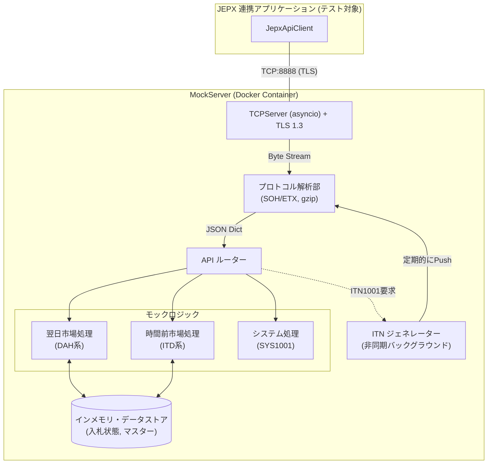
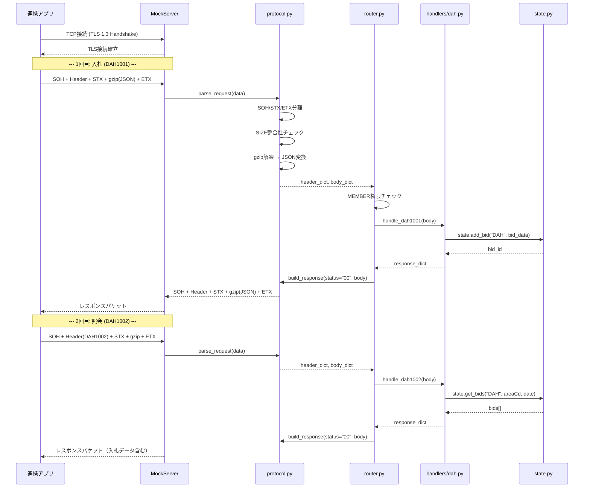
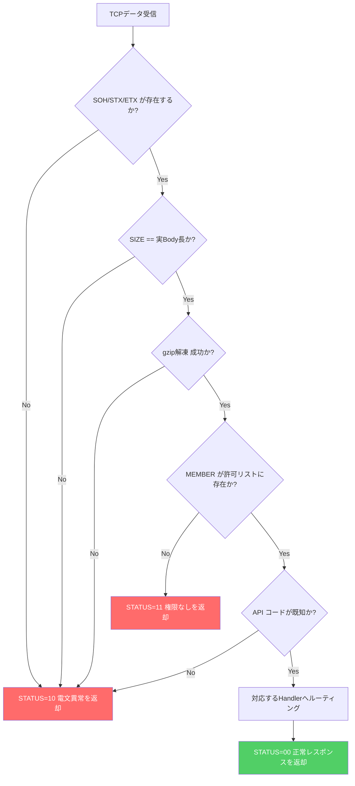
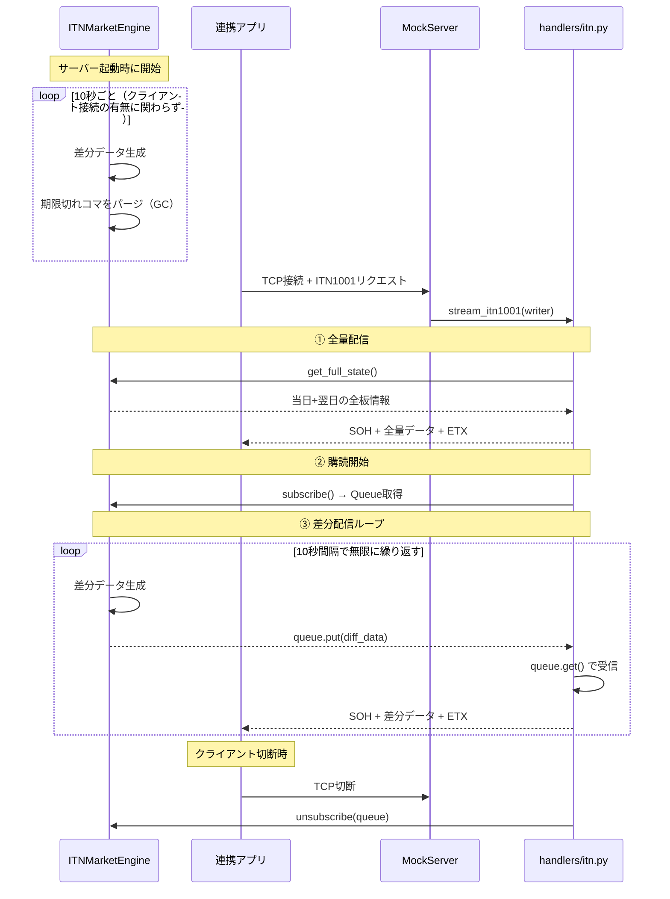
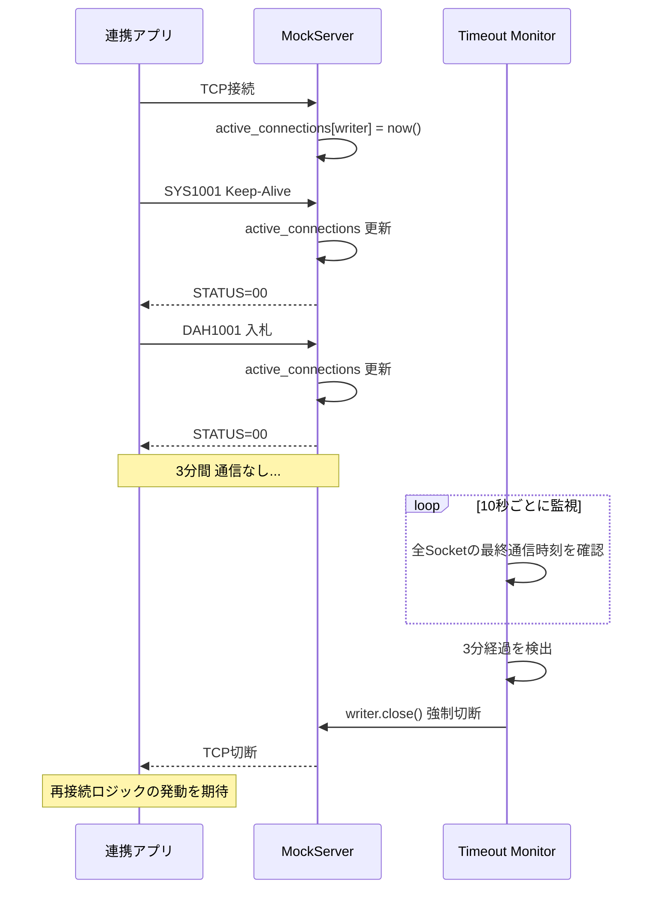
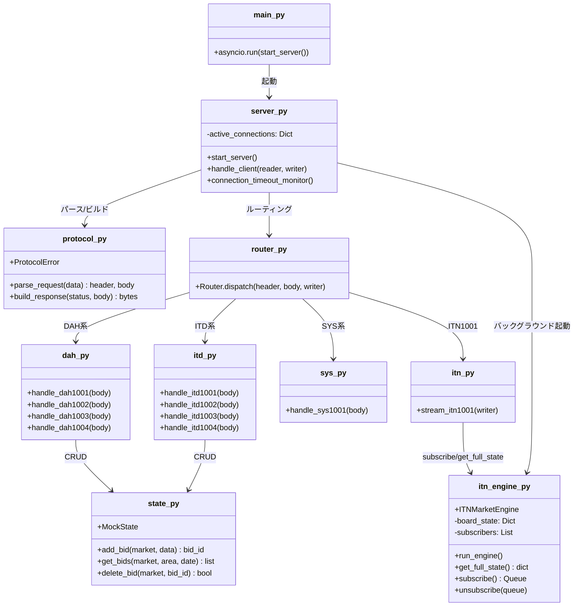

# MockServer 設計書 (JEPX API シミュレーター)

## 1. 目的と概要

本システム（MockServer）は、JEPX（日本卸電力取引所）が提供する専用接続線API（翌日市場・時間前市場）をエミュレートするテスト用の疑似サーバーです。
JEPX本番環境やテスト環境への接続には各種申請手続きや制限（固定IPやVPN等のインフラ手配）が必要であり、開発初期段階でのアジャイルなテストが困難です。
これを解決するため、JEPXの公式仕様書（接続技術書、API仕様書）に準拠した振る舞いをするMockServerをローカル（Docker上）に構築し、連携アプリケーションの単体テスト・結合テストを円滑に進めることを目的とします。

### 1.1 主なシミュレート対象
- **独自プロトコル**: TCP Socket上のSOH/STX/ETX制御文字によるフレーミングと、gzip圧縮JSONデータの送受信。
- **暗号化**: 自己署名証明書を用いたTLS 1.3通信。
- **コネクション仕様**: 3分間の無通信による強制切断（Keep-Aliveの検証用）。
- **ステートフルな振る舞い**: 「入札（DAH1001）」したデータが「入札照会（DAH1002）」で返却されるといった、メモリ内での状態（State）維持。
- **ストリーミング通信（ITN）**: コネクション確立後、サーバー側から能動的に延々とデータをPushし続ける時間前市場情報（ITN1001）のエミュレート。

---

## 2. システム構成と技術スタック

本MockServerは連携アプリケーションと同じくPythonで実装し、軽量かつ非同期通信に強いアーキテクチャとします。

- **言語**: Python 3.11+
- **コアモジュール**: `asyncio` (非同期TCPサーバー), `ssl` (TLS制御), `zlib`/`gzip` (圧縮・解凍)
- **インフラ**: Docker コンテナ上で稼働 (`docker-compose.yml` で連携アプリと同一ネットワーク上に配置可能)
- **データストア**: DBは使用せず、プロセスのメモリ（`dict` や `list`）で疑似データ（入札情報や約定情報）を保持します。



---

## 3. 通信プロトコル仕様 (Protocol Layer)

JEPX 公式の「専用接続線 接続技術書」に従い、以下のフォーマットをパース・生成できる `Protocol` クラスを実装します。

### 3.1 電文フォーマット
```text
[SOH (0x01)]
MEMBER=9999,API=DAH1001,SIZE=123 (ASCII・改行なし・カンマ区切り)
[STX (0x02)]
{gzip圧縮されたJSONバイナリ}
[ETX (0x03)]
```

### 3.2 通常API (DAH/ITD/SYS) のリクエスト・レスポンス シーケンス図

以下は、クライアントがDAH1001（入札）→ DAH1002（照会）を行う一般的な処理フローです。
1回のTCP接続で複数のAPIを連続して実行できます（Socketは維持されます）。



### 3.3 モックサーバー側での受信検証ロジック
MockServerはリクエストを受信した際、以下の厳格なチェックを行い、違反した場合は連携アプリの異常系テストのために相応のエラーを返却します。

1. **ヘッダフォーマット**: `SOH`で始まり、`STX`の間にカンマ区切りのKey-Valueがあるか。
2. **SIZE整合性チェック**: ヘッダの `SIZE` と、`STX`~`ETX` 間の実際のバイナリサイズが等しいか。一致しない場合は「電文フォーマット異常(STATUS: 10)」を返す。
3. **MEMBER権限**: （テスト用設定）MEMBERが許可されたIDでない場合、「権限なし(STATUS: 11)」を返す。

以下のフローチャートは、リクエスト受信時の検証ロジックを示しています。



---

## 4. 各APIのエミュレート仕様 (Handlers Layer)

### 4.1 共通応答ヘッダ
リクエストに対するレスポンスヘッダは以下のように生成します。
`STATUS={status_code},SIZE={body_length}`
（※正常時は `STATUS=00`）

### 4.2 翌日市場 (DAH) の振る舞い

- **DAH1001 (入札)**:
  - リクエストのJSON(`bidOffers`配列)をパースし、メモリ内に保存する。10桁の入札番号(`bidNo`)を採番する。
  - レスポンス: `{"status": "200", "statusInfo": "入札件数"}`
- **DAH1002 (入札照会)**:
  - `deliveryDate` で検索し、`bids[]` 配列で返却。各要素に `bidNo`, `areaCd`, `timeCd`, `price`, `volume` 等を含む。
- **DAH1003 (入札削除)**:
  - `deliveryDate` + `bidDels[].bidNo` で指定した入札を削除。`bidDels`未指定時は該当日の全入札を削除。
  - レスポンス: `{"status": "200", "statusInfo": "削除件数"}`
- **DAH1004 / DAH1030 (約定照会)**:
  - `bidResults[]` 配列で返却。各要素に入札過程情報に加え、`contractPrice`と`contractVolume`を付与。
- **DAH9001 (清算照会)**:
  - `fromDate` / `toDate` で指定された期間の清算データを `settlements[]` 配列で返却。各要素に `settlementNo`, `title`, `totalAmount`, `items[]`, `pdf` (Base64) を含む。

### 4.3 時間前市場 (ITD/ITN) の振る舞い

- **ITD1001 (入札)**:
  - リクエストJSONをパースし、メモリ内に保存。採番した`bidNo`を返却。
  - レスポンス: `{"status": "200", "statusInfo": "1", "bidNo": "..."}`
- **ITD1002 (入札削除要求)**:
  - `deliveryDate` + `timeCd` + `targetBidNo` で指定した入札を削除。削除要求入札の`bidNo`を返却。
- **ITD1003 (入札照会)**:
  - `deliveryDate` で検索し、`bids[]` 配列で返却。
- **ITD1004 (約定照会)**:
  - `bidResults[]` 配列で返却。`contractPrice`/`contractVolume`を付与。
- **ITD9001 (清算照会)**:
  - DAH9001と同様の`settlements[]`形式で時間前市場の清算データを返却。
- **ITN1001 (市場情報通知受信)**:
  - **ストリーム仕様 (Pub/Subモデル)**: このAPIだけは、1回応答して終了（Socket切断）しません。
  - サーバーはバックグラウンドで「中央エンジン(`itn_engine.py`)」を常時稼働させており、市場全体の状態（State）を管理しています。
  - **データ保持とGC（ガベージコレクション）**: エンジンが保持するデータ対象は「当日(Today)」と「翌日(Tomorrow)」の2日分（48コマ×9エリア）のみです。10秒ごとの更新ループの中で、**受渡時間のタイムリミットを過ぎた過去のコマのデータは自動的にメモリから削除（パージ）**され、データが無限に肥大化することを防ぎます。
  - クライアント接続直後に、中央エンジンから**現在の「全量配信」**を即座に送信します。
  - その後、接続Socketを保持したまま、中央エンジンが10秒間隔で生成する **CONTRACT (約定)** や **BID-BOARD (板情報)** の差分データを購読し、一斉にPush送信し続けます。

#### ITN1001 ストリーミング シーケンス図



### 4.4 システムAPI (SYS1001) と 切断仕様

- **SYS1001 (Keep-Alive)**:
  - 単純に `{"status": "200"}` の成功レスポンスを返す。
- **3分アイドル切断タイマー**:
  - 各Socketコネクションごとに「最終通信時刻」を記録します。
  - 非同期の監視タスクが常時ループし、最終通信から **「設定時間（デフォルト3分、テスト用に短縮可）」** 経過したSocketに対して、サーバー側から強制的に `close()` を発行します。（ITN1001接続は例外）。
  - これにより、連携アプリ側の「再接続ロジック」のテストが可能になります。

#### Keep-Alive と アイドル切断 シーケンス図



---

## 5. テスト・障害注入機能 (Fault Injection)

アジャイルなテストを行うため、MockServer自体に「意図的にエラーを起こす」仕掛け（Fault Injection）を持たせます。これらは環境変数や特殊なリクエストヘッダ（例: `MEMBER=ERR1` 等）でトリガーします。

| テストシナリオ | MockServerの振る舞い | 連携アプリの期待される動作 |
|---|---|---|
| ネットワーク瞬断 | リクエストヘッダ受信直後にSocketを強制Close | 自動再接続・指数バックオフ等によるリトライ |
| JEPX サーバービジー | レスポンスヘッダとして `STATUS=19` を返す | リトライ可能な一時エラ－として再試行 |
| データフォーマット異常 | レスポンスヘッダとして `STATUS=10` を返す | リトライ不可エラーとして業務処理を中断・アラート |
| パケット欠損 | 一部のデータを送信したまま、`ETX` を送信せずに停止 | タイムアウトエラー（ReadTimeout）および再試行 |
| 遅延（Latency）テスト | レスポンスを返却するまでに人為的に 5 秒間 `sleep` する | 連携アプリ側のタイムアウト設定の正常動作確認 |

---

## 6. ディレクトリ・ファイル構成案

```text
MockServer/
├── __init__.py
├── main.py              # アプリケーションエントリポイント (asyncio server起動)
├── core/
│   ├── server.py        # TCP Server実装、TLSコンテキスト設定、3分切断監視
│   ├── protocol.py      # SOH/ETXのフレーミング、gzip圧縮・解凍、ヘッダパース
│   ├── router.py        # APIコード(DAH1001等)からHandlerへのルーティング
│   ├── itn_engine.py    # ITN中央エンジン（バックグラウンドPub/Sub）
│   └── state.py         # インメモリデータストア (入札状態の保持)
├── handlers/
│   ├── dah.py           # 翌日市場関連のAPI実装 (1001, 1002, 1003, 1004)
│   ├── itd.py           # 時間前市場関連のAPI実装 (1001, 1002, 1003, 1004)
│   ├── itn.py           # ITN1001ストリーム動作（エンジンの購読・配信）
│   └── sys.py           # SYS1001 Keep-Alive
├── tests/
│   └── test_server.py   # 自動結合テスト（18テストケース）
├── certs/               # TLS1.3用 自己署名証明書および秘密鍵
├── config.py            # 設定値 (ポート、アイドルタイムアウト秒数設定)
├── Dockerfile
├── docker-compose.yml
└── MockServer設計書.md    # 本ドキュメント
```

### 6.1 モジュール関連図（クラス図）

各モジュール間の依存関係と役割の一覧です。



---

## 7. 起動方法 (How to Run)

MockServerは、開発環境やインフラ構成に合わせて、Dockerとコンテナレス（Pythonネイティブ）の両方で起動できるように設計します。

### 7.1 Docker (コンテナ) で起動する場合
最も推奨される方法です。依存パッケージのインストールや環境構築の工数を削減し、本番に近い分離環境でテストが可能です。

```bash
# MockServerディレクトリに移動
cd MockServer

# イメージのビルドと起動（バックグラウンド実行）
docker-compose up -d --build

# ログの確認
docker-compose logs -f
```
※ `docker-compose.yml` にて、ポートの公開（例: `8888:8888`）を行っているため、ホストマシンの連携アプリから `localhost:8888` で通信可能です。

### 7.2 Pythonネイティブ で起動する場合 (ローカルvenv)
コンテナを利用できない環境（あるいはIDEのデバッガをフル活用したステップ実行時など）の手順です。
実行には Python 3.11 以上が必要です。また、自己署名のテスト用SSL証明書ファイルが `certs/` ディレクトリに配置されている必要があります。

本番環境などに影響を与えないよう、MockServer専用の「仮想環境（venv）」を作成して実行することを強く推奨します。

```bash
# 1. モックサーバーのディレクトリ（n:\antigravity\jepx4\MockServer）に移動
cd n:\antigravity\jepx4\MockServer

# 2. 仮想環境（venv）の作成
# 実行すると現在のディレクトリ内に `venv` というフォルダが生成されます。
python -m venv .venv

# 3. 仮想環境の有効化（Activate）
# ---------- Windows PowerShell の場合 ----------
.\.venv\Scripts\Activate.ps1
# ---------- Mac/Linux の場合 ----------
source .venv/bin/activate
# ※成功すると、コマンドプロンプトの先頭に (venv) と表示されます。

# 4. [任意] 依存パッケージのインストール
# （外部ライブラリを最小限にするため組み込みモジュールのみで動く構成にしていますが、必要に応じて実行）
# pip install -r requirements.txt

# 5. メインスクリプトを起動
python main.py
```
起動すると、コンソールに `Listening on 0.0.0.0:8888 (TLS 1.3)...` のように表示され、待ち受けを開始します。ターミナル上で `Ctrl+C` を押下することで安全にシャットダウンします。

### 7.3 テストの実行方法
MockServerがJEPX仕様の電文（TLS 1.3、SOH〜ETXフレーミング、gzip圧縮）と各種APIルーティングを正確に再現できているかを確認するための自動結合テストが用意されています。

テストを実行するには、**MockServerが起動しているターミナルとは別のターミナル（コマンドプロンプト・PowerShell）**を新しく開く必要があります。
（※ Docker のコンテナとしてMockServerを起動している場合は、仮想環境の作成から始めてください）

```bash
# ----- (新規ターミナルを開く) -----

# 1. モックサーバーのディレクトリに移動
cd n:\antigravity\jepx4\MockServer

# 2. 仮想環境の有効化（先ほど作成したvenvを使用します）
# ---------- Windows PowerShell の場合 ----------
.\.venv\Scripts\Activate.ps1
# ---------- Mac/Linux の場合 ----------
source .venv/bin/activate

# 3. テストの実行（python -m unittest コマンドを使用します）
# まずコンソールのエンコーディングをUTF-8に設定
[Console]::OutputEncoding = [System.Text.Encoding]::UTF8
# その後テストを実行（| more は不要です）
python -m unittest tests/test_server.py -v
```

実行後、以下のように `OK` と表示されれば全テストが正常に通過しています。
```
Ran 20 tests in 16.696s
OK
```
テストコード内（`tests/test_server.py`）には、各検証シナリオの目的と詳細を日本語コメントで記載していますので、動作の理解に活用してください。
