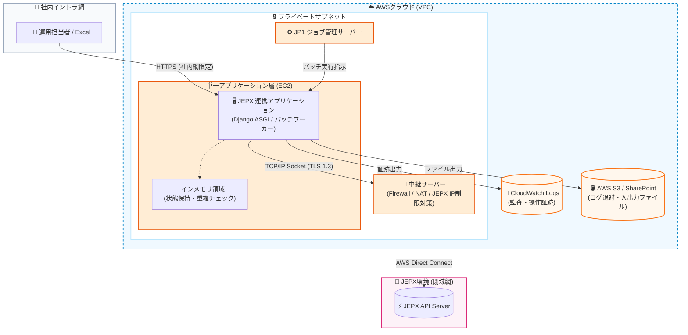
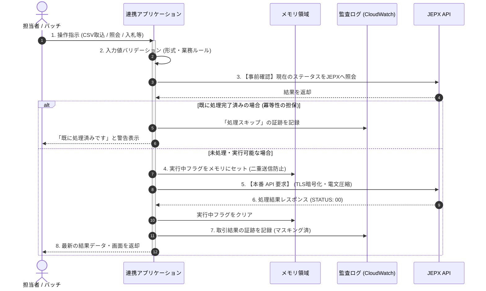
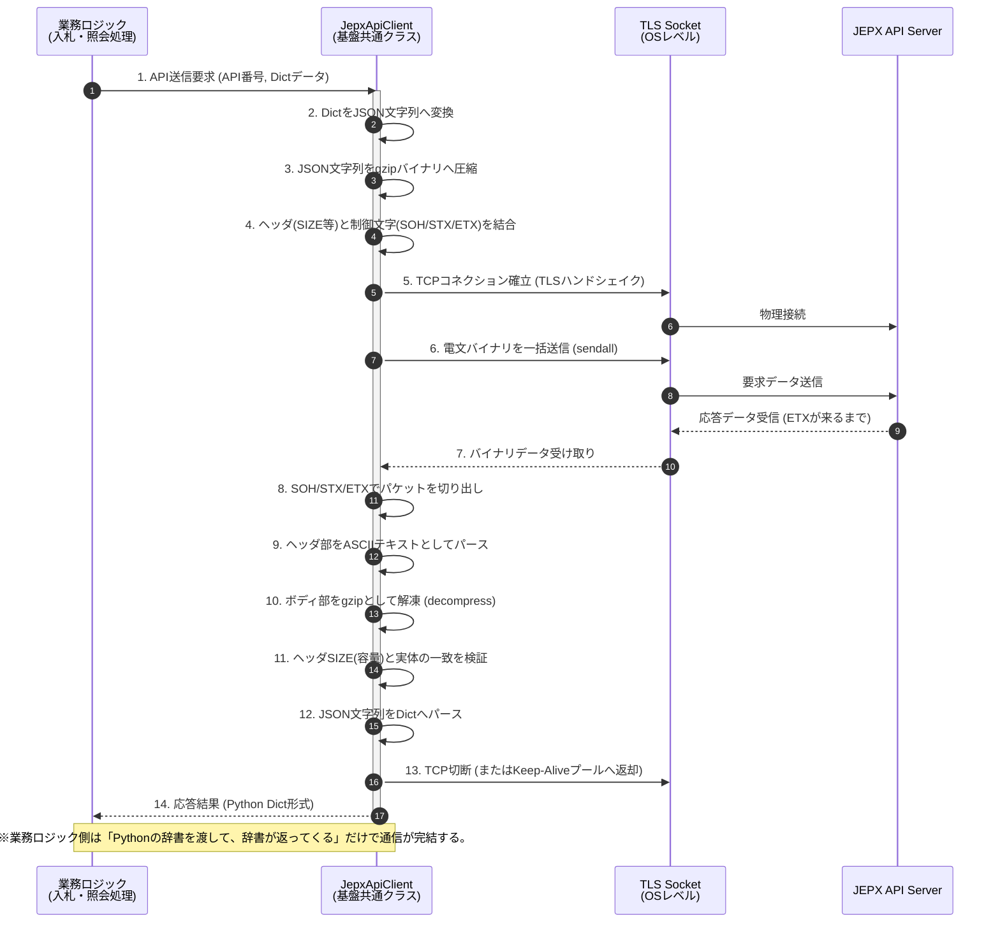
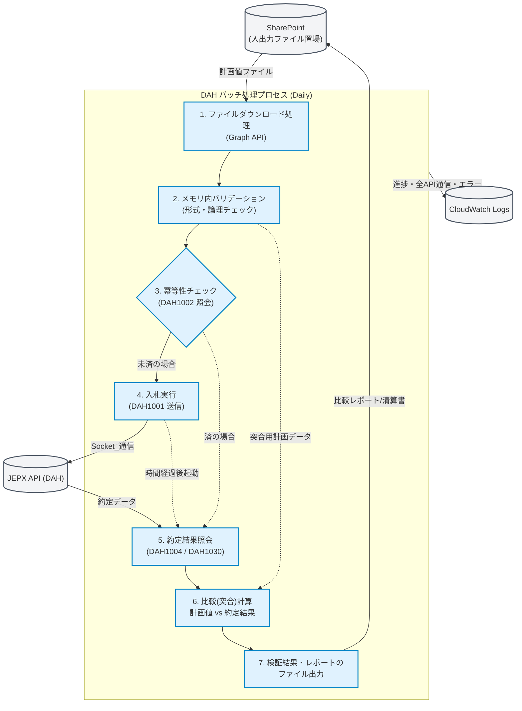
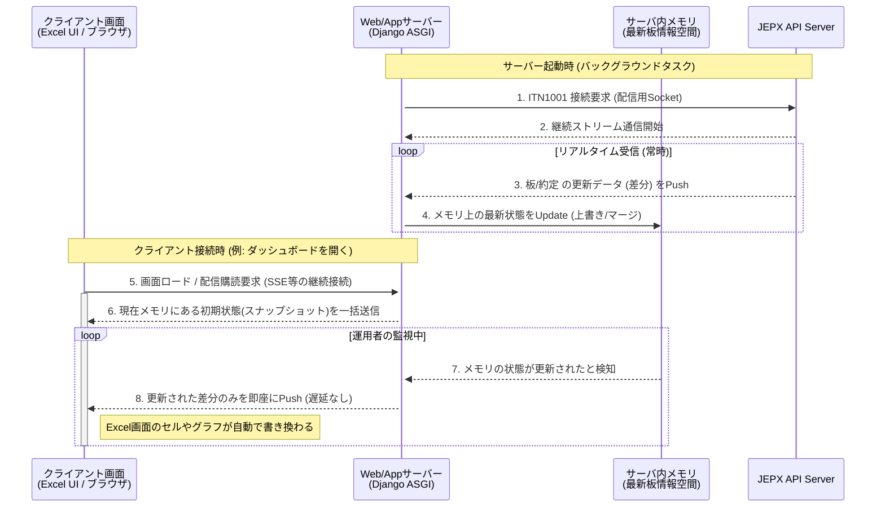
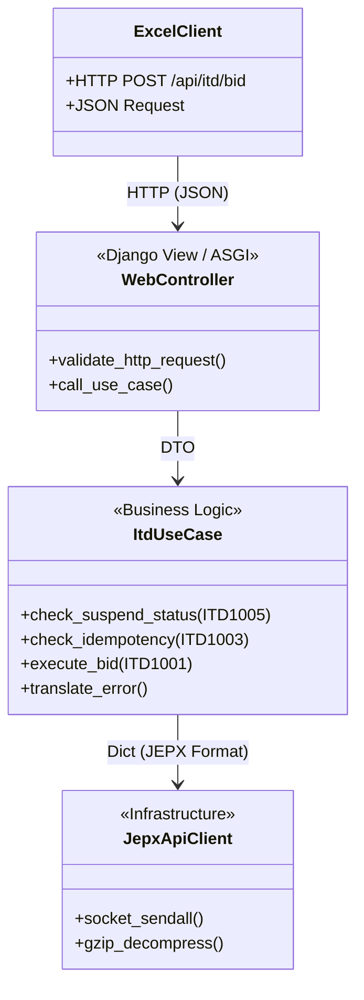
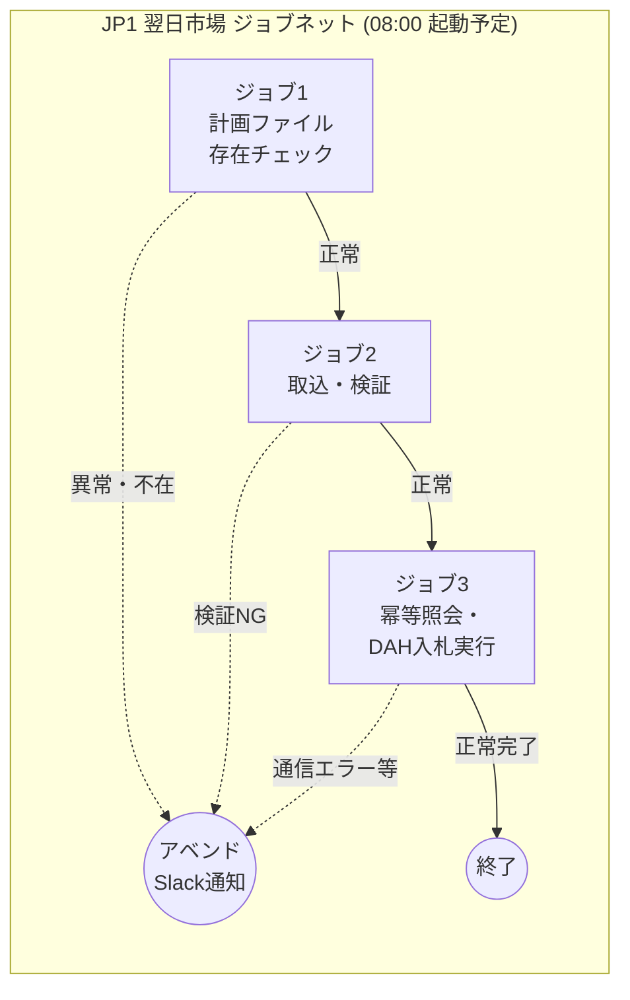

# 02. 基本設計（JEPX API連携システム）

## 文書情報

| 項目 | 内容 |
|------|------|
| 文書名 | 基本設計書 |
| バージョン | 1.0.0 |
| 対象システム | JEPX API連携システム |
| 関連要件定義 | 01.要件定義書.md |
| 関連見積り | 10.見積り.md |
| 参照仕様 | API仕様書(DAH/ITD) / JEPX専用接続線接続技術書 |

---

## 開発方針・構成の確認（目次案）

開発者が迷わないよう、見積もりの各領域（基盤、DAHバッチ、ITDウェブ、Excel UI、JP1運用など）を網羅する構成としています。
まずは**全体の章立てと、各章で定義する機能の網羅性**を確認します。

## 1. アーキテクチャ方針とシステム全体構成

本章では、システムの根幹となる技術選定の理由と、AWS上の物理層・論理層のインフラ構成を定義します。
- **主なカバー要件**:
  - [BR-04] RDBに依存しないシステムの構築
  - [NFR-03] 1サーバ構成・ステートレスアーキテクチャ
  - [NFR-04] 可用性（AWS・中継サーバ構成）

### 1.1 アーキテクチャ三大原則

本システムは、高いセキュリティ水準の維持と保守性の向上のため、以下の3つの原則を厳守して設計されます。

1. **完全ステートレス・DBレスアーキテクチャ**
   - RDB（リレーショナルデータベース）等の永続データストアは一切持ちません。
   - すべての取引データ・残高・ステータスは、その都度JEPX APIへ照会して最新の「正」のデータを取得します。これにより、自社システムとJEPX間の「データのズレ（不整合）」を構造的に排除します。
2. **メモリ内処理の徹底**
   - 画面描画用の一時データや、バッチ処理中の重複チェックフラグ等は、ファイルやDBに書き込まず、すべてサーバープロセス（Python ASGI等）の「揮発性メモリ」上で完結させます。
3. **全ての操作・通信の「公式な証跡化（監査ログ）」**
   - データを自社DBに持たない代わりに、JEPXへいつ・何を送信し、どういう結果が返ってきたかを、AWS CloudWatch Logsへ監査ログとしてすべて記録します。

### 1.2 AWSクラウドインフラ・ネットワーク構成図

本システムは、運用担当者（社内イントラ）からのHTTPSアクセスを受け付け、セキュアな閉域網（Direct Connect）を経由してJEPXと通信します。単一サーバー（Single Node）でWebリクエストとバッチ処理の両方を捌く、シンプルで可用性の高い構成です。



**【インフラ構成のポイント】**
- **IP制限のクリア**: JEPX側は「各市場・各サーバーにつき許可IPは1つのみ」という厳しい制約があります。「中継サーバー」を立て、すべての通信の送信元IPをここで単一（NAT変換）に絞ることで要件を満たします。
- **Direct Connect**: インターネットを経由しない専用の物理回線で、高速かつ安全にTCP通信を行います。

### 1.3 アプリケーション全体フロー（情報の流れ）

システムがユーザー（またはバッチ）からの要求をどのように受け取り、JEPXと会話し、結果を返すかのハイレベルな流れを示します。



---

## 2. 全体インターフェース（IF）・通信基盤設計

本システムの一番の技術的難所である「JEPX特有の独自Socket通信」を透過的（業務ロジックからは簡単に見えるよう）に扱うための通信基盤モジュールの設計です。
- **主なカバー要件**:
  - [FR-07] Socket接続・TLS1.3暗号化
  - [FR-08] 電文フォーマット変換 (SOH/STX/ETX, gzip)
  - [NFR-02] 独立した通信・機密性 (専用接続・IP制限)

### 2.1 JEPX Socket 通信プロトコル仕様

JEPXとの通信は、一般的なWeb API（HTTP/REST）ではなく、低レイヤーのTCP/IPを用いた独自の文字列プロトコルで行われます。これを表現する `JepxConnection` クラスを基盤として実装します。

- **通信方式**: TCP / IPv4
- **暗号化**: **TLS 1.3** が必須。（OSレベルのOpenSSL等を用いて強制指定。証明書検証あり）
- **コネクション上限ルール**: 1サーバーあたり「送信/照会用は最大5つ」「時間前通知受信(ITN)用は1つのみ」。この制限を超えないよう、コネクションプールで厳密に管理するか、1リクエスト1コネクション（都度切断）を徹底します。

#### 電文（パケット）の構造
送受信するデータは以下のフォーマットに則って構築・解析する必要があります。

`[SOH (0x01)]` + `CSV形式の独自ヘッダ (SIZE等)` + `[STX (0x02)]` + `gzip圧縮されたJSON(ボディ)` + `[ETX (0x03)]`

### 2.2 システム（共通）通信クラスのシーケンス設計

開発者が通常業務ロジックを書く際に「TCPソケット」「SOH等の制御文字」「gzip解凍」を意識しなくて済むよう、これらを吸収する基盤クラス（`JepxApiClient`）の振る舞い（シーケンス）です。



### 2.3 SYS1001 (Keep-Alive) とソケット維持機構

JEPX仕様（901.接続技術書）において、一般通信コネクションは**「3分間無通信が続くとサーバー側から強制切断される」**という制約があります。
通信効率化のために構築したSocketを即座に切断せず再利用（Connection Pool等）する場合、切断を回避するシステムAPI `SYS1001` をバックグラウンドで自動発行する機構が必要です。

#### Keep-Alive 管理ロジック
- **監視間隔**: プール内のソケットの最終通信時刻から「2分30秒 (150秒)」経過した場合に自動発火。
- **送付内容**: データ項目のない（空）電文によるSYS1001要求。
- **処理結果**: 成功すれば最終通信時刻を更新。失敗した場合は当該Socketを破棄し、次回業務要求時に新規接続を確立する。
- （※ITN配信用Socketは「無通信切断なし」の例外規定があるため、SYS1001の送信は不要です。）

### 2.4 エラー・再送制御（Retry Policy）

基盤クラスはネットワークレイヤーの一過性エラーに対し、自動的かつ安全なリトライを実施します。

1. **自動リトライ対象 (Transient Errors)**
   - TLSハンドシェイク失敗（ネットワーク瞬断等）
   - JEPXヘッダ `STATUS: 19` (システム異常：JEPX側の一時的過負荷)
   - Read/Write Timeout
   - **対策**: 指数バックオフ（待機時間を1秒→2秒→4秒と増やす）による最大3回までの自動リトライを実施し、業務ロジックの異常終了を防ぐ。

2. **リトライ不可対象 (Fatal Errors)**
   - JEPXヘッダ `STATUS: 10` (電文フォーマット異常 - プログラムバグの可能性)
   - JEPXヘッダ `STATUS: 11` (会員ID権限なし - 認証不備)
   - バリデーションエラー等の業務エラー (`body STATUS: 400`等)
   - **対策**: 再送しても状況は変わらないため直ちに業務ロジックへ例外（Exception）をスローし、即時異常終了・アラート発報させる。

## 3. アプリケーション機能設計：DAH（翌日市場）バッチ

本章では、日々の入札業務を自動化する「DAHバッチ処理」の詳細設計を定義します。
- **主なカバー要件**:
  - [BR-01] 手作業（RPA）の完全廃止と自動化
  - [FR-01] DAH1001～DAH9001 各機能
  - [FR-04] 入力ファイルの突合とバリデーション
  - [FR-05] 冪等性の担保（二重送信防止）

### 3.1 バッチアーキテクチャ・全体フロー

計画値ファイル（CSV等）の読み込みから、入札、そして事後の約定結果比較に至る日次の一巡のフローです。処理の実体は `Django Management Command` 等のCLIプログラムとして実装され、運用ツールのJP1から呼び出されます。



### 3.2 計画値取込とバリデーション (Validation Engine)

誤ったデータによる誤発注を防ぐため、JEPXへ送る前にメモリ上で厳格なチェック（バリデーション）を行います。
1レコードでもエラー（異常規格）が発見された場合、**ファイル全体の処理を中断（フェイルセーフ）**し、運用担当者へ修正指示のアラートを出します（部分的成功は許容しません）。

| 検証カテゴリ | 主なチェック内容 (例) | エラー時の振る舞い |
|---|---|---|
| **フォーマット/型** | 必須カラムの存在、受渡日(YYYY-MM-DD)、価格等の数値型妥当性 | 即時異常終了・運用者へログ通知 |
| **業務ルール** | 時間帯コード(01-48)、エリアコード、価格(10の倍数)、量(小数第一位) | 同上 |
| **セキュリティ** | 取込ファイルサイズの異常超過、不正な拡張子 | 同上 |

### 3.3 SharePoint連携 (Graph API) とファイルI/O制御

AWS環境はステートレスであるため、入力ファイル（運用担当者が作成するExcel等）の取得元、および出力ファイル（結果レポート・清算PDF等）の保存先として、社内標準の **SharePoint (Microsoft Graph API)** を利用します。

- **認証**: Azure EntraIDのクライアントクレデンシャル・フロー（Client ID/Secret）によるApplication権限での接続。トークンの有効期限切れを検知し、自動リフレッシュする基盤機能を持つこと。
- **一時ファイル**: バッチ処理中、生成した比較レポート（CSV/Excel）や清算照会（DAH9001）からBase64デコードしたPDFファイルは、OSの揮発性ディレクトリ (`/tmp` 等) に一時保存し、SharePointへアップロード完了次第、即座に削除します。

---

## 4. アプリケーション機能設計：ITD/ITN（時間前市場）Web API

本章では、時間前市場の「状況監視（リアルタイム板情報）」と「手動による即応操作（Excel等のクライアントからのHTTP要求）」を司るレイヤーを定義します。
- **主なカバー要件**:
  - [BR-02] ITN市況のリアルタイム監視
  - [FR-02] ITD1001～ITD9001 各機能
  - [FR-03] ITN1001市場情報ストリーム受信（板・約定）

### 4.1 時間前市場 (ITN) リアルタイム配信アーキテクチャ

時間前市場の最大の特長は、分単位で変動する「板情報（BID-BOARD）」と「約定情報（CONTRACT）」をJEPXから絶え間なく受信し、それを運用担当者の画面（Excelやブラウザ）へ遅延なく送り届けることです。
これを実現するため、**非同期Webサーバー（ASGI）とインメモリキャッシュを用いたストリーミング配信網**を構築します。



**【設計のポイント】**
- **DBに書き込まない**: 1秒間に何度も飛んでくる更新データをデータベースに保存すると、動作が極端に遅くなり（I/Oボトルネック）、リアルタイム性が失われます。これを「プロセスのメモリ（変数）」の中にしか持たないことで、株価ボード並みの超高速更新を実現します。
- **配信の分離**: JEPXからデータを受け取る「受信役（バックグラウンド）」と、それをExcelに配る「配信役（ASGI・SSE等）」を分業させます。これにより、Excelが何台接続されてもJEPXへの通信負荷（1コネクション制限）は変わりません。

### 4.2 Web同期リクエスト (ITD系手動操作)

ITNの「監視」に対して、ITDは運用担当者の「操作」を受け付けるレイヤーです。Excel等のクライアントからHTTP（REST等）でリクエストを受け取り、JEPXへSocket通信を実施して同期的に結果を返します。

#### クラス境界と変換ロジック (Adapter Pattern)
社内システム（HTTP/JSON）とJEPX様式（Socket/独自ヘッダ）の言葉の壁を埋めるため、Web層と基盤通信層の間にコンバーター（変換器）を設けます。



1. **WebController**: HTTPリクエストの受け口。受け取ったJSONが「空でないか」「数値の型が正しいか」等の入り口のチェックを行います。
2. **ItdUseCase**: 実際の業務の進行役です。
   - 入札前には必ず `ITD1005 (商品照会)` を呼び出し、取引が中断(Suspend)されていないかを確認する仕様をここに組み込みます。
   - 例外発生時（STATUS:11 権限なし等）を検知した場合、「JEPX特有のエラーコード」を「画面に表示しやすい社内向けエラーメッセージ（例: "ユーザーの入札権限がありません"）」に翻訳 (Translate) してWebControllerに返却します。
3. **JepxApiClient**: 前章で定義した通信モジュールです。

これにより、「JEPXの仕様変更」が起きた際は通信モジュールだけを直し、「画面の入力項目変更」が起きた際はWeb層だけ直すという、変更に強い（影響が波及しにくい）システム構造を維持します。

## 5. クライアントUI設計：Excel VBA

本章では、運用担当者が日常業務で操作する「画面」となるExcelツールの振る舞いと、裏側でのHTTP通信設計を定義します。
- **主なカバー要件**:
  - [BR-02] Excelからの時間前市場操作・キャンセル
  - [BR-03] 画面による確認・レポート機能
  - [FR-06] ExcelからのAPI制御（HTTP HTTPClient）

### 5.1 Excel UI - バックエンド間通信方式

WebブラウザではなくExcelをUIとするため、VBAの `MSXML2.XMLHTTP` 等のライブラリを用いて、Django側で用意したRESTful APIとJSON形式で通信します。

- **通信プロトコル**: HTTPS
- **認証方式**: 担当者のブラウザ等で取得したAzure EntraIDのアクセストークン（JWT）をHTTPリクエストヘッダ (`Authorization: Bearer <token>`) に付与し、API側で権限を検証します。
- **データ形式**: 送受信ともにJSON形式。VBA側のDictionary/CollectionとJSON文字列の相互変換を標準モジュールで実装します。

### 5.2 時間前市場（ITD）トレードダッシュボード設計

現在の市場状況をリアルタイムに把握し、クリック操作で即座に入札・取消を行える「板情報画面」です。

**【画面レイアウト（ワークシート）概念図】**

```text
+---------------------------------------------------------------------------------------------------+
|  [⚡ JEPX API連携システム]       [時間前市場 ダッシュボード]             [ 更新状態: 🟢 ON ]      |
+---------------------------------------------------------------------------------------------------+
|  ▼対象エリア: [ 01: 北海道 ]       [ 🔄 手動再取得 ]       [ 🛑 パニックボタン (全取消) ]       |
|                                                                                                   |
|  [ 📊 サマリー (全48コマ) ]                             |  [ 🔍 オーダーブック / 入札操作 ]       |
|  +----+---------------+-----------+-----------+----+  |  対象: [ 21 (10:00 - 10:30) ]           |
|  |コマ| 時間帯        |最安売(円)|最高買(円)|自分|  |                                         |
|  +----+---------------+-----------+-----------+----+  |  +---------+-----------+---------+      |
|  | 01 | 00:00 - 00:30 |   18.50   |   17.10   |    |  |  | 売(MW)  |  価格(円) |  買(MW) |      |
|  | .. |     ...       |    ...    |    ...    |    |  |  +---------+-----------+---------+      |
|  |▶21 | 10:00 - 10:30 |   17.80   |   17.60   | 買 |  |  |     150 |   18.50   |         |      |
|  | 22 | 10:30 - 11:00 |   17.90   |   17.80   |    |  |  |         |   17.80   |   ★100 |      |
|  | 48 | 23:30 - 00:00 |   18.10   |   16.90   |    |  |  |         |   17.10   |     800 |      |
|  +----+---------------+-----------+-----------+----+  |  +---------+-----------+---------+      |
|                                                       |                                         |
|  ※一覧行をクリックすると、右側にそのコマの詳細な厚み（板）と、   |  [ 📝 新規入札フォーム ]                |
|  自身の入札状況（★）が展開されます。                             |  種別:[ 買 ] 価格:[17.80] 量:[100]      |
|                                                       |      [ 入札実行(ITD1001) ]              |
+---------------------------------------------------------------------------------------------------+
```

#### ITNストリームデータの描画（更新ポーリング）
VBAはシングルスレッド環境であり、常時接続のSSE (Server-Sent Events) や WebSocket をネイティブで維持・ブロック描画するのは困難です。
そのため、Excel側では**非同期タイマー（Win32 API `SetTimer` 活用等）による高頻度ポーリング**を採用します。

1. ExcelタイマーがN秒間隔でDjango API (`/api/itn/latest`) へアクセス。
2. Django側はインメモリに保持している「前回からの差分」のみを高速返却。
3. VBAは描画処理の負荷を下げるため `Application.ScreenUpdating = False` 等を駆使し、差分セルのみを更新。

これにより、ExcelのUIフリージングを防ぎつつ、疑似的なリアルタイム描写を実現します。

---

## 6. ジョブ管理・運用・セキュリティ設計

本章では、構築したシステムが自動で安定稼働し続け、かつ機密性を保つための運用・警備の仕組みを定義します。
- **主なカバー要件**:
  - [NFR-01] 性能目標SLA（9時完了）
  - [NFR-05] 監査ログと証跡の保持
  - [NFR-06] エラー通知と運用監視

### 6.1 ジョブネット運用設計 (JP1)

第3章で設計したDAHバッチプログラムを、指定時刻に自動起動し、SLA（朝9:00前までの業務完了）を満たすための順序制御です。



- **異常時の運用**: いずれかのジョブがアベンド（異常終了）した場合、運用担当者へSlack/メール等で即時通知されます。担当者はエラー内容をログで確認し、手動で修正・JP1からジョブの「再実行」を行います。（※ジョブ3は冪等性が保証されているため、何度再実行しても二重入札にはなりません）

### 6.2 監査ログ (Audit Log) 設計と証跡保護

ステートレス設計において、障害発生時の「真実」をたどる唯一の手段となる監査ログの実装方針です。

1. **出力先**: アプリケーションサーバー内のログファイルに出力後、即座にCloudWatch Logsへ転送（CloudWatch Agent利用）することで、サーバークラッシュ時のログ消失を防ぎます。
2. **ログ種別**:
   - `[OPERATION]`: ユーザーのログイン、入札ボタン押下、例外操作などの記録。
   - `[API_COMM]`: JEPXへ送信・受信した「電文そのもの（JSON）」の完全な記録。
   - `[ERROR]`: 例外のスタックトレースと発生事由。

#### 情報漏洩防止（データマスキング機構）
API通信内容は証跡として極めて重要ですが、パスワードや特定の入札者IDまで平文で残すのはセキュリティ違反となります。ロガー（記録プログラム）は、CloudWatchへ送る直前に自動でマスキング処理を行います。

**【マスキングの例】**
```json
// JEPXへ送るJSON (加工前)
{"memberId": "0841", "password": "SuperSecretPassword123", "price": 15.5}

// CloudWatchに書かれるJSON (マスキング後)
{"memberId": "08**", "password": "********", "price": 15.5}
```

### 6.3 マスターコード・環境設定の外部管理

本システムはDBを持たないため、JEPXの仕様変更（例えば、新しいエリアの追加や、増税に伴う仕様変更など）にプログラムの改修なしで対応できるよう、可変のパラメータは設定ファイル（YAML）に切り出します。

**【管理対象の例: `config/jepx_master.yaml`】**
```yaml
# エリアコードマスタ
areas:
  "1": "北海道"
  "2": "東北"
  "3": "東京"
  #...
# 手動入札のハードリミット限界（誤操作による異常価格の歯止め）
limits:
  max_bid_price: 999.0
  max_bid_volume: 5000.0
```
運用担当者は、必要に応じてこのファイルを更新し、システムを再起動するだけで新ルールを適用できます。

