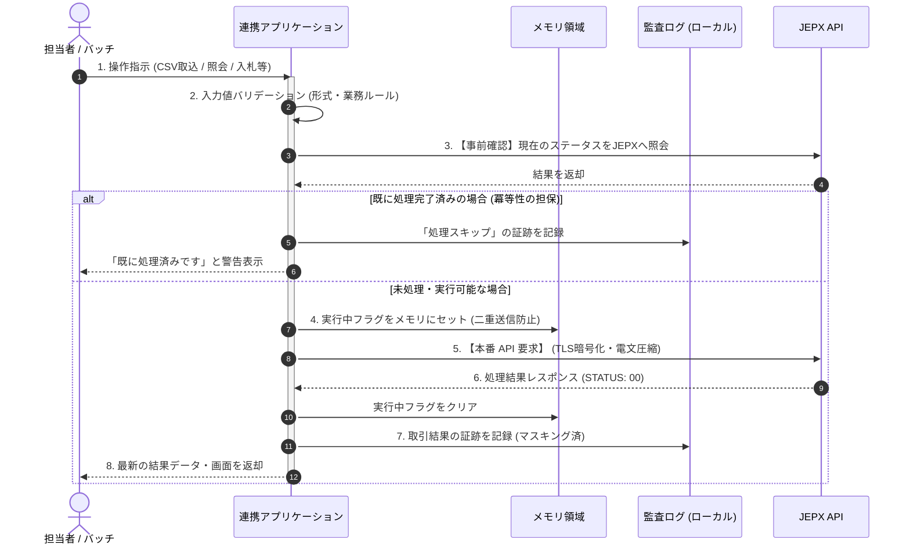
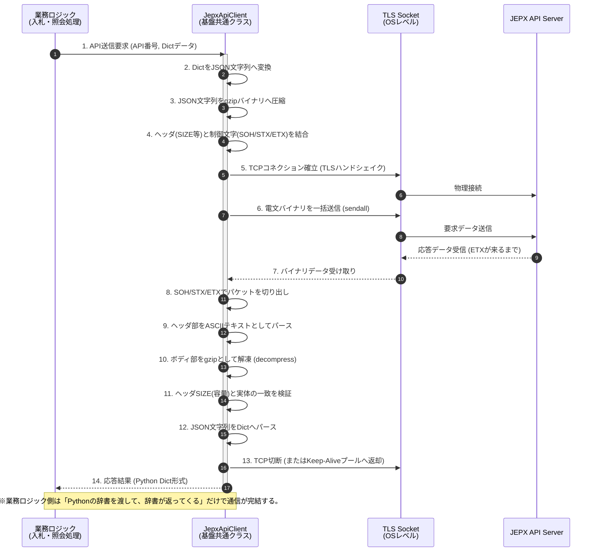
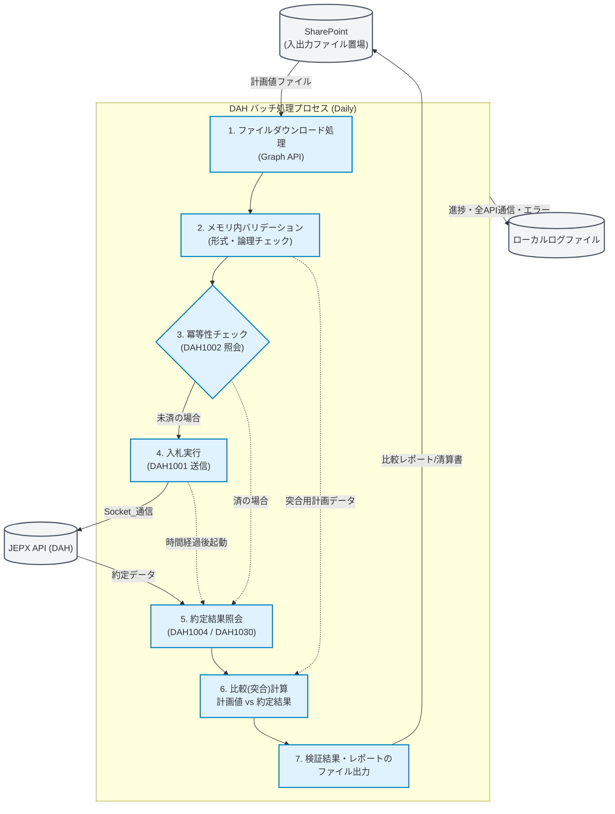
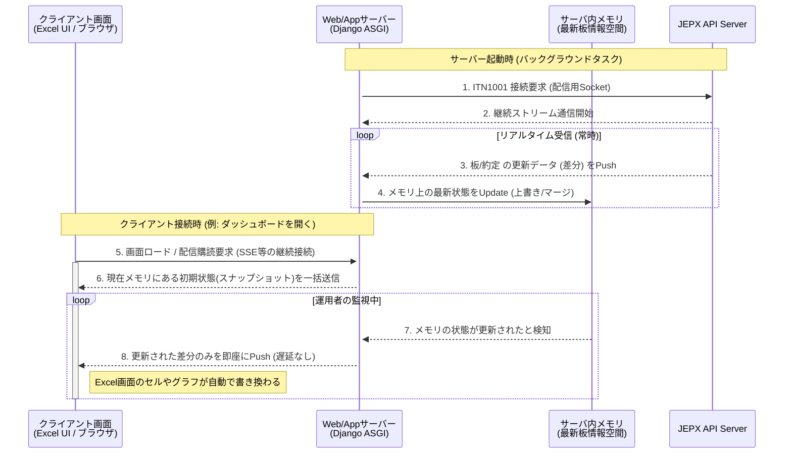
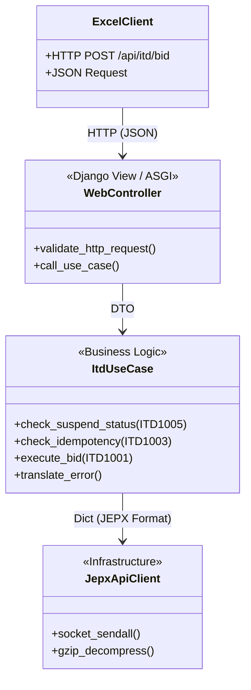
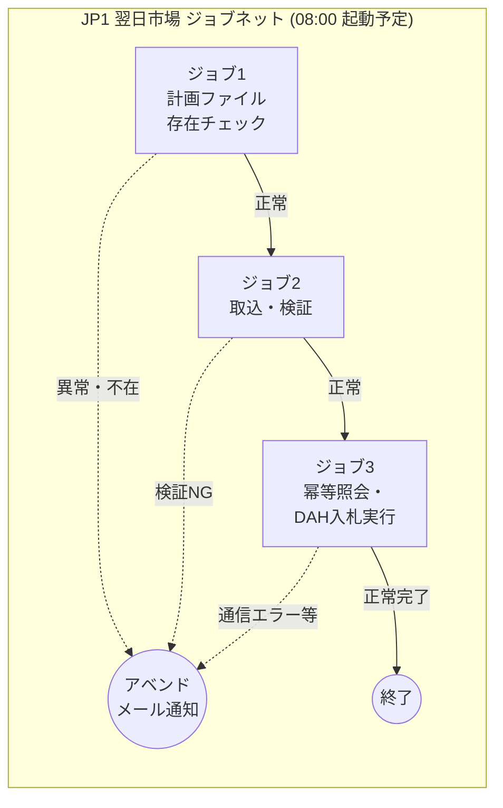

# 02. 基本設計（JEPX API連携システム）

## 文書情報

| 項目 | 内容 |
|------|------|
| 文書名 | 基本設計書 |
| バージョン | 1.0.0 |
| 対象システム | JEPX API連携システム |
| 関連要件定義 | 01.要件定義書.md |
| 関連見積り | 10.見積り.md |
| 参照仕様 | API仕様書(DAH/ITD) / JEPX専用接続線接続技術書 |

---

## 開発方針・構成の確認（目次案）

開発者が迷わないよう、見積もりの各領域（基盤、DAHバッチ、ITDウェブ、Excel UI、JP1運用など）を網羅する構成としています。
まずは**全体の章立てと、各章で定義する機能の網羅性**を確認します。


## 要件トレーサビリティマトリクス

本基本設計書が、上位の要件定義（FR: 機能要件、NFR: 非機能要件、BR: ビジネス要件）をどの章でカバーしているかを示す対応表です。

| 要件ID | 要件名 | 本書の対応章 |
|--------|--------|------------|
| FR-01 | ファイル取込・受付 | §3 SharePoint連携 |
| FR-02 | 入力バリデーション | §7 バリデーションエンジン |
| FR-03 | 業務妥当性 | §7 バリデーションエンジン |
| FR-10 | DAH API実装 | §2 通信基盤, §4 DAHバッチ |
| FR-11 | DAH入札制御 | §4 DAHバッチ |
| FR-20 | ITD/ITN API実装 | §2 通信基盤, §5 ITD/ITN API |
| FR-21 | ITD特有制御 | §5 ITD/ITN API |
| FR-22 | 配信受信（ITN中継） | §5 ITD/ITN API |
| FR-30 | 都度照会 | §4 DAHバッチ, §5 ITD/ITN API |
| FR-31 | 比較・検算レポート | §4 DAHバッチ |
| FR-32 | 清算・通知書出力 | §4 DAHバッチ, §5 ITD/ITN API |
| FR-40 | 二重送信防止（冪等性） | §4 DAHバッチ, §5 ITD/ITN API |
| FR-41 | 再試行・回復 | §2 通信基盤 |
| NFR-9.1 | 性能 (SLA等) | §8 ジョブ管理・運用 |
| NFR-9.2 | 可用性 | §1 アーキテクチャ, §2 通信基盤 |
| NFR-9.3 | 信頼性 | §2 通信基盤 |
| NFR-9.4 | セキュリティ | §1 アーキテクチャ, §8 セキュリティ設計 |
| NFR-9.5 | ログ・監査証跡 | §8 セキュリティ設計 (監査ログ) |
| NFR-9.6 | 保守性 | §8 セキュリティ設計 (外部設定管理) |
| BR-01 | 対象業務完全性 | §4 DAHバッチ, §5 ITD API |
| BR-02 | 自動化(DAH) | §4 DAHバッチ, §8 ジョブ管理 |
| BR-03 | ユーザビリティ(ITD) | §6 Excel UI |
| BR-04 | 監査性 | §8 セキュリティ設計 |
| BR-05 | 事業継続性 | §4 DAHバッチ, §2 通信基盤 |
| BR-06 | ステートレス運用 | §1 アーキテクチャ方針 |

---

## 1. アーキテクチャ方針とシステム全体構成

本章では、システムの根幹となる技術選定の理由と、AWS上の物理層・論理層のインフラ構成を定義します。
- **主なカバー要件**:
  - [BR-04] RDBに依存しないシステムの構築
  - [NFR-03] 1サーバ構成・ステートレスアーキテクチャ
  - [NFR-04] 可用性（AWS・中継サーバ構成）

### 1.1 アーキテクチャ三大原則

本システムは、高いセキュリティ水準の維持と保守性の向上のため、以下の3つの原則を厳守して設計されます。

1. **完全ステートレス・DBレスアーキテクチャ**
   - RDB（リレーショナルデータベース）等の永続データストアは一切持ちません。
   - すべての取引データ・残高・ステータスは、その都度JEPX APIへ照会して最新の「正」のデータを取得します。これにより、自社システムとJEPX間の「データのズレ（不整合）」を構造的に排除します。
2. **メモリ内処理の徹底**
   - 画面描画用の一時データや、バッチ処理中の重複チェックフラグ等は、ファイルやDBに書き込まず、すべてサーバープロセス（Python ASGI等）の「揮発性メモリ」上で完結させます。
3. **全ての操作・通信の「公式な証跡化（監査ログ）」**
   - データを自社DBに持たない代わりに、JEPXへいつ・何を送信し、どういう結果が返ってきたかを、アプリケーションサーバー内の監査ログにすべて記録し、ローテーション管理します。

### 1.2 AWSクラウドインフラ・ネットワーク構成図

本システムは、運用担当者（社内イントラ）からのHTTPSアクセスを受け付け、セキュアな閉域網（Direct Connect）を経由してJEPXと通信します。単一サーバー（Single Node）でWebリクエストとバッチ処理の両方を捌く、シンプルで可用性の高い構成です。


**【インフラ構成のポイント】**
- **IP制限のクリア**: JEPX側は「各市場・各サーバーにつき許可IPは1つのみ」という厳しい制約があります。「中継サーバー」を立て、すべての通信の送信元IPをここで単一（NAT変換）に絞ることで要件を満たします。
- **Direct Connect**: インターネットを経由しない専用の物理回線で、高速かつ安全にTCP通信を行います。

### 1.3 アプリケーション全体フロー（情報の流れ）

システムがユーザー（またはバッチ）からの要求をどのように受け取り、JEPXと会話し、結果を返すかのハイレベルな流れを示します。




### 1.4 稼働環境アーキテクチャと環境分離方針

本システムは、品質保証と無停止リリースを実現するため、物理的・論理的に分離された3つの環境（dev, stage, prod）を構成します。

1. **開発環境 (dev)**
   - **用途**: 開発者のローカルPC上での開発・単体テスト
   - **接続先**: 同一ネットワーク上に立ち上げたAPIシミュレータ（MockServer）
   - **構成**: Django組み込み開発サーバーで動作

2. **検証環境 (stage)**
   - **用途**: ステージング環境における結合テスト、ユーザー受入テスト(UAT)
   - **接続先**: JEPXが提供する検証環境（専用IP・ポート）
   - **構成**: 本番と同等の Nginx (リバースプロキシ) + Uvicorn (ASGI) 構成

3. **本番環境 (prod)**
   - **用途**: 本稼働
   - **接続先**: JEPX本番環境
   - **構成**: Nginx + Uvicorn (ASGIサーバー)

各環境は単一のコードベースからデプロイされ、動作の振る舞い（JEPX接続先IP、ログレベル、TLS証明書の扱いなど）はすべて外部の環境変数（`.env`ファイル）および環境別の設定ファイルによって安全に切り替えられる設計とします。
\n---

## 2. 全体インターフェース（IF）・通信基盤設計

本システムの一番の技術的難所である「JEPX特有の独自Socket通信」を透過的（業務ロジックからは簡単に見えるよう）に扱うための通信基盤モジュールの設計です。
- **主なカバー要件**:
  - [FR-07] Socket接続・TLS1.3暗号化
  - [FR-08] 電文フォーマット変換 (SOH/STX/ETX, gzip)
  - [NFR-02] 独立した通信・機密性 (専用接続・IP制限)

### 2.1 JEPX Socket 通信プロトコル仕様

JEPXとの通信は、一般的なWeb API（HTTP/REST）ではなく、低レイヤーのTCP/IPを用いた独自の文字列プロトコルで行われます。これを表現する `JepxConnection` クラスを基盤として実装します。

- **通信方式**: TCP / IPv4
- **暗号化**: **TLS 1.3** が必須。（OSレベルのOpenSSL等を用いて強制指定。証明書検証あり）
- **コネクション上限ルール**: 1サーバーあたり「送信/照会用は最大5つ」「時間前通知受信(ITN)用は1つのみ」。この制限を超えないよう、コネクションプールで厳密に管理するか、1リクエスト1コネクション（都度切断）を徹底します。

#### 電文（パケット）の構造
送受信するデータは以下のフォーマットに則って構築・解析する必要があります。

`[SOH (0x01)]` + `CSV形式の独自ヘッダ (SIZE等)` + `[STX (0x02)]` + `gzip圧縮されたJSON(ボディ)` + `[ETX (0x03)]`

### 2.2 システム（共通）通信クラスのシーケンス設計

開発者が通常業務ロジックを書く際に「TCPソケット」「SOH等の制御文字」「gzip解凍」を意識しなくて済むよう、これらを吸収する基盤クラス（`JepxApiClient`）の振る舞い（シーケンス）です。



### 2.3 SYS1001 (Keep-Alive) とソケット維持機構

JEPX仕様（901.接続技術書）において、一般通信コネクションは**「3分間無通信が続くとサーバー側から強制切断される」**という制約があります。
通信効率化のために構築したSocketを即座に切断せず再利用（Connection Pool等）する場合、切断を回避するシステムAPI `SYS1001` をバックグラウンドで自動発行する機構が必要です。

#### Keep-Alive 管理ロジック
- **監視間隔**: プール内のソケットの最終通信時刻から「2分30秒 (150秒)」経過した場合に自動発火。
- **送付内容**: データ項目のない（空）電文によるSYS1001要求。
- **処理結果**: 成功すれば最終通信時刻を更新。失敗した場合は当該Socketを破棄し、次回業務要求時に新規接続を確立する。
- （※ITN配信用Socketは「無通信切断なし」の例外規定があるため、SYS1001の送信は不要です。）

### 2.4 エラー・再送制御（Retry Policy）

基盤クラスはネットワークレイヤーの一過性エラーに対し、自動的かつ安全なリトライを実施します。

1. **自動リトライ対象 (Transient Errors)**
   - TLSハンドシェイク失敗（ネットワーク瞬断等）
   - JEPXヘッダ `STATUS: 19` (システム異常：JEPX側の一時的過負荷)
   - Read/Write Timeout
   - **対策**: 指数バックオフ（待機時間を1秒→2秒→4秒と増やす）による最大3回までの自動リトライを実施し、業務ロジックの異常終了を防ぐ。

2. **リトライ不可対象 (Fatal Errors)**
   - JEPXヘッダ `STATUS: 10` (電文フォーマット異常 - プログラムバグの可能性)
   - JEPXヘッダ `STATUS: 11` (会員ID権限なし - 認証不備)
   - バリデーションエラー等の業務エラー (`body STATUS: 400`等)
   - **対策**: 再送しても状況は変わらないため直ちに業務ロジックへ例外（Exception）をスローし、即時異常終了・アラート発報させる。


### 2.5 通信証明書 (TLS Certificate) 管理ポリシー

JEPXとのソケット通信は厳格なTLS1.3によって保護されますが、環境ごとの証明書の扱い方針を以下のように定めます。

- **本番環境 (Mode A)**: OS(Amazon Linux等)が標準で持つ「信頼されたルート証明書ストア」にJEPXから提供されたルート証明書をインストールし、システム全体として透過的かつセキュアに検証を行う方式を基本とします。
- **検証環境・開発環境 (Mode B)**: ファイルパス指定による特定証明書でのピンポイント検証を行います。特にローカル開発環境では、自作のMockServerが発行した自己署名CA証明書を読み込ませることで、本番同等の「暗号化＋検証」のテストチャネルを確立します。
\n## 3. 外部システム連携設計：SharePoint (Graph API)

本システムはRDBや永続ボリュームを持たないため、業務におけるデータの起点（入力）および終点（出力）となるファイル群の置き場として、Microsoft 365 SharePoint機能（Graph API）との連携を基本アーキテクチャに組み込みます。

### 3.1 認証認可アーキテクチャ (OAuth2)
- **認証方式**: Azure Entra ID に対する「Client Credentials Flow (クライアントクレデンシャルフロー)」を採用します。
- **権限設定**: Application権限（ユーザーを介在しないバッチ・サーバー間通信）として設定し、システム専用のClient IDおよびClient Secretを用いてアクセストークンを取得します。
- **トークン管理**: 取得したJWT（アクセストークン）はメモリ上で一定時間キャッシュし、有効期限切れ時に自動で再取得(リフレッシュ)する機構を実装します。

### 3.2 ディレクトリ構成とファイルI/O要件
JEPXシステム専用のSharePointサイト・ドライブ内に以下の論理ディレクトリ（フォルダ構造）を定義し、システムと運用担当者間のインターフェースとします。

1. **`input/` (入力待機フォルダ)**
   - 担当者がDAH市場向けの入札計画値CSV/Excelファイルを配置する領域。
   - バッチプログラムはここからファイルをダウンロードし、処理後にアーカイブフォルダへ移動させます。
2. **`output/` (処理完了・レポートフォルダ)**
   - システムが出力する「比較・検算レポート（CSV等）」およびJEPXから取得した特定フォーマットの「取引清算書（PDF）」等を自動アップロードする領域。
3. **`error/` (業務エラー報告フォルダ)**
   - 取込ファイルのバリデーションエラーなどでシステムがバッチ処理を中断した際、担当者へ即座に示す「エラー理由（行番号、ルール違反内容）」を記したエラーレポートCSVを出力する領域。

---

## 4. アプリケーション機能設計：DAH（翌日市場）バッチ

本章では、日々の入札業務を自動化する「DAHバッチ処理」の詳細設計を定義します。
- **主なカバー要件**:
  - [BR-01] 手作業（RPA）の完全廃止と自動化
  - [FR-01] DAH1001～DAH9001 各機能
  - [FR-04] 入力ファイルの突合とバリデーション
  - [FR-05] 冪等性の担保（二重送信防止）

### 4.1 バッチアーキテクチャ・全体フロー

計画値ファイル（CSV等）の読み込みから、入札、そして事後の約定結果比較に至る日次の一巡のフローです。処理の実体は `Django Management Command` 等のCLIプログラムとして実装され、運用ツールのJP1から呼び出されます。



### 4.2 計画値取込とバリデーション (Validation Engine)

誤ったデータによる誤発注を防ぐため、JEPXへ送る前にメモリ上で厳格なチェック（バリデーション）を行います。
1レコードでもエラー（異常規格）が発見された場合、**ファイル全体の処理を中断（フェイルセーフ）**し、運用担当者へ修正指示のアラートを出します（部分的成功は許容しません）。

| 検証カテゴリ | 主なチェック内容 (例) | エラー時の振る舞い |
|---|---|---|
| **フォーマット/型** | 必須カラムの存在、受渡日(YYYY-MM-DD)、価格等の数値型妥当性 | 即時異常終了・運用者へログ通知 |
| **業務ルール** | 時間帯コード(01-48)、エリアコード、価格(10の倍数)、量(小数第一位) | 同上 |
| **セキュリティ** | 取込ファイルサイズの異常超過、不正な拡張子 | 同上 |

### 4.3 SharePoint連携 (Graph API) とファイルI/O制御

AWS環境はステートレスであるため、入力ファイル（運用担当者が作成するExcel等）の取得元、および出力ファイル（結果レポート・清算PDF等）の保存先として、社内標準の **SharePoint (Microsoft Graph API)** を利用します。

- **認証**: Azure EntraIDのクライアントクレデンシャル・フロー（Client ID/Secret）によるApplication権限での接続。トークンの有効期限切れを検知し、自動リフレッシュする基盤機能を持つこと。
- **一時ファイル**: バッチ処理中、生成した比較レポート（CSV/Excel）や清算照会（DAH9001）からBase64デコードしたPDFファイルは、OSの揮発性ディレクトリ (`/tmp` 等) に一時保存し、SharePointへアップロード完了次第、即座に削除します。

---

## 5. アプリケーション機能設計：ITD/ITN（時間前市場）Web API

本章では、時間前市場の「状況監視（リアルタイム板情報）」と「手動による即応操作（Excel等のクライアントからのHTTP要求）」を司るレイヤーを定義します。
- **主なカバー要件**:
  - [BR-02] ITN市況のリアルタイム監視
  - [FR-02] ITD1001～ITD9001 各機能
  - [FR-03] ITN1001市場情報ストリーム受信（板・約定）

### 5.1 時間前市場 (ITN) リアルタイム配信アーキテクチャ

時間前市場の最大の特長は、分単位で変動する「板情報（BID-BOARD）」と「約定情報（CONTRACT）」をJEPXから絶え間なく受信し、それを運用担当者の画面（Excelやブラウザ）へ遅延なく送り届けることです。
これを実現するため、**非同期Webサーバー（ASGI）とインメモリキャッシュを用いたストリーミング配信網**を構築します。



**【設計のポイント】**
- **DBに書き込まない**: 1秒間に何度も飛んでくる更新データをデータベースに保存すると、動作が極端に遅くなり（I/Oボトルネック）、リアルタイム性が失われます。これを「プロセスのメモリ（変数）」の中にしか持たないことで、株価ボード並みの超高速更新を実現します。
- **配信の分離**: JEPXからデータを受け取る「受信役（バックグラウンド）」と、それをExcelに配る「配信役（ASGI・SSE等）」を分業させます。これにより、Excelが何台接続されてもJEPXへの通信負荷（1コネクション制限）は変わりません。

### 5.2 Web同期リクエスト (ITD系手動操作)

ITNの「監視」に対して、ITDは運用担当者の「操作」を受け付けるレイヤーです。Excel等のクライアントからHTTP（REST等）でリクエストを受け取り、JEPXへSocket通信を実施して同期的に結果を返します。

#### クラス境界と変換ロジック (Adapter Pattern)
社内システム（HTTP/JSON）とJEPX様式（Socket/独自ヘッダ）の言葉の壁を埋めるため、Web層と基盤通信層の間にコンバーター（変換器）を設けます。



1. **WebController**: HTTPリクエストの受け口。受け取ったJSONが「空でないか」「数値の型が正しいか」等の入り口のチェックを行います。
2. **ItdUseCase**: 実際の業務の進行役です。
   - 入札前には必ず `ITD1005 (商品照会)` を呼び出し、取引が中断(Suspend)されていないかを確認する仕様をここに組み込みます。
   - 例外発生時（STATUS:11 権限なし等）を検知した場合、「JEPX特有のエラーコード」を「画面に表示しやすい社内向けエラーメッセージ（例: "ユーザーの入札権限がありません"）」に翻訳 (Translate) してWebControllerに返却します。
3. **JepxApiClient**: 前章で定義した通信モジュールです。

これにより、「JEPXの仕様変更」が起きた際は通信モジュールだけを直し、「画面の入力項目変更」が起きた際はWeb層だけ直すという、変更に強い（影響が波及しにくい）システム構造を維持します。

## 6. クライアントUI設計：Excel VBA

本章では、運用担当者が日常業務で操作する「画面」となるExcelツールの振る舞いと、裏側でのHTTP通信設計を定義します。
- **主なカバー要件**:
  - [BR-02] Excelからの時間前市場操作・キャンセル
  - [BR-03] 画面による確認・レポート機能
  - [FR-06] ExcelからのAPI制御（HTTP HTTPClient）

### 6.1 Excel UI - バックエンド間通信方式

WebブラウザではなくExcelをUIとするため、VBAの `MSXML2.XMLHTTP` 等のライブラリを用いて、Django側で用意したRESTful APIとJSON形式で通信します。

- **通信プロトコル**: HTTPS
- **認証方式**: 担当者のブラウザ等で取得したAzure EntraIDのアクセストークン（JWT）をHTTPリクエストヘッダ (`Authorization: Bearer <token>`) に付与し、API側で権限を検証します。
- **データ形式**: 送受信ともにJSON形式。VBA側のDictionary/CollectionとJSON文字列の相互変換を標準モジュールで実装します。

### 6.2 時間前市場（ITD）トレードダッシュボード設計

現在の市場状況をリアルタイムに把握し、クリック操作で即座に入札・取消を行える「板情報画面」です。

**【画面レイアウト（ワークシート）概念図】**

```text
+---------------------------------------------------------------------------------------------------+
|  [⚡ JEPX API連携システム]       [時間前市場 ダッシュボード]             [ 更新状態: 🟢 ON ]      |
+---------------------------------------------------------------------------------------------------+
|  ▼対象エリア: [ 01: 北海道 ]       [ 🔄 手動再取得 ]       [ 🛑 パニックボタン (全取消) ]       |
|                                                                                                   |
|  [ 📊 サマリー (全48コマ) ]                             |  [ 🔍 オーダーブック / 入札操作 ]       |
|  +----+---------------+-----------+-----------+----+  |  対象: [ 21 (10:00 - 10:30) ]           |
|  |コマ| 時間帯        |最安売(円)|最高買(円)|自分|  |                                         |
|  +----+---------------+-----------+-----------+----+  |  +---------+-----------+---------+      |
|  | 01 | 00:00 - 00:30 |   18.50   |   17.10   |    |  |  | 売(MW)  |  価格(円) |  買(MW) |      |
|  | .. |     ...       |    ...    |    ...    |    |  |  +---------+-----------+---------+      |
|  |▶21 | 10:00 - 10:30 |   17.80   |   17.60   | 買 |  |  |     150 |   18.50   |         |      |
|  | 22 | 10:30 - 11:00 |   17.90   |   17.80   |    |  |  |         |   17.80   |   ★100 |      |
|  | 48 | 23:30 - 00:00 |   18.10   |   16.90   |    |  |  |         |   17.10   |     800 |      |
|  +----+---------------+-----------+-----------+----+  |  +---------+-----------+---------+      |
|                                                       |                                         |
|  ※一覧行をクリックすると、右側にそのコマの詳細な厚み（板）と、   |  [ 📝 新規入札フォーム ]                |
|  自身の入札状況（★）が展開されます。                             |  種別:[ 買 ] 価格:[17.80] 量:[100]      |
|                                                       |      [ 入札実行(ITD1001) ]              |
+---------------------------------------------------------------------------------------------------+
```

#### ITNストリームデータの描画（更新ポーリング）
VBAはシングルスレッド環境であり、常時接続のSSE (Server-Sent Events) や WebSocket をネイティブで維持・ブロック描画するのは困難です。
そのため、Excel側では**非同期タイマー（Win32 API `SetTimer` 活用等）による高頻度ポーリング**を採用します。

1. ExcelタイマーがN秒間隔でDjango API (`/api/itn/latest`) へアクセス。
2. Django側はインメモリに保持している「前回からの差分」のみを高速返却。
3. VBAは描画処理の負荷を下げるため `Application.ScreenUpdating = False` 等を駆使し、差分セルのみを更新。

これにより、ExcelのUIフリージングを防ぎつつ、疑似的なリアルタイム描写を実現します。

---

## 7. システム共通機能設計 (バリデーションエンジン)

DAHバッチ、ITD Web APIを含むシステム全体に対する「誤入力防止」と「JEPX送出前の品質担保」の要となる共通検査基盤です。

### 7.1 フェイルファスト (Fail-Fast) 原則
- 本システムに送信されるデータに1項目でも形式違反・論理違反があった場合、「正常な部分だけを入札する」といった**部分的成功（Partial Success）は一切許容しません**。
- エラーを検知した瞬間に全処理を即座に中断し、明示的なエラーレポートまたはエラーメッセージを運用担当者へ差し戻すことで、意図しない不完全な発注事故を防止します。

### 7.2 検証レイヤーの分離
バリデーションは以下の2層構造で実装し、保守性（再利用性）を高めます。
1. **共通ルール層**: 「必須入力」「数値型チェック」「指定フォーマット」など、業務に依存しないシステム共通の汎用検証ロジック。
2. **JEPX業務ルール層**: 「入札価格は10の倍数であること」「時間帯コードと対応エリアの整合性」「引渡契約コードの判定」など、JEPX固有の業務制約を担保するロジック。仕様変更時はこの層のみを改修します。

### 7.3 小数丸めと自動補正
システム要件（V-013等）に基づき、小数点以下の桁数が指定上限を超過する値が入力された場合は、「エラーとして弾く」のではなく**「切り捨て処理」による自動補正**を適用します。この際、補正が行われた事実を必ず監査ログへ記録し、事後のトラッキングを可能とします。

---

## 8. ジョブ管理・運用・セキュリティ設計

本章では、構築したシステムが自動で安定稼働し続け、かつ機密性を保つための運用・警備の仕組みを定義します。
- **主なカバー要件**:
  - [NFR-01] 性能目標SLA（9時完了）
  - [NFR-05] 監査ログと証跡の保持
  - [NFR-06] エラー通知と運用監視

### 8.1 ジョブネット運用設計 (JP1)

第3章で設計したDAHバッチプログラムを、指定時刻に自動起動し、SLA（朝9:00前までの業務完了）を満たすための順序制御です。



- **異常時の運用**: いずれかのジョブがアベンド（異常終了）した場合、運用担当者へメール等で即時通知されます。担当者はエラー内容をログで確認し、手動で修正・JP1からジョブの「再実行」を行います。（※ジョブ3は冪等性が保証されているため、何度再実行しても二重入札にはなりません）

### 8.2 監査ログ (Audit Log) 設計と証跡保護

ステートレス設計において、障害発生時の「真実」をたどる唯一の手段となる監査ログの実装方針です。

1. **出力先**: 外部のログ基盤は使用せず、アプリケーションサーバー（EC2）内のローカルディスクにログファイルとして出力します。ディスク容量の逼迫を防ぐため、特定世代（例: 30世代など※未定）を残して古いものを圧縮・削除するログローテーション設定（`logrotate`等）を必須とします。
2. **ログ種別**:
   - `[OPERATION]`: ユーザーのログイン、入札ボタン押下、例外操作などの記録。
   - `[API_COMM]`: JEPXへ送信・受信した「電文そのもの（JSON）」の完全な記録。
   - `[ERROR]`: 例外のスタックトレースと発生事由。

#### 情報漏洩防止（データマスキング機構）
API通信内容は証跡として極めて重要ですが、パスワードや特定の入札者IDまで平文で残すのはセキュリティ違反となります。ロガー（記録プログラム）は、ログファイルに書き込む直前に自動でマスキング処理を行います。

**【マスキングの例】**
```json
// JEPXへ送るJSON (加工前)
{"memberId": "0841", "password": "SuperSecretPassword123", "price": 15.5}

// ログに書き込まれるJSON (マスキング後)
{"memberId": "08**", "password": "********", "price": 15.5}
```

### 8.3 マスターコード・環境設定の外部管理

本システムはDBを持たないため、JEPXの仕様変更（例えば、新しいエリアの追加や、増税に伴う仕様変更など）にプログラムの改修なしで対応できるよう、可変のパラメータは設定ファイル（YAML）に切り出します。

**【管理対象の例: `config/jepx_master.yaml`】**
```yaml
# エリアコードマスタ
areas:
  "1": "北海道"
  "2": "東北"
  "3": "東京"
  #...
# 手動入札のハードリミット限界（誤操作による異常価格の歯止め）
limits:
  max_bid_price: 999.0
  max_bid_volume: 5000.0
```
運用担当者は、必要に応じてこのファイルを更新し、システムを再起動するだけで新ルールを適用できます。

