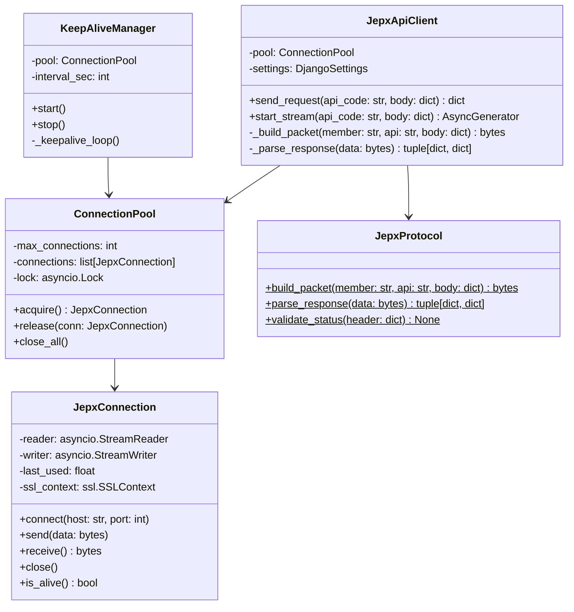
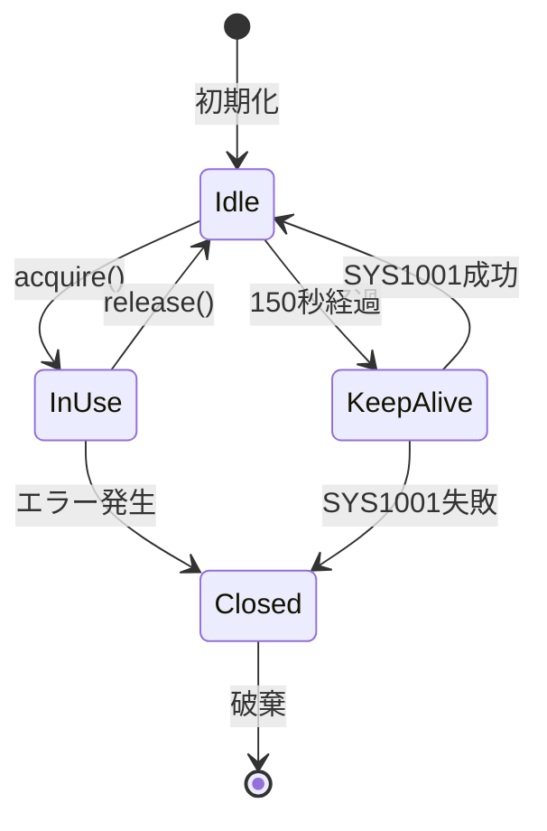
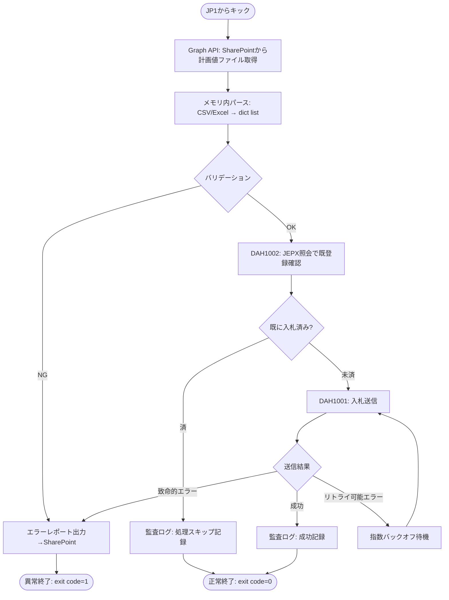
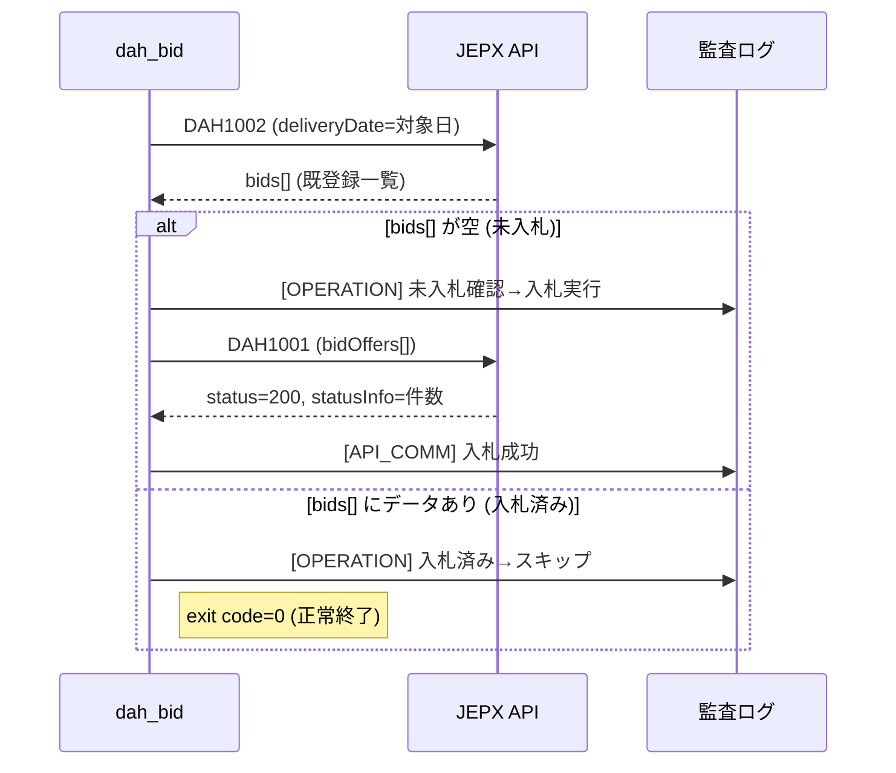
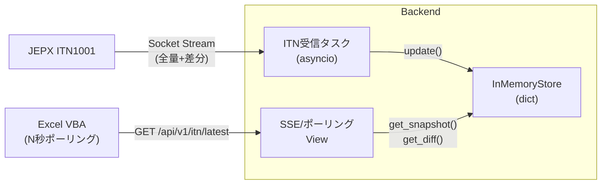
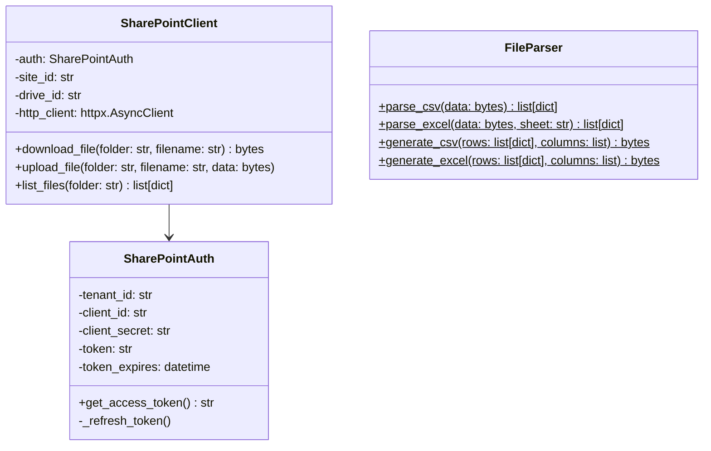
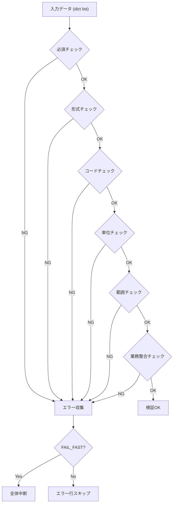
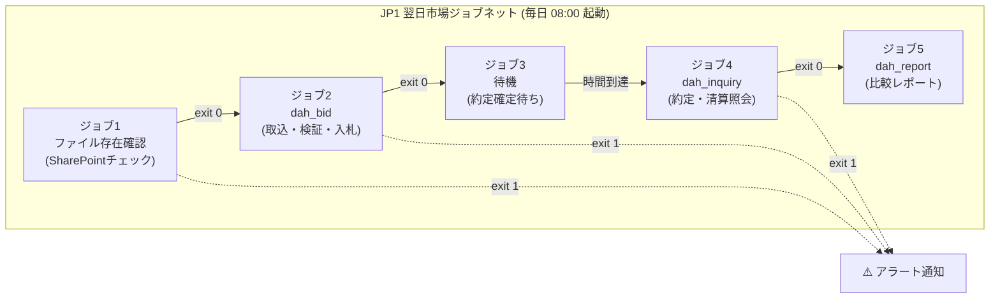

# 03. 詳細設計書（JEPX API連携システム）

## 文書情報

| 項目 | 内容 |
|------|------|
| 文書名 | 詳細設計書 |
| バージョン | 1.0.0 |
| 対象システム | JEPX API連携システム |
| 上位文書 | 01.要件定義書.md / 02.基本設計書.md |
| 参照仕様 | 901.接続技術書 / 902.API仕様書(DAH) / 903.API仕様書(ITD) |

---

## 要件トレーサビリティマトリクス

| 要件ID | 要件名 | 本書の対応章 |
|--------|--------|------------|
| FR-01 | ファイル取込・受付 | §6 SharePoint連携 |
| FR-02 | 入力バリデーション | §7 バリデーションエンジン |
| FR-03 | 業務妥当性 | §7 バリデーションエンジン |
| FR-10 | DAH API実装 | §3 JEPX通信基盤, §4 DAHバッチ |
| FR-11 | DAH入札制御 | §4 DAHバッチ |
| FR-20 | ITD/ITN API実装 | §3 JEPX通信基盤, §5 ITD/ITN API |
| FR-21 | ITD特有制御 | §5 ITD/ITN API |
| FR-22 | 配信受信（ITN中継） | §5 ITD/ITN API |
| FR-30 | 都度照会 | §4 DAHバッチ, §5 ITD/ITN API |
| FR-31 | 比較・検算レポート | §4 DAHバッチ |
| FR-32 | 清算・通知書出力 | §4 DAHバッチ, §5 ITD/ITN API |
| FR-40 | 二重送信防止 | §4 DAHバッチ, §5 ITD/ITN API |
| FR-41 | 再試行 | §3 JEPX通信基盤 |
| NFR-9.1 | 性能 | §10 デプロイ |
| NFR-9.2 | 可用性 | §3 JEPX通信基盤 |
| NFR-9.3 | 信頼性 | §3 JEPX通信基盤 |
| NFR-9.4 | セキュリティ | §9 設定管理, §10 デプロイ |
| NFR-9.5 | ログ | §8 ログ・監査証跡 |
| NFR-9.6 | 保守性 | §9 設定管理 |
| BR-01 | 対象業務完全性 | §4, §5 |
| BR-02 | 自動化(DAH) | §4 DAHバッチ, §10 JP1 |
| BR-03 | ユーザビリティ(ITD) | §5 ITD/ITN API |
| BR-04 | 監査性 | §8 ログ・監査証跡 |
| BR-05 | 事業継続性 | §4 冪等性, §3 リトライ |
| BR-06 | ステートレス運用 | §2 全体設計方針 |

---

## 第1章 用語・略語

| 用語 | 説明 |
|------|------|
| DAH | 翌日市場 (Day-Ahead) |
| ITD | 時間前市場 (Intraday) |
| ITN | 市場情報通知 (Intraday Notification) |
| SOH/STX/ETX | 制御文字 (0x01/0x02/0x03)。JEPX電文のデリミタ |
| ASGI | Asynchronous Server Gateway Interface |
| SSE | Server-Sent Events |
| Graph API | Microsoft 365 (SharePoint) 連携用API |
| JP1 | ジョブ管理ツール（バッチスケジューラ） |
| bidNo | JEPX仕様の入札番号（10桁数字文字列） |
| MockServer | 開発用JEPX APIシミュレータ（本プロジェクト内に構築済み） |

---

## 第2章 プロジェクト構成・ディレクトリ設計

### 2.1 Djangoプロジェクト全体構造

```
jepx_project/
├── manage.py
├── requirements.txt
├── Dockerfile
├── docker-compose.yml
│
├── config/                          # Djangoプロジェクト設定
│   ├── __init__.py
│   ├── settings/                    # ★ 3環境分離
│   │   ├── __init__.py
│   │   ├── base.py                  # 共通設定
│   │   ├── dev.py                   # 開発環境 (MockServer接続)
│   │   ├── stage.py                 # 検証環境 (JEPX検証環境接続)
│   │   └── prod.py                  # 本番環境 (JEPX本番接続)
│   ├── urls.py
│   ├── asgi.py
│   └── wsgi.py
│
├── apps/
│   ├── jepx_client/                 # JEPX Socket通信基盤
│   │   ├── __init__.py
│   │   ├── connection.py            # JepxConnection (TLS Socket)
│   │   ├── client.py                # JepxApiClient (送受信・パース)
│   │   ├── protocol.py              # 電文組立・解析 (SOH/STX/ETX/gzip)
│   │   ├── pool.py                  # コネクションプール
│   │   ├── keepalive.py             # SYS1001 Keep-Alive デーモン
│   │   └── exceptions.py            # JEPX通信例外クラス群
│   │
│   ├── dah_batch/                   # 翌日市場バッチ処理
│   │   ├── __init__.py
│   │   ├── management/
│   │   │   └── commands/
│   │   │       ├── dah_bid.py       # 入札バッチ (取込→検証→入札)
│   │   │       ├── dah_inquiry.py   # 照会バッチ (約定・清算)
│   │   │       └── dah_report.py    # 比較レポート生成
│   │   ├── services.py              # DAH業務ロジック
│   │   └── validators.py            # DAH用バリデーション
│   │
│   ├── itd_api/                     # 時間前市場 Web API
│   │   ├── __init__.py
│   │   ├── views.py                 # Django View (REST)
│   │   ├── urls.py                  # URL定義
│   │   ├── services.py              # ITD業務ロジック
│   │   ├── serializers.py           # リクエスト/レスポンスJSON変換
│   │   └── validators.py            # ITD用バリデーション
│   │
│   ├── itn_stream/                  # ITN市場情報通知ストリーム
│   │   ├── __init__.py
│   │   ├── receiver.py              # JEPX ITN受信バックグラウンドタスク
│   │   ├── store.py                 # インメモリ板情報ストア
│   │   └── views.py                 # SSE/ポーリング配信View
│   │
│   ├── sharepoint/                  # SharePoint連携 (Graph API)
│   │   ├── __init__.py
│   │   ├── auth.py                  # OAuth2 トークン取得
│   │   ├── client.py                # ファイルダウンロード/アップロード
│   │   └── file_parser.py           # CSV/Excelパーサー
│   │
│   └── common/                      # 共通ユーティリティ
│       ├── __init__.py
│       ├── logging.py               # 監査ログ・マスキング
│       ├── validators.py            # 共通バリデーションルール
│       └── codes.py                 # コード定義ローダー
│
├── config_data/                     # 設定ファイル群 (YAML)
│   ├── jepx_master.yaml             # エリアコード、時間帯コード等
│   ├── jepx_connection.yaml         # 接続先IP/ポート (環境別)
│   └── validation_rules.yaml        # バリデーションルール定義
│
├── certs/                           # TLS証明書
│   ├── jepx_root_ca.pem             # JEPXルート証明書
│   └── (環境別証明書)
│
├── logs/                            # ログ出力先
│   ├── app.log
│   ├── api_comm.log
│   └── audit.log
│
└── tests/                           # テスト
    ├── test_jepx_client.py
    ├── test_dah_batch.py
    ├── test_itd_api.py
    └── test_validators.py
```

### 2.2 環境別Settings設計（prod / stage / dev）

Django Settingsを3ファイルに分離し、環境変数 `DJANGO_SETTINGS_MODULE` で切り替える。

#### 2.2.1 環境定義

| 環境 | Settings | JEPX接続先 | MEMBER | 用途 |
|------|---------|-----------|--------|------|
| **dev** | `config.settings.dev` | `127.0.0.1:8888` (MockServer) | `9999` | ローカル開発・単体テスト |
| **stage** | `config.settings.stage` | JEPX検証環境IP:Port | `9999` | JEPX検証環境での結合テスト |
| **prod** | `config.settings.prod` | JEPX本番IP:Port | `0841` (実会員ID) | 本番運用 |

#### 2.2.2 base.py（共通設定）

```python
# config/settings/base.py
import os
from pathlib import Path

BASE_DIR = Path(__file__).resolve().parent.parent.parent

INSTALLED_APPS = [
    'django.contrib.contenttypes',
    'apps.jepx_client',
    'apps.dah_batch',
    'apps.itd_api',
    'apps.itn_stream',
    'apps.sharepoint',
    'apps.common',
]

# ---- JEPX通信 共通設定 ----
JEPX_SOCKET_TIMEOUT_SEC = 30
JEPX_KEEPALIVE_INTERVAL_SEC = 150  # 2分30秒 (3分切断の前)
JEPX_MAX_CONNECTIONS = 5           # 一般通信上限
JEPX_ITN_CONNECTIONS = 1           # 配信通信上限
JEPX_RETRY_MAX = 3
JEPX_RETRY_BACKOFF_BASE = 1       # 指数バックオフ基底(秒)

# ---- SharePoint連携 ----
GRAPH_API_TENANT_ID = os.environ.get('GRAPH_API_TENANT_ID', '')
GRAPH_API_CLIENT_ID = os.environ.get('GRAPH_API_CLIENT_ID', '')
GRAPH_API_CLIENT_SECRET = os.environ.get('GRAPH_API_CLIENT_SECRET', '')
SHAREPOINT_SITE_ID = os.environ.get('SHAREPOINT_SITE_ID', '')
SHAREPOINT_DRIVE_ID = os.environ.get('SHAREPOINT_DRIVE_ID', '')

# ---- ログ設定 ----
LOG_DIR = BASE_DIR / 'logs'
LOGGING = {
    'version': 1,
    'disable_existing_loggers': False,
    'formatters': {
        'audit': {
            'format': '{asctime} [{levelname}] [{name}] {message}',
            'style': '{',
        },
    },
    'handlers': {
        'api_comm': {
            'class': 'logging.handlers.RotatingFileHandler',
            'filename': str(LOG_DIR / 'api_comm.log'),
            'maxBytes': 50 * 1024 * 1024,  # 50MB
            'backupCount': 30,
            'formatter': 'audit',
            'encoding': 'utf-8',
        },
        'audit': {
            'class': 'logging.handlers.RotatingFileHandler',
            'filename': str(LOG_DIR / 'audit.log'),
            'maxBytes': 50 * 1024 * 1024,
            'backupCount': 30,
            'formatter': 'audit',
            'encoding': 'utf-8',
        },
        'console': {
            'class': 'logging.StreamHandler',
            'formatter': 'audit',
        },
    },
    'loggers': {
        'jepx.api': {
            'handlers': ['api_comm'],
            'level': 'DEBUG',
        },
        'jepx.audit': {
            'handlers': ['audit'],
            'level': 'INFO',
        },
    },
}

# ---- バリデーション ----
VALIDATION_FAIL_FAST = True  # 1件でもエラーならファイル全体を中断
```

#### 2.2.3 dev.py（開発環境 — MockServer接続）

```python
# config/settings/dev.py
from .base import *

DEBUG = True
ALLOWED_HOSTS = ['*']

# MockServer接続
JEPX_HOST = '127.0.0.1'
JEPX_PORT = 8888
JEPX_MEMBER_ID = '9999'
JEPX_TLS_VERIFY = False          # 自己署名証明書許容
JEPX_TLS_CA_CERT = None
JEPX_ENVIRONMENT = 'dev'

# dev環境ではSharePoint不要（ローカルファイル利用可）
SHAREPOINT_ENABLED = False
INPUT_FILE_DIR = BASE_DIR / 'test_data' / 'input'
OUTPUT_FILE_DIR = BASE_DIR / 'test_data' / 'output'

# コンソールログ追加
LOGGING['loggers']['jepx.api']['handlers'].append('console')
LOGGING['loggers']['jepx.audit']['handlers'].append('console')
LOGGING['root'] = {'handlers': ['console'], 'level': 'DEBUG'}
```

#### 2.2.4 stage.py（検証環境 — JEPX検証環境接続）

```python
# config/settings/stage.py
from .base import *

DEBUG = False
ALLOWED_HOSTS = [os.environ.get('ALLOWED_HOST', '*')]

# JEPX検証環境接続
JEPX_HOST = os.environ.get('JEPX_HOST')         # JEPX検証環境IP
JEPX_PORT = int(os.environ.get('JEPX_PORT', 0))  # JEPX検証環境Port
JEPX_MEMBER_ID = '9999'                           # 試験用会員ID
JEPX_TLS_VERIFY = True
JEPX_TLS_CA_CERT = str(BASE_DIR / 'certs' / 'jepx_root_ca.pem')
JEPX_ENVIRONMENT = 'stage'

# SharePoint有効
SHAREPOINT_ENABLED = True
```

#### 2.2.5 prod.py（本番環境 — JEPX本番接続）

```python
# config/settings/prod.py
from .base import *

DEBUG = False
ALLOWED_HOSTS = [os.environ['ALLOWED_HOST']]

# JEPX本番接続
JEPX_HOST = os.environ['JEPX_HOST']
JEPX_PORT = int(os.environ['JEPX_PORT'])
JEPX_MEMBER_ID = os.environ['JEPX_MEMBER_ID']    # 実会員ID
JEPX_TLS_VERIFY = True
JEPX_TLS_CA_CERT = str(BASE_DIR / 'certs' / 'jepx_root_ca.pem')
JEPX_ENVIRONMENT = 'prod'

JEPX_RETRY_MAX = 5  # 本番は再試行回数を増やす

# SharePoint有効
SHAREPOINT_ENABLED = True

# 本番ではコンソールログを出さない
LOGGING['loggers']['jepx.api']['handlers'] = ['api_comm']
```

#### 2.2.6 環境切り替え方法

```bash
# dev (ローカル開発)
export DJANGO_SETTINGS_MODULE=config.settings.dev
python manage.py runserver

# stage (検証環境)
export DJANGO_SETTINGS_MODULE=config.settings.stage
export JEPX_HOST=xxx.xxx.xxx.xxx
export JEPX_PORT=xxxxx
uvicorn config.asgi:application --host 0.0.0.0 --port 8000

# prod (本番)
export DJANGO_SETTINGS_MODULE=config.settings.prod
export JEPX_HOST=xxx.xxx.xxx.xxx
export JEPX_PORT=xxxxx
export JEPX_MEMBER_ID=0841
uvicorn config.asgi:application --host 0.0.0.0 --port 8000
```

### 2.3 依存ライブラリ

```
# requirements.txt
django>=5.0,<6.0
uvicorn[standard]>=0.30.0
httpx>=0.27.0          # Graph API (SharePoint) HTTPクライアント
openpyxl>=3.1.0        # Excel読み書き
pyyaml>=6.0            # YAML設定ファイル
sse-starlette>=2.0     # SSE配信 (ASGI)
```

---

## 第3章 JEPX Socket通信基盤 詳細設計

### 3.1 モジュール構成



### 3.2 protocol.py — 電文組立・解析

```python
# apps/jepx_client/protocol.py
"""JEPX電文プロトコル (901.接続技術書 §3 準拠)"""
import json, zlib

SOH = b'\x01'
STX = b'\x02'
ETX = b'\x03'

class JepxProtocol:

    @staticmethod
    def build_packet(member: str, api_code: str, body: dict) -> bytes:
        """リクエスト電文を組み立てる。
        Args:
            member: 会員ID (4桁英数字)
            api_code: API機能番号 (例: "DAH1001")
            body: リクエストボディ (dict)
        Returns:
            SOH + Header + STX + gzip(JSON) + ETX のbytes
        """
        json_bytes = json.dumps(body, ensure_ascii=False).encode('utf-8')
        compressed = zlib.compress(json_bytes)
        size = len(compressed)
        header = f"MEMBER={member},API={api_code},SIZE={size}".encode('ascii')
        return SOH + header + STX + compressed + ETX

    @staticmethod
    def parse_response(data: bytes) -> tuple[dict, dict]:
        """レスポンス電文を解析する。
        Returns:
            (header_dict, body_dict)
            header_dict: {"STATUS": "00", "SIZE": "254"}
            body_dict: JSONパース済みのdict
        Raises:
            JepxProtocolError: SOH/STX/ETX不正、SIZE不一致、gzip破損
        """
        soh_idx = data.find(SOH)
        stx_idx = data.find(STX)
        etx_idx = data.rfind(ETX)

        if soh_idx < 0 or stx_idx < 0 or etx_idx < 0:
            raise JepxProtocolError("電文フレーム異常: SOH/STX/ETX不正")

        header_str = data[soh_idx + 1:stx_idx].decode('ascii')
        header = dict(p.split('=') for p in header_str.split(','))

        body_bytes = data[stx_idx + 1:etx_idx]
        declared_size = int(header.get('SIZE', 0))
        if len(body_bytes) != declared_size:
            raise JepxProtocolError(
                f"SIZE不一致: 宣言={declared_size}, 実体={len(body_bytes)}"
            )

        decompressed = zlib.decompress(body_bytes)
        body = json.loads(decompressed.decode('utf-8'))
        return header, body

    @staticmethod
    def validate_status(header: dict) -> None:
        """ヘッダSTATUSを検証し、異常時は例外をスローする。
        Raises:
            JepxFormatError: STATUS=10 (電文フォーマット異常)
            JepxAuthError: STATUS=11 (権限なし)
            JepxSystemError: STATUS=19 (JEPXシステム異常、リトライ対象)
        """
        status = header.get('STATUS', '')
        if status == '00':
            return
        elif status == '10':
            raise JepxFormatError("電文フォーマット異常 (STATUS=10)")
        elif status == '11':
            raise JepxAuthError("会員ID権限なし (STATUS=11)")
        elif status == '19':
            raise JepxSystemError("JEPXシステム異常 (STATUS=19)")
        else:
            raise JepxProtocolError(f"未知のSTATUS: {status}")
```

### 3.3 exceptions.py — 例外クラス体系

```python
# apps/jepx_client/exceptions.py
class JepxError(Exception):
    """JEPX通信関連エラーの基底クラス"""
    pass

class JepxProtocolError(JepxError):
    """電文プロトコルの異常 (パース不能等)"""
    pass

class JepxFormatError(JepxError):
    """STATUS=10: 電文フォーマット異常 (リトライ不可)"""
    retryable = False

class JepxAuthError(JepxError):
    """STATUS=11: 会員ID権限なし (リトライ不可)"""
    retryable = False

class JepxSystemError(JepxError):
    """STATUS=19: JEPXシステム異常 (リトライ対象)"""
    retryable = True

class JepxConnectionError(JepxError):
    """TLS/Socket接続エラー (リトライ対象)"""
    retryable = True

class JepxTimeoutError(JepxError):
    """読み取り/書き込みタイムアウト (リトライ対象)"""
    retryable = True

class JepxBusinessError(JepxError):
    """body.status != "200": JEPX業務エラー (リトライ不可)"""
    retryable = False
    def __init__(self, status: str, status_info: str):
        self.status = status
        self.status_info = status_info
        super().__init__(f"JEPX業務エラー: status={status}, info={status_info}")
```

### 3.4 client.py — JepxApiClient 送受信

```python
# apps/jepx_client/client.py
"""JEPX API クライアント

業務ロジックはこのクラスの send_request() を呼ぶだけで、
Socket/TLS/gzip/SOH-ETXフレーミング を意識する必要がない。
"""
import asyncio
import logging
import time
from django.conf import settings
from .protocol import JepxProtocol
from .pool import ConnectionPool
from .exceptions import *

logger = logging.getLogger('jepx.api')
audit_logger = logging.getLogger('jepx.audit')

class JepxApiClient:

    def __init__(self):
        self.pool = ConnectionPool(
            host=settings.JEPX_HOST,
            port=settings.JEPX_PORT,
            max_connections=settings.JEPX_MAX_CONNECTIONS,
            tls_verify=settings.JEPX_TLS_VERIFY,
            ca_cert=getattr(settings, 'JEPX_TLS_CA_CERT', None),
        )
        self.member_id = settings.JEPX_MEMBER_ID
        self.max_retry = settings.JEPX_RETRY_MAX
        self.backoff_base = settings.JEPX_RETRY_BACKOFF_BASE

    async def send_request(self, api_code: str, body: dict) -> dict:
        """JEPX APIを呼び出し、レスポンスbody(dict)を返す。

        Args:
            api_code: "DAH1001", "ITD1003" 等
            body: リクエストJSON (dict)

        Returns:
            レスポンスボディのdict

        Raises:
            JepxFormatError: STATUS=10 (リトライ不可)
            JepxAuthError: STATUS=11 (リトライ不可)
            JepxBusinessError: body.status != "200"
            JepxError: リトライ上限超過
        """
        packet = JepxProtocol.build_packet(self.member_id, api_code, body)
        last_error = None

        for attempt in range(1, self.max_retry + 1):
            conn = None
            try:
                conn = await self.pool.acquire()
                start_time = time.monotonic()

                await conn.send(packet)
                raw_response = await conn.receive()

                elapsed = time.monotonic() - start_time
                header, resp_body = JepxProtocol.parse_response(raw_response)

                # 監査ログ出力
                audit_logger.info(
                    "[API_COMM] api=%s, elapsed=%.3fs, STATUS=%s, body_status=%s",
                    api_code, elapsed,
                    header.get('STATUS'), resp_body.get('status', '-')
                )

                # ヘッダSTATUS検証
                JepxProtocol.validate_status(header)

                # ボディ業務ステータス検証
                body_status = resp_body.get('status', '')
                if body_status not in ('200', ''):
                    raise JepxBusinessError(body_status, resp_body.get('statusInfo', ''))

                await self.pool.release(conn)
                return resp_body

            except (JepxSystemError, JepxConnectionError, JepxTimeoutError) as e:
                # リトライ対象
                last_error = e
                logger.warning(
                    "[RETRY] api=%s attempt=%d/%d error=%s",
                    api_code, attempt, self.max_retry, str(e)
                )
                if conn:
                    await conn.close()
                wait = self.backoff_base * (2 ** (attempt - 1))
                await asyncio.sleep(wait)

            except (JepxFormatError, JepxAuthError, JepxBusinessError):
                # リトライ不可 → 即スロー
                if conn:
                    await self.pool.release(conn)
                raise

        raise JepxError(f"リトライ上限超過 ({self.max_retry}回): {last_error}")
```

### 3.5 リトライポリシー判定表

| エラー種別 | STATUS | リトライ | 最大回数 | 待機方式 |
|-----------|--------|---------|---------|---------|
| TLS/Socket接続失敗 | — | ✅ | 設定値 (dev:3, prod:5) | 指数バックオフ |
| 読み取りタイムアウト | — | ✅ | 同上 | 指数バックオフ |
| JEPXシステム異常 | 19 | ✅ | 同上 | 指数バックオフ |
| 電文フォーマット異常 | 10 | ❌ | — | 即時例外 |
| 会員ID権限なし | 11 | ❌ | — | 即時例外 |
| JEPX業務エラー | 00 (body≠200) | ❌ | — | 即時例外 |

### 3.6 コネクションプール設計



- **一般通信 (DAH/ITD)**: プール上限 5 本。`acquire()` で取得し、使用後に `release()` で返却。
- **配信通信 (ITN)**: 専用 1 本。プールとは別管理。Keep-Alive不要（配信通信は無通信切断なし）。
- **Keep-Aliveデーモン**: プール内のIdle接続に対し、最終通信から150秒経過でSYS1001を自動発行。

---

## 第4章 DAHバッチ処理 詳細設計

### 4.1 Management Command一覧

| コマンド | 呼出元 | 説明 | 対応API |
|---------|--------|------|---------|
| `dah_bid` | JP1 ジョブ2-3 | 計画値取込→検証→冪等性チェック→入札 | DAH1001, DAH1002 |
| `dah_inquiry` | JP1 ジョブ4 | 約定照会・清算照会→ファイル出力 | DAH1004, DAH9001 |
| `dah_report` | JP1 ジョブ5 | 計画値vs約定の比較レポート生成 | — (ファイルI/O) |

### 4.2 dah_bid コマンド 処理フロー



### 4.3 dah_bid コマンド 関数シグネチャ

```python
# apps/dah_batch/management/commands/dah_bid.py
from django.core.management.base import BaseCommand

class Command(BaseCommand):
    help = '翌日市場 入札バッチ (DAH1001)'

    def add_arguments(self, parser):
        parser.add_argument('--date', type=str, required=True,
                            help='受渡日 (YYYY-MM-DD)')
        parser.add_argument('--file-path', type=str, default=None,
                            help='直接ファイルパス指定 (SharePointスキップ)')

    async def handle(self, *args, **options):
        delivery_date = options['date']
        # 1. ファイル取得
        # 2. バリデーション
        # 3. 冪等性チェック (DAH1002)
        # 4. 入札実行 (DAH1001)
        ...
```

### 4.4 DAH1001〜DAH9001 リクエスト/レスポンス詳細

#### DAH1001 入札

| 項目 | リクエスト | レスポンス |
|------|-----------|-----------|
| キー | `bidOffers[]` 配列 | `status`, `statusInfo` |
| 入札の各要素 | `deliveryDate`, `areaCd`, `timeCd`, `bidTypeCd`, `price`, `volume`, `deliveryContractCd`, `note` | `statusInfo` = 入札件数 (文字列) |
| 冪等性制御 | 事前にDAH1002で該当日の既登録を確認 | — |

#### DAH1002 入札照会

| 項目 | リクエスト | レスポンス |
|------|-----------|-----------|
| キー | `deliveryDate` | `status`, `statusInfo`, `bids[]` |
| `bids[]`要素 | — | `bidNo`, `deliveryDate`, `areaCd`, `timeCd`, `bidTypeCd`, `price`, `volume`, `deliveryContractCd`, `note` |

#### DAH1003 入札削除

| 項目 | リクエスト | レスポンス |
|------|-----------|-----------|
| キー | `deliveryDate`, `bidDels[].bidNo` | `status`, `statusInfo` |
| 動作 | `bidDels`未指定→該当日全削除 | `statusInfo` = 削除件数 |

#### DAH1004 / DAH1030 約定照会

| 項目 | リクエスト | レスポンス |
|------|-----------|-----------|
| キー | `deliveryDate` | `status`, `statusInfo`, `bidResults[]` |
| `bidResults[]`要素 | — | DAH1002 の全フィールド + `contractPrice`, `contractVolume` |

#### DAH9001 清算照会

| 項目 | リクエスト | レスポンス |
|------|-----------|-----------|
| キー | `fromDate`, `toDate`(任意) | `status`, `statusInfo`, `settlements[]` |
| `settlements[]`要素 | — | `settlementNo`, `settlementDate`, `title`, `totalAmount`, `items[]`, `pdf` (Base64) |

### 4.5 冪等性制御シーケンス



### 4.6 比較レポート生成仕様

`dah_report` コマンドは以下のCSVカラムで出力する：

| カラム | 内容 | ソース |
|-------|------|--------|
| deliveryDate | 受渡日 | 計画値/約定値共通 |
| timeCd | 時間帯コード | 同上 |
| areaCd | エリアコード | 同上 |
| plan_price | 計画価格 | 計画値ファイル |
| plan_volume | 計画量 | 計画値ファイル |
| contract_price | 約定価格 | DAH1004応答 |
| contract_volume | 約定量 | DAH1004応答 |
| diff_volume | 差分量 | `contract_volume - plan_volume` |
| match | 一致判定 | `OK` / `MISMATCH` |

---

## 第5章 ITD/ITN Web API 詳細設計

### 5.1 Django URL設計

```python
# apps/itd_api/urls.py
from django.urls import path
from . import views

urlpatterns = [
    # ITD 入札系
    path('api/v1/itd/bid',        views.ItdBidView.as_view()),       # POST
    path('api/v1/itd/bid/delete', views.ItdBidDeleteView.as_view()), # POST
    path('api/v1/itd/inquiry',    views.ItdInquiryView.as_view()),   # POST
    path('api/v1/itd/contract',   views.ItdContractView.as_view()),  # POST
    path('api/v1/itd/settlement', views.ItdSettlementView.as_view()),# POST

    # ITN 市場情報
    path('api/v1/itn/latest',     views.ItnLatestView.as_view()),    # GET
    path('api/v1/itn/stream',     views.ItnStreamView.as_view()),    # GET (SSE)
]
```

### 5.2 ITD API リクエスト/レスポンスJSON仕様

#### POST `/api/v1/itd/bid` — 入札

**リクエスト (Excel VBA → Django):**
```json
{
  "deliveryDate": "2026-04-01",
  "timeCd": "24",
  "areaCd": "1",
  "bidTypeCd": "SELL-LIMIT",
  "price": 50.0,
  "volume": 100.5,
  "deliveryContractCd": "BG001",
  "note": "テスト入札"
}
```

**レスポンス (Django → Excel VBA):**
```json
{
  "success": true,
  "jepx_status": "200",
  "bid_no": "1234567890",
  "message": "入札が完了しました"
}
```

**エラーレスポンス:**
```json
{
  "success": false,
  "error_code": "JEPX_AUTH_ERROR",
  "message": "会員IDの権限がありません。管理者にお問い合わせください。",
  "detail": "STATUS=11"
}
```

#### POST `/api/v1/itd/bid/delete` — 入札削除要求

**リクエスト:**
```json
{
  "deliveryDate": "2026-04-01",
  "timeCd": "24",
  "targetBidNo": "1234567890"
}
```

#### POST `/api/v1/itd/inquiry` — 入札照会

**リクエスト:**
```json
{ "deliveryDate": "2026-04-01" }
```

**レスポンス:**
```json
{
  "success": true,
  "bids": [
    {
      "bidNo": "1234567890",
      "deliveryDate": "2026-04-01",
      "timeCd": "24",
      "areaCd": "1",
      "bidTypeCd": "SELL-LIMIT",
      "price": 50.0,
      "volume": 100.5
    }
  ]
}
```

#### POST `/api/v1/itd/contract` — 約定照会

**レスポンス:**
```json
{
  "success": true,
  "bidResults": [
    {
      "bidNo": "...",
      "contractPrice": 50.0,
      "contractVolume": 100.5
    }
  ]
}
```

### 5.3 エラーコード体系（Django → Excel）

| error_code | 説明 | 起因 |
|-----------|------|------|
| `VALIDATION_ERROR` | 入力値の形式・範囲エラー | FR-02 |
| `JEPX_FORMAT_ERROR` | JEPX電文異常 (STATUS=10) | プログラムバグの疑い |
| `JEPX_AUTH_ERROR` | 会員ID権限なし (STATUS=11) | 設定ミス |
| `JEPX_SYSTEM_ERROR` | JEPXシステム異常 (STATUS=19) | JEPX側一時障害 |
| `JEPX_BUSINESS_ERROR` | JEPX業務エラー (status≠200) | 入札条件不備等 |
| `JEPX_CONNECTION_ERROR` | JEPX接続不可 | ネットワーク障害 |
| `JEPX_TIMEOUT` | JEPX応答タイムアウト | ネットワーク遅延 |
| `INTERNAL_ERROR` | サーバー内部エラー | 例外捕捉 |

### 5.4 ITN 市場情報通知 配信設計



#### InMemoryStore インターフェース

```python
# apps/itn_stream/store.py
import asyncio
from datetime import datetime

class ItnMemoryStore:
    """ITN板情報のインメモリストア (スレッドセーフ)"""

    def __init__(self):
        self._data: dict = {}           # {(deliveryDate, timeCd): notice_dict}
        self._version: int = 0
        self._lock = asyncio.Lock()
        self._updated = asyncio.Event()

    async def update(self, notices: list[dict]) -> None:
        """差分データでストアを更新"""
        async with self._lock:
            for notice in notices:
                key = (notice['deliveryDate'], notice['timeCd'])
                self._data[key] = notice
            self._version += 1
            self._updated.set()

    async def get_snapshot(self) -> dict:
        """全データのスナップショットを返却"""
        async with self._lock:
            return {
                'version': self._version,
                'notices': list(self._data.values()),
                'timestamp': datetime.now().isoformat()
            }

    async def wait_for_update(self, timeout: float = 10.0) -> bool:
        """更新があるまで待機 (SSE/ロングポーリング用)"""
        self._updated.clear()
        try:
            await asyncio.wait_for(self._updated.wait(), timeout=timeout)
            return True
        except asyncio.TimeoutError:
            return False
```

#### ITN受信バックグラウンドタスク

```python
# apps/itn_stream/receiver.py
"""Django ASGI起動時にバックグラウンドで ITN1001 を受信し続けるタスク"""

async def itn_receiver_loop(store: ItnMemoryStore):
    """JEPX ITN1001ストリームを受信し、storeを更新する無限ループ"""
    client = JepxApiClient()
    while True:
        try:
            async for header, body in client.start_stream('ITN1001', {}):
                notices = body.get('notices', [])
                if notices:
                    await store.update(notices)
                    logger.info("[ITN] %d notices received (v=%d)",
                                len(notices), store._version)
        except Exception as e:
            logger.error("[ITN] 受信エラー: %s, 5秒後に再接続", e)
            await asyncio.sleep(5)
```

---

## 第6章 SharePoint連携 (Graph API) 詳細設計

### 6.1 モジュール構成



### 6.2 OAuth2認証フロー

```python
# apps/sharepoint/auth.py
import httpx
from datetime import datetime, timedelta
from django.conf import settings

class SharePointAuth:
    """Azure Entra ID クライアントクレデンシャルフローによるトークン取得"""

    TOKEN_URL = "https://login.microsoftonline.com/{tenant}/oauth2/v2.0/token"

    def __init__(self):
        self.tenant_id = settings.GRAPH_API_TENANT_ID
        self.client_id = settings.GRAPH_API_CLIENT_ID
        self.client_secret = settings.GRAPH_API_CLIENT_SECRET
        self._token: str | None = None
        self._expires_at: datetime = datetime.min

    async def get_access_token(self) -> str:
        """有効なアクセストークンを返す。期限切れなら自動リフレッシュ。"""
        if self._token and datetime.now() < self._expires_at:
            return self._token
        await self._refresh_token()
        return self._token

    async def _refresh_token(self):
        url = self.TOKEN_URL.format(tenant=self.tenant_id)
        async with httpx.AsyncClient() as client:
            resp = await client.post(url, data={
                'grant_type': 'client_credentials',
                'client_id': self.client_id,
                'client_secret': self.client_secret,
                'scope': 'https://graph.microsoft.com/.default',
            })
            resp.raise_for_status()
            data = resp.json()
            self._token = data['access_token']
            self._expires_at = datetime.now() + timedelta(
                seconds=data.get('expires_in', 3600) - 300  # 5分前に更新
            )
```

### 6.3 ファイル取得・出力

```python
# apps/sharepoint/client.py
class SharePointClient:

    GRAPH_BASE = "https://graph.microsoft.com/v1.0"

    async def download_file(self, folder: str, filename: str) -> bytes:
        """SharePointからファイルをダウンロード(メモリ内)"""
        token = await self.auth.get_access_token()
        path = f"/sites/{self.site_id}/drives/{self.drive_id}/root:/{folder}/{filename}:/content"
        resp = await self.http_client.get(
            f"{self.GRAPH_BASE}{path}",
            headers={"Authorization": f"Bearer {token}"},
        )
        resp.raise_for_status()
        return resp.content

    async def upload_file(self, folder: str, filename: str, data: bytes):
        """SharePointへファイルをアップロード"""
        token = await self.auth.get_access_token()
        path = f"/sites/{self.site_id}/drives/{self.drive_id}/root:/{folder}/{filename}:/content"
        resp = await self.http_client.put(
            f"{self.GRAPH_BASE}{path}",
            headers={
                "Authorization": f"Bearer {token}",
                "Content-Type": "application/octet-stream",
            },
            content=data,
        )
        resp.raise_for_status()
```

### 6.4 SharePointフォルダ構成

```
SharePoint サイト/
├── JEPX/
│   ├── input/                    # 入力ファイル配置場所
│   │   ├── 2026-04-01_plan.csv   # 翌日市場 計画値
│   │   └── 2026-04-01_plan.xlsx
│   ├── output/                   # 出力ファイル格納場所
│   │   ├── 2026-04-01_report.csv # 比較レポート
│   │   └── 2026-04-01_settlement.pdf
│   └── error/                    # エラーレポート
│       └── 2026-04-01_error.csv
```

### 6.5 dev環境でのSharePointスキップ

dev環境では `SHAREPOINT_ENABLED = False` のため、ローカルファイルシステムを使用する。

```python
# apps/dah_batch/services.py
from django.conf import settings

async def get_plan_file(delivery_date: str, file_path: str = None) -> bytes:
    """計画値ファイルを取得する（環境に応じてソースを切替）"""
    if file_path:
        # 直接パス指定（デバッグ用）
        with open(file_path, 'rb') as f:
            return f.read()

    if settings.SHAREPOINT_ENABLED:
        client = SharePointClient()
        return await client.download_file('input', f'{delivery_date}_plan.csv')
    else:
        # dev環境: ローカルファイル
        local_path = settings.INPUT_FILE_DIR / f'{delivery_date}_plan.csv'
        with open(local_path, 'rb') as f:
            return f.read()
```

---

## 第7章 バリデーションエンジン 詳細設計

### 7.1 検証ルール一覧

#### 7.1.1 共通バリデーション（DAH/ITD共通）

| ルールID | カテゴリ | フィールド | 検証内容 | エラーコード |
|---------|---------|-----------|---------|------------|
| V-001 | required | deliveryDate | 必須、空欄不可 | `REQUIRED` |
| V-002 | format | deliveryDate | YYYY-MM-DD形式 | `FORMAT` |
| V-003 | required | areaCd | 必須 | `REQUIRED` |
| V-004 | code | areaCd | エリアコードマスタに存在する値 | `CODE` |
| V-005 | required | timeCd | 必須 | `REQUIRED` |
| V-006 | code | timeCd | "01"〜"48"の範囲 (DAH) | `CODE` |
| V-007 | required | bidTypeCd | 必須 | `REQUIRED` |
| V-008 | code | bidTypeCd | SELL-LIMIT/BUY-LIMIT/SELL-MARKET/BUY-MARKET/FIT/DEL | `CODE` |
| V-009 | required | price | 必須（成行除く） | `REQUIRED` |
| V-010 | unit | price | 10の倍数であること | `UNIT` |
| V-011 | range | price | 0 < price ≤ 999.0 (設定値) | `RANGE` |
| V-012 | required | volume | 必須 | `REQUIRED` |
| V-013 | format | volume | 小数第1位まで有効、第2位以下は切捨て | `FORMAT` |
| V-014 | range | volume | 0 < volume ≤ 5000.0 (設定値) | `RANGE` |
| V-015 | required | deliveryContractCd | 必須 | `REQUIRED` |
| V-016 | format | note | 最大100文字 | `FORMAT` |

#### 7.1.2 DAH固有バリデーション

| ルールID | カテゴリ | 検証内容 | エラーコード |
|---------|---------|---------|------------|
| V-D01 | schedule | deliveryDateが入札受付期間内であること | `SCHEDULE` |
| V-D02 | inconsistency | 同一(deliveryDate,areaCd,timeCd)の重複入札がファイル内にないこと | `INCONSISTENCY` |

#### 7.1.3 ITD固有バリデーション

| ルールID | カテゴリ | 検証内容 | エラーコード |
|---------|---------|---------|------------|
| V-I01 | schedule | 対象コマの取引が中断されていないこと | `SCHEDULE` |
| V-I02 | code | areaCd がエリアグループコードの場合も許容 (A1,A2等) | `CODE` |

### 7.2 バリデーション処理フロー



### 7.3 バリデーション実装

```python
# apps/common/validators.py
from dataclasses import dataclass

@dataclass
class ValidationError:
    row: int
    field: str
    rule_id: str
    error_code: str
    message: str

class BidValidator:
    """入札データの検証エンジン"""

    def __init__(self, codes: dict):
        self.area_codes = codes.get('areas', {})
        self.time_codes = [f"{i:02d}" for i in range(1, 49)]
        self.bid_types = codes.get('bid_types', [])
        self.max_price = codes.get('limits', {}).get('max_bid_price', 999.0)
        self.max_volume = codes.get('limits', {}).get('max_bid_volume', 5000.0)

    def validate(self, rows: list[dict]) -> list[ValidationError]:
        errors = []
        for i, row in enumerate(rows, start=1):
            errors.extend(self._validate_row(i, row))
        return errors

    def _validate_row(self, row_num: int, row: dict) -> list[ValidationError]:
        errs = []
        # V-001: deliveryDate 必須
        if not row.get('deliveryDate'):
            errs.append(ValidationError(row_num, 'deliveryDate', 'V-001', 'REQUIRED', '受渡日は必須です'))
        # V-010: price 10の倍数
        price = row.get('price')
        if price is not None and price % 10 != 0:
            errs.append(ValidationError(row_num, 'price', 'V-010', 'UNIT', '入札価格は10の倍数でなければなりません'))
        # V-013: volume 小数第1位で切捨て
        volume = row.get('volume')
        if volume is not None:
            row['volume'] = int(volume * 10) / 10  # 自動補正
        # ... 同パターンで全ルールを実装
        return errs
```

---

## 第8章 ログ・監査証跡 詳細設計

### 8.1 ログ種別と出力先

| ログ種別 | ロガー名 | ファイル | 記録内容 | ローテーション |
|---------|---------|--------|---------|-------------|
| API通信ログ | `jepx.api` | `logs/api_comm.log` | JEPX API送受信(マスキング済) | 50MB×30世代 |
| 監査ログ | `jepx.audit` | `logs/audit.log` | 操作・判定・バッチ進行 | 50MB×30世代 |
| エラーログ | `jepx.error` | `logs/error.log` | 例外スタックトレース | 50MB×30世代 |
| アプリログ | `root` | `logs/app.log` | Django全般 | 50MB×10世代 |

### 8.2 ログフォーマット

```
2026-04-01 08:15:32.456 [INFO] [jepx.api] [API_COMM] api=DAH1001, elapsed=0.234s, STATUS=00, body_status=200
2026-04-01 08:15:32.457 [INFO] [jepx.audit] [OPERATION] action=bid, delivery_date=2026-04-02, bid_count=1, result=success
2026-04-01 08:15:33.100 [ERROR] [jepx.error] JepxConnectionError: TLS handshake failed
  Traceback (most recent call last):
    ...
```

### 8.3 マスキング機構

```python
# apps/common/logging.py
import re
import json
import logging

MASK_PATTERNS = {
    'memberId': r'("memberId"\s*:\s*")([^"]+)(")',
    'password': r'("password"\s*:\s*")([^"]+)(")',
    'client_secret': r'("client_secret"\s*:\s*")([^"]+)(")',
}

class MaskingFilter(logging.Filter):
    """ログレコードから機密情報をマスクするフィルター"""

    def filter(self, record: logging.LogRecord) -> bool:
        if hasattr(record, 'msg') and isinstance(record.msg, str):
            for field, pattern in MASK_PATTERNS.items():
                record.msg = re.sub(
                    pattern,
                    lambda m: m.group(1) + '********' + m.group(3),
                    record.msg
                )
        return True
```

### 8.4 監査ログ記録ポイント一覧

| 記録ポイント | ログ種別 | タグ | 記録内容 |
|------------|---------|------|---------|
| バッチ起動 | audit | `[OPERATION]` | コマンド名、引数、開始時刻 |
| SharePointファイル取得 | audit | `[OPERATION]` | ファイル名、サイズ |
| バリデーション結果 | audit | `[OPERATION]` | レコード数、エラー数 |
| JEPX API送信 | api | `[API_COMM]` | API番号、リクエストボディ(マスキング済) |
| JEPX API受信 | api | `[API_COMM]` | STATUS、body.status、レスポンス時間 |
| 冪等性スキップ | audit | `[OPERATION]` | スキップ理由、既存bidNo数 |
| リトライ発生 | api | `[RETRY]` | 試行回数、エラー内容 |
| バッチ完了 | audit | `[OPERATION]` | 処理件数、所要時間、exit code |
| Excel APIリクエスト受信 | audit | `[OPERATION]` | エンドポイント、パラメータ |
| ITN受信 | api | `[ITN]` | notices件数、現在バージョン |

---

## 第9章 設定管理・コード定義 詳細設計

### 9.1 設定ファイル一覧

| ファイル | 内容 | 変更頻度 |
|---------|------|---------|
| `config_data/jepx_master.yaml` | マスタコード定義 | JEPX仕様変更時 |
| `config_data/validation_rules.yaml` | バリデーション上限値 | 業務変更時 |
| `config/settings/{env}.py` | 環境別接続先・動作設定 | デプロイ時 |
| `.env` (本番) | 機密情報（環境変数） | 初期設定/変更時 |

### 9.2 jepx_master.yaml

```yaml
# config_data/jepx_master.yaml

# エリアコード (翌日市場)
areas:
  "1": "北海道"
  "2": "東北"
  "3": "東京"
  "4": "中部"
  "5": "北陸"
  "6": "関西"
  "7": "中国"
  "8": "四国"
  "9": "九州"

# エリアグループコード (時間前市場)
area_groups:
  "A1": "北海道"
  "A2": "東北"
  "A4": "中部"
  "A7": "中国"
  "A9": "九州"

# 時間帯コード
time_codes:
  min: 1
  max: 48

# 入札種別コード
bid_types:
  - "SELL-LIMIT"    # 売り指値
  - "BUY-LIMIT"     # 買い指値
  - "SELL-MARKET"   # 売り成行
  - "BUY-MARKET"    # 買い成行
  - "FIT"           # FIT
  - "DEL"           # 削除要求 (ITD)

# 通知種別コード (ITN)
notice_types:
  - "CONTRACT"      # 約定情報
  - "BID-BOARD"     # 板情報

# 取引中断コード
suspend_codes:
  "0": "取引可能"
  "1": "取引中断"

# 入札制限値
limits:
  max_bid_price: 999.0     # 円/MWh
  max_bid_volume: 5000.0   # MW
```

### 9.3 コード定義ローダー

```python
# apps/common/codes.py
import yaml
from pathlib import Path
from functools import lru_cache
from django.conf import settings

@lru_cache(maxsize=1)
def load_master_codes() -> dict:
    """マスタコードYAMLを読み込み、dictとしてキャッシュする。
    変更を反映するにはプロセスの再起動が必要。
    """
    path = Path(settings.BASE_DIR) / 'config_data' / 'jepx_master.yaml'
    with open(path, 'r', encoding='utf-8') as f:
        return yaml.safe_load(f)

def get_area_name(area_cd: str) -> str:
    codes = load_master_codes()
    return codes['areas'].get(area_cd, f"不明({area_cd})")

def is_valid_bid_type(bid_type_cd: str) -> bool:
    codes = load_master_codes()
    return bid_type_cd in codes['bid_types']
```

### 9.4 環境変数一覧

| 変数名 | 環境 | 説明 | 必須 |
|--------|------|------|------|
| `DJANGO_SETTINGS_MODULE` | 全環境 | Settings切替 | ✅ |
| `JEPX_HOST` | stage/prod | JEPX接続先IP | ✅ |
| `JEPX_PORT` | stage/prod | JEPX接続先ポート | ✅ |
| `JEPX_MEMBER_ID` | prod | 実会員ID | ✅(prod) |
| `ALLOWED_HOST` | stage/prod | Djangoの許可ホスト | ✅ |
| `GRAPH_API_TENANT_ID` | stage/prod | Azure テナントID | ✅ |
| `GRAPH_API_CLIENT_ID` | stage/prod | Azure クライアントID | ✅ |
| `GRAPH_API_CLIENT_SECRET` | stage/prod | Azure クライアントシークレット | ✅ |
| `SHAREPOINT_SITE_ID` | stage/prod | SharePoint サイトID | ✅ |
| `SHAREPOINT_DRIVE_ID` | stage/prod | SharePoint ドライブID | ✅ |
| `SECRET_KEY` | stage/prod | Django SECRET_KEY | ✅ |

---

## 第10章 デプロイ・環境構築・運用 詳細設計

### 10.1 サーバー構成

| 項目 | 仕様 |
|------|------|
| OS | Amazon Linux 2023 / Ubuntu 22.04 LTS |
| Python | 3.12+ |
| ASGIサーバー | Uvicorn (ワーカー数: 4) |
| リバースプロキシ | Nginx |
| プロセス管理 | systemd |
| バッチスケジューラ | JP1 |

### 10.2 Nginx設定

```nginx
# /etc/nginx/conf.d/jepx_app.conf
upstream jepx_asgi {
    server 127.0.0.1:8000;
}

server {
    listen 443 ssl;
    server_name jepx-api.internal.example.com;

    ssl_certificate     /etc/nginx/ssl/server.crt;
    ssl_certificate_key /etc/nginx/ssl/server.key;

    # Excel VBAからのAPIリクエスト
    location /api/ {
        proxy_pass http://jepx_asgi;
        proxy_set_header Host $host;
        proxy_set_header X-Real-IP $remote_addr;
        proxy_set_header X-Forwarded-For $proxy_add_x_forwarded_for;
        proxy_read_timeout 60s;
    }

    # SSE (ITN配信) - バッファリング無効化
    location /api/v1/itn/stream {
        proxy_pass http://jepx_asgi;
        proxy_set_header Host $host;
        proxy_buffering off;
        proxy_cache off;
        proxy_read_timeout 3600s;  # 長時間接続
    }

    # ヘルスチェック
    location /health {
        proxy_pass http://jepx_asgi;
    }

    # アクセスログ
    access_log /var/log/nginx/jepx_access.log;
    error_log  /var/log/nginx/jepx_error.log;
}
```

### 10.3 Uvicorn systemd設定

```ini
# /etc/systemd/system/jepx-app.service
[Unit]
Description=JEPX API Application (Uvicorn ASGI)
After=network.target

[Service]
User=jepx
Group=jepx
WorkingDirectory=/opt/jepx_project
EnvironmentFile=/opt/jepx_project/.env
ExecStart=/opt/jepx_project/.venv/bin/uvicorn \
    config.asgi:application \
    --host 127.0.0.1 \
    --port 8000 \
    --workers 4 \
    --log-level info
Restart=always
RestartSec=5

[Install]
WantedBy=multi-user.target
```

### 10.4 .env ファイル (本番テンプレート)

```bash
# /opt/jepx_project/.env
DJANGO_SETTINGS_MODULE=config.settings.prod
SECRET_KEY=<django-secret-key>
ALLOWED_HOST=jepx-api.internal.example.com

# JEPX接続
JEPX_HOST=<JEPX本番IP>
JEPX_PORT=<JEPX本番Port>
JEPX_MEMBER_ID=0841

# SharePoint (Graph API)
GRAPH_API_TENANT_ID=<Azure_Tenant_ID>
GRAPH_API_CLIENT_ID=<Azure_Client_ID>
GRAPH_API_CLIENT_SECRET=<Azure_Client_Secret>
SHAREPOINT_SITE_ID=<SharePoint_Site_ID>
SHAREPOINT_DRIVE_ID=<SharePoint_Drive_ID>
```

### 10.5 JP1ジョブネット設計



#### JP1 ジョブ定義パラメータ

| ジョブ | コマンド | 引数 | タイムアウト | リトライ |
|-------|---------|------|-----------|---------|
| ジョブ1 | `python manage.py dah_check_file` | `--date $(DELIVERY_DATE)` | 60秒 | 0回 |
| ジョブ2 | `python manage.py dah_bid` | `--date $(DELIVERY_DATE)` | 300秒 | 0回 (内部リトライ有) |
| ジョブ3 | 待機 | — | — | — |
| ジョブ4 | `python manage.py dah_inquiry` | `--date $(DELIVERY_DATE)` | 300秒 | 0回 |
| ジョブ5 | `python manage.py dah_report` | `--date $(DELIVERY_DATE)` | 120秒 | 0回 |

### 10.6 SSL/TLS証明書管理

| 証明書 | 配置場所 | 用途 | 管理元 |
|--------|---------|------|--------|
| JEPXルートCA | `certs/jepx_root_ca.pem` | JEPX Socket通信のサーバー証明書検証 | JEPX配布 |
| Nginx SSL証明書 | `/etc/nginx/ssl/server.crt` | Excel VBAからのHTTPS通信 | 社内CA |
| Nginx 秘密鍵 | `/etc/nginx/ssl/server.key` | 同上 | 社内CA |
| MockServer自己署名 | `MockServer/certs/` | dev環境のみ使用 | 自動生成 |

### 10.7 デプロイ手順

```bash
# 1. ソースコード展開
cd /opt/jepx_project
git pull origin main

# 2. 仮想環境・依存ライブラリ
python3.12 -m venv .venv
source .venv/bin/activate
pip install -r requirements.txt

# 3. 環境変数設定 (.envファイルの配置・確認)
cp .env.template .env
# → 各値を記入

# 4. ログディレクトリ作成
mkdir -p logs

# 5. 静的ファイル収集 (必要な場合)
python manage.py collectstatic --noinput

# 6. サービス起動
sudo systemctl restart jepx-app
sudo systemctl restart nginx

# 7. 動作確認
curl -k https://localhost/health
```

### 10.8 環境別デプロイ比較

| 項目 | dev | stage | prod |
|------|-----|-------|------|
| JEPX接続先 | MockServer (localhost:8888) | JEPX検証環境 | JEPX本番 |
| Webサーバー | `python manage.py runserver` | Uvicorn + Nginx | Uvicorn + Nginx |
| SharePoint | 無効 (ローカルファイル) | 有効 | 有効 |
| TLS証明書検証 | 無効 (自己署名許容) | 有効 | 有効 |
| DEBUG | True | False | False |
| ログ出力先 | コンソール + ファイル | ファイル | ファイル |
| JP1 | 不使用 (手動実行) | 検証用ジョブ | 本番ジョブネット |
| Docker | MockServer (docker-compose) | — | — |
