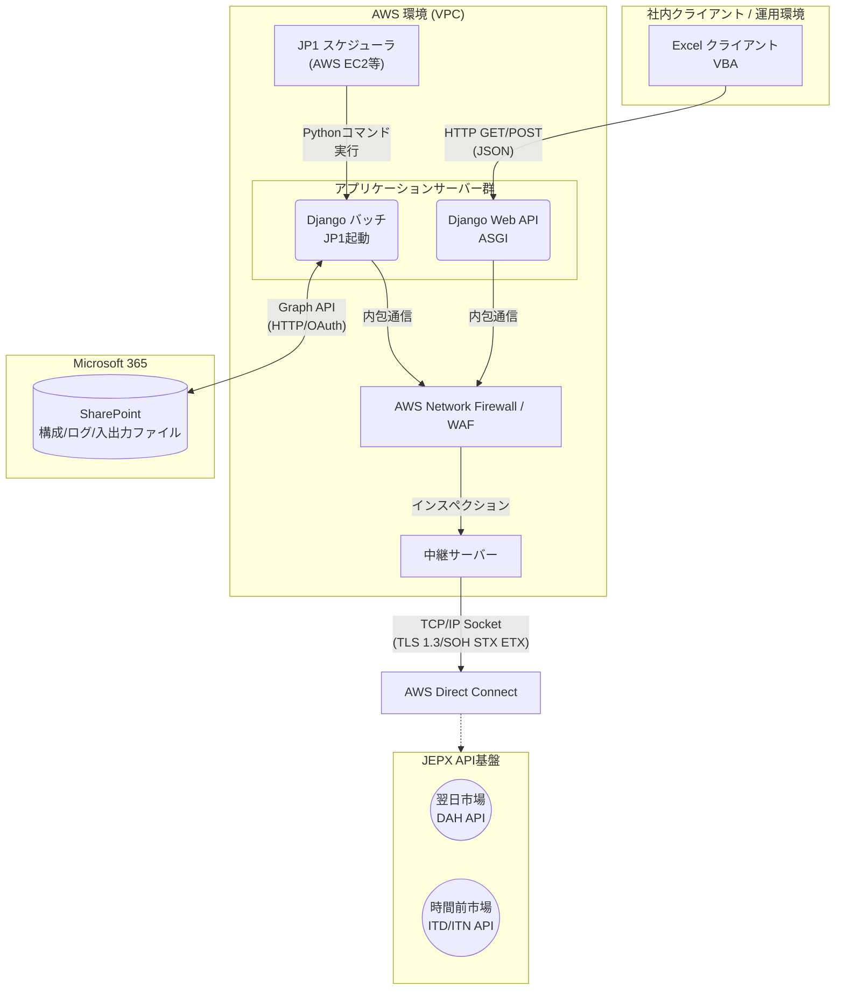
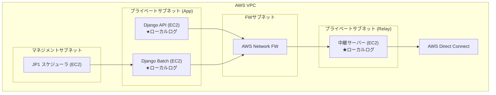

# 10. JEPX API連携システム 見積概要書（工数算出）

本書は、「01.要件定義書.md」に定義されたJEPX API連携システムの要件に基づき、プロジェクトに必要な作業領域（ドメイン）を大枠から小タスクまでブレイクダウンし、機能ごとの粒度（FP法に準ずる考え方）で想定工数（人日 / Man-Days）を算出する。

## 1. 前提条件・見積り方針

- **対象フェーズ**: 要件定義完了後の「基本設計」〜「総合テスト・受入支援」まで。
- **アーキテクチャ前提**: 画面UIなし（Excel VBAクライアント）、AWSクラウド環境、DB不使用（ファイルベース永続化）、Python (Django/バッチ) 中心、JP1ジョブ制御。
- **1人日（MD）の定義**: 1名が1日（約8時間）稼働した場合の作業量。1人月＝20人日とする。
- **スキルレベル前提**: 各領域において、当該技術（AWS, Python, VBA, JP1）の実務経験3年以上のミドル〜シニアエンジニア担当。
- 本見積りには、ハードウェア・ライセンス費用は**含まれない**。

---

## 2. アーキテクチャ図解

具体的な構築範囲・通信経路を明確にするための構成図。

### 2.1 ネットワーク通信フロー・システム全体構成図

JEPX、Excelクライアント、システムバックエンド間の通信経路とプロトコルを示す。

### 2.2 AWS クラウドインフラ構成図

AWS環境内で構築・設定が必要なコンポーネントを示す。

---

## 3. 領域別 詳細タスク分解と工数見積り

「どんぶり勘定」を排除するため、処理レイヤーや機能単位で小・詳細タスクまで落とし込み、人日カウント（ファンクションポイント的積算）を行う。
今回、システムの根幹となる「独自仕様のTCP/IP・TLSプロトコル」「非DB・インメモリのASGI状態管理」「SharePoint GraphAPIによるファイル永続化」という高難易度・独自要件に伴うリスク（異常系ハンドリング、排他制御など）を適正に評価し、現実的な工数を再算出している。

### 3.1 アプリケーション設計領域 (基本・詳細設計)
| 大タスク | 中・小（詳細）タスク | 規模/複雑度 | 工数(人日) |
| :--- | :--- | :---: | :---: |
| **全体IF設計** | 通信仕様(Socket・SOH/STX/ETX・SYS1001ソケット維持) 詳細設計 | 高 | 3.0 |
| | Graph API連携認証・I/Oフロー設計 | 低 | 1.0 |
| | HTTP APIレイアウト設計 (Excel - Django間 JSONスキーマ) | 中 | 3.0 |
| **バッチ設計(DAH)** | Excel/CSVデータのSharePoint取込定義・バリデーション設計 | 中 | 1.0 |
| | 通信制御(リトライ・タイムアウト・事前照会による二重送信防止) | 高 | 2.0 |
| | DAH系API（入札、削除、照会、約定、清算）のシーケンス・マッピング設計 | 高 | 2.5 |
| **API設計(ITD)** | Web層リクエストのJSONバリデーション設計 | 中 | 1.0 |
| | 入札計画と約定結果の比較(突合)ロジック・結果レポートの出力フロー設計 | 高 | 2.5 |
| | ITD系API（入札、削除、照会、約定、清算）マッピング設計 | 高 | 2.5 |
| | 時間前情報(ITN1001) インメモリ受取・中継およびクライアント・ポーリング設計 | 高 | 2.5 |
| **運用設計** | 業務エラーのトランスレーション設計（JEPXステータス→社内向けエラー） | 中 | 1.0 |
| | 監査ログ出力設計・マスキングロジック定義 | 低 | 1.0 |
| | 結果レポート(Excel/PDF化)復元出力設計 | 中 | 1.0 |
| **領域計** | 全体設計工程の積上合計 | | **23.5** |

### 3.2 アプリケーション開発領域 (コーディング・単体テスト: Django)

JEPX公式仕様と非DBの制約の中、高い堅牢性が求められる主要実装フェーズ。

| 大タスク | 中・小（詳細）タスク | 規模/複雑度 | 工数(人日) |
| :--- | :--- | :---: | :---: |
| **開発環境基盤** | 開発環境(Docker等)・CI基盤(Linter/Format/Test)の構築 | 中 | 1.5 |
| **基盤モジュール** | TCP/IP Socket通信クラス (TLS1.3・独自ヘッダ・SYS1001 KeepAlive・再送制御) | 高 | 6.5 |
| | エラー制御・共通ロギングクラス実装 (マスキング処理含む) | 中 | 1.5 |
| | 環境設定ファイル(YAML/ENV)・定数コード表ロード・管理実装 | 低 | 1.0 |
| **外部連携機能** | Graph API通信クラス (トークンリフレッシュ・リトライ・ファイルI/Oの確実な制御) | 中 | 2.5 |
| **DAHバッチ実装** | 取込ファイルのバリデーション、事前照会による二重送信防止判定の厳密な実装 | 高 | 3.0 |
| | DAH系API群実体化(1001～9001)および入札・約定比較処理、結果内容のSharePoint出力 | 高 | 6.0 |
| **ITD/ITN実装** | ASGIルーティング・Excelリクエストバリデーション・運用ヘルスチェックエンドポイント実装 | 中 | 2.0 |
| | JEPX ITD操作群実体化およびHTTP同期応答変換処理の実装 | 高 | 4.5 |
| | ITN1001 ストリーム継続受信、インメモリ状態保持（ロック・排他制御）・破棄の実装 | 高 | 6.5 |
| **単体テスト(UT)** | モックを利用した単体テスト（異常通信・タイムアウト・独自コードアサーション等のパターン網羅）| 高 | 8.0 |
| **領域計** | アプリケーション開発積上合計 | | **43.0** |

### 3.3 クライアント設計・開発領域 (Excel VBA)

ExcelをUIとして活用するための帳票化およびHTTPクライアントとしての制御設計・実装。

| 大タスク | 中・小（詳細）タスク | 規模/複雑度 | 工数(人日) |
| :--- | :--- | :---: | :---: |
| **基本・詳細設計** | UIレイアウト設計、状態遷移定義、Excel-Django通信エラー画面設計 | 中 | 3.0 |
| **UI・描画実装** | Excel入力シートセル定義、入力規則（リスト・10の倍数制約等）、ステータス画面実装 | 中 | 2.0 |
| **通信・業務ロジック** | HTTP送信クラス実装(タイムアウト考慮)、JSONパースラッパー、各種API要求（入札・照会）送信 | 高 | 4.0 |
| | 各種照会のレスポンス展開一覧出力、ITNポーリング受信による板シート動的描画ループ | 高 | 4.5 |
| **単体テスト(UT)** | モック指定でのUI動作テスト・URL動的切替の定着・パッケージング | 中 | 3.0 |
| **領域計** | ExcelVBA クライアント設計・開発積上合計 | | **16.5** |

### 3.4 クラウド・インフラ領域 (AWS / ネットワーク)

※IAMに関する構築タスクは対象外として除外。

| 大タスク | 中・小（詳細）タスク | 規模/複雑度 | 工数(人日) |
| :--- | :--- | :---: | :---: |
| **AWS環境構築** | VPC設計・サブネット生成、AWS Network Firewallルール設計・適用 | 中 | 3.0 |
| | Direct Connect (DX) 受け入れVGW設定・バックエンド中継ルーティング設定 | 高 | 2.0 |
| | EC2のAMIバックアップライフサイクル（Data Lifecycle Manager等）設定 | 低 | 1.0 |
| **ミドル構築** | EC2インスタンス(API, Batch, Relay, JP1サーバー) のプロビジョニング・OS初期設定 | 中 | 2.0 |
| | Python / Nginx / ASGIの基盤インストール・システムログローテーション設定 | 中 | 2.0 |
| **領域計** | クラウドインフラ構築積上合計 | | **10.0** |

### 3.5 ジョブ管理・運用設計領域 (JP1)

| 大タスク | 中・小（詳細）タスク | 規模/複雑度 | 工数(人日) |
| :--- | :--- | :---: | :---: |
| **JP1運用開発** | JP1/AJS3エージェント導入・ノード通信設定、カレンダー(営業日等)・ジョブネット定義 | 中 | 3.0 |
| | Pythonキック用ラッパーシェル開発、アラート閾値定義およびリカバリ手順作成 | 中 | 2.5 |
| **領域計** | ジョブ管理・運用積上合計 | | **5.5** |

### 3.6 テスト領域 (結合・総合テスト)

システム間のデータ連携の厚みと、高いSLAに耐えうるかの検証。

| 大タスク | 中・小（詳細）タスク | 規模/複雑度 | 工数(人日) |
| :--- | :--- | :---: | :---: |
| **結合テスト(IT)** | IT計画書作成、各種I/F連携試験（Excel-Django、Django-SharePoint、モック中継試験） | 高 | 8.5 |
| **総合テスト(ST)** | AWS/DX直結後のE2E通信試験、業務シナリオ通し試験 | 高 | 7.0 |
| | 異常系試験（ネットワーク瞬断、タイムアウト強制発生時のリトライ・冪等性確認） | 高 | 4.0 |
| | パフォーマンステスト（9:00稼働完了SLAの確認、同時API負荷検証） | 中 | 3.0 |
| **受入・移行(UAT)**| テスト環境提供/支援、マニュアル作成、本番環境移行手順策定 | 高 | 6.5 |
| **領域計** | 結合・総合などテスト工程積上合計 | | **29.0** |

---

## 4. 全体工数サマリ・見積り結果

設計工程の分離機能単位での適正な難易度再評価（異常系・非同期制御・独自通信プロトコルのリスク加味）に基づいた、ファンクションポイント（FP）準拠の最終本見積り。

| 領域 | 積上工数 (人日 / Man-Days) | 構成比 |
| :--- | :---: | :--- |
| **1. アプリケーション設計領域 (基本・詳細)** | 23.5 MD | 18.5% |
| **2. アプリケーション開発領域 (Django)** | 43.0 MD | 33.7% |
| **3. クライアント設計・開発領域 (Excel VBA)** | 16.5 MD | 12.9% |
| **4. クラウド・インフラ領域 (AWS)** | 10.0 MD | 7.8% |
| **5. ジョブ管理・運用設計領域 (JP1)** | 5.5 MD | 4.3% |
| **6. テスト・運用準備・移行** | 29.0 MD | 22.8% |
| **全開発実作業工数 合計** | **127.5 MD** | **100%** |

- **月換算工数:** **約 6.4 人月** （20人日換算）
- **積算の妥当性について**: AWS構築時のIAMタスク等の不要項目を削減する一方で、**「JEPX特有のTLS・SOH/STX/ETX通信（ソケットプログラミング）の自作」** や **「DBに頼らないメモリ上（ASGI）での安全なITNキュー・共有状態管理」** といった機能的ハードルを開発・テスト・設計の各工数として正しく手当（高難易度と認定して日数を割り付け）しています。どんぶり勘定による過少見積りを防ぎ、プロジェクトが破綻しないための現実的な工数に着地させています。
- PM(プロジェクトマネジメント)工数（総工数の約10〜15%）は本概算「純作業工数」には含まれていないため、実PJ化の際はこれを包含して最終費用化します。
