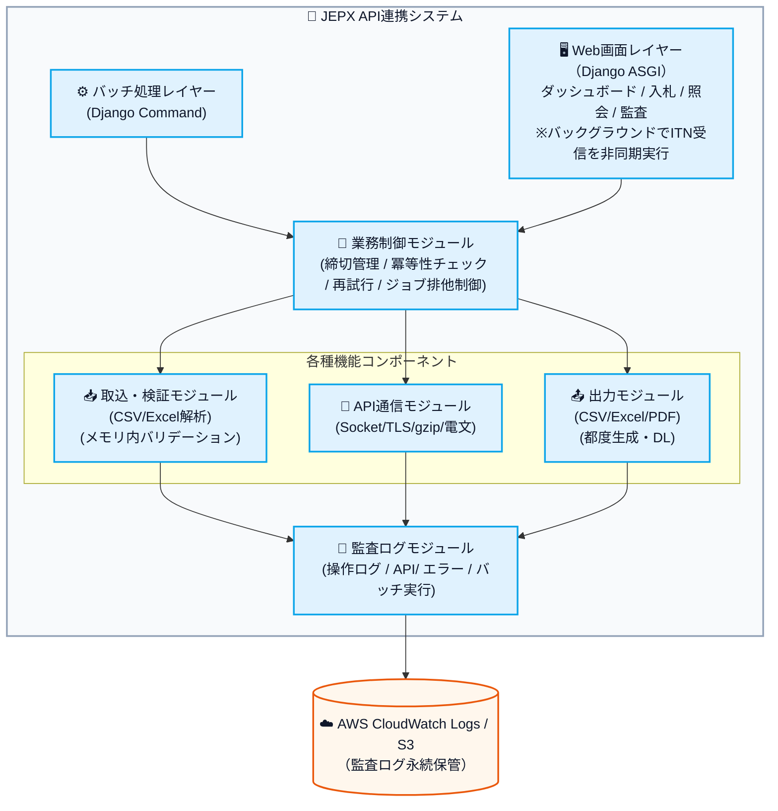
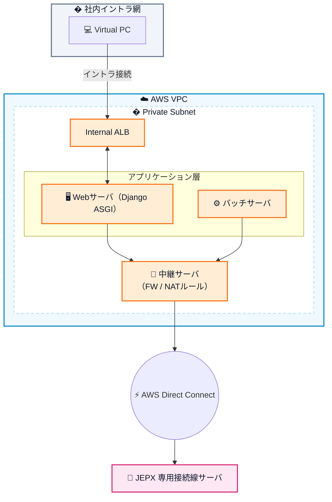
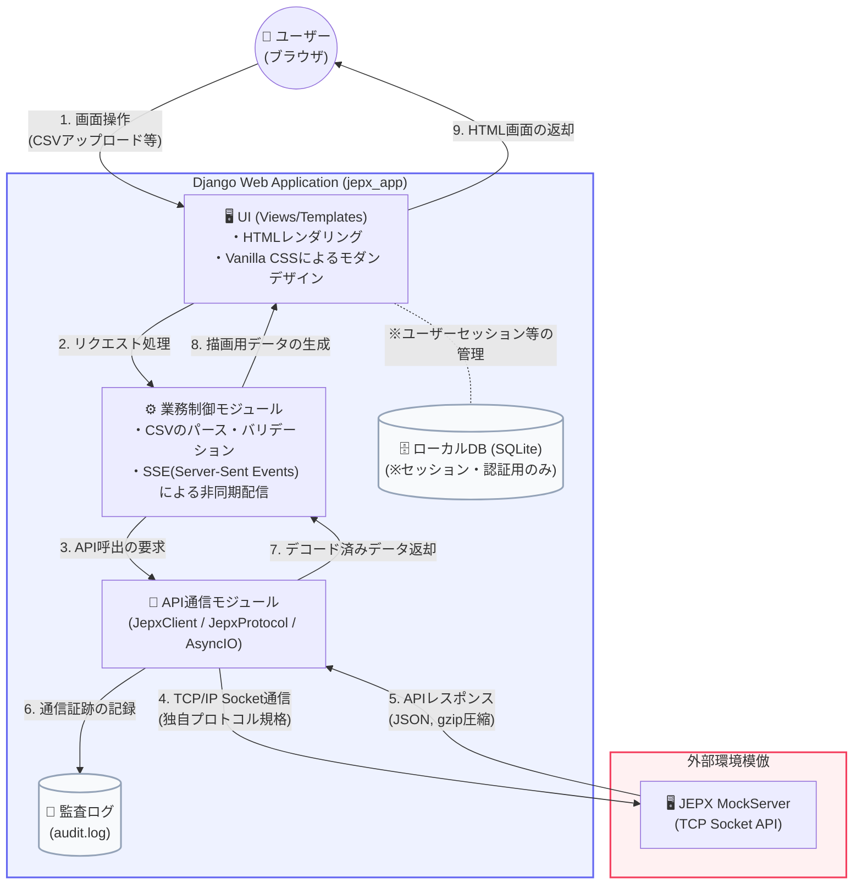

# 01. 基本設計（JEPX API連携システム）

## 文書情報

| 項目 | 内容 |
|------|------|
| 文書名 | 基本設計書 |
| バージョン | 1.0.0 |
| 作成日 | 2026-02-19 |
| 対象システム | JEPX API連携システム |
| 関連要件定義 | 01.要件定義.md |
| 参照仕様 | API仕様書(翌日市場取引システム) ver.1.1.1 / API仕様書(時間前市場取引システム) ver.1.0.3 / JEPX専用接続線接続技術書 ver.2.1 |

---

## 目次

1. [アーキテクチャ方針](#1-アーキテクチャ方針)
2. [システム全体構成](#2-システム全体構成)
3. [JEPX専用接続線接続設計](#3-jepx専用接続線接続設計)
4. [コンポーネント設計](#4-コンポーネント設計)
5. [翌日市場（DAH）機能設計](#5-翌日市場dah機能設計)
6. [時間前市場（ITD/ITN）機能設計](#6-時間前市場itditn機能設計)
7. [バッチ設計（翌日市場）](#7-バッチ設計翌日市場)
8. [画面設計](#8-画面設計)
9. [取込・検証設計](#9-取込検証設計)
10. [実行制御・冪等性設計](#10-実行制御冪等性設計)
11. [データ永続化方針（DB不使用）](#11-データ永続化方針db不使用)
12. [権限制御設計](#12-権限制御設計)
13. [監査ログ設計](#13-監査ログ設計)
14. [コード定義・設定管理](#14-コード定義設定管理)
15. [エラー・例外処理設計](#15-エラー例外処理設計)
16. [非機能設計対応方針](#16-非機能設計対応方針)
17. [要件トレーサビリティ](#17-要件トレーサビリティ)

---

## 1. アーキテクチャ方針

本設計はすべて以下の3原則に従う。これに矛盾する設計は採用しない。

| 原則 | 設計方針 |
|------|----------|
| **ステートレス処理** | バッチ・画面のいずれも表示・処理に必要なデータは都度JEPX APIから取得する。プロセス外への処理結果の保存は一切行わない。 |
| **DB不使用** | RDB・NoSQL・SQLite・ローカルキャッシュDBを含め、永続データストアは一切使用しない。コード定義・設定値はYAML/JSON/ENV形式の設定ファイルのみで管理する。 |
| **ログ保存** | 操作・API通信・判定・エラーの証跡を監査ログとして保存する。ログは監査・障害調査のための証跡であり、業務処理の入力には使用しない。 |

### 1.1 ステートレス設計の具体的含意

```
【許可】                           【禁止】
- プロセスメモリ内の一時変数       - ローカルファイルへの業務データ保存
- リクエスト処理中のメモリ         - DBへの業務データ保存
- JEPX API レスポンスの描画用変数  - セッション間を跨ぐキャッシュ
- 監査ログへの記録                 - ログを業務データ代替として利用
```

---

## 2. システム全体構成

### 2.1 論理アーキテクチャ



### 2.2 インフラ構成（AWS VPC）



**通信経路**: バッチサーバ/Webサーバ → FW（セキュリティグループ） → 中継サーバ → AWS Direct Connect → JEPXサーバ

**制約**:
- 各サーバ（非化石・電力）毎にアクセス許可IPは1つのみ（IP制限）
- 1通信線1サーバあたりのSocket上限: **5 + 1（配信用）**

### 2.3 コンポーネント一覧

| コンポーネント | 種別 | 説明 |
|-------------|------|------|
| Webサーバ（Django ASGI） | アプリ | 画面提供・API処理・ITN非同期配信 |
| バッチサーバ（Django Command） | アプリ | 翌日市場バッチ自動実行 |
| 中継サーバ | インフラ | FW・NAT・JEPX向けSocketプロキシ |
| AWS Direct Connect | ネットワーク | JEPX専用接続線接続 |
| CloudWatch Logs | ログ基盤 | 監査ログ永続保管 |
| S3 | ストレージ | ログアーカイブ・出力ファイル一時保管 |

### 2.4 システム構成・フロー図

Webアプリケーション（フロントエンド＋バックエンド）がどのように外部のMockServerと連携しているかを示す全体構成図です。



#### 文言の説明
- **UI (Views/Templates)**: ユーザーがブラウザで見る画面です。ここではTailwindなどの外部ライブラリを使わず、生（Vanilla）のCSSで高級感ある独自のすりガラス風（Glassmorphism）デザインを実装しています。
- **業務制御モジュール**: 受け取ったCSVデータのパース（読み解き）や、APIへ送信する前の各種チェック（バリデーション：例えば入札量が0以上かなど）を行います。
- **API通信モジュール**: JEPX指定の独自プロトコル（通信のお作法）を用いて、MockServerと通信を行う核となるプログラムです。
- **MockServer**: 本番のJEPXシステムの振る舞いを模倣（モック）する社内テスト用のサーバーです。本番同様に振る舞い、ダミーの約定データなどを返します。

---

## 3. JEPX専用接続線接続設計

### 3.1 接続仕様概要

| 項目 | 内容 |
|------|------|
| 通信方式 | TCP/IP Socket通信 |
| 暗号化 | TLS 1.3 |
| IP制限 | 各サーバ毎に許可IPは1つ |
| Socket上限 | 1通信線・1サーバあたり 5（一般） + 1（配信用） |
| 一般通信アイドル切断 | 3分無通信でサーバ側切断 |
| 配信通信 | 無通信でもサーバ側切断なし |
| ルート証明書 | JEPXが配布するルート証明書でサーバ証明書検証 |

### 3.2 電文フォーマット

#### 3.2.1 フレーム構造

```
[SOH][ヘッダ部][STX][ボディ部][ETX]
```

| 区分 | 内容 |
|------|------|
| SOH | フレーム開始（0x01） |
| ヘッダ部 | ASCII文字、`項目名=値` をカンマ区切り |
| STX | ヘッダ終端（0x02） |
| ボディ部 | gzip圧縮されたJSON |
| ETX | フレーム終端（0x03） |

#### 3.2.2 要求ヘッダ

| 項目 | キー | 形式 | 説明 |
|------|------|------|------|
| 会員ID | MEMBER | 英数字4桁 | JEPXから付与された会員ID |
| 機能番号 | API | 英数字7桁 | API仕様書の機能番号 |
| ボディサイズ | SIZE | 数字 | ボディ部のByte数（gzip圧縮後） |

例: `MEMBER=0841,API=DAH1001,SIZE=421`

#### 3.2.3 応答ヘッダ

| 項目 | キー | 形式 | 説明 |
|------|------|------|------|
| 電文ステータス | STATUS | 数字2桁 | 下表参照 |
| ボディサイズ | SIZE | 数字 | ボディ部のByte数 |

#### 3.2.4 電文ステータス

| STATUS | 内容 | 対応方針 |
|--------|------|----------|
| `00` | 正常処理（機能エラーでも電文は00） | ボディのstatusを確認して業務判定 |
| `10` | 電文フォーマット異常 | 電文生成ロジックを確認。監査ログ記録後エラー処理 |
| `11` | 会員ID権限なし | 会員ID設定を確認。監査ログ記録後業務停止 |
| `19` | サーバシステム異常 | 待機後リトライ。リトライ超過時は監査ログ記録後アラート通知 |

### 3.3 電文生成・解析の実装方針

```
【送信】
1. リクエストJSONオブジェクトをPythonで構築
2. json.dumps() でJSONシリアライズ
3. gzip.compress() でgzip圧縮
4. 圧縮後バイトサイズを計算 → SIZEヘッダ
5. SOH + ヘッダASCII文字列 + STX + gzip圧縮bytes + ETX を連結
6. Socket.sendall() で送信

【受信】
1. Socket.recv() でバイト列を受信（SOH～ETXまで確実に読み切る）
2. SOH/STX/ETXのデリミタでフレームを分割
3. ヘッダ部をASCIIデコード → STATUS, SIZE を解析
4. STATUSが00以外の場合はエラー処理
5. ボディ部をgzip.decompress() で展開
6. 展開後のByte数がSIZEと一致することを検証
7. json.loads() でJSONデシリアライズ
8. ボディのstatusフィールドで業務成否判定
```

**【処理の論理的な説明：電文の生成・送信と、受信・展開の仕組み】**
プログラムがJEPXサーバーと通信する際、データをどのような手順で加工・梱包して送り、受け取った小包をどうやって開けるかの具体的な処理の流れです。
1. **【送信時】データの作成と圧縮**:
   - プログラム内で扱う入札データ等を、通信用の標準データ形式（JSON）に変換します。
   - データを送信しやすいようサイズを小さくするため、ZIPファイルのように全体のデータを圧縮（gzip圧縮処理）します。
   - 圧縮後のデータが「何バイトあるか」を計算し、パケットの荷札となる「ヘッダー」の一部として記録します。
2. **【送信時】電文の組み立てと送信**:
   - 「開始の目印（SOH） ＋ 荷札（ヘッダー） ＋ 本文の開始目印（STX） ＋ 圧縮したデータ本体 ＋ 終了の目印（ETX）」という厳密な順序で一つのパケット文字に結合し、JEPXサーバーへ通信（`Socket.sendall`）します。
3. **【受信時】データの受け取りと分解**:
   - JEPXから返ってきた通信データを受け取り、終了の目印が来るまで確実に取り込みます。
   - 取り込んだデータをパズルをばらすように、目印を利用してヘッダーとデータ本体に切り分けます。
   - ヘッダーに書かれている「ステータス（STATUS）」を確認し、通信の形自体が正常（00）だったかを判定計算します。
4. **【受信時】データの解凍と内容の確認**:
   - 圧縮されているデータ本体を解凍（`gzip.decompress`）し、ヘッダーに記載されたサイズと実際のデータサイズが一致しているかを検証して、通信中の破損がないかを確認します。
   - 最後に、解凍した中身をプログラムで扱える辞書配列に戻し、業務データとして「成功したか、エラーだったか」の最終判定を行います。

### 3.4 Socket管理設計

#### 3.4.1 Socket種別

| 種別 | 用途 | API | 上限 |
|------|------|-----|------|
| 一般通信Socket | DAH/ITD APIリクエスト | DAH*, ITD*, SYS1001 | 5本/サーバ |
| 配信Socket | ITN市場情報通知受信 | ITN1001 | 1本/サーバ |

#### 3.4.2 Socket接続ライフサイクル

```
バッチ処理:
  起動 → Socket接続（TLSハンドシェイク） → 処理実行
  → Keep-alive（SYS1001）管理 → 処理完了 → Socket切断

Web画面:
  操作要求受信 → Socket接続 → APIリクエスト送受信 → Socket切断（または短時間保持）
  ※1リクエスト完結型。セッション間でのSocket共有は行わない
  ※高頻度操作の場合はConnectionPoolによりSocket再利用（プロセス内のみ）を検討
  
配信受信（ITN）:
  ASGIサーバの起動と共にバックグラウンド非同期タスクとして開始 → 1本のみ配信Socket接続 → ITN1001リクエスト
  → `asyncio` 等を用いて継続受信ループ → 受信データをプロセスメモリ上の非同期Queue・変数等に保持
  → クライアント側の各ブラウザに対しては Server-Sent Events (SSE) 等で非同期ブロードキャスト配信する (ワーカーをブロックしない)
```

#### 3.4.3 Keep-alive設計（SYS1001）

- **対象**: 一般通信Socket（3分無通信切断回避）
- **実装**: バックグラウンドスレッドでタイマー管理（例: 2分30秒毎にSYS1001送信）
- **配信Socket**: 無通信でも切断なし → SYS1001不要

```python
# Keep-aliveタイマーの概念設計
class SocketKeepAlive:
    INTERVAL_SECONDS = 150  # 2分30秒（3分制限の50秒前）
    
    def __init__(self, socket_conn):
        self.socket = socket_conn
        self._timer = None
    
    def start(self):
        """Keep-aliveタイマーを開始"""
        self._schedule_next()
    
    def stop(self):
        """タイマーを停止（Socket切断時に呼ぶ）"""
        if self._timer:
            self._timer.cancel()
    
    def reset(self):
        """通信発生時にリセット"""
        self.stop()
        self._schedule_next()
    
    def _schedule_next(self):
        self._timer = Timer(self.INTERVAL_SECONDS, self._send_keepalive)
        self._timer.start()
    
    def _send_keepalive(self):
        # SYS1001送信
        send_api(self.socket, "SYS1001", {})
        self._schedule_next()
```

**【処理の論理的な説明：通信の維持（Keep-alive）機構】**
JEPXのサーバーは「3分間何も通信がない状態が続くと、自動的に通信を切断する」という仕様になっています。これを防ぐためのタイマー自動延長機能です。
1. **タイマーのセット**: JEPXと通信を開始した際、`INTERVAL_SECONDS` に「150秒（2分30秒）」をセットしカウントダウンを始めます。これは3分の制限時間の少し前に余裕を持って処理を行うためです。
2. **待機とチェック**: システムが150秒間、他の通信（入札など）を一切行わなかった場合、自動的に `_send_keepalive` という処理が呼び出されます。
3. **維持電文の送信**: JEPXに対して「私たちはまだ繋がっていますよ」という合図である `SYS1001` という専用の通信（空のデータ）を送信します。
4. **タイマーのリセット**: 送信後、または他の通信が行われた際は、再度タイマーを「0秒」からカウントし直し、次の150秒間通信がないかを監視し続けます。
これにより、システム起動中は常にJEPXとの通信線が安定して裏側で維持され続けます。

---

## 4. コンポーネント設計

### 4.1 コンポーネント依存関係

```
取込・検証モジュール
       │（バリデーション済みデータをメモリで渡す）
       ▼
業務制御モジュール ──────────────────────────┐
       │（APIリクエスト指示）                  │（処理状態管理）
       ▼                                    │
API通信モジュール                           プロセスメモリ内
       │（レスポンスデータをメモリで返す）       （一時状態のみ）
       │
       ├───→ 画面表示モジュール（Django View）
       ├───→ 出力モジュール（CSV/Excel/PDF）
       └───→ 監査ログモジュール（全通信記録）
                    │
                    ▼
            CloudWatch Logs / S3
```

### 4.2 取込・検証モジュール

**責務**: CSV/Excelファイルを読み込み、メモリ内でバリデーションを実施する。

| 機能 | 内容 |
|------|------|
| ファイル読込 | CSV（`csv.DictReader`）/ Excel（`openpyxl`）の解析 |
| 文字コード検出 | `chardet` 等による自動検出、UTF-8/Shift-JIS対応 |
| 必須列チェック | ヘッダ行の必須カラム存在確認 |
| 型チェック | 日付形式(YYYY-MM-DD)、数値型チェック |
| 業務バリデーション | 入札価格: 10の倍数、入札量: 小数第1位有効（2位以下切捨て） |
| コードチェック | エリアコード(1-9)、時間帯コード(01-48)、入札種別コード確認 |
| 入力保持 | バリデーション済みデータはメモリ内リスト/辞書で保持 |

**インターフェース**:

```python
class BidImporter:
    def parse(self, file_obj) -> list[dict]:
        """
        ファイルを読み込み、バリデーション済みの入札データリストを返す。
        エラーがある場合はValidationErrorを発生させる。
        データはメモリ内のみ。ファイルシステムには保存しない。
        """
```

**【処理の論理的な説明：取込・検証モジュール】**
ユーザーが画面からCSVやExcelファイルをアップロードした際に、その中身をシステムが事前に解析・診断する処理です。データベースは使わず一時的なメモリ上で行われます。
1. **ファイルの受取**: ブラウザを通じてアップロードされたファイルデータをシステムが受け取ります。この時、ファイルはサーバーのハードディスクなどには保存せず、一時的なメモリ空間（記憶領域）にのみ展開します。
2. **データの解析とチェック**: ファイル内のデータを上から1行ずつ読み分けます。
   - 「必須項目が全て埋まっているか」
   - 「日付などの文字の形式が正しいか」
   - 「価格が10の倍数であるか、量が小数点指定の桁数であるか」
   これらを瞬時に判定・計算します。
3. **結果の返却**: 問題なく全てのチェック（バリデーション）を通過した場合のみ、整理整頓されたデータのリスト（一覧）を次の処理（API送信処理）へ引き渡します。もし1つでもルール違反（エラー）が見つかった場合は、直ちに処理を中断し、画面にエラーの内容（例：「3行目の価格が10の倍数ではありません」）を返却します。

### 4.3 API通信モジュール

**責務**: JEPXサーバとのSocket通信・電文生成・解析を担当する。

| 機能 | 内容 |
|------|------|
| Socket管理 | TLS1.3ソケット接続・切断・再接続 |
| 電文生成 | SOH+ヘッダ+STX+gzip(JSON)+ETX の組立 |
| 電文解析 | 受信バイト列のデリミタ分割・gzip展開・JSONデシリアライズ |
| SIZE整合性検証 | ヘッダSIZEとボディByte数の一致確認 |
| STATUS判定 | 電文ステータス00/10/11/19の判定 |
| ボディstatus判定 | "200"/"400"/"500"の判定 |
| Keep-alive | SYS1001によるSocket接続維持 |
| 監査ログ連携 | 全送受信内容の監査ログモジュールへの通知 |

**インターフェース**:

```python
class JepxApiClient:
    def call(self, api_code: str, body: dict) -> dict:
        """
        指定のAPIコードでJEPXにリクエストを送受信し、
        レスポンスのJSONデシリアライズ済み辞書を返す。
        電文STATUSが00以外、またはボディstatusが200以外の場合は例外を発生させる。
        全通信内容を監査ログモジュールに通知する。
        """
    
    def receive_stream(self, api_code: str, body: dict):
        """
        配信用Socket専用。ITN1001で使用。
        市場情報通知を継続受信するジェネレータ。
        受信データは都度yieldする。永続化は呼び出し元の責任。
        """
```

**【処理の論理的な説明：API通信モジュール】**
システムがJEPX側のサーバーと直接データのやり取りをするための「手足」となる中核の通信機能です。
1. **リクエスト（要求）の送信** (`call`機能):
   - 画面やバッチ処理から「送りたいデータ」と「APIの種類（例：入札ならDAH1001）」を受け取ります。
   - 受け取ったデータをJEPXが定めた「暗号化・圧縮（gzip）ルール」に従って変換し、ひとつの「電文（パケット）」という電子的な小包にまとめます。
   - JEPXサーバーへそれを物理的に送信し、結果が返ってくるまで待機します。
2. **レスポンス（応答）の受信と解析**:
   - 返ってきた結果を受け取り、JEPX独自のルールに基づいて暗号化・圧縮を解除（展開）します。
   - 中身のステータスコードをチェックし、「正常（00）」であればデータを次の処理へ引き渡します。「通信エラー」や「権限なしエラー」であれば、直ちに例外（異常事態）として処理を止めます。
3. **通信内容の記録**:
   - 送信したデータ、および受信したデータを、必ず「証跡（監査ログ）」としてログ記録システムに通知します。
4. **継続的な受信** (`receive_stream`機能 ※通知配信用):
   - 時間前市場の「リアルタイムの市場情報（ITN1001）」を受け取るためだけの専用処理です。1度きりの通信ではなく、一度接続したら「新しいデータが届くたびに、随時システム側へデータを垂れ流しにする」という永続的な受け取り箱（ジェネレータ）を作ります。

### 4.4 業務制御モジュール

**責務**: 送信順序・リトライ・冪等性確認・締切管理を担当する。

| 機能 | 内容 |
|------|------|
| 冪等性事前確認 | 照会API（DAH1002/ITD1003）で既登録状態を確認 |
| 二重送信防止 | プロセスメモリ内の送信済みキーセットで同一バッチ内重複を防止 |
| リトライ制御 | 通信失敗時のリトライ回数・待機時間管理（指数バックオフ） |
| 締切逆算スケジュール | 翌日市場の入札締切から逆算した処理時刻管理 |
| ジョブ排他制御 | Djangoプロセスロックファイルによる同一ジョブの多重起動防止 |

### 4.5 画面表示モジュール（Django Views / ASGI）

**責務**: 各画面のリクエストを受け付け、JEPX APIを都度呼び出してデータを取得し描画する。ITN配信画面ではServer-Sent Events (SSE)等の非同期通信を処理する。

- 永続データストアへのアクセスは一切行わない
- 通常API要求のViewは「APIリクエスト→レスポンス→テンプレート描画」の単一処理
- 配信のSSEエンドポイントは、Djangoのミドルウェアによる同期バッファリングや接続切断時のリークを完全に回避するため、Django Viewではなく**Native ASGIルーティング**（`asgi.py`内で直にリクエストをハンドリング）として実装し、共有メモリ上のデータをクライアントにプッシュする（Gunicornの同期ワーカーをクラッシュさせないため）
- また、ASGIサーバのライフサイクルで生成されるバックグラウンドの非同期受信タスクは、Pythonのガベージコレクション（GC）の対象になって途中で破棄されるのを防ぐため、グローバルな強参照（セット等）にタスクを保持する設計とする
- セッション（Djangoセッション）には認証情報・操作権限のみを保持し業務データは保持しない
- JEPX API通信エラー時はエラーメッセージを表示し、再取得操作を提供

### 4.6 監査ログモジュール

**責務**: 操作・API通信・判定・エラーの証跡をCloudWatch Logsへ記録する。

```python
class AuditLogger:
    def log_operation(self, operator, action, target_key, detail): ...
    def log_api(self, api_code, request_body_masked, response_status, body_status, elapsed_ms): ...
    def log_error(self, error_class, message, stacktrace): ...
    def log_batch(self, batch_name, phase, success_count, fail_count): ...
```

**【処理の論理的な説明：監査ログモジュール】**
システム内で「いつ・誰が・何をして・どうなったか」を証拠として克明に記録し続ける監視カメラのような処理です。
1. **操作の記録** (`log_operation`):
   - ユーザーが画面からボタンを押した際に、「操作したユーザーID」「対象の処理」「日時」をテキストとしてAWS CloudWatchというログ保存システムに書き込みます。
2. **API通信の記録** (`log_api`):
   - JEPXへデータを送信する直前・受信した直後に、やり取りしたデータの全容を記録します。ただし、パスワードや特定の会員識別番号など「機密性が高い情報が付与されている箇所」については、自動的に文字を伏せ字（マスキング）等にしてから安全に保存する計算処理を挟みます。
3. **異常時の記録** (`log_error`):
   - 何らかのエラーが発生して処理が止まった際に、「どこで・なぜ・どのようなエラーコードで」止まったかを記録し、後からの障害調査を可能にします。
4. **バッチ処理の記録** (`log_batch`):
   - 日次で自動で動く大量処理（入札まとめ処理など）の「開始・途中経過・終了」と「何件成功して何件失敗したか」を集計して記録します。

**マスキング対象**: 認証情報、会員IDは部分マスキング

### 4.7 出力モジュール

**責務**: JEPX APIから取得したデータをもとにCSV/Excel/PDFを一時生成し、ダウンロード提供する。

- 出力データはリクエスト受付時にJEPX APIから都度取得
- 生成ファイルはレスポンスのStreamとして直接ダウンロード（サーバ保存なし）
- PDFはJEPX APIから受け取るBase64エンコード済みデータをデコードして提供

---

## 5. 翌日市場（DAH）機能設計

### 5.1 対象API一覧

| API名 | コード | 機能概要 | 実装区分 |
|-------|--------|----------|----------|
| 入札 | DAH1001 | 通常入札データをJEPXサーバに送信 | バッチ・画面 |
| 入札照会 | DAH1002 | 登録済み入札情報を照会 | バッチ（冪等性確認）・画面 |
| 入札削除 | DAH1003 | 入札を削除（個別指定 / 全削除） | バッチ・画面 |
| 約定照会 | DAH1004 | 通常入札の約定結果を照会 | バッチ・画面 |
| 全約定照会 | DAH1030 | 通常・ブロック入札の全約定結果を照会 | バッチ・画面 |
| 市場結果照会 | DAH1050 | 市場結果（システムプライス等）をダウンロード | バッチ・画面 |
| 清算照会 | DAH9001 | 清算データをダウンロード（PDF付き） | バッチ・画面 |

> **注**: ブロック入札（DAH1011/1012/1013/1014）は対象外。

### 5.2 DAH1001 入札

#### リクエスト生成

```python
{
    "bidOffers": [
        {
            "deliveryDate": "YYYY-MM-DD",    # 受渡日
            "areaCd": "1",                   # エリアコード（1-9）
            "timeCd": "01",                  # 時間帯コード（01-48）
            "bidTypeCd": "SELL-LIMIT",       # 入札種別コード
            "price": 120,                    # 入札価格（10の倍数）
            "volume": 100.5,                 # 入札量（小数第1位まで）
            "deliveryContractCd": "ABCDE",   # 受渡契約コード
            "note": ""                       # 自由記入欄（任意）
        }
    ]
}
```

#### バリデーション（API送信前）

| 検証項目 | ルール |
|---------|--------|
| 受渡日 | YYYY-MM-DD形式、入札受付期間内 |
| エリアコード | 1〜9の有効値 |
| 時間帯コード | 01〜48の有効値 |
| 入札種別コード | SELL-LIMIT / BUY-LIMIT / SELL-MARKET / BUY-MARKET / SELL-FIT / SELL-APPROVAL |
| 入札価格 | 10の倍数、成行の場合は無効 |
| 入札量 | 小数第1位まで（第2位以下は切捨て）、最小量〜最大量 |
| 受渡契約コード | 必須 |

#### 冪等性制御

1. DAH1002（入札照会）で受渡日の既登録入札を取得
2. 同一エリア・時間帯・種別の入札が存在する場合はスキップ
3. 照会結果の確認ステップを監査ログに記録

### 5.3 DAH1002 入札照会

- リクエスト: `{ "deliveryDate": "YYYY-MM-DD" }`
- レスポンス: `bids[]` 配列（入札番号/受渡日/エリア/時間帯/種別/価格/量/受渡契約コード）
- 利用シーン: 冪等性確認、画面表示

### 5.4 DAH1003 入札削除

| モード | リクエスト | 挙動 |
|--------|-----------|------|
| 個別削除 | `bidDels: [{"bidNo":"…"}]` | 指定入札のみ削除 |
| 全削除 | `bidDels: []`（配列省略） | 受渡日の通常入札を全削除 |

### 5.5 DAH1004 約定照会

- リクエスト: `{ "deliveryDate": "YYYY-MM-DD" }`
- レスポンス: `bidResults[]`（入札情報＋約定価格＋約定量）
- 約定しない場合: `contractVolume=0`

### 5.6 DAH1030 全約定照会

- リクエスト: `{ "deliveryDate": "YYYY-MM-DD" }`
- レスポンス: `contractResults[]`（通常・ブロック入札とも含む。ブロックは30分単位に分割）
- ブロック入札は `blockTypeCd` で識別（`NORM` = 通常入札）

### 5.7 DAH1050 市場結果照会

- リクエスト: `{ "deliveryDate": "YYYY-MM-DD" }`
- レスポンス: `marketResults[]`（システムプライス、エリア別プライス、総約定量等）
- 当日の市場傾向とエリア間値差（市場間約定代金差額の元データ）を把握するために利用

### 5.8 DAH9001 清算照会

- リクエスト: `{ "fromDate": "YYYY-MM-DD", "toDate": null or "YYYY-MM-DD" }`
- レスポンス: `settlements[]`（清算番号/清算日/合計金額/内訳/PDF(Base64)）
- 最大50件照会
- PDFはBase64デコードして画面表示・ダウンロード提供

---

## 6. 時間前市場（ITD/ITN）機能設計

### 6.1 対象API一覧

| API名 | コード | 機能概要 | 実装区分 |
|-------|--------|----------|----------|
| 入札 | ITD1001 | 入札データをJEPXサーバに送信 | 画面 |
| 入札削除要求 | ITD1002 | 削除要求入札として優先処理 | 画面 |
| 入札照会 | ITD1003 | 入札情報（削除要求含む）を照会 | 画面（冪等性確認） |
| 約定照会 | ITD1004 | 約定結果を照会 | 画面 |
| 商品照会 | ITD1005 | 商品の取引中断状況を照会 | 画面（入札前確認） |
| 清算照会 | ITD9001 | 清算データをダウンロード（PDF付き） | 画面 |
| 市場情報通知 | ITN1001 | 板情報・約定情報を継続受信 | 画面（配信） |

### 6.2 ITD1001 入札

#### リクエスト

```python
{
    "deliveryDate": "YYYY-MM-DD",
    "timeCd": "48",
    "areaCd": "1",
    "bidTypeCd": "SELL-LIMIT",
    "price": 120,
    "volume": 100.5,
    "deliveryContractCd": "ABCDE",
    "note": ""
}
```

#### ITD特有バリデーション

| 検証項目 | ルール |
|---------|--------|
| 商品取引中断確認 | ITD1005で当該受渡日・時間帯コードの `suspendCd` が "0"（取引中断なし）であることを確認 |
| 入札種別 | SELL-LIMIT / BUY-LIMIT / SELL-MARKET / BUY-MARKET |

#### 冪等性制御

1. ITD1003（入札照会）で受渡日・時間帯コードの既登録入札を取得
2. 同一条件の有効入札（`deleteCd` が "0"）が存在する場合はスキップ
3. 確認ステップを監査ログに記録

### 6.3 ITD1002 入札削除要求

- DAHの入札削除（DAH1003）と異なり、**削除要求入札**として登録され優先処理される
- 取引中断中でも処理される
- `deleteCd="1"` で削除完了を確認できる
- 削除の削除は不可

#### リクエスト

```python
{
    "deliveryDate": "YYYY-MM-DD",
    "timeCd": "48",
    "targetBidNo": "1234567890"   # 削除対象の入札番号
}
```

#### DAH削除との差異

| 項目 | DAH1003 | ITD1002 |
|------|---------|---------|
| 処理方式 | 即時削除 | 削除要求入札として登録（優先処理） |
| 取引中断時 | 通常と同様 | 取引中断中でも処理可 |
| 対象指定 | 番号指定 / 全削除 | 番号指定のみ |
| 結果確認 | statusInfoの削除件数 | ITD1003で `deleteCd="1"` を確認 |

### 6.4 ITD1003 入札照会

- 通常入札・削除要求入札を含むすべての入札を返す
- `bidTypeCd="DEL"` が削除要求入札
- `deleteCd="1"` が削除完了

### 6.5 ITD1005 商品照会

- リクエストボディは空（`{}`）
- レスポンス: 当日・翌日受渡の商品一覧と取引中断コード

| `suspendCd` | 意味 | 対応 |
|-------------|------|------|
| `"0"` | 取引中断なし | 入札可能 |
| `"1"` | 取引中断中 | 入札不可。画面に「取引中断中」を表示 |

- 入札画面表示時にITD1005を都度呼び出し、対象商品の入札可否を表示する

### 6.6 ITD9001 清算照会

- リクエスト・レスポンス構造はDAH9001と同じ
- 時間前市場の清算データを取得

### 6.7 ITN1001 市場情報通知（配信）

- **配信用Socket**（専用1本）で接続。リクエスト送信後、継続受信を開始
- 初回: 当日・翌日受渡の全約定情報・板情報を通知
- 以降: 変動値・追加分のみ通知
- `noticeTypeCd="CONTRACT"`: 約定情報
- `noticeTypeCd="BID-BOARD"`: 板情報
- 0件通知（`notices:[]`）は正常ケース（市場情報なしを意味する）

#### 受信処理方針

```
配信受信スレッド:
  1. 配信Socket接続（TLS）
  2. ITN1001リクエスト送信（空ボディ）
  3. 受信ループ:
       a. 1電文受信
       b. 電文フレーム解析
       c. gzip展開・JSON解析
       d. noticeTypeCdで分岐処理
          - CONTRACT → メモリ内の最新約定情報を更新
          - BID-BOARD → メモリ内の板情報を差分更新
       e. 監査ログ記録（受信件数のみ。全データは記録しない）
       f. Webフレームワークに対してイベント通知（SSE/WebSocket）
```

**メモリ保持方針**: 受信データはプロセスメモリ内の変数に保持し、画面描画後は保持を継続しない設計とする（サーバ再起動で消失を許容）。ステートレス原則により、データの常時保持は行わない。

#### エリアグループコード（板情報）

| エリアグループ | コード |
|--------------|-------|
| 北海道 | A1 |
| 東北・東京 | A2 |
| 中部・北陸・関西 | A4 |
| 中国・四国 | A7 |
| 九州 | A9 |

---

## 7. バッチ設計（翌日市場）

### 7.1 バッチ処理フロー

```
[日次バッチ] DAH入札バッチ

入力: S3（または共有ストレージ）上の計画値ファイル（CSV/Excel）

Step 1: 計画値ファイル取込
  - S3から対象ファイルをダウンロード（一時メモリ展開）
  - ファイル取込完了を監査ログに記録
  
Step 2: バリデーション（メモリ内）
  - 全バリデーションを合格した場合のみ次ステップへ
  - エラーあり: エラー詳細を監査ログに記録→バッチ異常終了

Step 3: 冪等性確認（JEPX API呼び出し）
  - DAH1002で当該受渡日の既登録入札を取得
  - 送信済みキーセットを初期化（未送信分を確定）
  - 確認結果を監査ログに記録

Step 4: 入札送信（DAH1001）
  - 未送信分のみ送信
  - 送信済みキーをプロセスメモリ内のセットに追加
  - 送信成功/失敗を監査ログに記録（都度）

Step 5: 入札照会確認（DAH1002）
  - 送信完了後に照会APIで登録確認
  - 確認結果を監査ログに記録

Step 6: 約定照会（DAH1004）
  - 受渡日の約定結果を取得（JEPX API）
  - メモリ内計画値と照合（比較処理）
  - 比較結果を監査ログに記録

Step 7: 全約定照会（DAH1030）
  - 全約定情報を取得し、DAH1004との差分確認

Step 8: 市場結果照会（DAH1050）
  - 市場全体の約定結果（システムプライス/エリアプライス）を取得・保存

Step 9: 清算照会（DAH9001）
  - 必要に応じて清算データを取得・確認

Step 10: レポート生成
  - 計画値（メモリ）vs 約定結果（JEPX API）の比較レポートを一時生成
  - S3へ一時保存またはメール/通知送信

Step 11: バッチ完了記録
  - 処理件数・成功数・失敗数を監査ログに記録
```

### 7.2 バッチスケジュール管理

| 項目 | 内容 |
|------|------|
| スケジュール定義 | YAML設定ファイルに営業日カレンダー・締切時刻・バッチ実行時刻を定義 |
| 締切逆算実行 | 入札締切からX分前（設定値）に入札処理開始 |
| 安全完了目標 | 締切10分前までに入札処理完了 |
| スケジューラ | AWS EventBridge または cron（OSレベル） |
| ジョブ起動 | Django Management Command形式（`python manage.py run_dah_batch`） |

### 7.3 バッチ排他制御

```python
# プロセスロックファイルによる排他制御
LOCK_FILE_PATH = "/tmp/dah_batch_{delivery_date}.lock"

# 起動時にロックファイル作成。既存ならエラー終了
# 正常完了・異常終了時にロックファイル削除（finallyで保証）
```

**【処理の論理的な説明：バッチ排他制御（二重起動の防止）】**
自動的に実行されるバッチ処理（翌日市場の大量入札など）が、「もし誤って2つ同時に起動してしまった場合、同じデータを二重に送信してしまう」という事故を物理的に防ぐための安全装置（ロック機構）です。
1. **ロックファイルの作成**:
   - バッチ処理がスタートした瞬間に、システム内部のフォルダに「対象日であるYYYY-MM-DDのバッチは現在実行中である」という目印となる名前の「空のダミーファイル（ロックファイル）」を作成します。
2. **二重起動時のブロック**:
   - もし、誤操作等で別のプログラムやユーザーが同じ時間の同じバッチ処理を実行しようとした場合、まず「該当する目印ファイルがすでに存在するか」をチェックします。ファイルが存在する場合は「すでに他で実行中である」と判断し、後からスタートした処理は即座にエラーとして自動停止させます。
3. **完了時の撤収処理**:
   - 当初の処理が全て正常に終わった時、あるいは途中でエラーが起きて異常終了した時であっても、最後に必ずこの「目印ファイル」を削除して終了する（プログラムのtry-finally文による絶対的な保証）ルールになっています。これにより、後から正しいタイミングで次回の再実行が可能となります。

### 7.4 リカバリ設計

```
障害時対応フロー:
1. 監査ログから最終処理状態を確認
2. DAH1002（入札照会）でJEPXサーバの現況を確認
3. 既送信分の入札番号リストをメモリに構築
4. 未送信の入札のみを対象にバッチを再実行
5. 重複防止: Step3の冪等性確認で既送信分は自動スキップ
```

### 7.5 バッチ処理状態管理

- プロセスメモリ内のみで管理（各ステップの成功/失敗フラグ等）
- バッチ完了後は状態を保持しない
- 外部からの状態確認: 監査ログ参照、またはJEPX API照会で現況確認

---

## 8. 画面設計

### 8.1 画面一覧

| 画面名 | URL | 主な機能 |
|--------|-----|----------|
| ダッシュボード | `/` | 処理状態確認・市場別照会 |
| ファイル取込画面 | `/import/` | CSV/Excel取込・バリデーション結果表示 |
| 翌日市場 入札実行画面 | `/dah/bid/` | 手動入札・削除・照会 |
| 翌日市場 照会画面 | `/dah/inquiry/` | 入札照会・約定照会・清算照会 |
| 翌日市場 比較・レポート画面 | `/dah/report/` | 計画値vs約定比較・出力 |
| 時間前市場 入札画面 | `/itd/bid/` | 入札・削除要求・商品照会 |
| 時間前市場 照会画面 | `/itd/inquiry/` | 入札照会・約定照会・清算照会 |
| 時間前市場 市場情報画面 | `/itd/market/` | 板情報・約定情報リアルタイム表示 |
| 監査ログ参照画面 | `/audit/` | ログ検索・参照 |

### 8.2 ダッシュボード画面

**表示データ取得**:
- 翌日市場: DAH1002（入札照会）でその日の入札登録状況をリアルタイム取得
- 時間前市場: ITD1003（入札照会）で当日の入札状況をリアルタイム取得
- 市場情報: ITD1005（商品照会）で取引中断状況を表示

**表示項目**:

| 項目 | データソース |
|------|-------------|
| 翌日市場 入札状況（市場別/時間帯別） | DAH1002 都度取得 |
| 時間前市場 入札状況 | ITD1003 都度取得 |
| 商品取引中断状況 | ITD1005 都度取得 |
| 直近バッチ実行結果 | 監査ログ（CloudWatch Logs）から取得 |
| アラート・通知 | 監査ログから集計 |

**操作機能**: 再取得ボタン、絞り込み（市場/受渡日/時間帯）

### 8.3 ファイル取込画面

1. ファイルアップロード（マルチパートフォーム）
2. サーバ側でメモリに展開・バリデーション実行
3. バリデーション結果一覧を画面表示（エラー行・エラー内容）
4. OKの場合: 入札実行画面へ誘導
5. アップロードファイルはサーバに保存しない（メモリのみ）

### 8.4 翌日市場 入札実行画面

| 機能 | API | 説明 |
|------|-----|------|
| 現在登録入札確認 | DAH1002 | 画面表示時に都度取得 |
| 手動入札 | DAH1001 | フォーム入力→送信 |
| 個別削除 | DAH1003（個別） | 入札番号指定 |
| 全削除 | DAH1003（全削除） | 受渡日全件削除 |
| 再送（冪等性確認付き） | DAH1002→DAH1001 | 照会後に未送信分のみ送信 |

### 8.5 時間前市場 入札画面

| 機能 | API | 説明 |
|------|-----|------|
| 商品取引状態確認 | ITD1005 | 入札前に取引中断確認 |
| 現在登録入札確認 | ITD1003 | 画面表示時に都度取得 |
| 入札 | ITD1001 | フォーム入力→送信 |
| 入札削除要求 | ITD1002 | 削除対象入札番号指定 |
| 入札照会 | ITD1003 | 削除要求入札含む全件確認 |

### 8.6 時間前市場 市場情報画面

- Server-Sent Events（SSE）またはWebSocketでリアルタイム更新
- 初回表示時: ITN1001で現在の全市場情報を取得
- 更新: 配信Socket経由の差分通知をサーバからクライアントへpush
- 板情報: エリアグループ/時間帯/売買別の更新量を差分表示
- 約定情報: 受渡日/時間帯の約定価格・約定量を表示

### 8.7 監査ログ参照画面

- CloudWatch Logs API経由でログを検索・表示
- 検索条件: 日時範囲・ログ種別・API種別・操作者・受渡日
- 表示項目: 操作者・日時・操作内容・API種別・リクエスト概要・レスポンスステータス・エラー詳細

---

## 9. 取込・検証設計

### 9.1 対応ファイル形式

| 形式 | ライブラリ | 備考 |
|------|---------|------|
| CSV | `csv.DictReader` | 文字コード自動検出 |
| Excel (.xlsx) | `openpyxl` | 1シート目を対象 |

### 9.2 バリデーション項目

| 区分 | 検証項目 | エラーコード |
|------|---------|-------------|
| ファイル形式 | 文字コード、ヘッダ行の必須カラム存在 | format |
| 必須チェック | 必須フィールドのNULL/空値 | required |
| 形式チェック | 日付(YYYY-MM-DD)、数値型 | format |
| コードチェック | エリアコード(1-9)、時間帯コード(01-48)、入札種別コード | code |
| 業務ルール | 入札価格: 10の倍数 | unit |
| 業務ルール | 入札量: 小数第1位まで（第2位以下切捨て） | unit |
| 業務ルール | 入札価格の最小〜最大範囲 | range |
| 業務ルール | 入札量の最小〜最大範囲 | range |
| 整合性 | 受渡日の前後関係 | inconsistency |

### 9.3 バリデーションエラー表示

```
行番号 | カラム名 | エラーコード | エラーメッセージ
  5   | price   | unit        | 入札価格は10の倍数である必要があります（入力値: 125）
  7   | timeCd  | code        | 無効な時間帯コードです（入力値: 00）
```

### 9.4 入札量の丸め処理

- 入力値の小数第2位以下を切り捨てる
- 例: `100.56 → 100.5`、`100.99 → 100.9`
- メモリ内でDecimalを使用し浮動小数点誤差を防止

---

## 10. 実行制御・冪等性設計

### 10.1 二重送信防止の多層設計

```
Layer 1: バッチ内重複防止
  - プロセスメモリ内のsent_keysセット
  - キー: {受渡日}_{エリアコード}_{時間帯コード}_{入札種別コード}
  - 同一バッチ実行内で同じキーの2回目送信をブロック

Layer 2: JEPX側状態確認（冪等性チェック）
  - 入札送信前にDAH1002/ITD1003で既登録状態を確認
  - 同条件の入札が既存の場合はスキップ
  - 確認ステップを監査ログに記録

Layer 3: エラー時の再送制御
  - 再送前に必ずDAH1002/ITD1003で現況確認
  - 「未到達」を確認した場合のみ再送
```

### 10.2 リトライ設計

| 分類 | リトライ可否 | 戦略 |
|------|------------|------|
| 通信タイムアウト | 可 | 指数バックオフ（1秒→2秒→4秒→最大3回） |
| STATUS=19（サーバ異常） | 可 | 同上 |
| STATUS=11（権限なし） | 不可 | 即時エラー・アラート |
| STATUS=10（電文異常） | 不可 | 電文生成バグの可能性。即時エラー |
| ボディstatus=400（入力エラー） | 不可 | 入力データ確認が必要 |
| ボディstatus=500 | 可（慎重に） | 照会APIで確認後、未処理の場合のみ再送 |

### 10.3 タイムアウト設定

| 項目 | 設定値（設定ファイルで変更可） |
|------|---------------------------|
| TCP接続タイムアウト | 10秒 |
| API送受信タイムアウト | 30秒 |
| SYS1001送信間隔 | 150秒（2分30秒） |
| リトライ待機（初回） | 1秒 |
| リトライ最大回数 | 3回 |

---

## 11. データ永続化方針（完全DB不使用の厳格化）

本システムは設計上、いかなる理由があろうともデータベース（RDBMS、NoSQL、インメモリKVS等を問わず）を使用しない。

**【厳守事項】**
- Django標準のORM（`models.py`）は**一切定義・利用してはならない**。
- プロジェクトディレクトリ内に `db.sqlite3` などのデータベースファイルが生成されてはならない。
- `python manage.py migrate` または `makemigrations` は運用上・開発上ともに実行を禁止する。
- 認証セッション等はメモリベースやファイルベースに差し替えるなど、DBアクセスが発生しないよう回避設計を行うこと。

### 11.1 データ種別と扱い

| データ種別 | 保持方針 | 根拠 |
|-----------|---------|------|
| 入札計画値（CSV/Excel取込） | 取込時のみメモリ内処理。保存しない | ステートレス原則 |
| API送受信データ | 監査ログへの記録のみ | 証跡として保存 |
| 照会結果・約定結果 | 都度JEPX APIから取得して表示。保存しない | ステートレス原則 |
| レポート・出力ファイル | 要求時に一時生成しダウンロード後はサーバに残さない | ステートレス原則 |
| コード定義・設定値 | YAML/JSON/ENVファイルで管理 | 設定管理 |
| 監査ログ | CloudWatch Logs / S3へ永続保存 | 監査要件 |
| 認証情報（会員ID等） | AWS Secrets Managerまたは環境変数 | セキュリティ要件 |

### 11.2 設定ファイル構成

```
config/
├── settings.yaml          # 共通設定（タイムアウト・リトライ等）
├── codes.yaml             # コード定義（エリア・時間帯・入札種別等）
├── schedule.yaml          # バッチスケジュール定義
├── roles.yaml             # ロール・権限定義
└── .env                   # 接続先IP・会員ID等（Gitで管理しない）
```

### 11.3 設定ファイルの内容

```yaml
# codes.yaml 例
area_codes:
  - code: "1"
    name: "北海道"
  - code: "2"
    name: "東北"
  # ... 3-9

time_codes:
  - code: "01"
    start: "00:00"
    end: "00:30"
  # ... 02-48

bid_type_codes:
  - code: "SELL-LIMIT"
    name: "売（指値）"
  - code: "BUY-LIMIT"
    name: "買（指値）"
  - code: "SELL-MARKET"
    name: "売（成行）"
  - code: "BUY-MARKET"
    name: "買（成行）"
  - code: "SELL-FIT"
    name: "FIT売（成行）"
    note: "一般送配電事業者のみ"
  - code: "SELL-APPROVAL"
    name: "承認電源売（成行）"
    note: "承認電源所有者のみ"

delete_codes:
  - code: "0"
    name: "未削除"
  - code: "1"
    name: "削除済み"

suspend_codes:
  - code: "0"
    name: "取引中断なし"
  - code: "1"
    name: "取引中断中"
```

---

## 12. 権限制御設計

### 12.1 ロール定義

| ロール | 説明 |
|--------|------|
| Admin（管理者） | 設定変更、実行管理、監査ログ参照、ユーザ管理 |
| Operator（運用者） | ファイル取込、入札実行、削除、照会、レポート出力 |
| Viewer（閲覧者） | 照会・参照のみ（入札・削除・取込は不可） |

### 12.2 権限マトリクス

| 操作 | Admin | Operator | Viewer |
|------|:-----:|:--------:|:------:|
| ファイル取込 | ○ | ○ | ✕ |
| 入札送信（DAH/ITD） | ○ | ○ | ✕ |
| 入札削除 | ○ | ○ | ✕ |
| 入札照会 | ○ | ○ | ○ |
| 約定照会 | ○ | ○ | ○ |
| 清算照会 | ○ | ○ | ○ |
| 市場情報通知受信 | ○ | ○ | ○ |
| レポート出力 | ○ | ○ | ○ |
| 監査ログ参照 | ○ | ✕ | ✕ |
| 手動再送 | ○ | ○ | ✕ |
| 設定変更 | ○ | ✕ | ✕ |
| ユーザ管理 | ○ | ✕ | ✕ |

### 12.3 権限管理の実装方針

- ロール定義は `roles.yaml` で管理（DB不使用）
- Djangoの組み込み認証（`django.contrib.auth`）を使用
- カスタムパーミッションをDjango Admin経由で付与
- 重要操作（削除・再送・手動入札）は実行前に権限チェック＋監査ログ記録

---

## 13. 監査ログ設計

### 13.1 ログ種別と記録内容

#### 操作ログ

```json
{
    "log_type": "OPERATION",
    "timestamp": "2026-02-19T10:30:00.123Z",
    "operator": "operator_user_01",
    "action": "BID_SUBMIT",
    "target_key": "DAH_2026-02-20_area1_tc01",
    "detail": {
        "delivery_date": "2026-02-20",
        "area_cd": "1",
        "time_cd": "01",
        "bid_type_cd": "SELL-LIMIT",
        "price": 120,
        "volume": 100.0
    },
    "result": "SUCCESS"
}
```

#### API通信ログ

```json
{
    "log_type": "API",
    "timestamp": "2026-02-19T10:30:01.456Z",
    "api_code": "DAH1001",
    "direction": "REQUEST",
    "header": "MEMBER=0841,API=DAH1001,SIZE=421",
    "body_summary": {
        "bidOffers_count": 5,
        "delivery_date": "2026-02-20"
    },
    "elapsed_ms": 250,
    "socket_status": "00",
    "body_status": "200",
    "body_status_info": "5"
}
```

#### エラーログ

```json
{
    "log_type": "ERROR",
    "timestamp": "2026-02-19T10:30:02.789Z",
    "error_class": "SocketTimeoutError",
    "api_code": "DAH1001",
    "message": "Socket receive timeout after 30s",
    "retry_count": 2,
    "stacktrace": "..."
}
```

#### バッチ実行ログ

```json
{
    "log_type": "BATCH",
    "timestamp": "2026-02-19T10:00:00.000Z",
    "batch_name": "dah_bid_batch",
    "delivery_date": "2026-02-20",
    "phase": "COMPLETED",
    "success_count": 48,
    "fail_count": 0,
    "elapsed_seconds": 42
}
```

### 13.2 ログ出力先

```
Python logging
     │
     ├── CloudWatch Logs Handler（boto3/watchtower）→ AWS CloudWatch Logs
     │       ロググループ: /jepx-api-system/{env}
     │       ログストリーム: {yyyy-mm-dd}/{log_type}
     │
     └── ローカルファイル Handler（Rotating）→ /var/log/jepx/ （補助）
             ※最終的にCloudWatch Logsが正とする
```

### 13.3 ログ保管要件（運用設計で確定）

| 項目 | 方針 |
|------|------|
| 保管期間 | CloudWatch Logs: 最低1年（運用設計で確定） |
| アーカイブ | CloudWatch Logs → S3へ自動エクスポート |
| 環境分離 | 本番 / ステージング / 開発でロググループを分離 |
| 検索 | CloudWatch Logs Insights でクエリ |

### 13.4 マスキングルール

| データ | マスキング方法 |
|--------|--------------|
| 会員ID | 後半2桁マスク（例: `08**`） |
| 認証情報 | ログへの記録禁止 |
| 受渡契約コード | フルマスクまたは一部マスク（要運用確認） |

---

## 14. コード定義・設定管理

### 14.1 コード定義一覧

| 種別 | 管理ファイル | 内容 |
|------|------------|------|
| エリアコード | `codes.yaml` | 1（北海道）〜9（九州） |
| エリアグループコード | `codes.yaml` | A1/A2/A4/A7/A9 |
| 時間帯コード | `codes.yaml` | 01（00:00-00:30）〜48（23:30-24:00） |
| 入札種別コード（DAH） | `codes.yaml` | SELL-LIMIT/BUY-LIMIT/SELL-MARKET/BUY-MARKET/SELL-FIT/SELL-APPROVAL |
| 入札種別コード（ITD） | `codes.yaml` | SELL-LIMIT/BUY-LIMIT/SELL-MARKET/BUY-MARKET/DEL（戻り値のみ） |
| 入札削除コード | `codes.yaml` | 0（未削除）/1（削除済み） |
| ブロック種別コード | `codes.yaml` | STANDARD/LINK-P/LINK-C/LOOP-A/LOOP-B/NORM（対象外だが定義） |
| 取引中断コード | `codes.yaml` | 0（中断なし）/1（取引中断中） |
| 通知種別コード | `codes.yaml` | CONTRACT/BID-BOARD |
| 売買別コード | `codes.yaml` | SELL/BUY |
| 約定結果コード | `codes.yaml` | ACCEPT/REJECT（DAHのみ） |
| APIエラーコード | `codes.yaml` | required/format/inconsistency/unit/range/code/member/schedule/size/none |
| 電文ステータス | `codes.yaml` | 00/10/11/19 |

### 14.2 接続設定（ENV）

```
# .env（Gitで管理しない）
JEPX_DAH_IP=xxx.xxx.xxx.xxx
JEPX_DAH_PORT=xxxx
JEPX_ITD_IP=xxx.xxx.xxx.xxx
JEPX_ITD_PORT=xxxx
JEPX_ITN_IP=xxx.xxx.xxx.xxx
JEPX_ITN_PORT=xxxx
JEPX_MEMBER_ID=0841
JEPX_CERT_PATH=/etc/jepx/root_ca.pem
```

### 14.3 設定変更の運用フロー

```
設定変更 → Gitにコミット → レビュー・承認 → デプロイ → アプリ再起動で反映
（DBマイグレーション不要）
```

---

## 15. エラー・例外処理設計

### 15.1 エラー分類と処理方針

#### 入力エラー（バリデーション）

| エラーコード | 内容 | 処理 |
|------------|------|------|
| `required` | 必須項目が空またはNULL | エラー一覧を画面表示。送信不可 |
| `format` | 日付・数値フォーマット不正 | 同上 |
| `unit` | 入札価格/量の単位不正 | 同上 |
| `range` | 価格/量の範囲外 | 同上 |
| `code` | コード値不正 | 同上 |

#### 業務整合エラー（JEPX APIレスポンス）

| エラーコード | 内容 | 処理 |
|------------|------|------|
| `inconsistency` | 日付前後不整合等 | 操作者に明示・監査ログ記録 |
| `size` | 件数不正 | 同上 |
| `none` | 対象入札番号なし | 同上 |
| `member` | 会員不正 | 業務停止・管理者へアラート |
| `schedule` | 入札受付期間外 | 操作者に明示・監査ログ記録 |

#### 通信エラー

| エラー | 処理 |
|--------|------|
| STATUS=10（電文フォーマット異常） | 電文ロジック確認。監査ログ記録・アラート |
| STATUS=11（権限なし） | 即時停止。管理者アラート |
| STATUS=19（サーバ異常） | リトライ（指数バックオフ3回）。超過時アラート |
| SocketTimeoutError | リトライ。超過時は照会APIで現況確認後判断 |
| ConnectionRefusedError | 接続再試行。超過時は障害対応手順へ |

### 15.2 例外処理ヒエラルキー

```python
JepxApiException
├── JepxTelegramError(STATUS=10)   # 電文フォーマット異常
├── JepxAuthError(STATUS=11)       # 権限なし
├── JepxServerError(STATUS=19)     # サーバ異常（リトライ対象）
├── JepxBusinessError              # ボディstatus=400/500
│   ├── JepxInputError(400)        # リクエストエラー（エラーコード付き）
│   └── JepxServiceError(500)      # サービスエラー
└── JepxConnectionError            # Socket通信エラー（リトライ対象）
```

**【処理の論理的な説明：システム専用のエラー定義（例外クラス）の詳細】**
システム内で異常が発生した際に、単純に「エラーが起きました」とするのではなく、原因に応じた適切な対応（自動再実行や画面への警告表示など）を行うために、エラーの種類を階層状に分類した設計図です。
1. **大本のエラー（JepxApiException）**:
   - システム内で発生するすべてのJEPX関連エラーの「親」となる大分類を作成します。
2. **個別のエラー分類への細分化（派生）**:
   - 親のエラーから枝分かれさせる形で、具体的なエラーの種類を定義します。「電文の中身がおかしい（JepxTelegramError）」、「JEPXのサーバーが落ちている（JepxServerError）」、「ソケット通信が途切れた（JepxConnectionError）」といった形で個別の箱を用意します。
3. **業務に関するエラーの構造化**:
   - ユーザー入力の間違いなどの業務に関わるエラーは、さらに「JepxBusinessError」という中間の分類を作り、その下に「入力内容の不足や誤り（JepxInputError）」と「サービス側の処理異常（JepxServiceError）」を分けて定義しています。
これにより、「システム通信トラブルなら待機して自動で再チャレンジ（リトライ）する」「入力間違いなら画面でユーザーに修正を促す」といった判断をプログラム中で自動仕分け（分岐）できるようになります。

### 15.3 エラー情報の通知

```
バッチ：
  - 監査ログ記録（必須）
  - CloudWatch Alarmによる通知（SNS / メール / Slack等）
  - 締切前N分以内の失敗は即時アラート

画面：
  - 操作者に詳細エラーメッセージを表示
  - 監査ログ記録
  - 重大エラー（接続不可等）は管理者へ通知
```

---

## 16. 非機能設計対応方針

### 16.1 性能

| 要件 | 設計対応 |
|------|---------|
| 翌日市場バッチ: 締切10分前までに完了 | バッチスケジュール設計で締切逆算実行。48時間帯 × 9エリア = 最大432件を逐次処理（平均API応答2-3秒と仮定し、Socket5本での並行送信を検討） |
| 画面レスポンス（照会一覧） | JEPX API応答時間に依存。ローカルキャッシュ禁止のためAPIタイムアウト設定（30秒）以内でタイムアウトエラー表示 |
| ITN配信受信 | 配信Socketの専用スレッドで非同期受信。メインスレッドをブロックしない |

### 16.2 可用性

| 要件 | 設計対応 |
|------|---------|
| 通信障害時の回復 | 照会APIを起点とした現況確認スタートの復旧手順を標準化 |
| プロセス再起動後の継続性 | ステートレス設計のためローカル状態なし。再起動後は照会APIで現況取得して業務継続 |

### 16.3 信頼性

| 要件 | 設計対応 |
|------|---------|
| 電文整合性検証 | SOH/STX/ETXフレーム確認、ヘッダSIZE vs ボディByte数照合、gzip展開完全性確認 |
| 二重送信防止 | Layer1（プロセスメモリ）+ Layer2（JEPX照会API確認）の2層設計 |

### 16.4 セキュリティ

| 要件 | 設計対応 |
|------|---------|
| 通信暗号化 | TLS1.3（JEPXのルート証明書で検証） |
| IP制限 | 中継サーバのIPのみJEPX側で許可（IP制限設定） |
| 認証情報管理 | AWS Secrets Manager または環境変数。コードに埋め込み禁止 |
| 業務データ保護 | ローカルに業務データを保持しないことで漏洩リスクを排除 |
| ロール制御 | ロール定義によるAPIエンドポイント・操作権限の制御 |

### 16.5 保守性

| 要件 | 設計対応 |
|------|---------|
| APIバージョン差分追従 | コード定義・APIマッピングを設定ファイルとモジュール分離で吸収 |
| DB維持管理不要 | DB不使用設計のためマイグレーション管理が不要 |
| 設定変更 | YAMLファイル更新＋再デプロイのみで反映 |

---

## 17. 要件トレーサビリティ

> 💡 **開発者・保守担当者へ:**
> 各要件を実現するための「**具体的なソースコード（ファイルパス）**」や「**開発着手の起点**」を知りたい場合は、本書からさらにブレイクダウンされた『[03.詳細設計.md](./03.詳細設計.md)』の「**1. 機能要件・実装ソースコード対応表（開発着手指南ガイド）**」を最初に参照してください。

| 要件ID | 要件内容 | 本設計の対応箇所 |
|--------|---------|----------------|
| BR-01 | 対象業務完全性 | §5, §6 |
| BR-02 | 自動化（DAHバッチ） | §7 |
| BR-03 | 手動運用性（ITD画面） | §8.5, §8.6 |
| BR-04 | 可観測性（リアルタイム確認） | §8.2, §8.6 |
| BR-05 | 監査性 | §13 |
| BR-06 | 事業継続性（BCP） | §7.4, §10, §16.2 |
| BR-07 | ステートレス運用 | §1, §11 |
| FR-01 | ファイル取込 | §9 |
| FR-02 | 入力バリデーション | §9.2 |
| FR-03 | 業務妥当性 | §9.2, §9.4 |
| FR-10 | DAH API実装 | §5 |
| FR-11 | DAH入札制御 | §5.2, §7.1 |
| FR-20 | ITD/ITN API実装 | §6 |
| FR-21 | ITD特有制御（商品照会） | §6.5 |
| FR-22 | 配信受信 | §6.7 |
| FR-30 | 照会結果表示 | §8.3〜§8.6 |
| FR-31 | 比較・検算 | §7.1(Step6), §8.4 |
| FR-32 | 清算表示 | §5.7, §6.6 |
| FR-40 | ダッシュボード | §8.2 |
| FR-41 | 操作機能 | §8.4, §8.5 |
| FR-42 | 監査ログ参照 | §8.7 |
| FR-50 | 二重送信防止 | §10.1 |
| FR-51 | 再試行 | §10.2 |
| FR-52 | タイムアウト対策 | §3.4.3, §10.3 |
| FR-60 | 出力 | §4.7 |
| NFR-9.1 | 性能 | §16.1 |
| NFR-9.2 | 可用性 | §16.2 |
| NFR-9.3 | 信頼性 | §16.3 |
| NFR-9.4 | セキュリティ | §16.4 |
| NFR-9.5 | 監査・ログ | §13 |
| NFR-9.6 | 保守性 | §14, §16.5 |

---

## 付録A. システムAPIコード一覧

### 翌日市場（DAH）

| コード | API名 | 本システム対象 |
|--------|-------|:-------:|
| DAH1001 | 入札 | ○ |
| DAH1002 | 入札照会 | ○ |
| DAH1003 | 入札削除 | ○ |
| DAH1004 | 約定照会 | ○ |
| DAH1011 | ブロック入札 | ✕ |
| DAH1012 | ブロック入札照会 | ✕ |
| DAH1013 | ブロック入札削除 | ✕ |
| DAH1014 | ブロック約定照会 | ✕ |
| DAH1030 | 全約定照会 | ○ |
| DAH1050 | 市場結果照会 | ○ |
| DAH9001 | 清算照会 | ○ |

### 時間前市場（ITD）

| コード | API名 | 本システム対象 |
|--------|-------|:-------:|
| ITD1001 | 入札 | ○ |
| ITD1002 | 入札削除要求 | ○ |
| ITD1003 | 入札照会 | ○ |
| ITD1004 | 約定照会 | ○ |
| ITD1005 | 商品照会 | ○（取引中断確認用） |
| ITD9001 | 清算照会 | ○ |

### 市場情報（ITN）

| コード | API名 | 本システム対象 |
|--------|-------|:-------:|
| ITN1001 | 市場情報通知 | ○ |

### システム共通

| コード | API名 | 本システム対象 |
|--------|-------|:-------:|
| SYS1001 | ソケット接続時間延長 | ○（Keep-alive） |

---

## 付録B. エラーコード一覧

| エラーコード | エラー名 | 主な発生原因 |
|------------|---------|------------|
| `required` | 必須項目不正 | 必須項目がNULLまたは空文字、リストが0件 |
| `format` | フォーマット不正 | 数値ではない、指定の日付型ではない |
| `inconsistency` | 不整合 | 日付範囲の前後不整合、重複時間帯コード |
| `size` | 件数不正 | ブロック入札の時間帯コードが4件未満等 |
| `unit` | 単位不正 | 入札価格が10の倍数でない、入札量の単位不正 |
| `range` | 範囲不正 | 入札価格・量が範囲外、照会可能件数超過 |
| `code` | コード不正 | 指定可能な値以外のコード |
| `member` | 会員不正 | 会員が無効 |
| `schedule` | スケジュール不正 | 入札受付期間外 |
| `none` | 対象なし | 該当の入札番号が存在しない |

---

*本文書は要件定義（00.要件定義.md）をもとに作成。詳細設計（02.詳細設計.md）では本書の各コンポーネント・インターフェース・データ項目のマッピングを詳細化する。*
