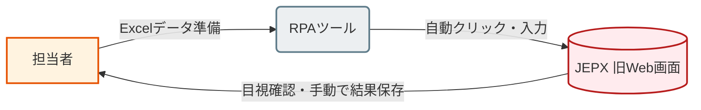
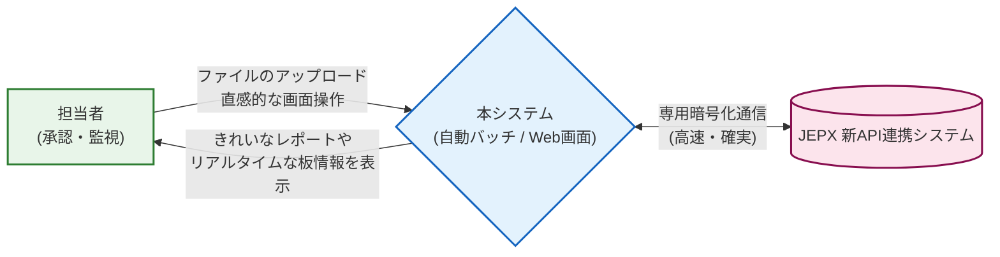
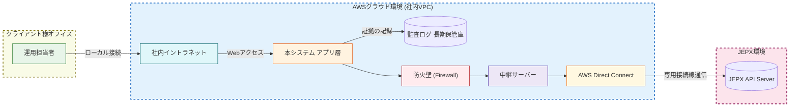
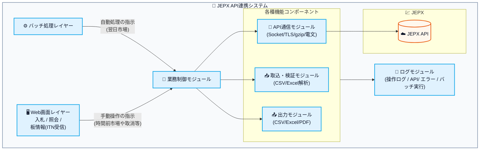
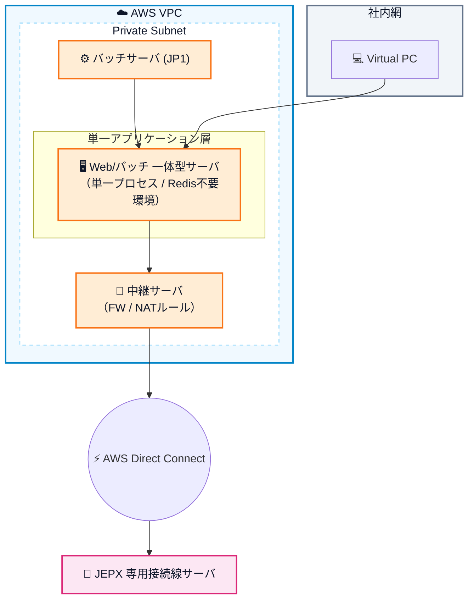
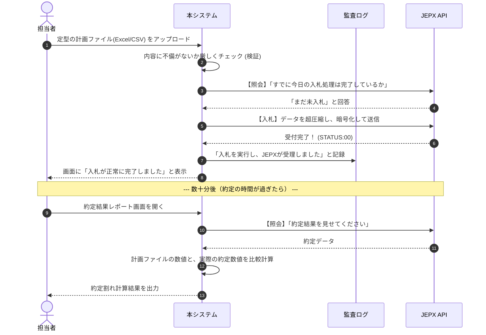

# 02. 基本設計書（JEPX API連携システム）

## 目次
- [1. はじめに（システム導入の目的）](#1-はじめにシステム導入の目的)
  - [1.1 前提・参照仕様ドキュメント](#11-前提参照仕様ドキュメント)
- [2. 業務フロー（現状と新システムの比較）](#2-業務フロー現状と新システムの比較)
  - [2.1 現状（As-Is）](#21-現状as-is)
  - [2.2 新システム導入後（To-Be）](#22-新システム導入後to-be)
- [3. システムアーキテクチャ・インフラ構成](#3-システムアーキテクチャインフラ構成)
  - [3.1 ステートレス設計とデータ永続化の厳格な禁止](#31-ステートレス設計とデータ永続化の厳格な禁止)
  - [3.2 JEPX専用接続線の制約（通信・インフラ仕様）](#32-jepx専用接続線の制約通信インフラ仕様)
  - [3.3 システム構成図（クラウド連携）](#33-システム構成図クラウド連携)
  - [3.4 稼働環境・ミドルウェア要件（TLS 1.3対応）](#34-稼働環境ミドルウェア要件tls-13対応)
- [4. アプリケーション機能・コンポーネント設計](#4-アプリケーション機能コンポーネント設計)
  - [4.1 コンポーネント構成図](#41-コンポーネント構成図)
  - [4.2 インフラ構成（AWS VPC）](#42-インフラ構成aws-vpc)
  - [4.3 機能一覧（処理別・市場別）](#43-機能一覧処理別市場別)
- [5. システムフロー図（情報の流れ）](#5-システムフロー図情報の流れ)
- [6. 画面設計・サンプルイメージ](#6-画面設計サンプルイメージ)
  - [6.1 UI機能におけるデータ取得・描画の基本方針](#61-ui機能におけるデータ取得描画の基本方針)
  - [6.2 時間前市場（ITD） トレードダッシュボード](#62-時間前市場itd-トレードダッシュボード)
  - [6.3 翌日市場（DAH） バッチ管理・レポート画面](#63-翌日市場dah-バッチ管理レポート画面)
- [7. バッチ設計（自動化制御）](#7-バッチ設計自動化制御)
  - [7.1 自動化シナリオ](#71-自動化シナリオ)
  - [7.2 二重送信防止の多層設計（冪等性の担保）](#72-二重送信防止の多層設計冪等性の担保)
  - [7.3 リトライとエラー分類戦略](#73-リトライとエラー分類戦略)
  - [7.4 バッチ処理の基本フロー](#74-バッチ処理の基本フロー)
- [8. ログ設計（真実の記録）](#8-ログ設計真実の記録)
  - [8.1 ログ種別とマスキング要件](#81-ログ種別とマスキング要件)
- [9. 例外・リカバリ設計](#9-例外リカバリ設計)
  - [9.1 エラー種別の定義とUIにおけるフィードバック方針](#91-エラー種別の定義とuiにおけるフィードバック方針)
- [10. 認証・権限制御設計（Azure EntraID SSO）](#10-認証権限制御設計azure-entraid-sso)
  - [10.1 ロール（権限）定義](#101-ロール権限定義)
- [11. 全体まとめ](#11-全体まとめ)
- [12. 機能・画面一覧（開発スコープ定義）](#12-機能画面一覧開発スコープ定義)
  - [12.1 画面（UI機能）一覧](#121-画面ui機能一覧)
  - [12.2 自動化バッチ・常駐処理（BAT機能）一覧](#122-自動化バッチ常駐処理bat機能一覧)
- [13. 詳細設計に向けた未確定事項（※未確定）](#13-詳細設計に向けた未確定事項未確定)
  - [13.1 外部インターフェース詳細定義](#131-外部インターフェース詳細定義)
  - [13.2 バリデーション詳細ルール](#132-バリデーション詳細ルール)
  - [13.3 画面仕様](#133-画面仕様)
- [14. 技術的課題と推奨構成案（クライアント協議事項）](#14-技術的課題と推奨構成案クライアント協議事項)
  - [14.1 課題：マルチプロセス（Python等）やスケールアウト環境（Java等）における状態共有](#141-課題マルチプロセスpython等やスケールアウト環境java等における状態共有)
  - [14.2 リスク評価と対策案](#142-リスク評価と対策案)
  - [14.3 結論（推奨方針）](#143-結論推奨方針)

---

## 1. はじめに（システム導入の目的）
JEPX（日本卸電力取引所）の専用Web画面の廃止に伴い、新たな「API連携」を利用して電力取引業務を継続・効率化するためのシステムです。
本システムは、「専門的なITスキルを持たない運用担当者でも、安全かつ確実に入札業務および状況監視を遂行できること」を第一の目的として設計されています。

### 1.1 前提・参照仕様ドキュメント
本システムの外部インターフェース仕様、通信プロトコル、電文フォーマット、各種コード・エラー定義等に関する**詳細な技術仕様の原本（正）は、以下のJEPX提供公式ドキュメント**とします。本設計書ではシステム全体の運用アーキテクチャやルールを定義し、個別の設定値やインターフェースの完全な定義はこれら参照ドキュメントに準拠して詳細設計を行います。

- `901.JEPX 専用接続線 接続技術書` （コネクション制約、Keep-alive仕様等）
- `902.API仕様書(翌日市場取引システム)` （入札・照会等APIのI/O定義、ステータス定義）
- `903.API仕様書(時間前市場取引システム)` （同上）
- `911.日本卸電力取引所 取引規程` / `912. 取引ガイド` （業務ルールおよび制約）

---

## 2. 業務フロー（現状と新システムの比較）

### 2.1 現状（As-Is）
これまでは、RPAツールを用いてWeb画面を操作し、入札や結果確認を自動化していました。JEPX側のWeb画面廃止により、この運用手法は継続困難となります。



### 2.2 新システム導入後（To-Be）
新システムでは、JEPXが公式に提供するAPI連携仕様に準拠し、直接データ通信を行います。これにより、処理の確実性と即応性が飛躍的に向上します。



---

## 3. システムアーキテクチャ・インフラ構成

本システムは、高い安全性（セキュリティ）と保守のしやすさを両立するため、**「ステートレス（状態を持たない）設計」**という先進的な構造を採用しています。

### 3.1 ステートレス設計とデータ永続化の厳格な禁止
一般的なシステムは業務データや取引履歴を自社のデータベース（DB）に永続化して管理します。しかし本システムではセキュリティと保守性の観点から、**RDB・NoSQL・SQLite等のデータベースソフトウェアおよびORM（オブジェクト関係マッピング）の利用をいかなる理由があろうとも厳格に禁止**します。
エリアコード・時間帯等のマスタデータやシステム設定はすべてYAML・JSON・ENVファイル形式で管理します。

さらに、ファイル取込時の中間データや市場情報の配信ストリーム等の一時データについても、すべてOS上の「APサーバ（PythonのASGIプロセスやJavaのインスタンス等）内のメモリ」でのみ保持し、処理終了後・画面プッシュ後は速やかに破棄する設計制約を定めます。（同一バッチ実行内の二重送信防止等もメモリ内のキーセットで完結させます）

画面表示や業務処理を実行するたびに、常にJEPXのサーバーへ最新の取引状態を照会し、そのデータを前提に処理を行います。
これにより、「自社システム内部のデータとJEPX側の実績データ間に発生する不整合リスク」を根本から排除し、機密情報漏えいのリスクを極小化します。

### 3.2 JEPX専用接続線の制約（通信・インフラ仕様）
本システムがJEPXと専用線経由で通信する際、以下の厳密なネットワーク・コネクション制約を遵守するアーキテクチャとします。

- **コネクション上限の管理**: 1通信網・1サーバあたりの同時接続数には厳密な上限が設けられています。本システムは接続プールを自身で管理し、上限を超過する通信が発生しないように制御します。
- **アイドル切断とKeep-alive**: 無通信状態が一定時間継続すると、JEPX側から強制的にTCPセッションが切断されます。これを防ぐため、システム内で自動的に定期的な接続維持用API（`SYS1001`等）を送信し、常時通信断を防止するKeep-aliveの仕組みを実装します。

※ 具体的なコネクション上限数、およびアイドルからの強制切断秒数・維持用APIの送信間隔等の厳密な運用規定値については、『901.JEPX 専用接続線 接続技術書.md』を正として詳細設計を行います。

### 3.3 システム構成図（クラウド連携）
AWS（Amazon Web Services）を利用し、JEPXとは専用の閉域網で安全に通信します。



### 3.4 稼働環境・ミドルウェア要件（TLS 1.3対応）
本システムとJEPXとの専用線通信においては、セキュリティ基準を満たすため**TLS 1.3**での暗号化通信が必須となります。これを実現するため、稼働OSおよびアプリケーション実行環境（ミドルウェア）に対して以下のバージョン必須制約を定めます。

- **稼働基盤 (Linux等)**: OpenSSL `1.1.1` 以上（または `3.x` 系）のライブラリが利用可能であること。
- **Pythonによる実装の場合**: Python `3.8` 以上（推奨は `3.10` 以上）であること。かつ、実行環境のビルド時に上記OpenSSLバージョンと正しくリンクされていること。
- **Javaによる実装の場合**: Java `11` 以上（推奨は `17` 以上）であること。（※ デフォルトでTLS 1.3をサポートしないJava 8環境での実行は不可とします）

---

## 4. アプリケーション機能・コンポーネント設計

システムを「画面・操作（UI）」「業務制御（ロジック）」「API通信」の3つのコンポーネントに分離して開発することで、将来の法改正や仕様変更に対する拡張性と保守性を確保しています。

### 4.1 コンポーネント構成図



### 4.2 インフラ構成（AWS VPC）

低アクセス数・限定された運用担当者（1〜2名想定）での利用を前提とし、運用コスト削減のため冗長構成（ロードバランサー等）を省いたシンプルで堅牢な単一サーバー（Single Worker）構成とします。




### 4.3 機能一覧（処理別・市場別）
業務の実態に合わせ、翌日市場は「自動処理（バッチ）機能」を充実させ、時間前市場は「画面操作機能」を充実させます。

| 機能グループ | 機能名 | 概要・業務への貢献 |
|---|---|---|
| **翌日市場 (DAH) ** | 取込・妥当性チェック | 入力ファイルの検証を行い、異常値（マイナス価格や不整合等）を事前の段階で検知・除外します。 |
| | 【自動】入札実行 | スケジューラに基づく規定時刻に、検証済みのデータを自動でJEPXへ送信します。 |
| | 【自動】結果比較 | JEPXの約定結果を取得し、当初の計画値との差異計算およびレポート生成を自動化します。 |
| **時間前市場 (ITD) ** | リアルタイム板情報 | 指定エリアの全48コマにおける市場の需給（売買オーダー）状況をダッシュボードへ即座に描画します。 |
| | 自動入札状況の監視 | 自動で投入された入札の推移等、該当システム上のアクティビティをダッシュボードで監視します。 |
| **共通・管理機能** | 監査ログ追跡 | API送受信履歴や操作履歴を追跡・監査するための公式な証跡基盤を提供します。 |
| | エラー時 再送制御 | JEPX側のレスポンス遅延や一時的な通信障害時にも、自動で再試行（リトライ）を実施し、業務の継続性を担保します。 |

---

## 5. システムフロー図（情報の流れ）

代表的な「翌日市場における、データの取込から約定結果の確認まで」の流れです。



---

## 6. 画面設計・サンプルイメージ

ユーザーが意図した操作を確実に行え、状況を即座に把握できるUIデザインを想定しています。
（実際の株式トレードなどで採用されるオーダーブックのレイアウトを参考としています）

### 6.1 UI機能におけるデータ取得・描画の基本方針
本システムはステートレス設計であるため、画面表示時のデータ取得や連携について、以下の明確なアーキテクチャポリシーを遵守して詳細設計を行います。
- **原則（都度同期取得）:** 画面の初期ロード時、および照会・再送等のボタン操作アクション時に、**毎回必ずJEPX APIへ同期通信を行い（直接アクセスし）**、取得した最新の実績データを描画します。ローカルキャッシュの使用を禁止します。
- **例外（ストリーム受信）:** 時間前市場の板情報（ITN1001）は、常時受信しているストリームデータをサーバメモリからWebSocket等を用いてブラウザへ非同期にプッシュ配信し、画面を即時更新します。

### 6.2 時間前市場（ITD） トレードダッシュボード
現在の市場状況（板情報）をリアルタイムに把握し、瞬時にアクションを起こせる「司令塔」となる画面です。

**【画面レイアウト 概念図】**

```text
+---------------------------------------------------------------------------------------------------+
|  [⚡ JEPX API連携システム]       [板情報ダッシュボード]    [翌日市場管理]        [👤 運用担当者]         |
+---------------------------------------------------------------------------------------------------+
|                                                                                                   |
|  🟢 システム状態: 正常通信中 / リアルタイム更新 ON    エリア選択: [ 01: 北海道 ▼ ]                       |
|                                                                                                   |
|  [ 📊 時間前市場（ITD） 板情報サマリー ]               |  [ 🔍 詳細板情報（オーダーブック） ]               |
|  (全48コマ一覧・自動更新)                              |  対象コマ：[ 21 (10:00 - 10:30) ]                 |
|                                                    |                                                   |
|  +----+---------------+-----------+-----------+----+  |  +---------+-----------+---------+          |
|  |コマ| 時間帯        |最安売(円)|最高買(円)|状況|  |  | 売(MW)  |  価格(円) |  買(MW) |          |
|  +----+---------------+-----------+-----------+----+  |  +---------+-----------+---------+          |
|  | 01 | 00:00 - 00:30 |   18.50   |   17.10   |    |  |  |     150 |   18.50   |         |          |
|  | 02 | 00:30 - 01:00 |   18.20   |   17.30   |    |  |  |     500 |   18.20   |         |          |
|  | 03 | 01:00 - 01:30 |   18.00   |   17.50   |    |  |  |      50 |   18.00   |         |          |
|  | .. |     ...       |    ...    |    ...    |    |  |  |---------+-----------+---------|          |
|  |▶21 | 10:00 - 10:30 |   17.80   |   17.60   |激化|  |  |         |   17.80   |     100 |          |
|  | 22 | 10:30 - 11:00 |   17.90   |   17.80   |    |  |  |         |   17.50   |     300 |          |
|  | .. |     ...       |    ...    |    ...    |    |  |  |         |   17.10   |     800 |          |
|  | 48 | 23:30 - 00:00 |   18.10   |   16.90   |    |  |  +---------+-----------+---------+          |
|  +----+---------------+-----------+-----------+----+  |                                             |
|                                                       |                                             |
|  ※一覧行をクリック(またはマウスオーバー)すると、        |                                             |
|    右側にそのコマの詳細な厚み（板）が展開されます。      |                                             |
|                                                       |                                             |
|                                                       |                                             |
|  [ 📝 直近の自動処理履歴 ]                                                                              |
|  10:02:15 | 時間前入札 | 10:00〜10:30 | 買い 100MW | ✅ JEPX受付完了                                   |
|  09:55:00 | 翌日入札   | 全48コマ対象   | 一括処理   | ✅ JEPX受付完了                                   |
+---------------------------------------------------------------------------------------------------+
```
*   **技術的なポイント**: JEPXからリアルタイムに送られてくるITN（市場情報通信）を受け取り、ブラウザの通信機能を使ってDBを介さずにこの表を更新し続けます。

### 6.3 翌日市場（DAH） バッチ管理・レポート画面
日々の定型業務である「翌日市場」に関するファイルをアップロードし、結果を振り返る画面です。

```text
+-----------------------------------------------------------------------------------+
|  [ 翌日市場業務 ]  入札操作 ＆ 約定結果レポート                                       |
+-----------------------------------------------------------------------------------+
|  1. 計画値ファイルの取り込み                                                        |
|     [ 📁 ファイルを選択... ] (C:\data\plan_20260226.csv)                          |
|     [ 📤 アップロードして内容を検証する ]                                           |
|                                                                                   |
|  2. 検証ステータス                                                                  |
|     ✅ エラーなし（48コマすべてのデータが揃っており、異常値はありません）                 |
|     [ 🚀 APIへ本送信を開始する ]  ※通常は朝のバッチにより自動で押下されます              |
|                                                                                   |
|  3. 約定結果レポート（事後照会）                                                    |
|     [ 🔄 JEPXから最新結果を取得する ]   [ 📥 この結果をCSVでダウンロードする ]          |
|  +---------+------------+-------------+-------------+------------+             |
|  | 時間帯  | 計画入札量 | 約定数量    | 計画との差分 | 約定価格   |             |
|  +---------+------------+-------------+-------------+------------+             |
|  | 01 (00:00)| 100 MW     | 100 MW      | 0            | 15.20 円   |             |
|  | 02 (00:30)| 120 MW     | 100 MW      | ▲ 20 MW      | 16.00 円   |             |
|  +---------+------------+-------------+-------------+------------+             |
+-----------------------------------------------------------------------------------+
```

---

## 7. バッチ設計（自動化制御）

翌日市場を中心に、定期的な定型処理を確実かつ無人化で遂行するための仕組みです。

### 7.1 自動化シナリオ
1. **ジョブ起動**: スケジューラ（cron等）により、日次で規定の時刻にバッチ処理が起動します。
2. **事前状態チェック（冪等性の担保）**: 手動での事前入札などとの重複実行（二重入札）を防止するため、処理の冒頭で必ずJEPXに対し「当日の対象入札が完了しているか」のステータス照会を実施します。
3. **入札の実行**: バリデーション（妥当性検証）を通過したデータのみを、APIを通じて一括送信します。
4. **結果の記録と通知**: 一連の処理結果を監査ログに記録し、例外発生時には管理担当者へ即時アラートを出力します。

### 7.2 二重送信防止の多層設計（冪等性の担保）
システムやネットワークの障害時に二重入札事故を防ぐため、以下の多層（3レイヤー）で重複送信をブロックします。
1. **Layer1（同アドレスからの連打・バッチ重複防止）**: DBやRedis等の外部KVSを用いず、単一アプリケーションマシンの「インメモリ・キャッシュ（ConcurrentHashMap等）」を利用し、同一処理の並行実行を数分間ブロックします。（スケールアウトしない単一構成であることを活用した高速・シンプルな排他制御です）
2. **Layer2（JEPX側状態の事前確認）**: 送信前に必ずJEPX側へ照会（`DAH1002`/`ITD1003`）し、すでに同条件の入札が登録済みであればスキップする。（冪等性担保の要）
3. **Layer3（エラー再送時の確認）**: エラー時の手動・自動リカバリ前にも必ず再度照会を行い、「確実にJEPXへ未到達」と判定された場合のみ再送を実施する。

### 7.3 リトライとエラー分類戦略
ネットワーク環境の瞬断や一時的な高負荷によりAPI要求が失敗した場合、そのエラーの性質に応じてシステムとしてのリカバリ挙動（リトライ）を制御します。エラーごとのシステムに対する振る舞いの基本方針は以下の通りです。

1. **システム起因エラー（通信タイムアウト / APIサーバ異常等）**
   - **振る舞い**: 指数バックオフ（待機時間を徐々に延ばす手法）による自動リトライを規定回数まで実施し、一時的な障害の自然回復を待ちます。それでも復旧不能な場合はオペレーターへアラートを発報します。

2. **業務起因エラー（認証・権限エラー / 電文フォーマット異常 / 必須入力不備等）**
   - **振る舞い**: 待機や再送信を行っても成功する見込みがないため、自動リトライは一切行いません。「即時処理停止」として、エラーの具体的な内容を監査ログおよび画面上に明示し、運用担当者へデータや運用設定の修正を促します。

※ 個別のエラー（JEPXが返却するSTATUS、エラーコードやbody_status）の完全な定義一覧、および各コードがどの分類に該当するかのディスパッチルールについては、『902.API仕様書』および『903.API仕様書』の規定を正として詳細設計内でマッピングを定義します。


### 7.4 バッチ処理の基本フロー

```
[日次バッチ] DAH入札バッチ

入力: S3（または共有ストレージ）上の計画値ファイル（CSV/Excel）

Step 1: 計画値ファイル取込
  - 対象ファイルをダウンロード
  - ファイル取込完了をログに記録
  
Step 2: バリデーション（メモリ内）
  - 全バリデーションを合格した場合のみ次ステップへ
  - エラーあり: エラー詳細をログに記録→バッチ異常終了

Step 3: 冪等性確認（JEPX API呼び出し）
  - DAH1002で当該受渡日の既登録入札を取得
  - 未送信分を確定
  - 確認結果をログに記録

Step 4: 入札送信（DAH1001）
  - 未送信分のみ送信
  - 送信成功/失敗をログに記録

Step 5: 入札照会確認（DAH1002）
  - 送信完了後に照会APIで登録確認
  - 確認結果をログに記録

Step 6: 約定照会（DAH1004）
  - 受渡日の約定結果を取得（JEPX API）
  - 計画値と照合（比較処理）
  - 比較結果をファイル出力

Step 7: 清算照会（DAH9001）
  - 必要に応じて清算データを取得・確認
  - 清算ファイルを出力

```

---

## 8. ログ設計（真実の記録）

「データをDBに保存しないシステム」では、過去の履歴を正確にたどるための「ログ（記録帳）」が生命線となります。

### 8.1 ログ種別とマスキング要件
システムは監査要件および障害調査のため、以下の4カテゴリで克明に処理を記録します。また、API通信ログ等において「機密情報（IDなど）」が含まれる場合は、出力前に**必ず伏せ字化（マスキング）**を実施する設計を必須要件とします。

| 種別 | 記録内容・用途 |
|---|---|
| **操作ログ** | 「誰が」「いつ」「どの画面で」「何をしたか」。社内の内部統制・不正操作の防止確認用。 |
| **API通信・エラーログ** | JEPXに送受信した暗号電文のデシリアライズ内容（マスキング済み）や、システム由来の通信・システム異常詳細。「正しく注文がJEPXに届いたか」の公式な証拠提出として用いる。 |
| **業務エラーログ** | 入力データの形式や整合性等による業務エラー事由と詳細内容。 |
| **バッチ実行ログ** | スケジュール実行の開始・終了、処理件数、成功・失敗数のサマリー。 |

---

## 9. 例外・リカバリ設計

通信障害やシステムダウンなどの異常事態において、システムが整合性を保ちながら安全に復旧するための設計思想です。

1. **「状態の不確定化」の防止**
   入札処理等の通信完了前にネットワークが切断された場合、「処理がJEPXに到達したか否か」が不確定となります。システムはこの状態を検知次第、JEPXへ照会APIを発行して処理の成否を確定させます。
2. **システム制御下での重複回避**
   上記の状態確認の結果、「未達」と判明したケースにおいてのみ、再送機能が有効化されます。これにより、運用担当者は二重送信のリスクを負うことなく、安全にリカバリ操作への移行が可能です。
3. **ステートレス設計による即時復旧**
   システム内部（DB等）に処理途中のトランザクション状態を保持しないため、万が一システムプロセスが強制停止した場合でも、サーバー再起動によって即座に「健全な初期状態」へ復帰します。

### 9.1 エラー種別の定義とUIにおけるフィードバック方針
システム内で発生するエラーを「業務エラー」と「システムエラー」に厳格に切り分け、画面を利用する運用担当者が「次に何をすべきか」を判断できるフィードバック基本設計とします。

| エラー種別 | 主なJEPX側のレスポンス定義 | 画面での表示および運用担当者へ促すアクション |
|---|---|---|
| **業務起因エラー<br>(ビジネスエラー)** | 必須項目不足(required)、型異常(format)、値異常(range/code)、不整合(inconsistency)、権限なし(STATUS:11) 等 | **【表示】**「どの項目の値が、どう間違っているか」を日本語で画面上に明示します。<br>**【アクション】**入力ファイルの修正、または画面入力値の見直しを行わせ、再実行を促します。 |
| **システム起因エラー<br>(通信・システム異常)** | サーバ異常(STATUS:19)、フォーマット異常(STATUS:10)、通信断、タイムアウト等 | **【表示】**「通信上の理由で受付が完了しませんでした」等と表示し、ステータス照会ボタンを有効化して現在の状態確認へ誘導します。<br>**【アクション】**自動リトライ上限後も不達であれば、手動での現況確認（照会API）および、安全確認の上での手動再送操作を促します。 |

---

## 10. 認証・権限制御設計（Azure EntraID SSO）

システム利用者に対する強固な認証と、DB不使用原則（パスワード情報をシステム内部に保持しない）を両立させるため、**Azure EntraIDを利用したSSO（シングルサインオン）認証**を基本方針として採用します。

### 10.1 ロール（権限）定義
SSO連携（SAML/OIDC等）によりIdPから渡されたユーザー属性（グループ情報等）から、自動的に以下の3ロールのいずれかを導出し、アクセス可能な画面とAPI操作を厳密に制限します。

| ロール | 権限範囲 |
|--------|----------|
| **Admin（管理者）** | 再送等リカバリ実行、監査ログ参照、設定ファイル変更の適用等、全機能の利用が可能。 |
| **Operator（運用者）** | 入札操作、ファイル取込、削除、結果照会、レポート出力等の業務操作が可能。 |
| **Viewer（閲覧者）** | 入札状況・約定結果・市場情報の「閲覧（照会）」のみが可能。データの更新（入札・削除等）は一切不可。 |

---

## 11. 全体まとめ

本システムは、JEPXの大規模な仕様変更を単に乗り切るだけでなく、お客様の業務をより堅牢で楽なものへと進化させます。

- **ブラックボックス化の解消**: 従来のRPAによる手順依存の画面操作から、公式仕様に裏付けられたAPI通信と構造化された監査ログ基盤へ移行します。
- **直感的な業務遂行（ノンプログラミング）**: 複雑な暗号化要件や電文生成はシステム側でカプセル化（隠蔽）し、ビジネスユーザーには使いやすい操作画面のみを提供します。
- **データ非保持による高セキュア構成**: 取引実績やマスタデータを自社環境内に永続化しないため、情報漏えいや、JEPX正データとの乖離（齟齬）といった構造的リスクを排除しています。

以上の方針により、翌日市場の堅牢な自動化と、時間前市場の的確な監視業務を実現し、お客様の電力取引の確実性と効率化を支援いたします。

---

## 12. 機能・画面一覧（開発スコープ定義）

本項は、開発者が詳細設計およびプログラム実装に移行するための機能単位（ファンクションポイント等）の全体像を定義するものです。クライアント様の業務要件が、具体的にどのシステム機能として実装されるかを紐付けます。

### 12.1 画面（UI機能）一覧
運用担当者が直接操作、または情報閲覧を行うWebインターフェース機能です。

| 機能ID | 画面名 | 関連市場 | 主な機能要件と使用API |
|---|---|---|---|
| **UI-DAH-01** | 翌日市場 入札計画ファイル取込 | 翌日市場 | 計画値ファイル(CSV/Excel)のアップロードおよびメモリ内でのバリデーション（妥当性検証）処理 |
| **UI-DAH-02** | 翌日市場 手動入札実行 | 翌日市場 | バリデーション済データの入札要求 (`DAH1001`) 送信 |
| **UI-DAH-03** | 翌日市場 入札状況照会 | 翌日市場 | 現在の入札ステータス照会 (`DAH1002`) |
| **UI-DAH-04** | 翌日市場 入札削除 | 翌日市場 | 送信済み入札データの削除要求 (`DAH1003`) |
| **UI-DAH-05** | 翌日市場 約定・清算結果レポート | 翌日市場 | 事後約定結果の取得 (`DAH1004`)、清算照会 (`DAH9001`)、計画値との差分比較計算・描画、結果のCSVダウンロード |
| **UI-ITD-01** | 時間前市場 ダッシュボード（板情報） | 時間前市場 | 対象エリア選択、全48コマ価格サマリー表示、特定コマのオーダーブック展開表示。市場情報ストリーム受信機能 (`ITN1001`) の描画 |
| **UI-ITD-02** | 時間前市場 手動入札実行 | 時間前市場 | 時間前市場への入札要求 (`ITD1001`) 送信 |
| **UI-ITD-03** | 時間前市場 入札状況照会 | 時間前市場 | 時間前市場の現在の入札ステータス照会 (`ITD1003`) |
| **UI-ITD-04** | 時間前市場 入札削除 | 時間前市場 | 時間前市場の送信済み入札データの削除要求 (`ITD1002`) |
| **UI-ITD-05** | 時間前市場 約定・清算結果レポート | 時間前市場 | 時間前市場の事後約定結果の取得 (`ITD1004`) および清算照会 (`ITD9001`) |


### 12.2 自動化バッチ・常駐処理（BAT機能）一覧
システム内部で独立して稼働する、スケジュール実行型および常駐型のバックグラウンド処理群です。

| 機能ID | バッチ・ジョブ名 | 起動契機 | 主な機能要件と使用API（※） |
|---|---|---|---|
| **BAT-DAH-01** | 翌日市場 定期照会ジョブ | 毎日規定時刻 | 当日分の入札完了状態ステータス確認 (`DAH1002`) |
| **BAT-DAH-02** | 翌日市場 定期入札ジョブ | 毎日規定時刻 | 検証済データの自動取得、および一括入札送信 (`DAH1001`) |
| **BAT-DAH-03** | 翌日市場 約定結果取得ジョブ | 毎日規定時刻 | 約定データの自動取得 (`DAH1004`) |
| **BAT-DAH-04** | 翌日市場 清算結果取得ジョブ | 毎日規定時刻 | 清算データの自動取得 (`DAH9001`) |
| **BAT-ITN-01** | 市場情報リアルタイムストリーム受信 | 常時起動（デーモン） | 時間前市場の市場情報通知受信 (`ITN1001`) のSocket常時接続およびシステム内キューへの転送 |
| **BAT-SYS-01** | コネクション維持（KeepAlive） | 常時起動（デーモン） | 一般通信におけるソケット接続延長要求 (`SYS1001`) の定期送信 |
| **BAT-CMN-01** | ログ アーカイブジョブ | 日次 | ローカル環境に蓄積されたログファイルを定期的にアーカイブ |

> ※ **各処理で呼び出すAPIの正式な仕様について**：
> 括弧内に記載したAPIコードは代表的な呼び出し先の例示です。リクエストパラメータ、電文（JSON/gzip等）の生成手順、およびレスポンス（ステータスコード等）の完全な定義については、『1.1 前提・参照仕様ドキュメント』に記載のJEPX公式仕様書に準拠した詳細設計を行います。

これらの各機能単位（UI機能／BAT機能）を要件定義書記載のAPI一覧と網羅的に1対1で整合させ、これを基盤として「03. 詳細設計」へと展開・実装を行います。

---

## 13. 詳細設計に向けた未確定事項（※未確定）

本基本設計書に基づき、次工程「詳細設計」へ進むにあたり、以下の仕様が未確定または詳細化待ちの状態です。これらは詳細設計着手時に優先的に決定する必要があります。

### 13.1 外部インターフェース詳細定義
- **入力ファイル（CSV/Excel）レイアウト**:
  - ※未確定：具体的な列順序、ヘッダ名称、必須/任意の区分、データ型（数値/文字列/日付形式）。
- **出力帳票・ファイル形式**:
  - ※未確定：約定結果レポート、差分比較ファイルの具体的な出力項目およびレイアウト。
  - ※未確定：PDF帳票のデザインテンプレート。

### 13.2 バリデーション詳細ルール
- ※未確定：各入力項目に対する具体的なバリデーションルール（桁数、禁止文字、最小値/最大値、許容誤差範囲など）の定義マトリクス。
- ※未確定：エラー発生時のハンドリング方針（全行ロールバックか、正常行のみ部分的取込か）。

### 13.3 画面仕様
- **画面遷移**:
  - ※未確定：具体的な画面遷移図およびメニュー構成。

---

## 14. 技術的課題と推奨構成案（クライアント協議事項）

本システムの「DBレス・ステートレス」方針は、セキュリティと保守性の観点で強力なメリットがありますが、Python（ASGI等）やJava（Spring Boot等）環境での実装にあたり、以下の技術的課題とリスクが存在します。これらはシステムの安定稼働に直結するため、クライアント様との協議・合意が必要です。

### 14.1 課題：マルチプロセス（Python等）やスケールアウト環境（Java等）における状態共有
PythonのWebサーバ（Uvicorn/Gunicorn等）は性能確保のために通常「マルチプロセス（複数のワーカー）」で動作します。また、Java環境（Spring Boot等）でも、冗長化や負荷分散のために複数インスタンス（コンテナ等）を展開運用する構成が一般的です。
しかし、プロセス間やインスタンス間のメモリ空間は独立しているため、以下の問題が発生します。

- **課題A（ITN配信の分断）**: プロセスAがJEPXから受信した市場情報（ITN）は、プロセスBに接続しているユーザー画面には配信されません。
- **課題B（二重送信防止の抜け穴）**: プロセスAで管理している「送信済みフラグ」を、プロセスBは参照できません。

### 14.2 リスク評価と対策案

#### 案1：完全インメモリ構成（現状の要件定義通り）
- **構成**: 外部DB/KVSは一切使用しない。ワーカープロセスを「1つ」に固定するか、特殊なプロセス間通信を実装する。
- **メリット**: インフラ構成が最も単純。DB管理コスト・セキュリティリスクがゼロ。
- **デメリット・リスク**:
    - **スケーラビリティ欠如**: 1プロセスで全負荷を捌くため、アクセス集中時に遅延する可能性がある。
    - **データ消失**: プロセス再起動やデプロイ時に、受信済みのITNデータや送信済みフラグがすべて消える。
    - **実装複雑度**: Python標準の共有メモリ（multiprocessing.Manager）等は複雑でデバッグが困難です。Javaの場合、単一インスタンス内であればスレッドセーフな変数による共有が比較的容易ですが、将来的な分散環境（複数台構成）への拡張を考慮すると独自の実装は技術的負債になりやすいです。
    
#### 案2：軽量KVS（Redis等）の導入【推奨】
- **構成**: AWS ElastiCache (Redis) または Docker上のRedisコンテナを1つ追加し、一時データのみを保持する。
- **メリット**:
    - **確実な同期**: 全プロセスが同一のRedisを参照するため、ITN配信や重複チェックが確実に動作する。
    - **耐障害性**: アプリ再起動後も直近のデータが残るため、復旧がスムーズ。
    - **標準的実装**: Web開発の標準パターンのため、技術的負債になりにくい。
- **デメリット**:
    - インフラコストが若干増加する。
    - 「DB不使用」という当初方針の緩和が必要（※ただし、データの永続化ではなく「揮発性キャッシュ」としての利用に限定することで、セキュリティポリシーとの整合は可能）。

### 14.3 結論（推奨方針）
システムとしての整合性と長期的な保守性を担保するため、**「案2：軽量KVS（Redis）の導入」を強く推奨します**。
「永続的な業務データの保存（RDB）」は行わず、「一時的な通信状態の共有（Cache）」に用途を限定することで、セキュリティ要件を満たしつつ上記課題を解決可能です。

