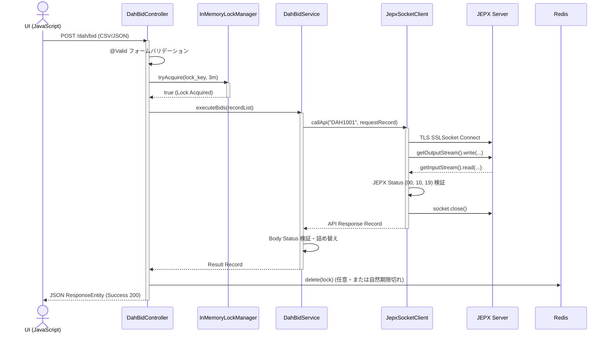
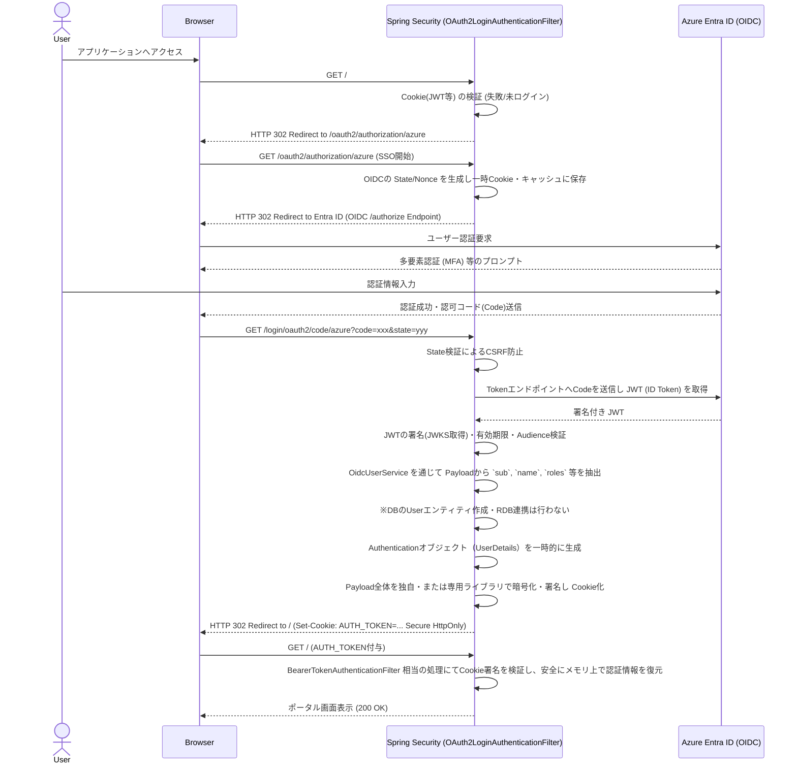

# 03. 詳細設計書（Java版）

## 文書情報

| 項目 | 内容 |
|------|------|
| 文書名 | 翌日市場/時間前市場 取引システム 詳細設計書（Java） |
| バージョン | 1.1.0 |
| 作成日 | 2026-03-04 |
| 対象システム | JEPX API連携システム |
| 関連基本設計 | 02.基本設計書.md |
| 参照仕様 | API仕様書(翌日市場取引システム) ver.1.1.1 / API仕様書(時間前市場取引システム) ver.1.0.3 / JEPX専用接続線接続技術書 ver.2.1 |

---

## 目次

1. [実装対象パッケージ・クラス網羅対応表（完全DBレス開発ガイド）](#1-実装対象パッケージクラス網羅対応表完全dbレス開発ガイド)
2. [API・通信仕様の詳細（インメモリTLS連携）](#2-api通信仕様の詳細インメモリtls連携)
3. [コンポーネント・パッケージ詳細設計](#3-コンポーネントパッケージ詳細設計)
4. [クラス・メソッドシグネチャ（主要API一覧）](#4-クラスメソッドシグネチャ主要api一覧)
5. [画面UI・エンドポイント詳細仕様（ステートレス設計）](#5-画面uiエンドポイント詳細仕様ステートレス設計)
6. [データモデル・JSON仕様（インメモリDTO定義リファレンス）](#6-データモデルjson仕様インメモリdto定義リファレンス)
7. [バリデーション規則詳細（共通リファレンス）](#7-バリデーション規則詳細共通リファレンス)
8. [エラー処理フロー・自動リトライ設計詳細](#8-エラー処理フロー自動リトライ設計詳細)
9. [バッチ処理・非同期タスク詳細仕様](#9-バッチ処理非同期タスク詳細仕様)
10. [監査ログ詳細仕様](#10-監査ログ詳細仕様)
11. [アプリケーション設定・環境変数定義詳細](#11-アプリケーション設定環境変数定義詳細)

---

## 1. 実装対象パッケージ・クラス網羅対応表（完全DBレス開発ガイド）

本章は、開発者が「この機能を実装するために、具体的にどのJavaパッケージ・クラスを触る必要があるか」を即座に把握するための完全なマッピング表です。本システムは **完全DBレス（データベース不使用）** および **CookieベースSSOセッション** を前提としており、一般的なSpring Boot（JPA）開発とはファイル構成や利用機能が著しく異なります。

> [!WARNING]
> **実装時の厳守事項（DBレス・ステートレス原則の徹底）**
> 1. **JPA/ORMの禁止**: `@Entity` や `spring-boot-starter-data-jpa` の利用、RDB接続用JDBCドライバの定義は**絶対に行わない**こと。
> 2. **DBセッションの代替**: Spring Session等を用いたRDBへのセッション保持は行わず、JWT等のトークンをCookie領域に格納した**ステートレスなセッション管理**とすること。
> 3. **メモリキャッシュの適正利用**: スケールアウトしない単一プロセス構成（1 Worker）を前提とし、冪等性を確保するための一時ロック制御には `ConcurrentHashMap` 等のインメモリ機構を利用すること。再起動で消滅してはならない業務データはファイルや外部ログ基盤へ書き出すこと。

### 1.1 ディレクトリ・パッケージ構造と責務（全体ツリー）

全体像を俯瞰するためのパッケージ構成です（各クラスの具体的責務は後続の節にて詳細化します）。

```text
src/main/java/com/client/jepx/
├── JepxApplication.java   # 起動クラス（DB構成除外設定）
├── config/                # 1.2 全体設定・セキュリティ層
│   ├── SecurityConfig.java
│   └── WebMvcConfig.java
├── web/                   # 1.3 / 1.4 UI・RESTエンドポイント層
│   ├── DahBidController.java
│   ├── DahInquiryController.java
│   └── ItnStreamController.java
├── service/               # 1.6 ビジネスロジック層
│   ├── DahBidService.java
│   └── ItdBidService.java
├── dto/                   # 1.6 インメモリデータモデル (Record)
│   ├── DahBidRecord.java
│   └── ItdNoticeRecord.java
├── client/                # 1.6 JEPX通信インフラ層
│   ├── JepxSocketClient.java # TCP/TLS通信クライアント
│   └── JepxCommunicationException.java
├── lock/                  # 1.6 in-memory KVS層
│   └── InMemoryLockManager.java
├── batch/                 # 1.5 非同期処理・常駐タスク層
│   ├── DahAutoBidTask.java
│   └── ItnSocketListener.java # ITN常駐タスク
└── audit/                 # 1.6 監査ログ出力層
    └── AuditLogger.java
```

### 1.2 全体設定・セキュリティ構成ファイル群（DB・JPA完全排除設定）

Spring Bootプロジェクト全体の振る舞いを決定する構成クラスおよびプロパティです。

| 分類 | 作成・実装するクラス・ファイル | 実装が必須となるコンポーネント・機能の詳細 |
|---|---|---|
| メイン設定 | `application.yml`<br>`JepxApplication.java` | - `spring.datasource.*` および `spring.jpa.*` プロパティの完全な排除<br>- JEPX通信タイムアウト等の環境変数マッピング<br>- `@SpringBootApplication(exclude = {DataSourceAutoConfiguration.class})` アノテーションによるDB自動構成のオフ |
| セキュリティ<br>構成 | `config.SecurityConfig.java` | - Spring SecurityのFilterChain設定<br>- EntraID（OIDC）連携用設定および、ステートレス対応（セッション作成ポリシーを `STATELESS` に設定） |
| 共通UI基盤 | `config.WebMvcConfig.java`<br>`templates/layout/base.html` | - 静的リソース配信やThymeleafの共通レイアウト設定<br>- 画面横断のフラッシュメッセージ（インメモリ機構）の設定 |

### 1.3 DAH（翌日市場）機能関連ファイル群

DAH市場におけるファイル取込、入札、照会等のWebエンドポイントと、それを処理するサービスです。

| 機能名 | 作成・修正するクラス | 実装詳細・ファイル内の責務 |
|---|---|---|
| CSV取込・UI | `web.DahBidController.java`<br>`templates/dah/bid.html` | - HTTP GET/POSTのルーティング。フォームにはDBエンティティを通さずDTOクラスを直接バインド<br>- CSVアップロードの `MultipartFile` メモリ上での受け渡し（ディスク書き出し禁止） |
| 入札入力・実行 | `service.DahBidService.java` | - CSVパースや画面入力を受け取り、バリデーションとインメモリの冪等性チェックを通したのちに、JEPX APIクライアント層へ処理を移管するビジネスロジック |
| 照会照会UI | `web.DahInquiryController.java`<br>`templates/dah/inquiry.html` | - 照会条件バインド用DTOを引数に取り、APIからの結果JSONを変換したDTOリストをThymeleafへモデルとして渡す |
| レポート出力 | `web.DahReportController.java` | - APIからのデータをCSVファイルバイト配列（`byte[]`）としてメモリ上で組み立て、`ResponseEntity` として直接ダウンロードレスポンスを返す |

### 1.4 ITD/ITN（時間前市場）機能関連ファイル群

時間前市場の入札・照会、および非同期の市場情報（ITN）モニタリング機能群です。

| 機能名 | 作成・修正するクラス | 実装詳細・ファイル内の責務 |
|---|---|---|
| 入札入力・実行UI | `web.ItdBidController.java`<br>`service.ItdBidService.java`<br>`templates/itd/bid.html` | - 単一商品・時間帯に対する入札条件フォーム処理<br>- コントローラーからサービスへ処理を移管し即座にJEPX時間前APIをコールする一連の流れ |
| ITNリアルタイム受信用UI<br>**(SSE実装)** | `web.ItnStreamController.java`<br>`templates/itd/market.html`<br>`static/js/stream.js` | - `@GetMapping` で `SseEmitter` または Reactor WebFlux の `Flux` を返すエンドポイント実装<br>- クライアントからの接続に対しサーバー内のメモリ上のObserver（EventEmitter等）をひも付け、リアルタイム中継 |

### 1.5 バッチ・SSE配信関連ファイル群（JP1等CLI）

翌日市場入札と、リアルタイムなITN接続を裏側で維持するためのプロセス群です。

| プロセス種別 | 作成・修正するクラス | 実装詳細・ファイル内の責務 |
|---|---|---|
| JP1等ジョブ用CLI<br>（自動入札バッチ） | `batch.JepxCommandLineRunner.java` | - `CommandLineRunner` または Spring Shell等を実装<br>- 引数を受け取って `DahBidService` を呼び出して完全自動化<br>- 永続化が必要な履歴はファイル（業務ログ/監査ログ）出力で代替 |
| ITN常駐プロセス | `batch.ItnSocketListener.java` | - アプリ起動時（`ApplicationRunner`等）に別スレッドとして常駐開始<br>- 単一SocketでJEPXと常時接続し、受信した電文をメモリ上のQueue/Observer等へブロードキャスト（自身のメモリにもため込まない） |

### 1.6 共通ビジネスロジック・KVS操作関連ファイル群

Controller（View）と、外部接続（JEPX通信やRedis）の中間を繋ぐレイヤーです。

| 共通ビジネスロジック<br>(Service層) | `service.DahBidService.java`<br>`service.ItdBidService.java` | - 画面やコマンドから呼び出される「業務ロジックの束」<br>- Controllerに代わって複数回のAPI呼び出しやデータ集計等を行う |
| JEPX通信基盤 | `client.JepxSocketClient.java`<br>`client.JepxConnectionException.java` | - Springの標準HTTP機能は使用できず、Java `SSLSocket` および Java NIO による低水準TCP/TLS層プログラムを構築。非同期・Keep-Alive送信のハンドリング<br>- Checked/Uncheckedの例外定義 |
| DTOレコード | `dto.DahBidRecord.java`<br>`dto.ItdNoticeRecord.java` | - Java 14+ の `record` クラス（または Lombok `@Value`）を用いた完全イミュータブルなDTO型定義<br>- Jakarta Bean Validationアノテーションを用いた入力制約 |
| メモリ内共有状態 | `lock.InMemoryLockManager.java` | - `ConcurrentHashMap` 等を用いた単一プロセス内での連打防止・排他制御（二重送信防止用ロック機構）の実装 |
| 監査ログ基盤 | `audit.AuditLogger.java`<br>`config.logback-spring.xml` | - Logback/SLF4Jを通じた監査情報のJSON吐き出し<br>- ログインユーザー情報やAPI応答コードをMDC（Mapped Diagnostic Context）に載せて全通信でトレースするためのAOP/Filter構成 |

## 2. API・通信仕様の詳細（インメモリTLS連携）

外部のAPI Gateway等を経由せず、自前でTCPソケットを管理してJEPXの取引システムと通信を行う、本システムの最もコアとなるレイヤーの仕様です。

### 2.1 電文フレーム構造とヘッダ部フォーマット

JEPX APIとやり取りするバイナリフレームの物理構造は以下の通りです。

**基本構造**:
```
[SOH(0x01)][ヘッダ部ASCII][STX(0x02)][ボディ部gzip化JSON][ETX(0x03)]
```

**ヘッダ部（送信時）の構成**:
Java側からは、固定の区切り文字 `,` と `=` で構成されたASCII文字列を生成します。
*   `MEMBER`: 環境変数等から取得した自社会員ID
*   `API`: 送信対象のAPIコード（例: `DAH1001`）
*   `SIZE`: gzip圧縮後のボディ部の正確なバイト長（**※圧縮前のJSON文字数ではなく、必ず圧縮完了後のバイナリデータ長を指定します。受信側でこれを基にソケットからの読み取りバイト数を決定するためです**）
*   例: `MEMBER=0841,API=DAH1001,SIZE=421`

### 2.2 TLS 1.3 SSLSocket クライアントの詳細実装仕様

Springの `RestTemplate` 等はHTTP専用であるため使用できず、Java標準の `SSLSocket` を用いて実装する `client.JepxSocketClient` の振る舞いです。

1.  **接続初期化**:
    *   `SSLContext.getInstance("TLSv1.3")` を生成し、JEPX指定のルート証明書を格納した `TrustManagerFactory` で初期化します。
    *   `context.getSocketFactory().createSocket()` によりソケットを生成し接続します。
    *   接続後、`socket.startHandshake()` にてTLSハンドシェイクを明示的に完了させます。
2.  **送出処理**:
    *   引数で受け取ったJava Record (DTO) を Jackson `ObjectMapper` でJSON化します。
    *   `ByteArrayOutputStream` と `GZIPOutputStream` を用いてメモリ上でバイナリ圧縮し、データ長を取得します。
    *   2.1のヘッダをASCIIバイト配列化し、制御文字（`0x01`, `0x02`, `0x03`）を連結して `socket.getOutputStream().write()` で送信します。
3.  **受信・パース処理**:
    *   `socket.getInputStream().read()` で終端文字 `0x03` (ETX) が現れるまでバイト配列バッファ（`ByteArrayOutputStream` 等）に蓄積します。
    *   受信データをヘッダと圧縮ボディに分離し、`GZIPInputStream` で解凍後、Jackson `ObjectMapper` を通してレスポンス用Recordクラスへデシリアライズします。

### 2.3 SYS1001送信（Keep-alive）の常駐スレッド制御メカニズム

JEPXとのコネクションは「3分間の無通信で強制切断」される仕様のため、これをコントロールします。

*   **DAH / ITDソケット（画面・バッチからの都度通信用）**:
    *   Tomcatのワーカースレッドを無駄に占有しないよう、原則として**「都度接続・即時切断（ショートコネクション）」**とします。したがって、これらの用途のソケットに対してはSYS1001送信を行わず、API結果受信後に速やかに `socket.close()` （try-with-resources構文による確実なクローズ）を実行します。
*   **ITNソケット（Stream常駐制）**:
    *   後述する常駐バッチ（`batch.ItnSocketListener`）内で、ITNの配信を待ち受ける専用Socketです。
    *   `ScheduledExecutorService` やSpringの `@Async` 等を用いて別スレッドを起動し、ソケットがオープンである限り**150秒間隔**で `API=SYS1001` の空ボディ電文を送信し続けます。

### 2.4 通信シーケンス図（フロントエンド → バックエンド → JEPX API）

非同期のリクエスト（DAH入札実行時など）における、各コンポーネント間のデータフローです。



## 3. コンポーネント・パッケージ詳細設計

Spring Bootのステートレス設計において、コア業務と通信基盤を担う主要コンポーネント（Bean）の役割を定義します。

### 3.1 `JepxSocketClient`（通信管理モジュール）の内部状態・DI構造

JEPX APIとの全低水準通信を統括するコンポーネントです。

*   **配置**: `client.JepxSocketClient.java`
*   **アノテーション**: `@Component`（あるいは `@Service`）。デフォルトのシングルトン・スコープとします。
*   **目的・果たすべき役割**: JEPX固有のソケット通信（TCP/TLSプロトコル）の複雑さを隠蔽し、上位層（Service）に対して標準的なJavaメソッド呼び出しのインターフェースを提供すること。
*   **実現手段・技術要素**: Java標準の `javax.net.ssl.SSLSocket` および Java NIO を用いた低水準なプログラミング。
*   **なぜこの設計なのか**: JEPXの通信仕様上、Spring Bootの標準である `RestTemplate` や `WebClient`（HTTPベース）が使用できず、自前で `SOH` や `ETX` などの制御文字を伴うバイナリフレームを構成・解析し、コネクションを制御する必要があるため、専用のクライアント層が必須となります。
*   **主要なDI（`@Autowired` / コンストラクタ注入）**:
    *   `AuditLogger`: API通信の証跡を非同期で記録するためのロガーコンポーネント。
    *   環境プロパティ（`@Value("${jepx.host}")` 等）: ホスト、ポート、証明書パス。
*   **状態（State）**:
    *   クラスフィールドに「接続中のSocketインスタンス」を保持すること**は禁止**します。SpringのシングルトンBeanは並行リクエストから同時に呼ばれるため、`SSLSocket`の生成・利用・破棄は**すべてメソッド内のローカル変数スコープ**で完結させるか、適切にスレッドセーフなコネクションプール機構を構築します。
    *   ※ITNの常駐プロセス用は例外的に独立したインスタンス/スレッドとしてライフサイクルを管理します。

### 3.2 `DahBidService` / `ItdBidService`（ビジネスロジック層）のクラス役割

Controllerから複雑な業務ルールとAPI呼び出しの順序制御を切り離すためのサービスクラス群です。

*   **アノテーション**: `@Service`
*   **状態（State）**: 完全なステートレス・シングルトンとします。
*   **目的・果たすべき役割**: Controller（Web画面からの受付）やCLI（JP1バッチからの受付）から複雑な業務ルール（相関バリデーションやAPI呼び出しの順序制御など）を切り離し、どこからでも再利用可能な「ビジネスロジックの束」を提供すること。
*   **実現手段・技術要素**: トランザクション等の状態を持たない、プレーンなSpringのサービスBean。
*   **なぜこの設計なのか**: 本システムはWeb画面の他に、JP1等のジョブ管理システムからのバッチ実行でも同じ機能を提供します。どちらの経路から呼ばれても全く同じ業務ルールやJEPX通信を通すアーキテクチャとするため、「処理の共通化」を主眼としてService層を独立構成にしています。
*   **主要なDI**:
    *   通信用 `JepxSocketClient`
    *   ロック機構用 `InMemoryLockManager`
*   **主要責務**:
    *   ControllerからビジネスDTOを受け取る。
    *   トランザクション境界を持たない一連の手続き型スクリプトとして、相関チェック → 分散ロック取得 → JEPX API実行 → レスポンス変換 をオーケストレーションします。

### 3.3 `InMemoryLockManager`（単一プロセス用二重送信防止ロック）

*   **配置**: `lock.InMemoryLockManager.java`
*   **アノテーション**: `@Component`
*   **目的・果たすべき役割**: ユーザーの画面ダブルクリックや、バッチの二重起動などによって、全く同じリクエスト（入札指示など）がJEPXへ重複して送信されてしまうことを未然に防ぐこと（排他・冪等性の担保）。
*   **実現手段・技術要素**: Java標準の `ConcurrentHashMap` を用いたシングルプロセス内（JVM内）でのスレッドセーフな排他制抑ロジック。
*   **なぜこの設計なのか**: 当初の設計案では複数サーバー間でのロックを考慮しSpring Data Redisを採用していましたが、「冗長化なし・単一プロセス（Worker=1）」での稼働を前提とする方針に変更されました。Redisなどの外部ミドルウェアを廃止し、システム構成と運用保守の手間を極限まで下げる（シンプルにする）ため、インメモリ設計へと転換しています。
*   **主要プロパティ**:
    *   `ConcurrentHashMap<String, Instant> locks`: ロックキーとその有効期限を保持するスレッドセーフなマップ。
*   **主要責務**:
    *   `boolean tryAcquire(String lockKey, Duration ttl)` メソッドの提供。
    *   内部でConcurrentHashMapをアトミックに操作し（`compute` メソッド等）、期限切れキーのパージと新規ロックの取得を同時に行い、成否を返却します。

## 4. クラス・メソッドシグネチャ（主要API一覧）

主要クラスが外部層（Controller等）からどのように呼び出されるか、そのインターフェース仕様を定義します。

### 4.1 `@Service` / API層の主要メソッド

**`JepxSocketClient`**
*   `public <T> T callApi(String apiCode, Object requestRecord, Class<T> responseType)`
    *   **処理**: API通信のコア。内部で TLSハンドシェイク、Jacksonシリアライズ、送信、受信、解凍、デシリアライズを順次実行し、指定されたJava Record型で結果を返す汎用メソッド。
    *   **例外**: （Unchecked Exceptionとして定義した） `JepxCommunicationException`, `JepxAuthException`, `JepxServerTemporaryException` などを適宜スローする。

**`DahBidService`**
*   `public DahResultRecord executeBids(List<DahBidRecord> bidRecords, String userId)`
    *   **引数**: ControllerでJakarta Validation済みのイミュータブルなDTOリスト、およびプロトコル用ユーザーID。
    *   **処理**: `InMemoryLockManager` でロック取得後、`JepxSocketClient` 経由で DAH1001 を呼び出し、入札番号のリスト等を含む結果Recordを返す。
*   `public List<DahInquiryRowRecord> getInquiry(LocalDate fromDate, LocalDate toDate)`
    *   **処理**: DAH1002 を呼び出し、結果をThymeleafなど画面層で扱いやすい一覧用のRecordリストに詰め替えて返却する。

### 4.2 `@RestController` / `@Controller` 層の主要メソッドシグネチャ

画面描画またはAPIリクエストを受け付ける主要メソッド定義です（Thymeleafを前提とした非RESTの例）。

**`DahBidController`**
*   `@GetMapping("/dah/bid")`
    *   `public String showBidForm(Model model)`
    *   **処理**: `dah/bid.html` の入札画面（空のフォーム用オブジェクトをModelにセット）をレンダリングして返す。
*   `@PostMapping("/dah/bid")`
    *   `public String processBidForm(@Valid @ModelAttribute("bidForm") DahBidForm form, BindingResult bindingResult, RedirectAttributes redirectAttributes)`
    *   **処理**: `@Valid` によって初期入力チェックを実施。エラーがあれば元の画面(`dah/bid`)を再描画。
    *   成功時、フォームデータを `DahBidRecord` に変換して `DahBidService.executeBids()` へ渡し、成功時は完了画面へリダイレクト（PRGパターン）。
    *   例外捕捉：`@ControllerAdvice`（後述）または `try-catch` にて `IdempotencyException` 発生時は特別なFlash Message（`処理中のためお待ちください`）をセットして再描画。

## 5. 画面UI・エンドポイント詳細仕様（ステートレス設計）

システムが提供するWeb画面のURL構造と、DBを持たずに状態を維持するためのセッション管理仕様です。

### 5.1 各画面のURLルーティング・HTTPメソッド一覧表

| パス (URL) | メソッド | Controllerクラス | 主要な機能・画面内容 |
|---|---|---|---|
| `/` | `GET` | `DashboardController` | ログイン後のポータル。システムのお知らせ等を初期表示 |
| `/login/oauth2/code/*` | `GET` / `POST` | (Spring Security内蔵) | Azure Entra IDへのOIDCリダイレクト開始およびコールバック受付 |
| `/logout` | `POST` | (Spring Security内蔵) | Cookieセッションの手動破棄 |
| `/dah/bid` | `GET` / `POST` | `DahBidController` | 翌日市場の入札CSVアップロードおよび結果表示 |
| `/dah/inquiry` | `GET` | `DahInquiryController` | 翌日市場の約定結果等の照会 |
| `/dah/report` | `GET` | `DahReportController` | パラメータに応じたCSV/Excelレポートの動的ダウンロード |
| `/itd/bid` | `GET` / `POST` | `ItdBidController` | 時間前市場の単一入札フォーム表示および実行 |
| `/itd/market` | `GET` | `ItnStreamController` | ITNリアルタイム通知を受信するベースHTML（JSによるSSE通信）の初期表示 |

### 5.2 SSO連携とCookie（JWT等）セッションのペイロード仕様詳細

ユーザーのログイン状態は「サーバー側のDBやTomcat標準のJSESSIONID」には極力保存せず、OIDCのIDトークン（JWTベース）等を暗号化Cookieに内包してクライアント（ブラウザ）へ持たせます。

**セッション（Cookieペイロード）に保持する情報**:
*   `sub` (Subject): Azure Entra IDから取得した従業員のユニークID（主にJEPXへ送る監査用）。
*   `name` / `preferred_username`: 画面ヘッダー等に表示するユーザー情報。
*   `roles`: アプリケーションロール（管理者画面の認可制御等に使用）。
*   `exp`: トークン有効期限。

**セキュリティ要件**:
認証Cookie（例: `AUTH_SESSION`）には必ず以下の属性を付与し、XSSやCSRFリスクを排除します。
*   `HttpOnly`: true (JavaScriptからの読み取り禁止)
*   `Secure`: true (HTTPS環境下のみ送信)
*   `SameSite`: Lax または Strict

### 5.3 各画面の入力要素とバックエンド処理へのマッピング詳細

例として **DAH入札画面 (`/dah/bid`)** の動作仕様を示します。

1.  **入力**: ユーザーがCSVファイルを選択して `POST /dah/bid` 送信。
2.  **バインディング**: `DahBidForm` は対象フィールドを `MultipartFile` 型として一つだけ持ちます。Springの設定 `spring.servlet.multipart.file-size-threshold` を十分大きく保つことで、ディスクI/Oを発生させずメモリ上のみで完結させます。
3.  **パースと変換**: `DahBidService` 内で `com.opencsv` や `jackson-dataformat-csv` を用いて、`InputStream` から直接 `DahBidRecord` のリストへパージングします。この際、アノテーションベースのバリデーション（`Validator.validate()`）を併用します。
4.  **画面へのFB**: パースエラーやバリデーションエラーがあれば、`BindingResult` または専用のDTOを介してエラーリストを作成し、Thymeleafテンプレートの `th:each="err : ${errors}"` ループを用いて「15行目: 数量が不正です」のように表示して画面を再描画します。

### 5.4 SSO連携・ステートレス認証シーケンス図

セッションをRDB等に保存せず完全にステートレス化しつつ、外部SSOでユーザー認証を行い安全にCookie（トークン）へ紐付ける流れは極めて重要であるため、詳細なシーケンス設計として定義します。



### 5.5 フロントエンド・アーキテクチャ設計

本システムではReactやVue.jsといったSPA（Single Page Application）フレームワークは採用せず、Spring Bootと親和性の高いThymeleafを利用したSSR（Server-Side Rendering）を主体とするアーキテクチャとします。

*   **目的・果たすべき役割**: 冗長なフロントエンド・ビルド環境（Node.js/Webpack等）を排除し、JavaエンジニアがバックエンドからView層まで一貫して保守・改修できる環境を構築すること。
*   **実現手段・技術要素**: 
    *   **HTML/テンプレート**: Thymeleaf 3（`th:fragment` などの共通レイアウト機能を利用）
    *   **CSSレイアウト**: プレーンなCSS、または軽量なCSSフレームワーク（Bootstrap 5等。CDN経由を想定）
    *   **クライアントサイドJS**: Vanilla JS（素のJavaScript）。ITNのリアルタイム受信（SSEの `EventSource` API利用）や、ファイル選択時の簡易チェック、UIのトグル動作程度に留める。
*   **なぜこの設計なのか**: 本システムの特性上、極度にインタラクティブなUIよりも「確実な業務遂行（CSVアップロードと結果確認）」に主眼が置かれています。UI層をReact等のJSフレームワークで分離すると、リポジトリ分割やAPIインターフェース設計のオーバーヘッドが生じます。Spring MVCとThymeleafの組み合わせという堅牢で安定した技術スタックを採用することで、開発初期の構築速度や、数年単位の長期安定稼働における運用・保守性を最大化するためです。

## 6. データモデル・JSON仕様（インメモリDTO定義リファレンス）

JPA/Hibernateを利用しない本システムでは、ビジネスデータは全て `Record` クラス（Java 14以降）を利用した完全イミュータブルなDTO（Data Transfer Object）として定義します。

### 6.1 `Record` クラスを活用したリクエストDTO構造詳細

JEPX APIへ送信するJSON構造に合わせたオブジェクトを `dto` パッケージ下に配置します。レコードはスレッドセーフであり、JSONシリアライズとも相性が良いです。

**例：DAH入札リクエストDTO (`dto.DahBidOfferRecord.java`)**
```java
package com.client.jepx.dto;

import jakarta.validation.constraints.*;
import java.math.BigDecimal;

public record DahBidOfferRecord(
    @NotBlank String deliveryDate, // YYYY-MM-DD
    @NotBlank @Pattern(regexp="^[1-9]$") String areaCd,
    @NotBlank @Pattern(regexp="^(0[1-9]|[1-3][0-9]|4[0-8])$") String timeCd,
    @NotBlank String bidTypeCd,
    @MultipleOfTen BigDecimal price, // カスタム制約または単なるBigDecimal
    @NotNull @DecimalMin("0.1") BigDecimal volume,
    @Size(max=5) String deliveryContractCd,
    @Size(max=100) String note
) {}

public record DahBidRequestRecord(
    @NotEmpty @Size(max=100) java.util.List<DahBidOfferRecord> bidOffers
) {}
```

### 6.2 DTOとJackson (`ObjectMapper`) の物理マッピング表

APIからのレスポンスJSONをRecordへマッピングする定義です。`@JsonProperty` を用いて、Java側のキャメルケースとJSON側の仕様差異を吸収します（基本的にJEPX側もキャメルケースですが、一部エイリアスが必要な箇所に対応）。

| JEPX APIコード | JSONキー (Path) | DTOプロパティ名 | 型 (Java) | 備考 |
|---|---|---|---|---|
| DAH1001 (Res) | `bidNo[]` | `bidNoList` | `List<String>` | 送信成功時の受付番号リスト |
| DAH1002 (Res) | `bids[].registeredTime` | `registeredTime` | `OffsetDateTime` | ISO8601文字列を自動パース |
| ITN1001 (Res) | `notices[].noticeTypeCd` | `noticeTypeCd` | `String` | CONTRACT または BID-BOARD |
| ITN1001 (Res) | `notices[].contractPrice` | `contractPrice` | `BigDecimal` | 浮動小数点誤差を防ぐため `double` は禁止 |

---

## 7. バリデーション規則詳細（共通リファレンス）

JEPXシステムへ不正な電文を送信してSTATUSエラーを受け取る前段の「UI・取込時」の境界で弾くための厳密な規則です。

### 7.1 `jakarta.validation` を用いた制約アノテーション一覧

前述の Record 定義内にてアノテーションを用いて単項目チェックを実施します。Controllerの引渡箇所で `@Valid` を付与して発火させます。

*   **価格 (Price)**: 
    *   カスタムアノテーション `@MultipleOfTen` を自作し、`ConstraintValidator` で `value.remainder(BigDecimal.TEN).compareTo(BigDecimal.ZERO) == 0` を判定。
    *   成行の場合はnull（`@Nullable`想定）であるため、null時はスキップ。
*   **数量 (Volume)**:
    *   `@DecimalMin("0.1")` でゼロや負数をブロック。
    *   `@Digits(integer=8, fraction=1)` で「小数第1位まで」を強制。

### 7.2 Controller/Service間での相関チェック詳細

単項目ではなく、複数のフィールドや「現在時刻」の組み合わせに基づく複雑なチェックは、Serviceのメソッド先頭で実装し、NG時は `JepxBusinessException` をスローします。

*   **時間前市場（ITD）の入札・削除期限チェック**:
    *   `deliveryDate` と `timeCd` の組み合わせから受渡開始の `LocalDateTime` を算出し、`OffsetDateTime.now()` と比較。「開始時刻の30分前（独自プロパティ定義）を過ぎている場合はエラー」とする相関ゲートチェックを必ず行います。

## 8. エラー処理フロー・自動リトライ設計詳細

### 8.1 発生例外の3分類と捕捉（`@ControllerAdvice`）定義

Springの強力な例外ハンドリング機構を用いて、画面層へのフィードバックを統一します。

| 例外クラス (基底: `RuntimeException`) | 発生要因 | 捕捉・ログレベル | `@ExceptionHandler` による処理 |
|---|---|---|---|
| `JepxBusinessException` | 相関チェックNG、JEPX STATUS:11等 | `WARN` | HTTP 400系相当。元の入力画面へリダイレクト（フラッシュスコープでエラーメッセージを運搬）。 |
| `JepxCommunicationException` | SSLハンドシェイク失敗、ソケット切断等 | `ERROR` | HTTP 500系相当。`error/500.html` 等の汎用エラー画面へルーティング。 |
| `JepxSystemException` | 設定異常、パース不能な未知電文等 | `ERROR` / `FATAL` | HTTP 500系相当。汎用エラー画面へルーティングし、監視チームへ即時アラート連携。 |

### 8.2 Spring Retryを用いた自動再送メカニズムの詳細

JEPX APIクライアント層にて、一時的な通信エラーや `STATUS=19` を検知した場合、透過的なリトライを実施します。

*   **適用アノテーション**: `JepxSocketClient.callApi()` に対して `@Retryable` を付与。
*   **設定詳細**:
    *   `include = {JepxServerTemporaryException.class, IOException.class}`
    *   `maxAttempts = 3`
    *   `backoff = @Backoff(delay = 1000, multiplier = 2.0)` （指数バックオフ：1秒→2秒待機）
*   **リカバリ**: 3回失敗時は `@Recover` メソッドが発火し、最終的に `JepxCommunicationException` へラップして上位へ通知。

---

## 9. バッチ処理・非同期タスク詳細仕様

サーバー内でバックグラウンド実行されるプロセス、およびOSコマンドとして起動されるバッチ仕様です。本システムはJP1等のジョブ管理システムからの呼び出しを中核要件の一つとして想定しています。

### 9.1 OSコマンド（CRON / JP1等）による DAH自動入札スケジューラーの構成

タスクスケジューリングはSpring内蔵の`@Scheduled`等を極力使わず、外部のジョブスケジューラ（JP1/cron）から直接CLI（セクション9.2）をキックする形態を中心とします。稼働構成上、どうしても内部タイマーが必要な場合は `@Scheduled` を利用しますが、スレッドを不必要に占有しない設計とします。

### 9.2 JP1等ジョブ連携用 CLI（Command Line Interface）の仕様

JP1から時刻トリガーでJEPX APIを叩くための、OSプロセス実行エントリーポイントです。

*   **目的・果たすべき役割**: 外部のジョブスケジューラ（JP1など）から本システムをJavaプロセスとして呼び出し、引数として処理日付や対象ファイルを指定してバッチ処理を起動できるインターフェースを提供すること。
*   **実現手段・技術要素**: HTTP通信用のREST APIではなく、Spring Bootの `CommandLineRunner` または `ApplicationRunner` 機能を利用して、Webサーバーを起動せずにCLIバッチとしてのみ実行する機構を実装します。
*   **なぜこの設計なのか**: 一般的にWeb API（REST）でバッチの起動口を作ると、非同期タイムアウトの問題や、画面と同じSSO（Entra ID）認証をバッチプログラムからも突破しなければならないという高い技術的ハードルが生じます。OSのJavaプロセスとして直接起動させるCLIアーキテクチャであれば、認証の問題をバイパスしつつ、戻り値（Exit Code）でJP1へ直接成否を伝達できるため運用設計が非常に容易になります。また、呼び出すのはWebと同じ共通 `Service` 層であるため、業務ロジックの乖離も発生しません。

**A. コマンドインターフェース定義**
*   **実装**: `batch.JepxCommandLineRunner` クラスを作成。
*   **実行コマンド例** (`--spring.main.web-application-type=NONE` でWeb層を無効化):
    ```bash
    java -jar jepx-app.jar --spring.main.web-application-type=NONE --job.type=DAH_BID --job.user=SYSTEM_JP1 --job.file=/path/to/bid.csv
    ```

**B. 監査ログ用 認証・実行者ID指定**
JP1からのバッチ実行とWeb画面（OIDC）からの手動操作を証跡（MDC・監査ログ）上で正確に区別するため、**起動引数（`--job.user`）で仮想のシステムユーザーID（例: `SYSTEM_JP1`）を必須指定**させます。`Runner` 内でこのIDをMDCに手動バインドした上で、共有サービスへ処理を委譲します。

**C. JP1への状態伝達と終了コード（Exit Code）設計**
JP1がジョブの成否を正しく判定・分岐できるよう、`SpringApplication.exit()` および `System.exit(N)` を用いて、発生した例外に応じた終了コードをOSへ返却します。

| 終了コード (`Exit Code`) | 状態 | ハンドリング・運用側の対応 |
|---|---|---|
| `0` | **正常終了** | JEPX APIから STATUS:00（正常）または STATUS:10（受付済）を受領。後続ジョブを実行可能。 |
| `1` | **入力/ビジネス例外** | 入力ファイルのバリデーション例外、または「30分前を過ぎている」等の `JepxBusinessException`。データ修正が必要。 |
| `2` | **通信/API異常終了** | `JepxCommunicationException` や JEPX STATUS:11（認証エラー）、STATUS:19のリトライ上限到達。ネットワーク再確認が必要。 |
| `9` | **システム/未知の異常** | `JepxSystemException`、または `NullPointerException` などの未捕捉エラー。即時調査が必要。 |

### 9.3 定住スレッドと `SseEmitter` による ITNリアルタイム通知基盤

時間前市場（ITD）において、JEPXから絶えず送られてくる約定情報や板情報を、Webブラウザ側の画面へリアルタイムにプッシュ配信するメカニズムです。

*   **目的・果たすべき役割**: JEPXシステムの「ITN1001」ポートから送信される情報のストリームを途切れさせることなく受信し、現在ログインして画面を開いている全ユーザーのブラウザへ、即座（サブ秒単位）に中継・ブロードキャストすること。
*   **実現手段・技術要素**: Java（Spring Boot）の非同期スレッド（`ExecutorService`）を用いた ソケットリスナーと、JVM内の配信構造（`ApplicationEventPublisher` または Observerパターン）、およびSpring MVCの `SseEmitter` を用いた **SSE (Server-Sent Events)** 技術の組み合わせ。
*   **なぜこの設計なのか**: リロード不要のリアルタイム描画には通常WebSocketと専用のメッセージブローカー（Redis Pub/Sub等）を用いますが、それらはインフラ構成とパッケージ構成を劇的に複雑化させます。JEPX→ブラウザという一方向のプッシュ通信であればSSEで必要十分です。さらに、Redisを廃止した単一前提のサーバーにおいては、JVMプロセス内のイベント発行機構（Pub/Subの代替）だけで十分なブロードキャスト性能と軽量さを発揮できるため、学習・運用コストの極小化を狙ってこのインメモリ設計としています。

*   **JEPX受信デーモン（Publisher）**:
    *   `ApplicationRunner` を実装した `ItnSocketListener` を用意し、起動時に別スレッドプール（`ExecutorService`）へ常駐タスクとして投下。
    *   ITN1001ソケットを維持し、受信したJSONを、Springの `ApplicationEventPublisher` や、シングルトンBeanとして定義した `SseEmitter` 用のObserver（`CopyOnWriteArrayList` 等）へ発行（ブロードキャスト）する。
*   **SSE Controller（Subscriber）**:
    *   `ItnStreamController` にWebブラウザからの接続口（`/itd/market/stream`）を用意し、戻り値を `SseEmitter` とする。
    *   接続毎に `SseEmitter` インスタンスを生成し、上記のObserverへ登録する。データ受信時に `emitter.send()` を通じて即座に画面へ反映させる。クライアント切断時に適切にObserverから登録を取り消す。

---

## 10. 監査ログ詳細仕様

「いつ・誰が・何をJEPXへ送信し、どういう結果を得たか」をファイルシステム等へ証跡として残す設計です。

### 10.1 Logback カスタムレイアウトと出力項目（JSON）

`logback-spring.xml` にて `net.logstash.logback.encoder.LogstashEncoder` 等を利用し、パースしやすいJSON形式で出力します。

```json
{
  "@timestamp": "2026-03-04T10:00:00.000+09:00",
  "level": "INFO",
  "logger_name": "com.client.jepx.audit.AuditLogger",
  "userId": "OIDC-U12345",
  "apiCode": "DAH1001",
  "requestSummary": "bidCount=3",
  "jepxStatus": "00",
  "durationMs": 450
}
```

*   **MDC (Mapped Diagnostic Context) の活用**: Spring Securityフィルタの後段で `MDC.put("userId", authentication.getName())` を行い、通信スレッド全域でユーザーIDを透過的にロガーへ連携します（非同期スレッドへまたがる場合は `TaskDecorator` 等でMDCをコピー）。

### 10.2 機密情報のマスキング仕様

*   `Logback` の `<masking>` 機能や、カスタムの `MessageConverter` プラグインを作成。
*   指定された正規表現ルール（例: `"password"\s*:\s*"[^"]+"`）に合致する文字列出力において、一律 `"password":"***MASKED***"` に置換処理を挟んでからファイル出力層へ流します。

---

## 11. アプリケーション設定・環境変数定義詳細

RDBレスおよびコンテナ・クラウド環境でのデプロイを前提とした Twelve-Factor App 準拠の設定（プロパティ）一覧です。過去の版で削除されていましたが、本システムの構築・運用において非常に重要な設計要素であるため詳細化して再掲します。

### 11.1 環境変数（OS環境変数 -> `application.yml` バインディング）一覧

| application.yml プロパティ | 元となる環境変数 | 用途・詳細仕様 | 必須 | 備考 |
|---|---|---|:---:|---|
| `jepx.security.cookie-secret` | `JEPX_COOKIE_SECRET` | 認証用トークン(JWT等)をCookieへ格納する際の暗号化・署名鍵。 | **Yes** | 例: `Hsbd89G...` (高エントロピー文字列) |
| `server.port` | `PORT` | アプリケーションが待ち受けるHTTPポート番号。 | No | デフォルト: 8080 |
| `server.error.include-stacktrace` | (不要) | 例外トレースのブラウザ表示抑制。設定ファイル内で直接 `never` に固定。 | - | 環境変数化は不要・ハードコード |
| `jepx.api.host` | `JEPX_API_HOST` | JEPX 取引システム（DAH/ITD/ITN）のIPアドレスまたはFQDN。 | **Yes** | 例: `api.jepx.org` |
| `jepx.api.port` | `JEPX_API_PORT` | JEPX 取引システムの通信先ソケットポート番号。 | **Yes** |
| `jepx.member-id` | `JEPX_MEMBER_ID` | 自社に割り振られたJEPXの4桁の会員コード。送信電文のヘッダ部に使用。 | **Yes** | 例: `0841` |
| `jepx.tls.trust-store` | `JEPX_TRUST_STORE` | JEPXより払い出されたルート証明書を格納したJKS形式などのトラストストアファイルのパス。 | **Yes** |
| `jepx.tls.trust-store-password`| `JEPX_TRUST_STORE_PASSWORD`| トラストストアのパスワード。 | **Yes** |
| `spring.security.oauth2.client.registration.azure.client-id` | `ENTRA_CLIENT_ID` | Azure Entra ID (OIDC) のアプリケーションID。 | **Yes** | SSO構成用 |
| `spring.security.oauth2.client.registration.azure.client-secret` | `ENTRA_CLIENT_SECRET` | Entra IDのクライアントシークレット。 | **Yes** |
| `spring.security.oauth2.client.provider.azure.issuer-uri` | `ENTRA_ISSUER_URI` | Entra IDの特定テナントディスカバリーURL。 | **Yes** | 例: `https://login.microsoftonline.com/{tenant-id}/v2.0` |
| `jepx.batch.dah-bid-cron` | `DAH_BID_CRON` | 翌日市場の自動入札バッチの起動タイミング（Cron式）。 | No | デフォルト例: `0 0 9 * * ?` |
