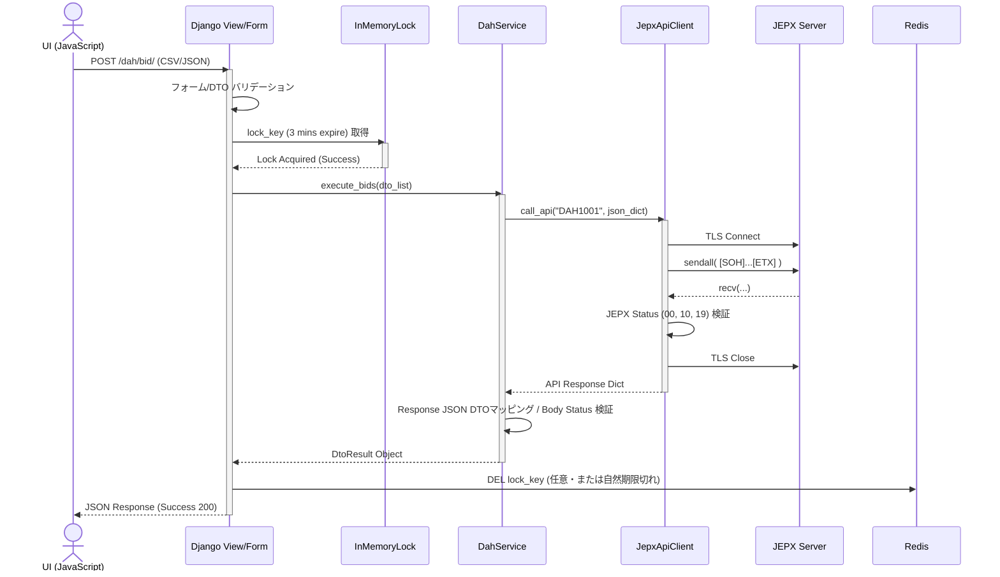
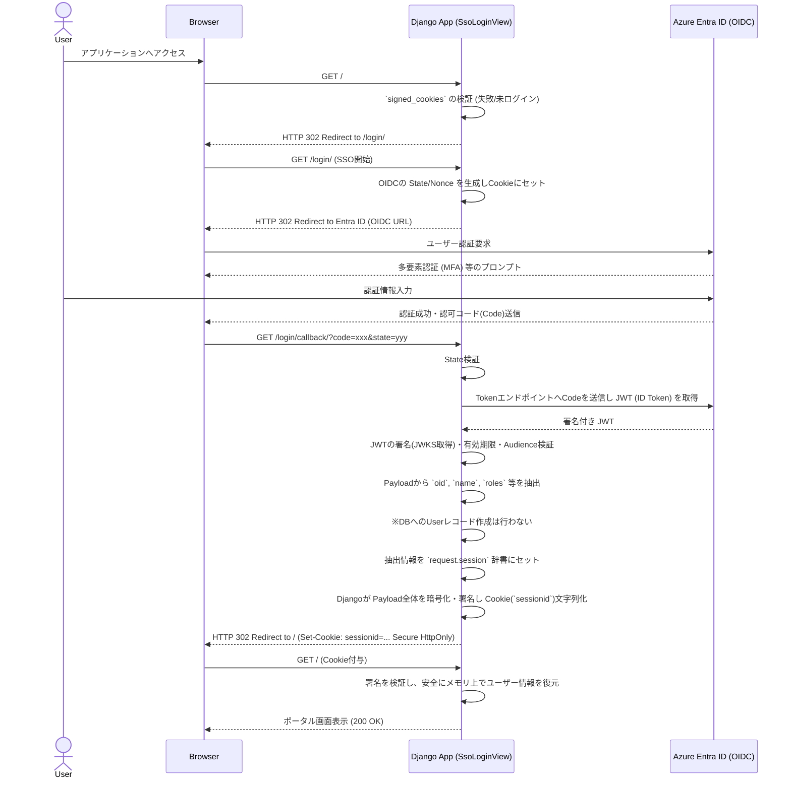

# 03. 詳細設計書（Python版）

## 文書情報

| 項目 | 内容 |
|------|------|
| 文書名 | 翌日市場/時間前市場 取引システム 詳細設計書（Python） |
| バージョン | 1.1.0 |
| 作成日 | 2026-03-04 |
| 対象システム | JEPX API連携システム |
| 関連基本設計 | 02.基本設計書.md |
| 参照仕様 | API仕様書(翌日市場取引システム) ver.1.1.1 / API仕様書(時間前市場取引システム) ver.1.0.3 / JEPX専用接続線接続技術書 ver.2.1 |

---

## 目次

1. [実装対象ファイル網羅対応表（完全DBレス開発ガイド）](#1-実装対象ファイル網羅対応表完全dbレス開発ガイド)
2. [API・通信仕様の詳細（インメモリTLS連携）](#2-api通信仕様の詳細インメモリtls連携)
3. [クラス・モジュール詳細設計](#3-クラスモジュール詳細設計)
4. [関数・メソッドシグネチャ（主要API一覧）](#4-関数メソッドシグネチャ主要api一覧)
5. [画面UI・エンドポイント詳細仕様（ステートレス設計）](#5-画面uiエンドポイント詳細仕様ステートレス設計)
6. [データモデル・JSON仕様（インメモリDTO定義リファレンス）](#6-データモデルjson仕様インメモリdto定義リファレンス)
7. [バリデーション規則詳細（共通リファレンス）](#7-バリデーション規則詳細共通リファレンス)
8. [エラー処理フロー・自動リトライ設計詳細](#8-エラー処理フロー自動リトライ設計詳細)
9. [バッチ処理・非同期タスク詳細仕様](#9-バッチ処理非同期タスク詳細仕様)
10. [監査ログ詳細仕様](#10-監査ログ詳細仕様)
11. [アプリケーション設定・環境変数定義詳細](#11-アプリケーション設定環境変数定義詳細)

---

## 1. 実装対象ファイル網羅対応表（完全DBレス開発ガイド）

本章は、開発者が「この機能を実装するために、具体的にどのファイルを触る必要があるか」を即座に把握するための完全なマッピング表です。本システムは **完全DBレス（データベース不使用）** および **CookieベースSSOセッション** を前提としており、一般的なDjango開発とはファイル構成や利用機能が著しく異なります。

> [!WARNING]
> **実装時の厳守事項（DBレス・ステートレス原則の徹底）**
> 1. **モデルの禁止**: Django標準の `models.py` へのクラス定義、および `manage.py makemigrations/migrate` の実行は**絶対に行わない**こと。
> 2. **DBセッションの代替**: `django.contrib.sessions.backends.db` は使用せず、必ず**`signed_cookies`**バックエンドを使用すること。
> 3. **メモリキャッシュの適正利用**: スケールアウトしない単一プロセス構成（1 Worker）を前提とし、冪等性確保等のための一時的なロック管理はアプリケーションのインメモリ（`dict`や`set`等のグローバル変数・シングルトン機構）で完結させること。再起動で消滅してはならない業務データ（監査ログ等）はファイルや外部ログ基盤へ書き出すこと。

### 1.1 ディレクトリ・パッケージ構造と責務（全体ツリー）

全体像を俯瞰するためのディレクトリ構成です（各ファイルの具体的責務は後続の節にて詳細化します）。

```text
jepx_project/          # プロジェクトルート
├── manage.py
├── requirements.txt
├── .env.example
├── jepx_project/      # プロジェクト設定（1.2節）
│   ├── settings.py    # 全体設定・DB無効化等
│   ├── urls.py        # ルートURL定義
│   ├── asgi.py        # ASGIエントリポイント
│   └── wsgi.py
├── web/               # UI・エンドポイント層（1.3, 1.4節）
│   ├── urls_dah.py, urls_itd.py
│   ├── views/         # 各種Viewコントローラー群
│   ├── forms/         # UIバリデーション・パース用Form群
│   ├── routing.py     # WebSocket/SSE用ルーティング
│   └── consumers.py   # ITN配信用Consumer
├── services/          # ビジネスロジック層（1.6節）
│   ├── dah_service.py
│   ├── itd_service.py
│   └── dtos/          # インメモリDTO定義 (Pydantic)
│       ├── dah_dto.py
│       └── itd_dto.py
├── api_client/        # JEPX通信インフラ層（1.6節）
│   ├── client.py      # JepxApiClient (TCP/TLS)
│   ├── exceptions.py
│   └── lock_manager.py # Idempotency (InMemory)
├── batch/             # 非同期処理・常駐プロセス層（1.5節）
│   ├── tasks.py       # Celeryタスク
│   └── management/commands/
│       └── run_itn_listener.py # ITN常駐受信プロセス
└── audit/             # 監査ログ出力層（1.6節）
    └── logger.py
```

### 1.2 プロジェクト全体・共通設定ファイル群（DB・ORM無効化等）

Djangoプロジェクト初期セットアップおよび全体を通したインフラ的機能の設定ファイル群です。

| 分類 | 作成・実装するファイル | 実装が必須となるコンポーネント・機能の詳細 |
|---|---|---|
| ルート設定 | `jepx_project/settings.py` | - `DATABASES` 辞書を空 (`{}`) に設定しDB接続を完全無効化<br>- `SESSION_ENGINE = 'django.contrib.sessions.backends.signed_cookies'` の設定<br>- 追加アプリ（`api_client`, `web`等）の `INSTALLED_APPS` 登録<br>- `env` 変数によるJEPX接続先、シークレットキーの読み込み |
| WSGI/ASGI | `jepx_project/urls.py`<br>`jepx_project/wsgi.py`<br>`jepx_project/asgi.py` | - 各アプリケーション（web）のURLルーティング統合<br>- プロダクション用WSGIエントリポイント<br>- ITNリアルタイム通知（WebSockets/SSE）のためのASGI（Django Channels等）エントリポイント |
| 要件・環境定義 | `requirements.txt`<br>`.env.example` | - `Django`, `pydantic`, `python-json-logger` 等の依存宣言（※Celery, Redisは不要）<br>- 接続情報やTLS証明書パスの環境変数テンプレート |

### 1.3 DAH（翌日市場）機能関連ファイル群

DAH市場におけるファイル取込、入札、照会、レポート出力等のUIおよびコントローラー群です。

| 機能名 | 作成・修正するファイル | 実装詳細・ファイル内の責務 |
|---|---|---|
| 全体ルーティング | `web/urls_dah.py` | - `web/urls.py` から `include` される、DAHドメイン下のURLパターン（例: `/dah/bid/`） |
| CSV取込・バリデーション | `web/forms/dah_forms.py` | - 画面からのUploadFile受け取り用フォーム定義<br>- **DB非依存**のPydanticモデルによるCSV行バリデーションロジック |
| 入札入力・実行UI | `web/views/dah_bid_views.py`<br>`web/templates/dah/bid.html` | - ファイル展開後の一覧表示用GETと、確認後API送信実行のPOSTを処理するコントローラー<br>- 送信時の `InMemoryLockManager` による二重送信チェック呼び出し |
| 入札・約定照会照会UI | `web/views/dah_inq_views.py`<br>`web/templates/dah/inquiry.html` | - 検索条件を受け取り `DahService` を呼び出してAPI経由でデータを都度取得するコントローラー<br>- DBの `QuerySet` ではなく、DTOリストをTemplateへマッピング |
| レポート出力 | `web/views/dah_report_views.py` | - 取得したDTOデータ（JSON）をメモリ上でCSV/Excelバイナリに変換し、 `FileResponse` として返却する処理 |

### 1.4 ITD/ITN（時間前市場）機能関連ファイル群

時間前市場の入札・照会、および非同期の市場情報（ITN）モニタリング機能群です。

| 機能名 | 作成・修正するファイル | 実装詳細・ファイル内の責務 |
|---|---|---|
| 全体ルーティング | `web/urls_itd.py` | - ITD機能関連のルーティング（例: `/itd/bid/`） |
| 入札入力・実行UI | `web/forms/itd_forms.py`<br>`web/views/itd_bid_views.py`<br>`web/templates/itd/bid.html` | - 単一商品・時間帯に対する入札条件フォーム定義（DB非依存）<br>- 入札実行および送信済入札の削除（取消）コントローラー |
| ITNリアルタイム受信用UI<br>**(SSE実装)** | `web/views/itd_stream_views.py`<br>`web/templates/itd/market.html`<br>`web/static/js/stream.js` | - ASGIやChannels等の外部ミドルウェアを要する構成は避け、Django標準の `StreamingHttpResponse` だけでServer-Sent Events(SSE)を実装する<br>- HTTPリクエストに対してプロセス内のQueueを監視させ、データを受け取り即座にブラウザへ中継<br>- JavaScript側でSSE通信(`EventSource`)を張る仕組み |

### 1.5 バッチ・常駐プロセス関連ファイル群（コマンド・スレッド）

翌日市場入札と、リアルタイムなITN接続を裏側で維持するためのプロセス群です。

| プロセス種別 | 作成・修正するファイル | 実装詳細・ファイル内の責務 |
|---|---|---|
| JP1等の外部ジョブコマンド<br>（DAH入札等） | `batch/management/commands/run_jepx_job.py` | - 定期起動されるカスタム管理コマンド（Celery等のキューは使わずOSのcron/JP1等から直接叩く）<br>- DB状態を保持せず開始したら設定ファイルを読み込んで `DahService` に依頼し完結させる |
| ITN常駐プロセス | `batch/management/commands/run_itn_listener.py` | - JEPXのITN1001専用Socketを張りっぱなしにするデーモンコマンド。受信した電文を（DBに保存せず）モジュール変数上のQueue等に流し込み、Web層のSSEビューへ連携する<br>- `SYS1001` Keep-Alive の送信スレッドを内部稼働 |

### 1.6 共通ビジネスロジック・KVS操作関連ファイル群

Controller（View）と、外部接続（JEPX通信やRedis）の中間を繋ぐレイヤーです。

| 分類 | 作成・修正するファイル | 実装詳細・ファイル内の責務 |
|---|---|---|
| 共通ビジネスロジック<br>(Service層) | `services/dah_service.py`<br>`services/itd_service.py` | - 画面やバッチから呼び出される「業務ロジックの束」<br>- Viewに代わって複数回のAPI呼び出しやデータ集計等を行う |
| 外部API通信<br>インフラ層 | `api_client/client.py`<br>`api_client/exceptions.py` | - `JepxApiClient` クラス。ソケットとTLS化、電文シリアライズを行うコア機能。<br>- 各種エラー定義（業務エラー、ネットワークエラー等） |
| DTO定義 | `services/dtos/dah_dto.py`<br>`services/dtos/itd_dto.py` | - `django.db.models.Model` に代わり、Pydantic `BaseModel` を用いて定義されたメモリ上のデータ構造（入力チェック付き） |
| メモリ内共有状態 | `api_client/lock_manager.py` | - クラス `InMemoryLockManager` 等。単一プロセス内での連打防止・排他制御（二重送信防止ロック機構）を辞書やセットで実現する |
| 監査ログ出力 | `audit/logger.py` | - Python `logging` 拡張。通信やユーザー操作を捉え、非同期キュー経由で JSONファイル（後続でCloudWatch Logs送出）に書き込む |

## 2. API・通信仕様の詳細（インメモリTLS連携）

外部のAPI Gateway等を経由せず、自前でTCPソケットを管理してJEPXの取引システムと通信を行う、本システムの最もコアとなるレイヤーの仕様です。

### 2.1 電文フレーム構造とヘッダ部フォーマット

JEPX APIとやり取りするバイナリフレームの物理構造は以下の通りです。

**基本構造**:
```
[SOH(0x01)][ヘッダ部ASCII][STX(0x02)][ボディ部gzip化JSON][ETX(0x03)]
```

**ヘッダ部（送信時）の構成**:
Python側からは、固定の区切り文字 `,` と `=` で構成されたASCII文字列を生成します。
*   `MEMBER`: 環境変数 `JEPX_MEMBER_ID` から取得した自社会員ID
*   `API`: 送信対象のAPIコード（例: `DAH1001`）
*   `SIZE`: gzip圧縮後のボディ部の正確なバイト長（**※圧縮前のJSON文字数ではなく、必ず圧縮完了後のバイナリデータ長を指定します。受信側でこれを基にソケットからの読み取りバイト数を決定するためです**）
*   例: `MEMBER=0841,API=DAH1001,SIZE=421`

### 2.2 TLS 1.3 ソケット通信クライアントの詳細実装仕様

Python組み込みの `socket` および `ssl` モジュールを用いて実装する `api_client/client.py` の振る舞いです。

1.  **接続初期化 (`connect`)**:
    *   `ssl.SSLContext(ssl.PROTOCOL_TLS_CLIENT)` を生成し、JEPX指定のルート証明書パス（環境変数 `JEPX_CERT_PATH`）を `load_verify_locations()` で読み込みます。
    *   `context.minimum_version = ssl.TLSVersion.TLSv1_3` を明記し、ダウングレード攻撃を防ぎます。
    *   `socket.create_connection()` でTCP接続後、`context.wrap_socket()` を実行してハンドシェイクを完了させます。
2.  **送出処理 (`send_telegram`)**:
    *   引数で受け取ったPydantic DTOを `model_dump_json(exclude_none=True)` でJSON文字列化します。
    *   `gzip.compress()` でバイナリ化し、2.1のヘッダおよび制御文字（`\x01`, `\x02`, `\x03`）を連結して `socket.sendall()` で一括送信します。
3.  **受信・パース処理 (`receive_telegram`)**:
    *   `socket.recv()` をループして、終端文字 `\x03` (ETX) が現れるまでバッファに蓄積します。
    *   受信後、`\x01` と `\x02` を目印にヘッダ部分（ASCIIデコード）とボディ部分（gzipデコード → JSONパース）に分離し、結果の辞書オブジェクトを返却します。

### 2.3 SYS1001送信（Keep-alive）の常駐・都度制御メカニズム

JEPXとのコネクションは「3分間の無通信で強制切断」される仕様のため、これをコントロールします。

*   **DAH / ITDソケット（画面・タスクからの都度通信用）**:
    *   不特定多数のWebリクエストのスレッドを占有しないよう、原則として**「都度接続・即時切断（ショートコネクション）」**とします。したがって、これらの用途のソケットに対してはSYS1001の送信は行わず、API結果受信後に速やかに `socket.close()` を発行します。
*   **ITNソケット（Stream常駐制）**:
    *   後述する常駐プロセス（`run_itn_listener.py`）内で、ITNの配信を待ち受ける専用Socketです。
    *   ソケットとは**別のバックグラウンドスレッド**（`threading.Timer` または `asyncio.create_task`）を起動し、ソケットが閉じられるまで**150秒間隔**で `API=SYS1001` の空ボディ電文を送信し続けます。

### 2.4 通信シーケンス図（フロントエンド → バックエンド → JEPX API）

非同期のリクエスト（DAH入札実行時など）における、各コンポーネント間のデータフローです。



## 3. クラス・モジュール詳細設計

DBレス設計において、コアとなるビジネスロジックや通信基盤を構成する主要クラスの役割と構造を定義します。

### 3.1 `JepxApiClient`（通信管理モジュール）の内部状態

JEPX APIとの全通信を統括する単一のクライアントモジュールです。

*   **配置**: `api_client/client.py`
*   **ライフサイクル**: Djangoリクエストごとに生成され、通信終了と共に破棄されるステートレスなインスタンス。
*   **目的・果たすべき役割**: JEPX固有のソケット通信（TCP/TLSプロトコル）の複雑さを隠蔽し、上位層（Service）に対してRESTライクなインターフェース（関数呼び出し）を提供すること。
*   **実現手段・技術要素**: Python標準の `socket` および `ssl` ライブラリを用いた低水準なプログラミング。
*   **なぜこの設計なのか**: JEPXの通信仕様上、一般的なHTTPプロトコルをラップした `requests` 等のライブラリが使用できず、自前で `SOH` や `ETX` などの制御文字を伴うバイナリフレームを構成・解析する必要があるため、専用のインフラクライアント層が必須となります。
*   **主要プロパティ**:
    *   `config (Dict)`: `.env` から読み込まれたホスト、ポート、タイムアウト等の設定値。
    *   `audit_logger (AuditLogger)`: 監査ログ記録用に注入されるロガーインスタンス。
*   **主要責務**:
    *   APIコード（DAH1001等）を受け取り、適切なシリアライズ・通信・リトライ・デシリアライズを遮蔽して実行する。
    *   JEPX固有の `STATUS: 19` などを理解し、透過的な「指数バックオフ再送」を実行する。
    *   通信例外を `JepxCommunicationError` 等のシステム定義例外へ変換してスローする。

### 3.2 `DahService` / `ItdService`（ビジネスロジック層）のクラス役割

View（コントローラー）から複雑な業務ルールを切り離すためのサービスクラス群です。

*   **配置**: `services/dah_service.py`, `services/itd_service.py`
*   **状態（State）の排除**: インスタンス変数に業務状態を一切保持しません（クラスメソッドや `@staticmethod` 的な振る舞いを推奨します）。
*   **目的・果たすべき役割**: View（Web画面）やCLI（バッチ）層から複雑な業務ルール（バリデーションやAPI呼び出しの順番など）を切り離し、どこからでも再利用可能な「ビジネスロジックの束」を提供すること。
*   **実現手段・技術要素**: トランザクション等の状態（State）を持たない、プレーンなPythonクラスおよびメソッド群。
*   **なぜこの設計なのか**: 本システムはWeb画面からの手動操作だけでなく、JP1等のジョブ管理システムからのコマンド実行（バッチ）も中核要件です。どちらの経路から呼ばれても全く同じ業務ルールやJEPX通信を通すアーキテクチャとするため、「処理の共通化」を主眼としてService層を厚くしています。
*   **主要責務**:
    *   Viewから渡された業務要件（入札情報リスト等）を受け取る。
    *   後述の `InMemoryLockManager` による「二重送信防止ロック」を取得する。
    *   （ITDの場合）現在のサーバー時刻と受渡開始時刻を比較し、「直前30分ルール」などの相関チェック（相関バリデーション）を行う。
    *   `JepxApiClient` に処理を委譲し、得られた結果レコード群を結合・再編成してViewへ返却する。

### 3.3 `InMemoryLockManager`（単一プロセス用二重送信防止ロック）のクラス構造

*   **配置**: `api_client/lock_manager.py`
*   **依存関係**: 標準ライブラリ群のみ（`threading.Lock`, `time` 等）
*   **目的・果たすべき役割**: ユーザーの画面ダブルクリックや、バッチの二重起動などによって、全く同じリクエスト（入札指示など）がJEPXへ重複して送信されてしまうことを未然に防ぐこと（排他・冪等性の担保）。
*   **実現手段・技術要素**: Python標準の `threading.Lock` とメモリオブジェクト（辞書構造 `Dict`）を用いたシングルプロセス内での排他制御ロジック。
*   **なぜこの設計なのか**: 当初の設計案では複数サーバー間でのロックを考慮しRedisを採用していましたが、「冗長化なし・単一プロセス（Worker=1）」での稼働を前提とする方針に変更されました。Redisなどの外部ミドルウェアを廃止し、システム構成と運用保守の手間を極限まで下げる（シンプルにする）ため、インメモリ設計へと転換しています。
*   **主要プロパティ**:
    *   `_locks (Dict[str, float])`: アプリケーションの生存期間中維持されるクラス変数（またはシングルトンインスタンス変数）。キーにロック文字列、値に有効期限（UNIX Epoch）を保持する。
    *   `_mutex (threading.Lock)`: 上記辞書へスレッドセーフにアクセスするためのミューテックス。
*   **主要責務**:
    *   `acquire_lock(lock_key: str, ttl_seconds: int = 180) -> bool`: 排他制御下で辞書を確認し、存在しないか有効期限切れであれば現在時刻+ttlをセットしてTrueを返す。
    *   入力DTOのハッシュ値から一意な `lock_key` を生成するメソッド。

## 4. 関数・メソッドシグネチャ（主要API一覧）

主要クラスが外部層（Controller）からどのように呼び出されるか、そのインターフェース仕様を定義します。

### 4.1 通信・サービス層の主要メソッド

**`JepxApiClient`**
*   `def call_api(self, api_code: str, request_body: dict, retry_count: int = 3) -> dict`
    *   **処理**: API通信のコア。内部で `_get_connection()`, `socket.sendall()`, `socket.recv()` を順次呼び出し、JSON辞書を返す。
    *   **例外**: `JepxCommunicationError` (接続失敗時等), `JepxAuthError` (STATUS:11時), `JepxServerError` (STATUS:19時・内部でリトライ後超過時)

**`DahService`**
*   `def execute_bids(self, bid_dtos: List[DahBidDto], user_id: str) -> DahResultDto`
    *   **引数**: Controllerでパース済みのインメモリDTOリスト、および監査用SSO・ユーザーID。
    *   **処理**: `InMemoryLockManager` でロック取得後、`JepxApiClient` 経由で DAH1001 を呼び出し、入札番号のリストを含む結果DTOを返す。
*   `def get_inquiry(self, from_date: str, to_date: str) -> List[DahInquiryRowDto]`
    *   **処理**: DAH1002 を呼び出し、結果を一覧表示用のDTOリストに詰め替えて返却する。

### 4.2 コントローラー（View）層の主要関数

Djangoのクラスベースビュー（CBV）の主要メソッドに対するオーバーライド定義です。

**`DahBidView` (CBV)**
*   `def get(self, request, *args, **kwargs)`
    *   **処理**: `dah/bid.html` の入札画面（空のフォーム）をレンダリングして返す。
*   `def post(self, request, *args, **kwargs)`
    *   **処理**: アップロードされたCSVを `DahBidForm` で受領。`form.is_valid()` 後、メモリ上のストリームから `DahBidDto` のリストを生成。
    *   生成したリストを `DahService.execute_bids()` へ渡し、成功時は「完了画面」へリダイレクト（PRGパターン）。
    *   例外捕捉：`IdempotencyError` 発生時はフォームのエラーメッセージ領域に「処理中のためしばらくお待ちください」を追加し、同じ画面を再描画。

## 5. 画面UI・エンドポイント詳細仕様（ステートレス設計）

システムが提供するWeb画面のURL構造と、DBを持たずに状態を維持するためのセッション管理仕様です。

### 5.1 各画面のURLルーティング・HTTPメソッド一覧表

| パス (URL) | メソッド | Viewクラス | 主要な機能・画面内容 |
|---|---|---|---|
| `/` | `GET` | `DashboardView` | ログイン後のポータル。システムのお知らせ等を初期表示 |
| `/login/` | `GET` / `POST` | `SsoLoginView` | Azure Entra IDへのOIDCリダイレクト開始およびコールバック受付 |
| `/logout/` | `POST` | `LogoutView` | Cookieセッションの手動破棄 |
| `/dah/bid/` | `GET` / `POST` | `DahBidView` | 翌日市場の入札CSVアップロードおよび結果表示 |
| `/dah/inquiry/` | `GET` / `POST` | `DahInquiryView` | 翌日市場の約定結果等の照会（POSTは検索条件送信） |
| `/dah/report/` | `GET` | `DahReportView` | パラメータに応じたCSV/Excelレポートの動的ダウンロード |
| `/itd/bid/` | `GET` / `POST` | `ItdBidView` | 時間前市場の単一入札フォーム表示および実行 |
| `/itd/market/` | `GET` | `ItdMarketView` | ITNリアルタイム通知を受信するベースHTML（JSによるSSE通信）の初期表示 |

### 5.2 SSO連携とCookie（Signed Cookie）セッションのペイロード仕様詳細

ユーザーのログイン状態は「サーバー側のDBやRedis」には保存せず、暗号化・署名されたCookie（Djangoの `signed_cookies` セッションバックエンド）内に内包してクライアント（ブラウザ）へ持たせます。

**セッション（Cookieペイロード）に保持する情報**:
*   `user_id`: Azure Entra IDから取得した従業員のユニークID（JEPX送信時の操作者証跡として利用）。
*   `email` / `name`: 画面ヘッダー等に表示するユーザー情報。
*   `roles`: 所属部署等のロール（管理者画面の表示制御等に利用）。
*   `exp`: セッション自体の有効期限（通常はEntra ID側のIDトークン有効期限と同調させる）。

**セキュリティ要件**:
Cookieには必ず以下の属性を付与し、XSSやCSRFのリスクを排除します。
*   `HttpOnly`: true (JavaScriptからの読み取り禁止)
*   `Secure`: true (HTTPS通信時のみ送信)
*   `SameSite`: Lax または Strict

### 5.3 各画面の入力要素とバックエンド処理へのマッピング詳細

例として **DAH入札画面 (`/dah/bid/`)** の動作仕様を示します。

1.  **入力**: ユーザーがCSVファイルを選択し `POST` 送信。
2.  **バインディング**: `DahBidForm` は対象フィールドを `FileField` (厳密には `File`) として一つだけ持ちます。Djangoの標準機能により、ファイル実体は `InMemoryUploadedFile` としてメモリ上にのみ乗ります（特定サイズを超過して一時ファイル化されるのを防ぐため `FILE_UPLOAD_MAX_MEMORY_SIZE` を十分に大きく設定します）。
3.  **パースと変換**: Formの `clean()` メソッド内で `csv.DictReader` 等を利用し、行ごとに Pydanticモデル (`DahBidDto`) へ流し込んでフォーマットバリデーションを実行します。
4.  **画面へのFB**: パースエラーがあれば `Form.add_error()` にメッセージを積み、HTML（Thymeleaf/DjangoTemplate）の `{{ form.errors }}` 領域に「15行目: 数量が不正です」のように表示して再描画します。

### 5.4 SSO連携・ステートレス認証シーケンス図

セッションをRDBに保持しない本システムにおいて、外部SSOでユーザー認証を行い、安全にCookieへ紐付ける流れは極めて重要であるためシーケンス設計として定義します。



### 5.5 フロントエンド・アーキテクチャ設計

本システムではReactやVue.jsといったSPA（Single Page Application）フレームワークは採用せず、Djangoの標準テンプレート機能（SSR: Server-Side Rendering）を主体としたシンプルで保守性の高いアーキテクチャとします。

*   **目的・果たすべき役割**: 冗長なJSビルド環境（Node.js/npm等）を排除し、Python/DjangoエンジニアのみでViewからバックエンドまで一貫して改修・保守可能な画面レイヤを構築すること。
*   **実現手段・技術要素**: 
    *   **HTML/テンプレート**: Django Templates（ベースレイアウトの継承機能を利用）
    *   **CSSレイアウト**: プレーンなCSS、または軽量なCSSフレームワーク（Bootstrap 5等。CDN経由を想定）
    *   **クライアントサイドJS**: Vanilla JS（素のJavaScript）。ITNのリアルタイム受信（SSEの `EventSource` API利用）や、CSVアップロード前の簡易バリデーション、UIのトグル動作程度に留める。
*   **なぜこの設計なのか**: システムの想定ユーザーが少数であり、かつ主な操作がバッチ的なCSVアップロードや照会であるため、複雑なクライアント状態管理を必要とするリッチなUI（SPA）はオーバースペックです。確実に動作し、数年単位の長期保守が容易（npmモジュールの陳腐化やビルドエラーのリスクがない）な「枯れた技術スタック」が最も要件・運用計画に適合するためです。

## 6. データモデル・JSON仕様（インメモリDTO定義リファレンス）

Django ORMの排他として、本システムのビジネスデータは全て `Pydantic` を利用したインメモリDTO（Data Transfer Object）として定義します。

### 6.1 `Pydantic` を利用したリクエストDTO構造詳細

JEPX APIへ送信するJSON構造と1:1、あるいはビジネスロジックで扱いやすい形に集約したデータ構造を `services/dtos/` 下に配置します。

**例：DAH入札リクエストDTO (`services/dtos/dah_dto.py`)**
```python
from pydantic import BaseModel, Field, field_validator
from decimal import Decimal
from typing import Optional, List

class DahBidOfferDto(BaseModel):
    deliveryDate: str = Field(..., description="受渡日 (YYYY-MM-DD)")
    areaCd: str = Field(..., description="エリア指定コード")
    timeCd: str = Field(..., description="時間帯コード (01~48)")
    bidTypeCd: str = Field(..., description="入札種別")
    price: Optional[Decimal] = Field(None, description="入札価格")
    volume: Decimal = Field(..., description="入札量")
    deliveryContractCd: Optional[str] = Field(None, max_length=5)
    note: Optional[str] = Field(None, max_length=100)

class DahBidRequestDto(BaseModel):
    bidOffers: List[DahBidOfferDto] = Field(..., max_length=100)
```

### 6.2 JEPXの公式JSON定義とDTOの物理マッピング表

APIからのレスポンスJSONと読み取り用DTOのマッピングです。`Pydantic`のエイリアス機能を利用し、Python側のスネークケースとJSON側のキャメルケースを吸収します。

| JEPX APIコード | JSONキー (Path) | DTOプロパティ名 | 型 (Python) | 備考 |
|---|---|---|---|---|
| DAH1001 (Res) | `bidNo[]` | `bid_numbers` | `List[str]` | 送信成功時の受付番号リスト |
| DAH1002 (Res) | `bids[].registeredTime` | `registered_time` | `datetime` | ISO8601文字列を自動パース |
| ITN1001 (Res) | `notices[].noticeTypeCd` | `notice_type_cd` | `str` | CONTRACT または BID-BOARD |
| ITN1001 (Res) | `notices[].contractPrice` | `contract_price` | `Decimal` | 浮動小数点誤差を防ぐためDecimal型 |

---

## 7. バリデーション規則詳細（共通リファレンス）

JEPXシステムへ不正な電文を送信してSTATUSエラーを受け取る前段の「UI・取込時」の境界で弾くための厳密な規則です。

### 7.1 対象項目ごとの入力規則（Pydanticバリデーター定義）

前述のDTOクラス内にて `@field_validator` を用いて単項目チェックを実施します。

*   **価格 (Price)**: 
    *   `bidTypeCd` が指値（`-LIMIT`）の場合のみ必須（Null判定）。
    *   常に「10の倍数であること」（`price % 10 == 0`）。
*   **数量 (Volume)**:
    *   0.1以上の数値であること。
    *   小数第1位までのみ許可（`volume.as_tuple().exponent >= -1`）。
*   **各種コード類**:
    *   `areaCd`: 1～9の1桁の数字文字列（正規表現 `^[1-9]$`）。
    *   `timeCd`: 01～48の2桁の数字文字列（正規表現 `^(0[1-9]|[1-3][0-9]|4[0-8])$`）。

### 7.2 時間前市場等の相関チェック（ビジネスルール）詳細

単項目ではなく、複数のフィールドや「現在時刻」の組み合わせに基づく複雑なチェックは、サービス層（`services/itd_service.py` など）または `@model_validator` で実装します。

*   **時間前市場（ITD）の入札・削除期限チェック**:
    *   JEPX仕様上の「対象時間帯の受渡開始時刻のNN分前（例：30分前）まで」というルールを、`deliveryDate`, `timeCd` の組み合わせから対象日時（`datetime`）を算出し、サーバーの現在時刻 `timezone.now()` と比較するロジックを実装します。間に合わない場合は `JepxBusinessException` をスローし、入札をブロックします。

## 8. エラー処理フロー・自動リトライ設計詳細

### 8.1 発生例外の3分類と捕捉ミドルウェア定義

| 例外クラス (基底: `Exception`) | 発生要因 | 捕捉・ログレベル | 画面へのフィードバック（Django Middleware等での処理） |
|---|---|---|---|
| `JepxBusinessException` | 入力値エラー、相関チェックNG | `WARNING` | HTTP 400系相当。フォーム画面へリダイレクトし、ユーザーに解釈可能なエラー（例: `開始時刻を過ぎています`）を表示。 |
| `JepxCommunicationException` | SSLハンドシェイク失敗、タイムアウト等 | `ERROR` | HTTP 500系相当。汎用エラー画面へリダイレクト（`現在システムが混み合っております`）。 |
| `JepxSystemException` | 予期せぬプログラムバグ、設定異常等 | `CRITICAL` | HTTP 500系相当。汎用エラー画面へリダイレクトし、監視チームへ即時アラート送信。 |

### 8.2 JEPXステータスに応じた自動再送メカニズムの詳細

JEPXからの応答電文解析時、ヘッダの `STATUS=19` （JEPX側の一時異常等）を検知した場合は、即座にエラーとせず透過的なリトライを試みます。

*   **リトライ層**: `JepxApiClient.call_api()` 内部。
*   **バックオフ戦略**: 指数バックオフ（Exponential Backoff）。
    *   1回目失敗 → 1秒待機 → 2回目送信
    *   2回目失敗 → 2秒待機 → 3回目送信
    *   3回目失敗 → `JepxServerError` をスローして諦める。

---

## 9. バッチ処理・非同期タスク詳細仕様

Celery 等の外部ジョブキューモジュールを撤廃し、Django カスタムコマンド（`manage.py`）を中心とした構成とします。本システムはJP1等のジョブ管理システムからの呼び出しを中核要件の一つとして想定しています。

### 9.1 OSコマンド（CRON / JP1等）による DAH自動入札スケジューラーの構成

タスクスケジューリングはCelery等を使わず、外部のジョブスケジューラから直接Pythonコマンドをキックする形態とします。

*   **タスク定義**: `batch/management/commands/run_dah_auto_bid.py` 内にコマンドとして実装。
*   **処理フロー**:
    1. 起動時、指定のディレクトリや環境定義ファイルから当日の入札対象データをパースする。
    2. `DahService.execute_bids()` を呼び出す（Viewからの手動入札と全く同じ共通サービスルートを通る）。
    3. 成否に関わらず結果をログへ記録し、OSへ適切なExit Codeを返してプロセスを終了する。

### 9.2 JP1等ジョブ連携用 CLI（Command Line Interface）の仕様

JP1から時刻トリガーでJEPX APIを叩くための、OSプロセス実行エントリーポイントです。

*   **目的・果たすべき役割**: 外部のジョブスケジューラ（JP1など）から本システムを呼び出し、引数として処理日付や対象ファイルを指定して自動化バッチを起動できるインターフェースを提供すること。
*   **実現手段・技術要素**: HTTP通信用のREST APIではなく、Djangoのコマンドラインツール拡張機能である「カスタム管理コマンド（`manage.py command_name`）」を実装します。
*   **なぜこの設計なのか**: 一般的にWeb API（REST）でバッチの起動口を作ると、非同期タイムアウトの問題（長時間処理）や、画面と同じSSO（Entra ID）認証をバッチプログラムからも突破しなければならないという高い技術的ハードルが生じます。OSのプロセスとして直接起動させるCLIアーキテクチャであれば、認証の壁をバイパスしつつ、戻り値（Exit Code）でJP1へ直接成否ルールを伝達できるため、運用設計が非常に容易になります。また、呼び出すのはWebと同じ共通 `Service` 層であるため、業務ロジックの乖離も発生しません。

**A. コマンドインターフェース定義**
*   **配置**: `batch/management/commands/run_jepx_job.py`
*   **実行コマンド例**:
    ```bash
    python manage.py run_jepx_job --job-type DAH_BID --user-id SYSTEM_JP1 --input-file /path/to/today_bid.csv
    ```

**B. 監査ログ用 認証・実行者ID指定**
JP1からの実行とWebからの手動実行を監査ログ上で明確に区別するため、**CLI引数（`--user-id`）で仮想のユーザーID（例: `SYSTEM_JP1`）を必須指定**させます。このIDを元に `IdempotencyManager` や `AuditLogger`、および共有サービスへ引き回します。

**C. JP1への状態伝達と終了コード（Exit Code）設計**
JP1がジョブの成否を正しくハンドリングできるよう、コマンドの終了プロセスにて厳密に `sys.exit(N)` を制御します。

| 終了コード (`Exit Code`) | 状態 | ハンドリング・運用側の対応 |
|---|---|---|
| `0` | **正常終了** | JEPX APIから STATUS:00（正常）または STATUS:10（受付済）を受領。後続ジョブを実行可能。 |
| `1` | **入力/ビジネス例外** | CSVフォーマット異常、または「30分前を過ぎている」等の `JepxBusinessException`。運用担当者によるデータ修正が必要。 |
| `2` | **通信/API異常終了** | `JepxCommunicationException` や JEPX STATUS:11（認証エラー）、STATUS:19のリトライ上限到達。システム担当者によるネットワーク確認が必要。 |
| `9` | **システム/未知の異常** | `JepxSystemException` または未捕捉のパニック。再起動や即時調査が必要。 |

### 9.3 `StreamingHttpResponse` とプロセス内Queueによる ITNリアルタイム通知の配信メカニズム

時間前市場（ITD）において、JEPXから絶えず送られてくる約定情報や板情報を、Webブラウザ側の画面へリアルタイムにプッシュ配信するメカニズムです。

*   **目的・果たすべき役割**: JEPXシステムの「ITN1001」ポートから送信される情報のストリームを途切れさせることなく受信し、現在ログインして画面を開いている全ユーザーのブラウザへ、即座（サブ秒単位）に中継・ブロードキャストすること。
*   **実現手段・技術要素**: Pythonのスレッドを用いた `Socket Listener` と、プロセス共有メモリ上のデータ受け渡し構造（`Queue` 等）、およびDjangoの `StreamingHttpResponse` を用いた **SSE (Server-Sent Events)** 技術の組み合わせ。
*   **なぜこの設計なのか**: リロード不要のリアルタイム描画には通常WebSocket等の双方向通信と非同期専用サーバー（ASGI + Redis Channels等）を用いますが、それらはインフラ構成とPythonライブラリの依存関係を劇的に複雑化させます。JEPX→ブラウザという一方向のプッシュ通信であればSSE（HTTPの延長技術）で必要十分です。さらに、Redisを廃止した単一前提のサーバーにおいては、プロセス内のメモリ空間を使った「インメモリQueue配列へのPush/Pop」だけで十分なブロードキャスト性能と軽量さを発揮できるため、学習コストと運用コストの極小化を狙ってこの設計としています。

*   **リスナープロセス**: `manage.py run_itn_listener` （自作コマンド）をデーモンとして永続起動。JEPXのITN1001ポートへ接続し、受信したgzip電文を解凍後、即座に **共有メモリ・モジュール空間上のQueue（またはPublisher/Subscriber機構を模したオブザーバー登録オブジェクト）** へデータをPushします。
*   **Django SSE View**: ブラウザから `/itd/market/stream/` へ接続時、該当のQueueにListenerを登録した `generator` 関数を生成し、`StreamingHttpResponse` の引数として渡します。データが飛んできたら `yield 'data: {}\n\n'.format(json)` でブラウザへプッシュ送信（SSE）します。

---

## 10. 監査ログ詳細仕様

「いつ・誰が・何をJEPXへ送信し、どういう結果を得たか」をファイルシステムへ保存し、CloudWatch等へ転送するための仕様です。

### 10.1 ログJSONフォーマットおよびCloudWatch等を想定した出力項目

`python-json-logger` を利用して１行１JSONの形式で `logs/audit.log` 等へ出力します。

```json
{
  "timestamp": "2026-03-04T10:00:00Z",
  "level": "INFO",
  "module": "api_client",
  "user_id": "U12345",
  "action": "DAH1001",
  "request_summary": {"bidCount": 3},
  "jepx_status": "00",
  "jepx_response_status": "200",
  "duration_ms": 450
}
```

### 10.2 機密情報のマスキング（Filter）例外仕様

万が一、APIの要求仕様変更等で「電文内に個人情報やセッショントークン」そのものが含まれることになった場合への防御措置です。

*   `logging.Filter` インターフェースを実装した `MaskingFilter` クラスを作成します。
*   ログレコードの `msg` や `request_summary` 辞書を舐め、正規表現等に合致するキー（例：`token`, `password` 等）の値を強制的に `***MASKED***` へ置換してからファイル出力へ回します。

---

## 11. アプリケーション設定・環境変数定義詳細

DBレスおよびDocker/PaaS等でのデプロイを前提とした Twelve-Factor App 準拠の設定（環境変数）一覧です。過去の版で削除されていましたが、構築および運用において極めて重要な設計要素であるため再掲します。

### 11.1 環境変数（`process.env` / `.env`）マッピング表

| 変数名 | 型/形式 | 用途・詳細仕様 | 必須 | 備考 |
|---|---|---|:---:|---|
| `DJANGO_SECRET_KEY` | `String` | Djangoの `signed_cookies` の署名暗号化等に使用。十分に長くセキュアな乱数をデプロイ環境ごとに設定。 | **Yes** | 漏洩時はCookieの偽造が可能になるため厳重管理。 |
| `DJANGO_DEBUG` | `Boolean` | `True` に設定された場合のみエラー詳細画面（Traceback）等を表示。本番環境では絶対に `False` とする。 | No | 未指定時は `False` |
| `ALLOWED_HOSTS` | `String` (CSV) | 本システムへアクセス可能なドメイン名のホワイトリスト設定。Hostヘッダーインジェクション対策。 | **Yes** | 本番例: `jepx-trade.example.com` |
| `SESSION_COOKIE_SECURE` | `Boolean` | 本番環境で常にCookieをHTTPS経由のみで送信させる。 | No | 本番では `True` 固定 |
| `JEPX_API_HOST` | `String` | JEPX 取引システム（DAH/ITD/ITN）のIPアドレスまたはFQDN。 | **Yes** | 例: `api.jepx.org` または `10.0.X.Y` |
| `JEPX_API_PORT` | `Integer` | JEPX 取引システムのソケット通信先ポート番号。 | **Yes** |
| `JEPX_MEMBER_ID` | `String(4)` | 自社に割り振られたJEPXの4桁の会員コード。送信電文のヘッダ部に使用。 | **Yes** | 例: `0841` |
| `JEPX_CERT_PATH` | `String` | M2M通信用としてJEPXから払い出されたクライアント/サーバー用TLS証明書（`.pem` や `.crt`）の絶対パス。 | **Yes** |
| `ENTRA_CLIENT_ID` | `String` | Azure Entra ID (OIDC) のアプリケーション（クライアント）ID。 | **Yes** | SSO構成用 |
| `ENTRA_CLIENT_SECRET` | `String` | Entra IDのクライアントシークレット。 | **Yes** |
| `ENTRA_TENANT_ID` | `String` | テナントID。OIDCのディスカバリーURL生成等に使用する。 | **Yes** |
| `TZ` | `String` | アプリケーションプロセスのタイムゾーン設定。 `Asia/Tokyo` 固定。 | No | JEPX連携時刻の基点 |
