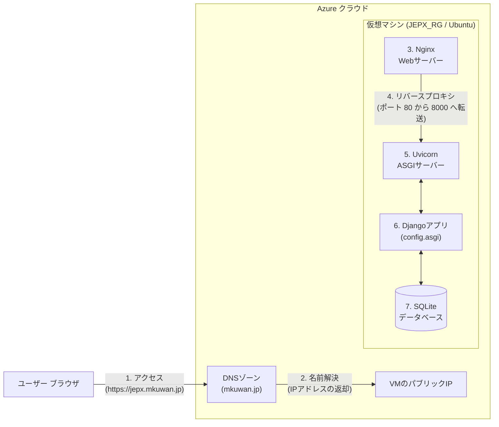
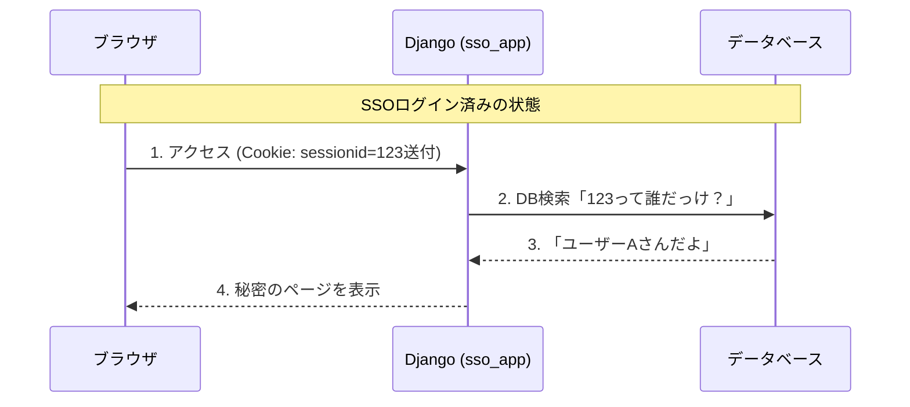
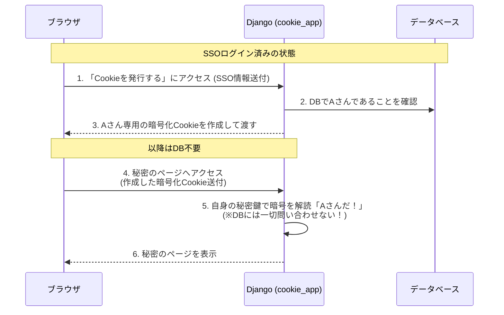
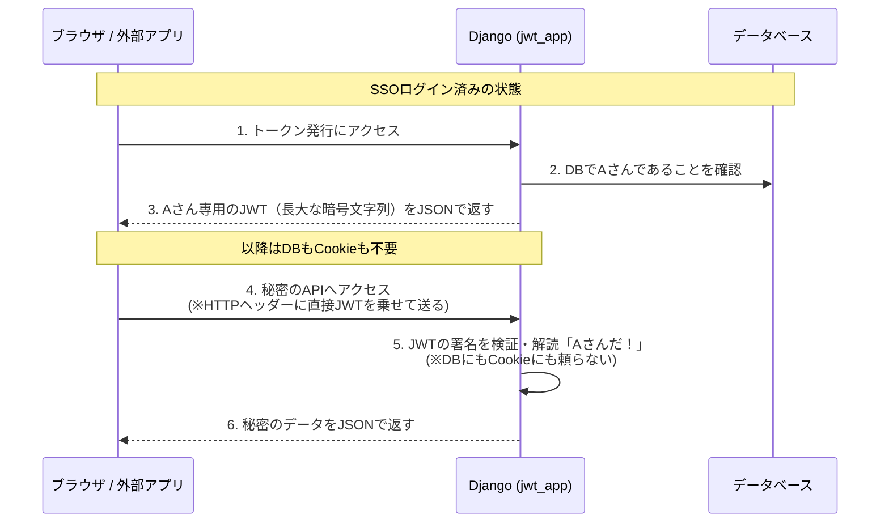

# Azure × Django (ASGI) Webアプリケーション構築 ハンズオントレーニング

本資料は、クラウド（Azure）上に新しくサーバー（仮想マシン）を立ち上げ、そこへPythonのWebフレームワークである「Django」を使ったアプリケーションを構築・公開するまでの手順を、初心者の方に向けて「なぜその作業が必要なのか」を一つひとつ丁寧に解説しながら進めるハンズオン（体験型）テキストです。

今回は、あらかじめ作成済みの以下リソースを利用・連携させます。
*   **リソースグループ**: `JEPX_RG`（サーバーなどを入れる箱）
*   **DNSゾーン**: `mkuwan.jp`（`rg-mk-system`内。今回はここに `jepx` という名前を追加します）

---

## 🎯 1. システム構成と技術要素の解説

まずは、これから作成するシステムがどのように動くのか、全体像を把握しましょう。



### 登場する技術・ツールの役割
1.  **Ubuntu (Linux OS)**: 今回作成するサーバーの基本ソフト（OS）です。Windowsとは異なり、主に黒い画面（ターミナル）でコマンドを入力して操作します。
2.  **Django (Python Webフレームワーク)**: Webサイトの裏側の仕組み（データベースとの連携や、画面の表示など）を簡単に作るためのPythonプログラムのセットです。
3.  **SQLite (データベース)**: Djangoに最初から組み込まれているデータベースです。別でデータベースサーバーを用意する必要がなく、1つのファイル（`db.sqlite3`）としてデータを保存するため、入門に最適です。
4.  **ASGI と Uvicorn**: 
    *   **ASGI** は、非同期処理（複数の通信を効率よく同時にさばく仕組み）に対応した、PythonのWebサーバーとWebアプリとをつなぐ新しいルール（規格）です。
    *   **Uvicorn** は、そのASGI規格に沿ってDjangoアプリを動かすための「アプリケーションサーバー（プログラム）」です。
5.  **Nginx (エンジンエックス)**: ホームページのデータを高速にユーザーへ返すための「Webサーバー」です。今回は、インターネットからの通信（HTTPS 443番ポート）を最初に受け取り、それを安全に後ろにいるUvicorn（8000番ポート）へ「橋渡し（リバースプロキシ）」する門番の役割を持たせます。
6.  **Let's Encrypt / Certbot**: Webサイトの通信を暗号化（HTTPS化）するための無料のSSL証明書を発行してくれるサービスと、それを自動設定してくれるツールです。

---

## 🚀 Step 1: Azure 仮想マシン (VM) の作成

プログラムを動かすための「OSが入ったまっさらなパソコン」をクラウド上に作成します。

### 1-1. VM作成画面へ移動する
1. Webブラウザで [Azure Portal (https://portal.azure.com)](https://portal.azure.com) にアクセスし、サインインします。
2. 画面上部の検索バーに「リソースグループ」と入力し、サービス一覧からクリックします。
3. すでに存在する **`JEPX_RG`** をクリックして中に入ります。
4. 左上にある **「＋ 作成」** をクリックし、表示された一覧から **「仮想マシン (Virtual Machine)」** の下にある「作成」ボタンをクリックします。

### 1-2. 「基本」タブの設定
仮想マシンの基礎スペックを決めます。以下のように設定してください。

*   **仮想マシン名**: `jepx-vm` （わかりやすい名前を入力します）
*   **地域 (リージョン)**: `Japan East` (東日本) を推奨します。物理的に日本にあるサーバーのほうが通信が速いためです。
*   **可用性オプション**: `インフラストラクチャ冗長は必要ありません` （学習用のため）
*   **セキュリティの種類**: `Standard`
*   **イメージ (OS)**: `Ubuntu Server 24.04 LTS - x64 Gen2` （または 22.04 LTS。LTSは長期サポート版の意味です）
*   **VM のアーキテクチャ**: `x64`
*   **サイズ**: `Standard_B1s` などの安価なサイズ（学習用なので、メモリ1GB程度の最小構成で十分動きます）。

**[管理者アカウント]**
サーバーを外部から操作するための「鍵付きの扉」を設定します。
*   **認証の種類**: `SSH 公開キー` （とても複雑な暗号キーを使った、安全な接続方法です）
*   **ユーザー名**: `azureuser` （この名前でサーバーにログインします）
*   **SSH 公開キーのソース**: `新しいキーのペアの生成`
*   **キーのペア名**: `jepx-vm-key` など、わかりやすい名前。

**[受信ポートの規則]**
インターネットからこのサーバーへ接続する際の「通り道（ポート）」を開放します。
*   **パブリック受信ポート**: `選択したポートを許可する`
*   **受信ポートの選択**: 以下の3つにチェックを入れます。
    *   **HTTP (80)**: 「HTTPS(443)にするなら不要では？」と思われるかもしれませんが、**必須です**。SSL証明書（Let's Encrypt）を無料で取得・更新する際の「身元確認（HTTP-01チャレンジ）」として使われるほか、間違ってhttpでアクセスしてきたユーザーを安全なhttpsへ自動転送するためにも開けておく必要があります。
    *   **HTTPS (443)**: 暗号化されたWebサイト用です。最終的にユーザーはこちらを通ります。
    *   **SSH (22)**: 今からあなたがサーバーを操作・設定するための自分専用の通り道です。

### 1-3. 作成とキーのダウンロード
1. 画面一番下の **「確認および作成」** をクリックします。
2. 入力内容の検証が行われ、「検証に成功しました」と表示されたら **「作成」** をクリックします。
3. **重要：** ここで **「新しいキーのペアの生成」** というポップアップ画面が出ます。必ず **「プライベート キーのダウンロードとリソースの作成」** をクリックしてください。
4. パソコンに **`jepx-vm-key.pem`** （または設定したキー名）というファイルがダウンロードされます。**これはサーバーの心臓部に触れるための「鍵」そのものです！無くしたり、他人に渡したりしないよう大切に保管してください。**

### 1-4. パブリックIPアドレスの確認
デプロイ（構築処理）が1〜2分で完了し、「デプロイが完了しました」という画面になります。
1. **「リソースに移動」** をクリックします。
2. 概要ページ右側にある **「パブリック IP アドレス」** の数字（例: `20.123.45.67`）をコピーして、メモ帳などに控えておいてください。これが、このサーバーの「インターネット上の住所」になります。

---

## 🌐 Step 2: 独自ドメイン (`jepx.mkuwan.jp`) の設定

現状では「IPアドレス（数字の羅列）」でしかサーバーにたどり着けません。人間が覚えやすいように、用意してあるドメイン（`mkuwan.jp`）の一部（サブドメインといいます）を、先ほどのIPアドレスに紐付けます。

1. Azure Portalの検索バーで再度「リソースグループ」を検索し、今度は **`rg-mk-system`** を開きます。
2. リソースの一覧から、種類が「DNSゾーン」となっている **`mkuwan.jp`** をクリックします。
    *   *※DNS (Domain Name System) とは、ドメイン名とIPアドレスを変換するインターネットの電話帳のような仕組みです。*
3. 画面上部の **「＋ レコード セット」** をクリックします。
4. 画面右側に設定パネルが出るので、以下のように入力します。
    *   **名前**: `jepx` （ドメインがmkuwan.jpなので、これで `jepx.mkuwan.jp` が出来上がります）
    *   **種類**: `A` （Aレコードとは、ドメイン名をそのままIPアドレスに変換する一番基本的なルールです）
    *   **エイリアスのレコードセット**: `いいえ`
    *   **TTL**: そのまま (1時間など)
    *   **IP アドレス**: Step 1でメモした **「VMのパブリックIPアドレス」** を貼り付けます。
5. 下部の **「保存 (OK)」** をクリックします。

設定がインターネット全体に反映されるまで数分〜数十分かかることがありますが、これで `http://jepx.mkuwan.jp` へアクセスすると、先ほど作ったサーバー宛に通信が向かうようになりました。

---

## 💻 Step 3: サーバー環境の基本構築 (SSH接続)

いよいよ、WindowsパソコンからAzure上のサーバー（Linux Ubuntu）に入って、中身を構築していきます。

### 3-1. PowerShell を開く
Windowsのスタートボタンを右クリック（または `Windowsキー + X`）し、**「ターミナル」** または **「Windows PowerShell」** を開きます。黒または青い画面が開きます。

### 3-2. 鍵ファイルがある場所に移動する
Step 1でダウンロードした `jepx-vm-key.pem` があるフォルダに移動します。通常はダウンロードフォルダにあります。ターミナルに以下を入力してEnterを押します。

```powershell
# ダウンロードフォルダへ移動するコマンド (cd = Change Directory)
cd ~\Downloads
```

### 3-3. SSHでサーバーに接続する
以下のコマンドを使って、安全にサーバーへ通信をつなぎます。IPアドレスの部分をご自身のメモ通りに書き換えてください。

```powershell
# 書式: ssh -i "鍵のファイル名" ユーザー名@サーバーのIPアドレス
ssh -i "jepx-vm-key.pem" azureuser@<Step1でメモしたパブリックIP>
```

初めて接続するサーバーの場合、以下のような英語の警告が出ます。
`The authenticity of host '20.123.45.67...' can't be established.`
`Are you sure you want to continue connecting (yes/no/[fingerprint])?`
これは「初めて接続する相手だけど、本当に信用して繋いでもいい？」という確認です。手動で **`yes`** と入力してEnterを押してください。

画面の先頭が `azureuser@jepx-vm:~$` のように変わったら、接続成功です！今あなたは、Azure上のサーバーの内部に入り込んでいます。

### 3-4. ソフトウェアのアップデートとインストール
ここからはLinux（Ubuntu）に対する命令（コマンド）です。
まずはサーバー内のソフトを最新にしてから、Djangoなどを動かすために必要な道具をインストールします。以下のコマンドを1行ずつコピー＆ペーストしてEnterを押してください。（ペーストはターミナル上で右クリックで可能です）

```bash
# 1. ソフトウェアの目次（リスト）を最新に更新する
sudo apt update

# 2. 目次を元に、古いソフトを最新版にアップグレードする (-y は途中の「本当に行う？」という確認を全てYesにする設定)
sudo apt upgrade -y

```bash
# 3. これから使う必要なソフトをインストールする
# - python3-venv: Pythonの「仮想環境」を作るためのツール
# - python3-pip: Pythonの拡張パッケージ（Djangoなど）をダウンロードするツール
# - nginx: Webサーバー
# - certbot, python3-certbot-nginx: HTTPS(SSL化)ツールとNginx連携プラグイン
sudo apt install python3-venv python3-pip nginx certbot python3-certbot-nginx -y
```
それぞれ数十秒〜数分処理が流れます。入力待ち（`azureuser@jepx-vm:~$`）に戻ったら完了です。

### 3-5. 搭載されているPythonバージョンの確認
Ubuntuには最初からPython環境が組み込まれています。OSのバージョンによって以下のようになります。
* **Ubuntu 24.04 LTS** の場合: **Python 3.12** 系
* **Ubuntu 22.04 LTS** の場合: **Python 3.10** 系

実際にどのバージョンが入っているか、以下のコマンドで確認してみましょう。

### 3-5. 搭載されているPythonバージョンの確認
Ubuntuには最初からPython環境が組み込まれています。OSのバージョンによって以下のようになります。
* **Ubuntu 24.04 LTS** の場合: **Python 3.12** 系
* **Ubuntu 22.04 LTS** の場合: **Python 3.10** 系

実際にどのバージョンが入っているか、以下のコマンドで確認してみましょう。

```bash
# 大文字の V でバージョンを確認します
python3 -V
```
`Python 3.12.3` のように表示されれば正常です。今後、仮想環境（venv）を作った際もこのバージョンがベースになります。

> [!NOTE]
> **「仮想マシンのPythonバージョンは変更しなくていいの？」**
> 結論から言うと、入門用のDjangoアプリを動かす程度であれば、**バージョンを変更する必要はありません**。
> 先ほど確認したバージョン（3.10 や 3.12）がそのまま使えます。
>
> **ローカルPC（Windows）とのバージョンの違いについて**:
> 手元のWindowsに入っているPythonが `3.11` で、Azure側が `3.12` のように「少しズレている」状態でも、基本的な機能はそのまま動きます。（Pythonは 3.x 台であれば互換性が高いためです）
> ただし、本格的な業務アプリを作る場合は「手元のPCに、あえてAzureと同じバージョン（3.12など）をインストールして開発する」のが、本番での予期せぬエラーを防ぐための一番安全なやり方（ベストプラクティス）になります。

---

## 💻 Step 4: ローカルPC (Windows) での Django アプリ開発

今回は、サーバー上でいきなりプログラムを書くのではなく、お手元の Windows パソコン（ローカル環境）で Django のひな形を作成し、それをサーバーへ転送（デプロイ）する本格的な開発フローを体験します。

### 4-1. Windows 側での準備
Windowsのスタートボタンを右クリックして **「ターミナル」** または **「PowerShell」** を開きます（※すでにサーバーにSSH接続している画面とは別に、新しく開いてください）。

デスクトップなど、わかりやすい場所に作業フォルダを作ります。

```powershell
# デスクトップに移動
cd ~\Desktop

# "jepx_local" というフォルダを作って中に入る
mkdir jepx_local
cd jepx_local
```

### 4-2. ローカルでの仮想環境作成とインストール
Windows側でもPythonの仮想環境を作り、Djangoなどのライブラリをインストールします。
（※WindowsにPython本体がインストールされている前提です）

```powershell
# "venv" という名前の仮想環境を作成
python -m venv venv

# 仮想環境を有効にする (WindowsのPowerShell用コマンド)
.\venv\Scripts\Activate.ps1
```
※エラーが出た場合、別途PowerShellの実行ポリシー変更（`Set-ExecutionPolicy -ExecutionPolicy RemoteSigned -Scope CurrentUser`）が必要なことがあります。

左端に `(venv)` と付けば成功です。続けてインストールします。

```powershell
# ピップ(pip)を使ってDjangoをインストール
pip install django
```

### 4-3. Djangoプロジェクトの作成
```powershell
# "config" という名前で、現在のフォルダ(".")にDjangoのひな形を作る
django-admin startproject config .

# データベースの初期化
python manage.py migrate
```
これで、Windowsのデスクトップに `config` フォルダや `manage.py` が作成されました。

### 4-4. `settings.py` の修正 (ドメイン許可設定)
Windows側で設定ファイル（`config/settings.py`）を開き、本番環境向けのアクセス許可を追加しておきましょう。
VS Codeなどのエディタ、またはメモ帳などで開いてください（`notepad config/settings.py` 等）。

`ALLOWED_HOSTS = []` を探し、以下のように書き換えて上書き保存します。

```python
ALLOWED_HOSTS = ['jepx.mkuwan.jp', '<VMのパブリックIPアドレス>', '127.0.0.1', 'localhost']

# NginxからのHTTPS通信を正しく認識するための設定
SECURE_PROXY_SSL_HEADER = ('HTTP_X_FORWARDED_PROTO', 'https')

# HTTPS化に伴い、Cookieのセキュア属性をオンにする
SESSION_COOKIE_SECURE = True
CSRF_COOKIE_SECURE = True
```

---

## 🚀 Step 5: ローカルからサーバーへの手動デプロイ（ファイル転送）

Windowsで作ったプログラム（`manage.py`, `db.sqlite3` と `config` フォルダ）を、Step3で準備したAzureサーバーへまるごとコピーします。
この作業を「手動デプロイ」と呼びます。

Windowsのターミナル（`jepx_local` フォルダ内）で、以下の **SCP (Secure Copy)** コマンドを実行します。
※ `<鍵のフルパス>` は `~\Downloads\jepx-vm-key.pem` など、鍵の場所を正確に指定してください。

```powershell
# venv フォルダなどはサーバー側で別途作るので、必要な本体だけを転送します

# 1. サーバー側に "learn-azure-app" フォルダを作成する指令を送る
ssh -i "<鍵のフルパス>" azureuser@<パブリックIP> "mkdir -p ~/learn-azure-app"

# 2. SCPコマンドを使って、必要なファイルとディレクトリをサーバーへ転送する
scp -i "<鍵のフルパス>" -r config manage.py db.sqlite3 azureuser@<パブリックIP>:~/learn-azure-app/
```
これでパスワード（鍵）を使った暗号化通信により、ファイルがAzureへ安全にコピーされました！

---

## 🐍 Step 6: サーバー側での Django 起動準備 (SSH接続内)

ここからは、**Step 3 でサーバーにSSH接続していた黒い画面（Ubuntuのターミナル）** に戻って作業します。

### 6-1. 転送されたファイルの確認と移動
```bash
# 転送先である learn-azure-app フォルダへ移動
cd ~/learn-azure-app

# 中身を確認 (config, manage.py 等があれば大成功！)
ls -l
```

### 6-2. サーバー側でのPython「仮想環境」の作成
Windowsで作った `venv` フォルダはOSが違うため使えません。Ubuntuサーバー側でも専用の仮想環境を作り直すのが鉄則です。

```bash
# "venv" という名前の仮想環境（小部屋）を作成する
python3 -m venv venv

# 作成した仮想環境を有効化（小部屋に入るコマンド）
# ※Windowsとはコマンドが少し違います
source venv/bin/activate
```
※成功すると、左端に `(venv)` が付きます。

### 6-3. サーバー側でのパッケージインストール
サーバー側（本番環境）では、Djangoに加えて、ASGIサーバーである「Uvicorn」が必要になります。

```bash
# 必要なライブラリをインストール
pip install django uvicorn
```
これで、Windowsから持ってきたDjangoアプリを、Azureサーバー上で動かす準備が整いました。

---

## ⚙️ Step 7: Uvicorn を常駐させる (Systemd サービス化)

現状では、アプリを起動しても、あなたがSSH接続を切った（パソコンの作業ウィンドウを閉じた）瞬間にアプリも止まってしまいます。
そうならないよう、サーバーの裏側（バックグラウンド）でアプリを24時間起動し続け、もしサーバーが再起動した際も自動で立ち上がるようにシステム（Systemd）に登録します。

### 7-1. サービスファイルの作成
Systemdに「jepxというサービスを動かしてね」と教えるための設定ファイルを作ります。`sudo` をつけて管理者権限で作成します。

```bash
sudo nano /etc/systemd/system/jepx.service
```

### 7-2. 設定の記述
エディタが開いたら、以下の内容をすべてコピーして貼り付けてください。

```ini
[Unit]
Description=Uvicorn server for JEPX Django App
After=network.target

[Service]
# プログラムを実行するユーザーを指定
User=azureuser
Group=www-data
# 作業するフォルダ（ディレクトリ）を指定
WorkingDirectory=/home/azureuser/learn-azure-app

# サービスが開始されたときに実行されるメインのコマンド
# 仮想環境(venv)の中のuvicornを直接指定して、config.asgiをポート8000で立ち上げます
ExecStart=/home/azureuser/learn-azure-app/venv/bin/uvicorn config.asgi:application --host 127.0.0.1 --port 8000

# もしプログラムがクラッシュして落ちても、自動的に再起動(Restart)させる設定
Restart=always

[Install]
WantedBy=multi-user.target
```

貼り付けたら、先ほどと同じく保存して閉じます。
（`Ctrl + O` => `Enter` => `Ctrl + X`）

### 7-3. サービスの起動と自動起動設定
設定ファイルを作っただけでは動きません。Systemdに「設定を追加したから読み直して、起動して」と命令します。

```bash
# 1. Systemdの設定をリロード（再読み込み）する
sudo systemctl daemon-reload

# 2. jepxサービスを今すぐ開始(start)させる
sudo systemctl start jepx

# 3. サーバーを再起動しても自動的(enable)に動き出すように設定する
sudo systemctl enable jepx
```

正しく裏側で起動できたか確認しましょう。

```bash
# ステータス状況を確認する
sudo systemctl status jepx
```
画面の真ん中あたりに、緑色の文字で **`Active: active (running)`** と表示されていれば大成功です！（確認モードから抜けるには、キーボードの **`q`** を押してください）。
これで、ポート「8000番」でDjangoアプリが待ち構えている状態になりました。

---

## 🚪 Step 8: Nginx (リバースプロキシ) の設定

Django(Uvicorn)はポート8000番で待っていますが、一般のユーザーがWebサイトを見るときはポート80番（HTTP）でアクセスしてきます。
そこで、「Webサーバー」のプロフェッショナルであるNginxを最前線の80番ポートに立たせ、ユーザーからのアクセスを受け止めてから、内部の8000番（Uvicorn）へ転送（リバースプロキシ）する設定を行います。

### 8-1. Nginx用 ドメインごとの設定ファイル作成
Nginxは複数のドメインをさばけるため、今回は `jepx` 用の専用ファイルを作ります。

```bash
sudo nano /etc/nginx/sites-available/jepx
```

### 8-2. 設定の記述 (HTTP受け口)
Certbot（SSL自動設定ツール）を使うため、最初はシンプルな「ポート80」で設定を作ります。後でCertbotが自動的にこのファイルを「ポート443 (HTTPS)」用に書き換えてくれます。
以下の内容を貼り付けてください。

```nginx
server {
    # ユーザーからのポート80(HTTP)の通信を待ち受ける設定
    listen 80;
    
    # どのドメイン宛のアクセスか判別するための設定
    server_name jepx.mkuwan.jp;

    location / {
        # 重要な部分：ここで受け取ったアクセスを内部の127.0.0.1(自分自身)のポート8000へ転送している
        proxy_pass http://127.0.0.1:8000;

        # 転送する際、誰(Host)宛てか、元のユーザーのIP(X-Real-IP)は何か等、情報のタグをつけてUvicorn側に教えてあげる設定
        proxy_set_header Host $host;
        proxy_set_header X-Real-IP $remote_addr;
        proxy_set_header X-Forwarded-For $proxy_add_x_forwarded_for;
        proxy_set_header X-Forwarded-Proto $scheme;
    }
}
```
保存して閉じます。（`Ctrl + O` => `Enter` => `Ctrl + X`）

### 8-3. 設定の有効化とNginxの再起動
Nginxには「利用可能な設定ファイル置き場 (sites-available)」と「現在有効な設定ファイル置き場 (sites-enabled)」があります。設定を有効にするには、enabled側に「ショートカット（シンボリックリンク）」を作成します。

```bash
# 1. 最初から入っている不要なデフォルト設定(80番ポート)を削除し、競合を防ぐ
sudo rm /etc/nginx/sites-enabled/default

# 2. 今作った設定を有効にするため、ショートカットを作成する(ln -s はリンク作成コマンド)
sudo ln -s /etc/nginx/sites-available/jepx /etc/nginx/sites-enabled/

# 3. 記述したNginxの設定ファイルにタイポ（書き間違い）等の文法エラーがないかチェックする
sudo nginx -t
```
`nginx -t` を実行して、
`nginx: configuration file /etc/nginx/nginx.conf test is successful` と出れば文法完璧です！

```bash
# 4. 問題なければ、設定を読ませるためにNginxを再起動する
sudo systemctl restart nginx
```

---

## 🔒 Step 9: SSL証明書の取得とHTTPS (ポート443) の設定

作成したWebサイトを安全に公開するため、「Let's Encrypt」という無料のサービスを使ってSSL証明書を取得し、通信を暗号化（HTTPS / ポート443）します。
Certbotというツールを使うと、Nginxの設定ファイル（ポート80の設定）を自動で読み取り、ポート443用に書き換えてくれます。

### 9-1. Certbot の実行
以下のコマンドを実行します。

```bash
# Nginx用のCertbotプラグインを実行し、SSL証明書を自動設定する
sudo certbot --nginx -d jepx.mkuwan.jp
```

### 9-2. 初期設定の入力
初回起動時はいくつかの情報入力を求められます。

1. **Enter email address (used for urgent renewal and security notices)**:
   自分自身のメールアドレスを入力し、`Enter` を押します。（証明書の更新期限などのお知らせ用です）
2. **Please read the Terms of Service... (A)gree/(C)ancel**:
   利用規約への同意です。「**`A`**」を押して `Enter`。
3. **Would you be willing... (Y)es/(N)o**:
   メーリングリストへの登録です。「**`N`**」を押して `Enter` で構いません。

少し待つと処理が進み、以下のメッセージが出れば成功です！
`Successfully deployed certificate for jepx.mkuwan.jp to /etc/nginx/sites-enabled/jepx`
`Congratulations! You have successfully enabled HTTPS on https://jepx.mkuwan.jp`

これだけで、Nginxは自動的にポート443で待ち受けるようになり、もしポート80でアクセスされた場合も安全なHTTPS（443）へ自動転送する設定に書き換えられました。

---

## 🎉 Step 10: Webブラウザで最終動作確認！

これですべての準備が整いました！
お手元のパソコンのWebブラウザ（ChromeやEdge、Safariなど）を開き、アドレスバーに以下のURLを入力してアクセスしてください。

👉 **`https://jepx.mkuwan.jp`**

画面にロケットが飛んでいくイラストと共に、
**「The install worked successfully! Congratulations!」**
というDjangoの初期歓迎ページが表示されたら、ハンズオンは大成功です！！！

### 通信がどう処理されたかのおさらい
今あなたがアクセスしてロケットの絵が出るまでの間、コンマ数秒の世界で以下が行われました。

1. あなたのブラウザが `jepx.mkuwan.jp` のIPを知るためDNSに問い合わせる（Step 2の設定）。
2. アジュール上のVM（IP）の443番ポートへ暗号化されて通信が飛ぶ（Step 1の設定）。
3. サーバーのNginxがそれを受け取り、「あ、証明書も合ってるし、このドメインなら8000番のUvicornさんへパスしよう」と判断する（Step 8, 9の設定）。
4. Uvicornが通信をASGI規格でDjangoに渡し、Djangoが「まだアプリがないから、とりあえずロケットの初期画面を返そう」と動き、逆の順序であなたのブラウザまで暗号化されたままレスポンスを返してきた（Step 6, 7の設定）。

これこそが、モダンでセキュアなWebアプリケーション構築の基礎となるアーキテクチャです。

---

## 🔐 応用編 Step 11: Microsoft Entra ID でのログイン機能追加

企業向けアプリケーションなどで必須となる、Microsoft Entra ID (旧 Azure AD) を使ったシングルサインオン (SSO) を Django に組み込む方法です。
今回は `social-auth-app-django` という有名なパッケージを使用します。

> [!NOTE]
> **仮想マシン作成時の「Microsoft Entra ID でログイン」とは違うの？**
> VM作成時のタブにあった該当項目は、「サーバーの管理者（あなた）が **SSH接続** する際にEntra IDを使う」ための機能（インフラの管理機能）です。
> ここで設定する Step 11 は、「**Webサイトを訪れた一般ユーザー** がブラウザからシステムを利用する際にEntra IDでログインする」ための機能（アプリケーションの機能）になります。両者は全く別のレイヤーで動いています。

### 11-1. Entra ID 側での「アプリの登録」
ローカルPCのブラウザで [Azure Portal](https://portal.azure.com) の **Microsoft Entra ID** 画面を開きます。
1. 左メニューから **「アプリの登録」** -> **「新規登録」** をクリックします。
2. **名前**: `JEPX Django App` など
3. **サポートされているアカウントの種類**: 要件に合わせます（この組織のディレクトリのみ 等）
4. **リダイレクト URI (Web)**: `https://jepx.mkuwan.jp/oauth/complete/azuread-tenant-oauth2/` と入力し **「登録」** をクリックします。

### 11-2. 認証情報の取得とシークレット作成
アプリが登録されると「概要」画面が出ます。
1. 以下の2つをメモします。
   * **アプリケーション (クライアント) ID**
   * **ディレクトリ (テナント) ID**
2. 左メニューの **「証明書とシークレット」** -> **「新しいクライアント シークレット」** を作成し、表示された **「値 (Secret)」** を必ずメモします。（※一度しか表示されません）

### 11-3. Django 側へのライブラリのインストール
**ローカルPC (Windows) のターミナル**に戻り、仮想環境 `(venv)` で以下を実行します。

```powershell
pip install social-auth-app-django
```

### 11-4. Django `settings.py` の設定追加
`config/settings.py` を開き、以下の設定を追記・変更します。

```python
# 1. INSTALLED_APPS に追加
INSTALLED_APPS = [
    # ... 既存のアプリ ...
    'social_django',  # これを追加
]

# 2. MIDDLEWARE に追加
MIDDLEWARE = [
    # ... 既存のミドルウェア ...
    'social_django.middleware.SocialAuthExceptionMiddleware', # サインインエラー制御
]

# 3. AUTHENTICATION_BACKENDS を追加 (ファイルの最後などでOK)
AUTHENTICATION_BACKENDS = (
    'social_core.backends.azuread_tenant.AzureADTenantOAuth2', # Entra ID用
    'django.contrib.auth.backends.ModelBackend',               # 通常のDjangoログイン用
)

# 4. Entra IDの認証情報 (11-2 でメモしたものに書き換えてください)
SOCIAL_AUTH_AZUREAD_TENANT_OAUTH2_KEY = 'あなたのクライアントID'
SOCIAL_AUTH_AZUREAD_TENANT_OAUTH2_SECRET = '作成したクライアントシークレット値'
SOCIAL_AUTH_AZUREAD_TENANT_OAUTH2_TENANT_ID = 'あなたのテナントID'

# 5. ログイン・ログアウト後の遷移先URL
LOGIN_URL = '/oauth/login/azuread-tenant-oauth2/'
LOGIN_REDIRECT_URL = '/'
LOGOUT_REDIRECT_URL = '/'
```

### 11-5. トップページの簡単な作成と URL ルーティングの追加
Entra ID でログイン成功後、Django は `LOGIN_REDIRECT_URL = '/'` の設定に従ってトップページ（`/`）へ戻ろうとします。しかし今の状態ではトップページが存在しないため、404エラー（Not Found）になってしまいます。

これを防ぎ、ログインに成功したことを確認するため、簡単なトップページを追加しましょう。

`config/urls.py` を開き、以下のように書き換えます（トップページ用の簡単な処理 `home` 関数もこの中に書いてしまいます）。

```python
from django.contrib import admin
from django.urls import path, include # include を追加
from django.http import HttpResponse  # これも追加
from django.contrib.auth import logout
from django.shortcuts import redirect

# ログアウト用の関数
def custom_logout(request):
    logout(request) # Djangoのセッションを破棄
    return redirect('/') # トップページに戻る

# 簡単なトップページ用の関数
def home(request):
    if request.user.is_authenticated:
        # ログインしている場合
        return HttpResponse(f"<h1>ログイン成功！</h1><p>ようこそ、{request.user.username} さん</p><p><a href='/logout/'>ログアウト</a></p>")
    else:
        # ログインしていない場合
        return HttpResponse('<h1>JEPX ホーム</h1><p><a href="/oauth/login/azuread-tenant-oauth2/">Entra ID でログイン</a></p>')

urlpatterns = [
    # トップページ (何もないパス '') の設定
    path('', home, name='home'),
    path('logout/', custom_logout, name='logout'), # ログアウトのURLを追加
    
    path('admin/', admin.site.urls),
    # Social Auth 用のURLを追加
    # これにより /oauth/login/... などが自動で利用可能になります
    path('oauth/', include('social_django.urls', namespace='social')),
]
```

### 11-6. データベースの更新と本番反映
ローカルでマイグレーションを作成します。

```powershell
python manage.py migrate
```

設定が終わったら、修正したコード（とインストール情報）をAzureサーバーへ反映させます。本来はGitなどを使いますが、今回は手動デプロイします。

```powershell
# Windowsターミナルから SCP で上書き転送
scp -i "<鍵のフルパス>" -r config manage.py db.sqlite3 azureuser@<パブリックIP>:~/learn-azure-app/
```

その後、**Azureサーバー側のターミナル(SSH)** に戻り、ライブラリを追加して再起動します。

```bash
cd ~/learn-azure-app
source venv/bin/activate
# サーバー側でもインストール
pip install social-auth-app-django

# サービスを再起動して設定を読み込ませる
sudo systemctl restart jepx
```

### 11-7. ログインして確認
ブラウザで直接以下のログイン用URLにアクセスしてみます。
👉 `https://jepx.mkuwan.jp/oauth/login/azuread-tenant-oauth2/`

見慣れた Microsoft のログイン画面に切り替わり、成功すると元の設定したページ（今回なら `/`）に戻ってくるはずです！これが出来れば、SSO連携は見事成功です。

---

## 🧠 技術解説: SSO連携とセッション管理の裏側

今回の SSO (シングルサインオン) がどのように裏側で連携し、なぜ「データベース」でセッション管理をしているのか、その仕組みと代替手段を解説します。

### 1. Entra ID と Django の連携フロー（DB管理の場合）

今回構築した `social-auth-app-django` と Entra ID によるログインは、一般的に **OAuth 2.0 / OpenID Connect** という世界標準の規格で動いています。

1. **ユーザーがログイン画面へ**: ユーザーが `Entra ID でログイン` をクリックすると、あらかじめ登録しておいた「クライアントID」を持って Microsoft (Entra ID) の画面に飛びます。
2. **Entra ID での認証**: MSの画面でID・パスワード（や多要素認証）を入れると、MS側が「この人は誰か」を認証します。
3. **Django への帰還（コールバック）**: 認証が成功すると、MSから Django のリダイレクトURI（今回の設定）へ特別な **「合言葉 (Authorization Code など)」** を持たせてユーザーを戻します。
4. **Django からの裏側通信**: Django サーバーは、受け取った合言葉と「クライアントシークレット」を持って、裏側（サーバー同士の通信）で再びMSへ問い合わせ、「アクセストークン」や「ユーザー情報（メアドや名前など）」をもらいます。
5. **DBへのユーザー登録（初回のみ）**: Django はもらったメアドなどを元に、自身のデータベース (`db.sqlite3` の `auth_user` テーブルと `social_auth_usersocialauth` テーブル) に「この人はこういう外部IDを持っているユーザーだ」と記録（自動作成）します。
6. **セッションの確立（DBへの記録）**: Django は「このユーザーのログイン状態（セッション）」を表すランダムな一意の **「セッションID (Session ID)」** を発行し、以下の2箇所に発行します。
   - **サーバー側**: DB内の `django_session` テーブルに「セッションID: XXXX は、ユーザーID: YYY のものである」と保存する。（これが "DBでセッション管理している" という状態です）
   - **ブラウザ側**: ユーザーのブラウザに Cookie（クッキー）として `sessionid=XXXX` という形で保存させる。
7. **その後のアクセス**: ユーザーがトップページなどを見るたびに、ブラウザは自動的に `sessionid=XXXX` というCookieをサーバーに送ります。Djangoは送られてきたIDを見て、**DBのセッション表と照らし合わせ**、「あ、この人は認証済みのユーザーYYYさんだな」と判断して画面を表示します。

このように、Entra ID の役割は「本人確認と最初の情報の受け渡し（玄関のパスポートチェック）」だけです。その後の「アプリケーション内を歩き回る許可証（セッション）」の管理は、Djangoと我々のデータベースが完全に引き継いで行っています。

### 2. もしデータベース（DB）を使わない構成にする場合の代替手段

Django のデフォルトは上記のような「DBセッション管理」ですが、大規模なシステムやAPIサーバーなどでは、毎アクセスDBに問い合わせると動作が重くなるため、他の手段をとることがあります。

#### 代替手段A: キャッシュサーバー (Redis / Memcached) に保存する
DB（ハードディスク/SSD）の代わりに、**Redis（レディス）** と呼ばれる「メモリ上で動く超高速なデータ置き場」にセッションIDを保存する方法です。
* **メリット**: 読み書きが圧倒的に速い。アクセスが激しいWebサービス（SNSやECサイトなど）の標準構成です。
* **デメリット**: 別途 Redis サーバーを構築・運用する手間が必要になります。
* **Djangoでの設定**: `SESSION_ENGINE = 'django.contrib.sessions.backends.cache'` と設定します。

#### 代替手段B: Cookie だけで完結させる（Cookie-based Session）
サーバー側のDBやRedisには一切データを記録せず、ブラウザに渡す Cookie の中に「私は誰々です」という情報自体を **強力に暗号化（改ざん防止）** して持たせる方法です。
* **メリット**: サーバー側に保存領域が不要なため、サーバーの負担が極めて軽い。
* **デメリット**: Cookieの容量制限（約4KB）があるため、カートの中身など多くの情報は持たせられない。
* **Djangoでの設定**: `SESSION_ENGINE = 'django.contrib.sessions.backends.signed_cookies'` と設定します。

#### 代替手段C: JWT (JSON Web Token) を使う ※API特化
フロントエンド（React/Vue/スマホアプリ等）とバックエンド（Django等）が完全に分離しているモダンなシステムでよく使われる手法です。サーバーは認証後「JWT」と呼ばれるデジタル署名付きのパスコードを発行し、そのままユーザーへ投げ返します。Cookieすら使わず、ブラウザやアプリ側がそのパスコードを自力で保持して通信に毎回くっつける方式です。
* **特徴**: 厳密にはセッション（状態管理）ではなく「ステートレス（状態を持たない）」な認証方式です。現在のモダンアプリ開発の主流の1つですが、Djangoの標準機能だけではできず、専用のライブラリ（`djangorestframework-simplejwt` など）が必要です。

入門としては現在の「小規模で安全に運用できるDBセッション管理」が最も確実ですので、今回のアーキテクチャはベストな選択です！

#### 💡 よくある疑問: 「アプリごとにSSOやJWTなどの認証方式を分けることは可能？」
結論から言いますと、**1つのDjangoプロジェクト内で、アプリ（やURL）ごとに認証方式を使い分けることは完全に可能**です。わざわざプロジェクトを分割する必要はありません。

Djangoの設計として、以下のように考え方が分かれています。
* **セッションの「保存先（DBかRedisか等）」**: これは `SESSION_ENGINE` として**プロジェクト全体（settings.py）で1つ**に決める必要があります。
* **セッションの「確認方法（認証方式）」**: これは**ビュー（URL）ごとに自由に設定**できます。

**【よくある実践的な構成例】**
1つのDjangoプロジェクト（`jepx_project`）の中に、2つのアプリを作ったとします。

1. **`web_app` (ブラウザで見る社内管理画面)**
   * **認証方式**: `SessionAuthentication`（今回構築したSSO連携）
   * **動き**: ユーザーがアクセスしたら、ブラウザのCookie（セッションID）を見て、DBのセッション情報と照らし合わせてログイン状態を確認する。
2. **`api_app` (スマホアプリや外部システムから呼ばれるAPI)**
   * **認証方式**: `JWTAuthentication` (ステートレス通信)
   * **動き**: 外部システムからのアクセスにはCookieを見ず、リクエストのヘッダーにくっついてくる「JWT（暗号化トークン）」だけを解読して本人確認をする。

このように、Django Rest Framework（DRF）などの拡張ライブラリを使えば、「このURL（アプリ）はCookieのセッションで認証する」「このURL（アプリ）はJWTで認証する」という風に、**URL（エンドポイント）単位で別々のガードマンを立たせる**ことができます。これがDjangoの拡張性の高さの1つです。

---

## 🔐 応用編 Step 12: Django 3つの認証方式（SSO・Cookie・JWT）実践チュートリアル

ここまでSSO（Entra ID連携）を完成させました。ここからはさらに進んで、同じDjangoプロジェクト内で**「3つの異なる認証方式」**を動かし、その裏側の違いを体感していただきます。

### 12-1. 今回の学習ゴール

1つのプロジェクト内に以下の3つのアプリ（機能を持ったフォルダ）を追加し、それぞれの動作の違いを確認します。

1. **`sso_app` (DBセッションあり)**
   - これまで設定してきた Entra ID の結果をそのまま利用する標準的なWebアプリ。
2. **`cookie_app` (DBセッションなし / ステートレスCookie)**
   - Djangoの標準セッション（DB）をあえて使わず、**「暗号化署名付きのCookie」** だけで本人確認を行う、サーバーに優しい自作の認証フローを体感します。
3. **`jwt_app` (DBセッションなし / JWT API)**
   - Cookieすら使わず、モバイルアプリや外部システムとの通信で使われる **JSON Web Token (JWT)** による API 認証を構築します。

---

### 12-2. アプリ（App）の作成と準備

まずはローカルPC (Windowsターミナル) で3つのアプリのひな形を作ります。

```powershell
# プロジェクトのルートディレクトリ (manage.py がある場所) で実行します
python manage.py startapp sso_app
python manage.py startapp cookie_app
python manage.py startapp jwt_app
```

これによって、3つの新しいフォルダが作成されます。

次に、Django に「この3つのアプリを使うよ」と教え、さらに JWT に必要な強力なライブラリ群をインストールします。

```powershell
pip install djangorestframework djangorestframework-simplejwt
```

`config/settings.py` の `INSTALLED_APPS` を以下のように修正します。

```python
INSTALLED_APPS = [
    'django.contrib.admin',
    'django.contrib.auth',
    'django.contrib.contenttypes',
    'django.contrib.sessions',
    'django.contrib.messages',
    'django.contrib.staticfiles',
    
    # 追加したライブラリ
    'social_django',
    'rest_framework',         # JWT用
    'rest_framework_simplejwt', # JWT用
    
    # 追加した自作アプリ
    'sso_app',
    'cookie_app',
    'jwt_app',
]
```

---

### 12-3. `sso_app` の構築 (DBセッションあり)

これは私たちが既に作った機能の延長です。Entra ID でログインしたユーザーだけが見られる特別なページを作ります。

**`sso_app/views.py`** に以下を記述します。
Djangoが用意している `@login_required` という便利な「ガードマン（デコレータ）」が、DBのセッションと照らし合わせてくれます。

```python
from django.http import HttpResponse
from django.contrib.auth.decorators import login_required

# @login_required をつけると、「（DBに登録された）セッションを持った人しか見れない」画面になる
@login_required
def sso_secret_page(request):
    return HttpResponse(f"""
        <h1>SSO 秘密のページ</h1>
        <p>こんにちは、{request.user.username} さん。</p>
        <p>あなたのセッション情報は、サーバーのデーターベース（django_sessionテーブル）で安全に管理されています。</p>
        <a href="/">トップに戻る</a>
    """)
```

---

### 12-4. `cookie_app` の構築 (DBセッションなし / 署名付きCookie)

次は、「サーバー側のDBにセッションを保存しない」方式を自作してみましょう。
Djangoの強力な暗号化機能（`get_cookie_signer`）を使って、ブラウザのCookieに直接ユーザー情報を埋め込みます。

**`cookie_app/views.py`** に以下を記述します。

```python
from django.http import HttpResponse
from django.core.signing import get_cookie_signer, BadSignature
from django.contrib.auth.decorators import login_required

# Cookie専用の署名ツール（settings.pyのSECRET_KEYと専用のSaltを使って強力な暗号化・復号化を行う）
# salt (塩) を指定することで、「この用途以外では絶対に解読できない」専用の暗号が作れます
signer = get_cookie_signer(salt='cookie_app_secret_salt')

@login_required # 大前提として、SSO（DBセッション）でログイン済みの人のみ実行可能
def cookie_login(request):
    """SSOの本人確認結果を利用して、独自に暗号化したCookieを発行する処理"""
    # SSOから取得したユーザー名を利用する
    raw_data = f"user_name:{request.user.username}"
    
    # データを暗号化（署名）する
    signed_data = signer.sign(raw_data)
    
    response = HttpResponse(f"""
        <h1>Cookie認証 ログイン（発行）成功</h1>
        <p>SSOのログイン情報を元に、あなたのブラウザに暗号化されたCookieを渡しました。Cookie用としてのDB記録は何もしていません。</p>
        <p>渡したデータ: {raw_data}</p>
        <a href="/cookie/secret/">Cookie専用の秘密のページへ</a>
    """)
    
    # ブラウザに "my_stateless_session" という名前で暗号化Cookieを保存させる
    response.set_cookie('my_stateless_session', signed_data)
    return response

def cookie_secret_page(request):
    """送られてきたCookieの暗号を解読して本人確認するページ（DBやSSO連携は一切見ない）"""
    signed_data = request.COOKIES.get('my_stateless_session')
    
    if not signed_data:
        return HttpResponse("Cookieがありません。先にCookieを発行してください。", status=401)
    
    try:
        # 暗号を解読する（改ざんされていればエラーになる）
        original_data = signer.unsign(signed_data)
        return HttpResponse(f"""
            <h1>Cookie 秘密のページ</h1>
            <p>認証成功！サーバーのDBには一切問い合わせていません。</p>
            <p>解読した中身: {original_data}</p>
            <a href="/">トップに戻る</a>
        """)
    except BadSignature:
        return HttpResponse("Cookieが改ざんされています！", status=403)
```

---

### 12-5. `jwt_app` の構築 (DBセッションなし / JWT・Cookie不使用)

最後に、現代のSPA（React/Vue）やスマホアプリ連携で必須となる JWT です。
これはCookieすら使わず、「通信のヘッダー」に長大な暗号化文字列（トークン）をくっつけてやり取りする方式です。

今回は `djangorestframework-simplejwt` という外部ライブラリにお任せします。

**`config/settings.py` の一番下** に以下を追記します。

```python
# Django Rest Framework のデフォルト認証プロバイダを JWT に変更
REST_FRAMEWORK = {
    'DEFAULT_AUTHENTICATION_CLASSES': (
        'rest_framework_simplejwt.authentication.JWTAuthentication',
    )
}
```

**`jwt_app/views.py`** に、API形式（JSONを返す）の秘密のページと、JWT発行機能を作ります。

```python
from django.http import JsonResponse
from django.contrib.auth.decorators import login_required
from rest_framework.response import Response
from rest_framework.decorators import api_view, permission_classes
from rest_framework.permissions import IsAuthenticated
from rest_framework_simplejwt.tokens import RefreshToken

# 1. SSOのログイン情報を元に、JWTトークンを発行する機能
@login_required # 大前提として、SSO（DBセッション）でログイン済みの人のみ実行可能
def jwt_generate_token(request):
    """SSOでログイン済みのユーザーに対し、外部API接続用のJWTを手動発行する"""
    # 現在SSOログインしているユーザー情報を元にJWTを作成
    refresh = RefreshToken.for_user(request.user)
    
    return JsonResponse({
        "message": "JWTの発行に成功しました！このトークンをAPIツールの Authorization ヘッダーに設定してください。",
        "user": request.user.username,
        "access_token": str(refresh.access_token),
        "refresh_token": str(refresh)
    })

# 2. JWTを持っている人だけがアクセスできるAPI
# IsAuthenticated によって、正しいJWTトークンを持った人しかアクセスできない（SSOのDBセッションは見ない）
@api_view(['GET'])
@permission_classes([IsAuthenticated])
def jwt_secret_api(request):
    return Response({
        "message": "JWT認証 成功！",
        "user_name": request.user.username,
        "detail": "このアクセスはCookieを使用しておらず、DBのセッション検索も行っていません（ステートレス）。"
    })
```

---

### 12-6. 全ての URL（道案内）をつなぐ

作成した3つのアプリの画面にブラウザからアクセスできるように、`config/urls.py` を書き換えます。

**`config/urls.py`**

```python
from django.contrib import admin
from django.urls import path, include
from django.http import HttpResponse
from django.contrib.auth import logout
from django.shortcuts import redirect

# 今回作った3つのアプリのビューを読み込む
from sso_app.views import sso_secret_page
from cookie_app.views import cookie_login, cookie_secret_page
from jwt_app.views import jwt_generate_token, jwt_secret_api

# ログアウト用の関数
def custom_logout(request):
    logout(request) # DjangoのDBセッションを破棄
    # ついでにCookie認証用のCookieも削除してあげる
    response = redirect('/')
    response.delete_cookie('my_stateless_session')
    return response

def home(request):
    if request.user.is_authenticated:
        return HttpResponse(f"""
            <h1>ログイン成功！</h1>
            <p>ようこそ、{request.user.username} さん</p>
            <p><a href='/logout/'>ログアウト</a></p>
            <hr>
            <h3>1. SSO (DBセッション) のテスト</h3>
            <ul><li><a href='/sso/secret/'>SSOの秘密のページへ</a></li></ul>
            
            <h3>2. Cookie (ステートレス) のテスト</h3>
            <p>※SSOログイン情報を元にCookieを発行し、以後はDBを見ずに認証します。</p>
            <ul>
                <li><a href='/cookie/login/'>Cookieを発行する</a></li>
                <li><a href='/cookie/secret/'>Cookieの秘密のページへ</a></li>
            </ul>
            
            <h3>3. JWT (API) のテスト</h3>
            <p>※SSOログイン情報を元にJWTを発行し、以後はDBを見ずに通信ヘッダーで認証します。</p>
            <ul>
                <li><a href='/api/jwt/generate/'>SSO情報からJWTを発行する</a></li>
                <li>(※APIの秘密のページにはブラウザから直接アクセスできません。後述)</li>
            </ul>
        """)
    else:
         return HttpResponse('<h1>JEPX ホーム</h1><p><a href="/oauth/login/azuread-tenant-oauth2/">Entra ID でログイン</a></p>')

urlpatterns = [
    path('', home, name='home'),
    path('logout/', custom_logout, name='logout'),
    path('admin/', admin.site.urls),
    path('oauth/', include('social_django.urls', namespace='social')),
    
    # 1. SSO アプリのURL
    path('sso/secret/', sso_secret_page),
    
    # 2. Cookie アプリのURL
    path('cookie/login/', cookie_login),
    path('cookie/secret/', cookie_secret_page),
    
    # 3. JWT アプリのURL
    path('api/jwt/generate/', jwt_generate_token), # SSOユーザー用JWT発行URL
    path('api/jwt/secret/', jwt_secret_api),
]
```

---

### 12-7. 動作確認とまとめ

これまでと同様、変更したファイルをAzureサーバーへ転送し、Nginx(Djagno)を再起動します。
今回は新しくインストールしたJWTライブラリがあるため、サーバー側で `pip install` も必要です。

```powershell
# 1. Windowsからフォルダ丸ごと転送
scp -i "<鍵ファイル>" -r config sso_app cookie_app jwt_app manage.py azureuser@<IPアドレス>:~/learn-azure-app/

scp -i "./.key/jepx-vm_key.pem" -r config cookie_app jwt_app sso_app manage.py db.sqlite3 requirements.txt azureuser@20.89.16.112:~/learn-azure-app/

# 2. サーバー側での作業 (SSH接続後)
cd ~/learn-azure-app
source venv/bin/activate
pip install djangorestframework djangorestframework-simplejwt

sudo systemctl restart jepx
```

#### 結果はどうなる？（ブラウザでの体感）とそれぞれの仕組み

今回の3つのアプリは、それぞれ裏側で以下のようなデータのやり取り（フロー）を行っています。

##### 1. `sso_app` (DBセッション通信)
一番標準的で安全。サーバー側のDBに「誰がログイン中か」をしっかり記憶しておく方式です。



##### 2. `cookie_app` (ステートレスCookie通信)
サーバー側のDBへのアクセスを減らし、高速化を図る方式。代わりにブラウザ自身に暗号化した身分証を持たせます。



##### 3. `jwt_app` (ステートレスAPI通信)
Cookieスラ使わない、完全独立型。スマホアプリや外部システムとのAPI通信に最適です。



これらの違いをふまえて、ブラウザでトップページを開き、ログインした状態でリンクを踏んでみてください。

1. **SSOの秘密のページ**
   * フロー図のように、普通に見れます。強力で安全です。
2. **Cookieの秘密のページ**
   * 最初に「Cookieを発行する」を押すと、あなたのSSOアカウント名を埋め込んだ独自の暗号化Cookieがブラウザに付与されます（図の1〜3）。
   * その後、Cookieの秘密のページ（図の4）を見ることができます。DBが介入していないため、万が一DBのセッションが消えても、ブラウザの暗号化Cookieの有効期限内はログインを継続できるといった柔軟な運用が可能になります。
3. **JWTの秘密のページ (API)**
   * 先に「SSO情報からJWTを発行する」を押すと、あなたのSSOアカウントに紐づいたJWTトークンが画面にJSONで表示されます（図の1〜3）。
   * ブラウザから `https://jepx.mkuwan.jp/api/jwt/secret/` へ直接アクセスすると **エラーになります**。
   * なぜなら、API通信（図の4）ではブラウザの自動機能であるCookieを使わないため、認証情報が届かないからです。認証を通すには、Postmanなどの開発ツールやプログラムからの通信を使って、発行された `access_token` を手動で通信ヘッダーに乗せて送る必要があります。

**【結論】**
このように、「ログイン（玄関の鍵開け）は必ず強力なSSOの仕組みを使いつつ、アプリ内での滞在証明（各部屋のパスカード）は必要に応じて高速なCookieやJWTに切り替える」ことができるのが、モダンで拡張性の高いアプリケーション開発の面白いところです！

#### 💡 [上級コラム] 今回のSSOフローは「完全なステートレス」ではない？

上の図をよく見ると、Cookieを発行する際やJWTを発行する際（図の1〜3）において、「結局一度はDjangoのデータベース(DB)を見に行っている」ことにお気づきかもしれません。「それならSSOでもDBに依存しているのでは？完全なステートレスにはできないの？」という疑問が湧いた方は、**アーキテクトとして非常に鋭く、素晴らしい視点を持っています。**

その通り、今回のハンズオンの構成は **「入り口（ログイン）はステートフル（DB依存）、入った後（各アプリ）はステートレス（DB非依存）」** というハイブリッドな手法をとっています。

では、**「入り口のSSOも含めて、完全にDBを一切作らずにステートレス化」** することは可能かというと、**技術的には完全に可能**です。

**【完全ステートレスなSSOアーキテクチャの例（SPA構成）】**
もし、フロントエンドをReactやVueで作った「シングルページアプリ（SPA）」と、バックエンドの「Django APIサーバー」を完全に分離した場合、以下のようなフローになります。

1. **DB見ない**: ユーザーはDjangoではなく、Reactアプリ（ブラウザ上）から直接 Entra ID へログインしに行きます。
2. **DB見ない**: Entra ID はログイン成功の証として、**Entra ID自身が発行したデジタル署名付きのJWT（IDトークンやアクセストークン）** をReactアプリへ直接渡します。
3. **DB見ない**: Reactアプリは、Django(API)へ通信する際、その「Entra IDが作ったJWT」をそのままHTTPヘッダーにくっつけて送ります。
4. **DB見ない**: Djangoは受け取ったJWTの暗号署名を見て、「なるほど、これは確かにMicrosoft(Entra ID)が発行した本物のパスポートだ」と数学的に検証・解読し、本人確認を完結させます。Django内にそのユーザーが登録されているか（DBにいるか）は一切確認しません。

これが真の **「完全ステートレス（サーバー側にDBや状態を持たない）SSO認証」** です。スマホアプリやモダンなWebシステムでは、この方式が主流になりつつあります。

しかし、今回のハンズオンのような**「Django自身がHTML画面を作る（サーバーサイドレンダリング）」ような伝統的なWebアプリを作る場合**は、フレームワークの仕組み上、入り口で一度ユーザーを自身のデータベース（`auth_user`テーブル等）に同期（ステートフル化）してしまった方が、その後の権限管理（「この人は管理者か？」等の設定）などが圧倒的に楽になるため、今回のような構成（入り口はDB、内部でCookie/JWT発行）がベストプラクティスとして採用されています。

---

## 📚 さらに先のステップへ (Next Action)

無事に動く基盤がセキュアな状態（HTTPS）で完成し、モダンなAPI認証の概念までカバーできました。ここからがWeb開発の本当のスタートです！
今後は以下のようなことに挑戦してアプリをリッチにしていきましょう。

1. **アプリ機能の開発**:
   - `models.py` を使ってデータベース設計を行い、画面から入力されたデータを保存・表示する機能を実際に作ってみましょう。
2. **静的ファイル（CSSや画像など）の配信設定**:
   - DjangoはHTMLを作るのは得意ですが、画像やCSSファイル（静的ファイル）をユーザーに返すのは少し苦手です。Nginx側に「画像フォルダのアクセスが来たら、Djangoを通さずに直接高速で返してね」という設定（STATIC設定）を追加する必要があります。

まずはここまでの構築、大変お疲れ様でした！分からないことがあれば、いつでも質問しにきてください。
