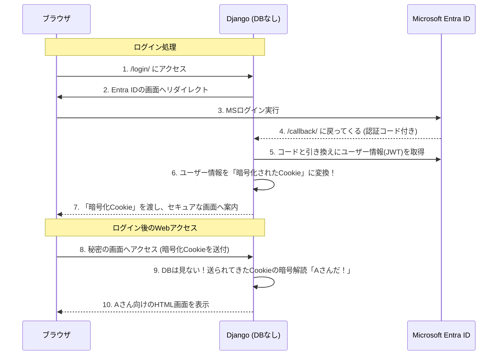

# 🚀 完全ステートレス！DBを使わないWebサーバー構築編（Django単体）

本チュートリアルでは、**ReactなどのSPA（フロントエンド）を使わず、Django単体でHTML画面を表示しつつも、データベース（DB）を一切使わない（完全ステートレスな）Webアプリケーション** を構築します。

「ユーザーがログインしている」という状態（セッション）を、**サーバーのDBではなく、暗号化してブラウザのCookieに全て預ける** というアプローチ（`signed_cookies` 方式）をとることで、Django単体でもDB不要のアーキテクチャを実現可能です。

---

## 🎯 今回の学習ゴール

* Django単体で**DBなし**の完全ステートレスなWebサーバーを起動する。
* OAuth2連携ライブラリ（`Authlib`）を使って、Entra IDのログイン画面へ直接リダイレクトする仕組みを作る。
* Entra IDから得たユーザー情報を、DBに保存せず「暗号化Cookie」に閉じ込めて持ち回る（セッション管理のステートレス化）方法を学ぶ。



---

## 🛠️ Step 1: 新規プロジェクトの準備

これまでのプロジェクトとは完全に分けるため、新しいフォルダ（例: `jepx_nodatabase`）を作成して作業します。

```powershell
# 新しいフォルダを作成して入る
cd ~\Desktop
mkdir jepx_nodatabase
cd jepx_nodatabase

# 仮想環境を作成して有効化
python -m venv venv
.\venv\Scripts\Activate.ps1
```

今回必要なライブラリをインストールします。Djangoのほかに、API通信用の `requests`、OAuth2連携を自作するための `Authlib`、そして発展編でJWTを自力デコードするための `PyJWT[crypto]` を使います。

```powershell
pip install django requests authlib "PyJWT[crypto]"
```

Djangoプロジェクトと、アプリケーションを作成します。

```powershell
django-admin startproject config .
python manage.py startapp web_app
```

---

## 🗑️ Step 2: データベースの「完全無効化」と「Cookieセッション」の設定

**`config/settings.py`** を開き、DB機能を完全に無効化し、セッション（記憶）の保存先を**「DB」から「ブラウザのCookieそのもの」**に変更します。

### 1. INSTALLED_APPS の大掃除
DBが必要な機能（`admin`, `auth` 等）を消し、Cookieセッション機能（`sessions`）だけは残します。

```python
# 【変更後】
INSTALLED_APPS = [
    'django.contrib.sessions', # セッション機能そのものは残す (ただし保存先は次でCookieに変更する)
    'django.contrib.messages',
    'django.contrib.staticfiles',
    'web_app', # 今作ったアプリ
]
```

### 2. MIDDLEWARE のお掃除
認証（`AuthenticationMiddleware`）はDB（`auth_user`テーブル）を見に行くため削除します。

```python
# 【変更後】
MIDDLEWARE = [
    'django.middleware.security.SecurityMiddleware',
    'django.contrib.sessions.middleware.SessionMiddleware', # セッションを読み書きするミドルウェア
    'django.middleware.common.CommonMiddleware',
    'django.middleware.csrf.CsrfViewMiddleware',
    'django.contrib.messages.middleware.MessageMiddleware',
    'django.middleware.clickjacking.XFrameOptionsMiddleware',
]
```

### 3. 【重要】 データベース無効化とCookieセッション化

設定ファイルの末尾などに、以下の3セットを記述します。

```python
# ① データベースを完全に空っぽにする（マイグレーション不要になる）
DATABASES = {}

# ② 【超重要】ユーザーのアクセス状態（セッションデータ）の保存先を、
# （標準のDBではなく）「暗号化してブラウザのCookieに保存する」方式に変更する！
SESSION_ENGINE = "django.contrib.sessions.backends.signed_cookies"

# ③ Entra IDの連携情報を環境変数（またはここに直接）書く
ENTRA_TENANT_ID = 'あなたのテナントID(ディレクトリID)'
ENTRA_CLIENT_ID = 'あなたのクライアントID(アプリケーションID)'
ENTRA_CLIENT_SECRET = 'あなたのクライアントシークレット(値)'
```

### 4. TEMPLATES (画面描画) 設定のクリーンアップ

DjangoのHTML描画機能（TEMPLATES）は、初期設定で「画面を開くたびに `request.user` をDBから探して渡す」という処理（`context_processors.auth`）がオンになっています。DBを消した今回はこれがエラーの原因になるため、この1行だけを削除します。

`settings.py` の `TEMPLATES` ブロックを探し、`OPTIONS` -> `context_processors` の中にある `django.contrib.auth.context_processors.auth` という行を削除（またはコメントアウト）してください。

```python
# 【変更前】
TEMPLATES = [
    {
        'BACKEND': 'django.template.backends.django.DjangoTemplates',
        'DIRS': [],
        'APP_DIRS': True,
        'OPTIONS': {
            'context_processors': [
                'django.template.context_processors.debug',
                'django.template.context_processors.request',
                'django.contrib.auth.context_processors.auth', # ← ★これを削除します！
                'django.contrib.messages.context_processors.messages',
            ],
        },
    },
]

# 【変更後】
TEMPLATES = [
    {
        'BACKEND': 'django.template.backends.django.DjangoTemplates',
        'DIRS': [],
        'APP_DIRS': True,
        'OPTIONS': {
            'context_processors': [
                'django.template.context_processors.debug',
                'django.template.context_processors.request',
                'django.contrib.messages.context_processors.messages',
            ],
        },
    },
]
```

これで、Djangoは **「自分の手元(DB)には一切状態を持たず、全てのログイン情報を暗号化Cookieとしてブラウザに押し付ける」** ステートレスなサーバーに変身しました！

---

## 🔑 Step 3: Authlib を使ったログイン処理（Views）

Entra IDのログイン画面へ飛ばす処理（`/login`）と、戻ってきたらトークンを受け取ってユーザー情報を読み取る処理（`/callback`）を手動で作ります。

**【超重要: Entra ID側の事前準備】**
ローカル開発サーバー（`runserver`）でテストを行う前に、**必ず**Azure Portalの「アプリの登録」→「認証」から、以下の「リダイレクト URI」を追加しておいてください。
* `http://127.0.0.1:8000/callback/`
* `http://localhost:8000/callback/`
これを忘れると、ログイン後に「URIが一致しない (`AADSTS50011`)」というエラーで弾かれます。

**`web_app/views.py`** に以下を記述します。

```python
import json
from django.shortcuts import render, redirect
from django.conf import settings
from authlib.integrations.django_client import OAuth

# --- Authlib (OAuthクライアント)の初期設定 ---
oauth = OAuth()

oauth.register(
    name='microsoft',
    client_id=settings.ENTRA_CLIENT_ID,
    client_secret=settings.ENTRA_CLIENT_SECRET,
    server_metadata_url=f'https://login.microsoftonline.com/{settings.ENTRA_TENANT_ID}/v2.0/.well-known/openid-configuration',
    client_kwargs={'scope': 'openid email profile'}
)

# --- View関数（画面の処理） ---

def home(request):
    """トップページ（DBもセッションも不要）"""
    
    # セッション(Cookie)の中に 'user' という情報が入っているかを自力でチェック
    user = request.session.get('user')
    
    return render(request, 'home.html', {'user': user})


def login(request):
    """「ログインする」ボタンを押したときの処理（EntraID画面へ飛ばす）"""
    
    # コールバック（処理後に戻ってくる）URLを指定してリダイレクト
    # ※本番では https://~ にする必要があります
    redirect_uri = request.build_absolute_uri('/callback/')
    return oauth.microsoft.authorize_redirect(request, redirect_uri)


def auth_callback(request):
    """EntraIDから戻ってきたときの受取窓口"""
    
    # 1. 戻ってきた暗号（Code）を引き換えに、EntraIDから「アクセストークン」と「ユーザー情報」を受け取る
    token = oauth.microsoft.authorize_access_token(request)
    
    # 2. トークンの中に入っているユーザー情報（名前やメールアドレス）を取り出す
    # ※ Authlibが内部でJWTの署名検証（本物かどうかの解読）を自動で行ってくれます！
    userinfo = token.get('userinfo')
    
    if userinfo:
        # 3. 【ここが魔法のステートレス】
        # DB(auth_user)にユーザーを保存するのではなく、Djangoの session 機能を使って
        # 取得したユーザー情報を丸ごと「暗号化Cookie」に圧縮してブラウザに突き返す！
        request.session['user'] = {
            'name': userinfo.get('name'),
            'email': userinfo.get('preferred_username', ''),
        }
        
    return redirect('/')


def logout(request):
    """ログアウト処理"""
    
    # セッション情報（Cookieの中身のユーザー情報）を空っぽにして破棄
    request.session.flush()
    return redirect('/')
```

---

## 🎨 Step 4: HTMLテンプレートの作成

表示用の画面 (`home.html`) を作ります。
アプリの中に `templates` フォルダを作り、その中に `home.html` を保存します。（`web_app/templates/home.html`）

```html
<!DOCTYPE html>
<html lang="ja">
<head>
    <meta charset="UTF-8">
    <title>完全ステートレス Django Webアプリ</title>
</head>
<body style="font-family: sans-serif; padding: 2rem;">
    <h1>DBを使わない完全ステートレス認証（Django単体）</h1>
    <hr>
    
    
        <!-- Cookieの中に 'user' 情報が復号化できた場合（ログイン中） -->
        <div style="background-color: #e8f5e9; padding: 1rem; border-radius: 8px;">
            <h2>ログイン成功！</h2>
            <p>ようこそ、<strong>{{ user.name }}</strong> さん！</p>
            <p>メールアドレス: {{ user.email }}</p>
            <p style="color: dimgray; font-size: 0.9em;">※このユーザー情報は、サーバーのDBではなく、あなたのブラウザのCookie（暗号化済み）から読み取られています。</p>
            <br>
            <a href="/logout/" style="padding: 10px 20px; background-color: #f44336; color: white; text-decoration: none; border-radius: 4px;">ログアウト</a>
        </div>
    
        <!-- Cookieの中に情報がない場合（未ログイン） -->
        <div style="background-color: #fff3e0; padding: 1rem; border-radius: 8px;">
            <p>あなたはまだログインしていません。</p>
            <p>※以下のボタンを押すとMicrosoft Entra IDの画面に飛びます。</p>
            <br>
            <a href="/login/" style="padding: 10px 20px; background-color: #2196F3; color: white; text-decoration: none; border-radius: 4px;">Entra ID でログイン</a>
        </div>
    
</body>
</html>
```

---

## 🔗 Step 5: URLの紐付け・起動

最後に、作った4つの関数をURLとして公開します。
**【超重要】** ここで、初期から記述されている `from django.contrib import admin` や `path('admin/', admin.site.urls)` は**絶対に削除**してください。管理画面はDB（UserやContentType）に強く依存しているため、残っていると `ContentType` のエラーで起動できなくなります。

**`config/urls.py` （※中身を以下でまるごと上書きしてください）**
```python
from django.urls import path
from web_app.views import home, login, auth_callback, logout

urlpatterns = [
    path('', home, name='home'),
    path('login/', login, name='login'),
    path('callback/', auth_callback, name='callback'),
    path('logout/', logout, name='logout'),
]
```

設定はこれで**すべて完了**です！マイグレーション（`manage.py migrate`）は一切不要です！

```powershell
python manage.py runserver
```

ブラウザで `http://127.0.0.1:8000/` にアクセスし、ログインボタンを押してみてください。Entra ID経由で認証され、見事に画面上にあなたの名前が表示されるはずです。

### 仕組みの解説
ログイン成功後、ブラウザの開発者ツールなどを開いて Cookie（`sessionid`）を確認してみてください。
通常のDjangoでは、このCookieの中には「ランダムな英数字（DBの整理券番号）」しか入っていませんが、今回の構成では **「このCookie自体の暗号を解読すると、その中にユーザーの名前やメールアドレスがそのまま入っている」** ようになっています。
（※もちろん `settings.py` の `SECRET_KEY` で暗号化・署名されているため、ユーザーが勝手に中身を書き換えて「私は社長です」などと改ざんすることは不可能です）

### なぜこの構成が素晴らしいのか？
前述のAPIベース（Reactとの分離）だけでなく、「Django単体で完結するHTMLアプリ」においても、この手裏剣のような「暗号化Cookieセッション（`signed_cookies`）」を使うことで、**「DBがなくてもログイン機能を実装できる」** ことが証明されました。
ユーザー管理DBの運用負荷をなくしつつ、サクッと社内ツールを作りたい場合などに、最強のアーキテクチャとなります！

---

## 🍪 発展編: 今の設定はCookie？JWTを使うパターンは？

**Q. 今作った「DBを使わないWebサーバー構築編」はCookieを使っているのですか？**

**A. はい、使っています！**
`settings.py` の `SESSION_ENGINE = "django.contrib.sessions.backends.signed_cookies"` という設定がその正体です。
この設定により、`request.session['user'] = ...` と書いた瞬間に、Djangoはユーザー情報を暗号化・署名し、**ブラウザのCookie（通常は `sessionid` という名前）に直接保存** します。
ブラウザは次回以降のアクセスで自動的に（サーバー側に隠れて）このCookieを送ってくるため、サーバー側はDBを見なくても「あ、Aさんだ」と復号化して認識できる仕組みです。


**Q. Django単体構成（React不使用）で JWT を使うパターンはありますか？**

**A. あります！ セッション機能を完全に捨てて、JWTを直接Cookieに乗せて自力で検証するパターンが定石です。**

**（補足: JWTをsessionに入れることも「技術的には可能」ですが…）**
誤解のないよう補足しますと、`request.session['jwt'] = raw_jwt` のように、**Djangoのセッションの中にJWT文字列を保存して使うこと自体は設計として全く問題なく可能**です。
しかし、あえてDjango単体のプロジェクトにおいて「JWT」を採用する最大の理由は、**「Django以外のサーバー（GoやNode.jsで作られた別のAPIなど）でも、同じCookieを読み取って認証を共通化したいから」** であることがほとんどです。

Djangoの `request.session` を使って暗号化してしまうと、そのCookieは「Django独自の暗号化ルール（秘密鍵）」で包まれてしまうため、**Go言語などの他言語サーバーがそのCookieを見ても中身のJWTを取り出せなくなってしまいます**。
そのため、JWTの強みである「他システムとの認証共通化」を活かす場合は、「DjangoのSession機能に包まず、生のJWTを直接Cookieに書き込む」という設計が一般的なのです。

ReactなどのSPAであればHTTPヘッダー（`Authorization: Bearer ...`）にJWTを載せて送るのが普通ですが、「Django単体（HTMLとブラウザ間の通信）」の場合、**ブラウザはページを切り替えるたびに自動的にJWTヘッダーを付けてくれない**ため、**実質的にCookieという「入れ物」の中に生のJWTを直接入れて運搬する**のが定石となります。

**JWTパターンの実装イメージ (Django単体版):**

**① コールバック時の保存処理 (views.py)**
Entra IDから受け取った生（なま）のJWT文字列（`token['id_token']`など）を、そのままCookieとしてブラウザに渡します。

```python
def auth_callback(request):
    token = oauth.microsoft.authorize_access_token(request)
    raw_jwt = token.get('id_token') # EntraIDから発行されたJWTそのもの
    
    response = redirect('/')
    # Djangoのsessionを使わず、自分でレスポンスに直接Cookie(JWT)をセット！
    response.set_cookie(
        'my_jwt_token', 
        raw_jwt, 
        httponly=True,  # JavaScriptから盗まれないようにする必須設定
        secure=True     # HTTPS通信時のみ送信
    )
    return response
```

**② 画面表示時の検証処理 (views.py または カスタムデコレータ)**
ユーザーが画面にアクセスしてきた際、ブラウザが自動送信してくる `my_jwt_token` （Cookie）を受け取り、自力で暗号解読して本人確認を行います。

この時、JWTの署名が「本当にMicrosoft（Entra ID）が発行したものか」を検証するためには、**Microsoftの公開鍵（Public Key）**が必要です。
Microsoftの公開鍵は定期的に変更されるため、ハードコードするのではなく、**Microsoftの公開URL(`JWKS` という仕組み)からその都度（あるいはキャッシュして）取得する** のが正しいやり方です。

```python
import jwt as pyjwt # ★名前衝突を避けるため別名にする
from jwt import PyJWKClient
from django.shortcuts import render, redirect
from django.conf import settings # ★環境変数やsettings.pyの値を読み込むため

# Microsoftの公開鍵一覧(JWKS)が置かれているURL
JWKS_URL = f'https://login.microsoftonline.com/{settings.ENTRA_TENANT_ID}/discovery/v2.0/keys'
jwks_client = PyJWKClient(JWKS_URL)

def home(request):
    # Cookieから生のJWT文字列を取り出す
    token = request.COOKIES.get('my_jwt_token')
    
    user = None
    if token:
        try:
            # 1. JWTのヘッダー情報から、使われている鍵のID(kid)を取り出し、
            #    MicrosoftのJWKS URLにアクセスして対応する「公開鍵」を動的に取得する！
            signing_key = jwks_client.get_signing_key_from_jwt(token)
            public_key = signing_key.key
            
            # 2. 取得した公開鍵を使って、JWTの署名を検証＆復号化
            decoded_payload = pyjwt.decode( # ★pyjwtを使う
                token,
                public_key,
                algorithms=['RS256'],
                audience=settings.ENTRA_CLIENT_ID,
                issuer=f'https://login.microsoftonline.com/{settings.ENTRA_TENANT_ID}/v2.0'
            )
            # 3. 偽造されていなければ、名前とメールアドレスを取り出す
            user = {
                'name': decoded_payload.get('name'),
                'email': decoded_payload.get('preferred_username')
            }
        except Exception as e:
            # トークンが不正、期限切れ、署名が合わない、またはパースエラー
            print(f"JWT Validation Error: {e}") 
            
    return render(request, 'home.html', {'user': user})
```

この「JWT × Cookie」パターンの場合、Djangoフレームワークが提供する `sessions` 関連のミドルウェアすら不要になります（さらに純粋なステートレスになります）。
「認証をバックエンドのAPIサーバー群（Go言語など）と完全共通化・一元化したい」場合などには、この仕組みが絶大な威力を発揮します。

---

## 🚀 Step 6: Uvicornでの起動とAzure本番デプロイ

開発サーバー（`runserver`）ではなく、実際の運用に耐えうる非同期サーバー（Uvicorn）での起動方法と、Azure環境（`jepx-nodb.mkuwan.jp`）へのデプロイ手順を解説します。

### 1. Uvicornの導入と起動テスト

Uvicornをインストールし、ローカルで起動できるかテストします。

```powershell
pip install uvicorn
# 開発サーバーの代わりにUvicornで起動（ASGIを使用）
uvicorn config.asgi:application --reload --port 8000
```
これでも先ほどと同じように `http://127.0.0.1:8000` で動作確認ができます。

### 2. Azure環境へのデプロイ準備

今回は新しいサブドメイン `jepx-nodb.mkuwan.jp` で動かすため、各種クラウド環境の設定を追加します。

**① Azure DNSゾーンのレコード追加（超重要）**
はい、新しいサブドメインを利用するため、**専用のレコードセットが必須**です！
Azure Portalの「DNS ゾーン」を開き、`mkuwan.jp` の中に新しい「Aレコード」を追加してください。
* 名前: `jepx-nodb`
* 種類: `A`
* IPアドレス: あなたのUbuntu VMのパブリックIPアドレス

**② Entra ID側の設定追加**
Azure PortalのApp Registrations（アプリの登録）を開き、対象アプリの「認証 (Authentication)」メニューから、 リダイレクトURI に以下を追加してください。
* `https://jepx-nodb.mkuwan.jp/callback/`
（※ これを追加しないと、本番環境でログイン後に「URIが一致しない」というエラーになります）

**③ Django `settings.py` の本番対応**
`config/settings.py` を開き、末尾などに以下の本番用設定を追記します。Nginxを通じたHTTPS通信を正しく処理するための必須設定です。
01.ハンズオントレーニング（DBあり）の場合: Djangoの標準機能では、Cookie（sessionid）に入っているのは単なる「整理券番号（ランダムな英数字32桁）」です。万が一これがお試し環境（HTTP）で盗まれたとしても、即座に深刻な個人情報漏洩には直結しにくい（もちろん盗まれるべきではないですが）、という設計になっています。

02.DBを使わないWebサーバー構築編 の場合: 今回は SESSION_ENGINE = "django.contrib.sessions.backends.signed_cookies" を採用しています。つまり、ユーザーの名前やメールアドレスといった情報そのものが、Cookieの中に直接入ってネットワーク上を飛び交っている状態です。 もしこれがHTTP（暗号化されていない通信）で盗み見されると、ユーザー情報が丸見えになってしまいます。絶対にCookieの盗聴を防ぐため、「HTTPSの暗号化された安全な通信の時だけしか、このCookieを送信させない」という鉄壁の防御設定（SESSION_COOKIE_SECURE = True）が必須となります。

2. Nginx環境下での「HTTPSの認識」の違い
SESSION_COOKIE_SECURE = True （HTTPSの時しかCookieを送らない）を設定すると、今度は別の問題が発生します。

Azure上のシステム構成は以下のようになっています。 [インターネット] --(HTTPS)--> [Nginx(リバースプロキシ)] --(HTTP)--> [Uvicorn(Django)]

NginxがインターネットからのHTTPS通信を受け止め、その後ろにあるDjango（Uvicorn）に対しては「HTTP」で通信を横流ししています。 そのため、一番奥にいるDjangoは**「自分はHTTPで通信されている」と勘違い**してしまいます。

Djangoが「今はHTTP通信だ」と勘違いしている状態で SESSION_COOKIE_SECURE = True （HTTPS専用）になっていると、「今の通信は安全ではないので、ログインCookieは発行しないでおこう」と判断し、ログインしてもすぐにログアウトされてしまう（セッションが維持されない）という恐ろしいバグを引き起こします。

これを解消するのが、以下の1行です。

python
SECURE_PROXY_SSL_HEADER = ('HTTP_X_FORWARDED_PROTO', 'https')
これはDjangoに**「Nginxさんから『X-Forwarded-Proto: https』という証明書が送られてきたら、一番外側のユーザーとはちゃんとHTTPSで暗号化通信できている証拠だから、安心してHTTPSモードとして振る舞いなさい（セキュアなCookieを発行しなさい）」**と教え込むための設定です。

```python
# 許可するドメインに独自ドメインを追加
ALLOWED_HOSTS = ['jepx-nodb.mkuwan.jp', '127.0.0.1', 'localhost']

# NginxからのHTTPS通信を正しく認識するための設定
SECURE_PROXY_SSL_HEADER = ('HTTP_X_FORWARDED_PROTO', 'https')

# HTTPS化に伴い、Cookieのセキュア属性をオンにする
SESSION_COOKIE_SECURE = True
CSRF_COOKIE_SECURE = True
```

### 3. プロジェクトファイルの転送

完成した `jepx_nodatabase` フォルダを、Azure VMへ転送します。

```powershell
# Windows側からSCPで転送
scp -i "<あなたの鍵ファイル>" -r config web_app manage.py azureuser@<VMのIPアドレス>:~/jepx_nodatabase/

scp -i "../.key/jepx-vm_key.pem" -r config web_app manage.py requirements.txt azureuser@20.89.16.112:~/jepx_nodatabase/
```

### 4. サーバー側でのUvicorn本番設定 (Systemd)

サーバーにSSH接続し、新しいプロジェクト用のPython環境を作り直します。

```powershell
ssh -i "../.key/jepx-vm_key.pem" azureuser@20.89.16.112
```
```bash
# サーバー側での作業
cd ~/jepx_nodatabase
python3 -m venv venv
source venv/bin/activate
pip install django requests authlib uvicorn "PyJWT[crypto]"
```

Uvicornをバックグラウンドで常時起動させるため、systemdのサービスファイルを作成します。今回はポート `8001` で動かします（既存アプリが 8000 を使っているため、衝突を避けます）。

```bash
sudo nano /etc/systemd/system/jepx-nodb.service
```

以下の内容を書き込んで保存します。

```ini
[Unit]
Description=Uvicorn daemon for DB-less Django (jepx-nodb)
After=network.target

[Service]
User=azureuser
Group=www-data
WorkingDirectory=/home/azureuser/jepx_nodatabase
ExecStart=/home/azureuser/jepx_nodatabase/venv/bin/uvicorn config.asgi:application --host 127.0.0.1 --port 8001
Restart=always

[Install]
WantedBy=multi-user.target
```

サービスを起動・有効化します。

```bash
sudo systemctl daemon-reload
sudo systemctl start jepx-nodb
sudo systemctl enable jepx-nodb
```

### 5. Nginx と SSL(HTTPS) の設定

最後に、ドメイン `jepx-nodb.mkuwan.jp` にアクセスが来たら、裏で動いているポート `8001` のUvicornに通信を流すようNginxを設定します。
（※事前にAzureのDNSやドメイン管理画面で `jepx-nodb.mkuwan.jp` をVMのIPに紐づけておく必要があります）

新しいNginxの設定ファイルを作成します。

```bash
sudo nano /etc/nginx/sites-available/jepx-nodb
```

以下のように記述します。

```nginx
server {
    listen 80;
    server_name jepx-nodb.mkuwan.jp;

    location / {
        proxy_pass http://127.0.0.1:8001;
        proxy_set_header Host $host;
        proxy_set_header X-Real-IP $remote_addr;
        proxy_set_header X-Forwarded-For $proxy_add_x_forwarded_for;
        proxy_set_header X-Forwarded-Proto $scheme;
    }
}
```

設定を有効化してNginxを再起動し、CertbotでHTTPS化します。

```bash
sudo ln -s /etc/nginx/sites-available/jepx-nodb /etc/nginx/sites-enabled/
sudo nginx -t
sudo systemctl restart nginx

# Let's EncryptでSSL証明書を取得（jepx-nodb.mkuwan.jp 用）
sudo certbot --nginx -d jepx-nodb.mkuwan.jp
```

これで **`https://jepx-nodb.mkuwan.jp/`** にアクセスすれば、**「Django単体 × Uvicorn × DBレス完全ステートレス」** という次世代の高速Webシステムが本番稼働します！
